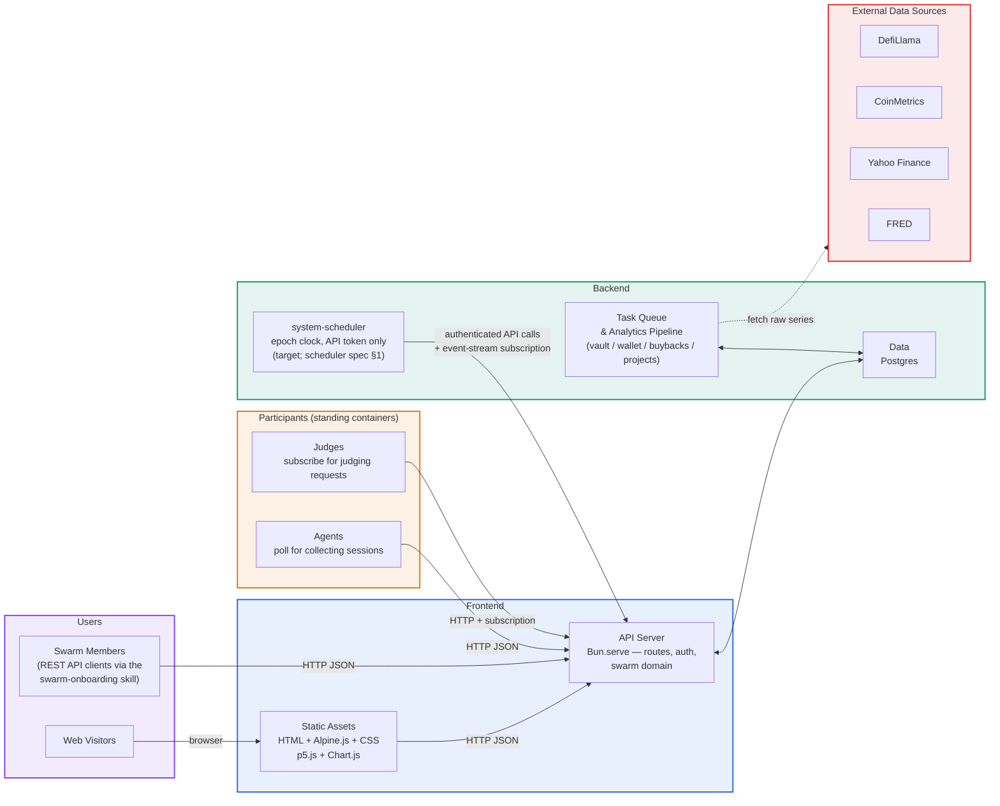
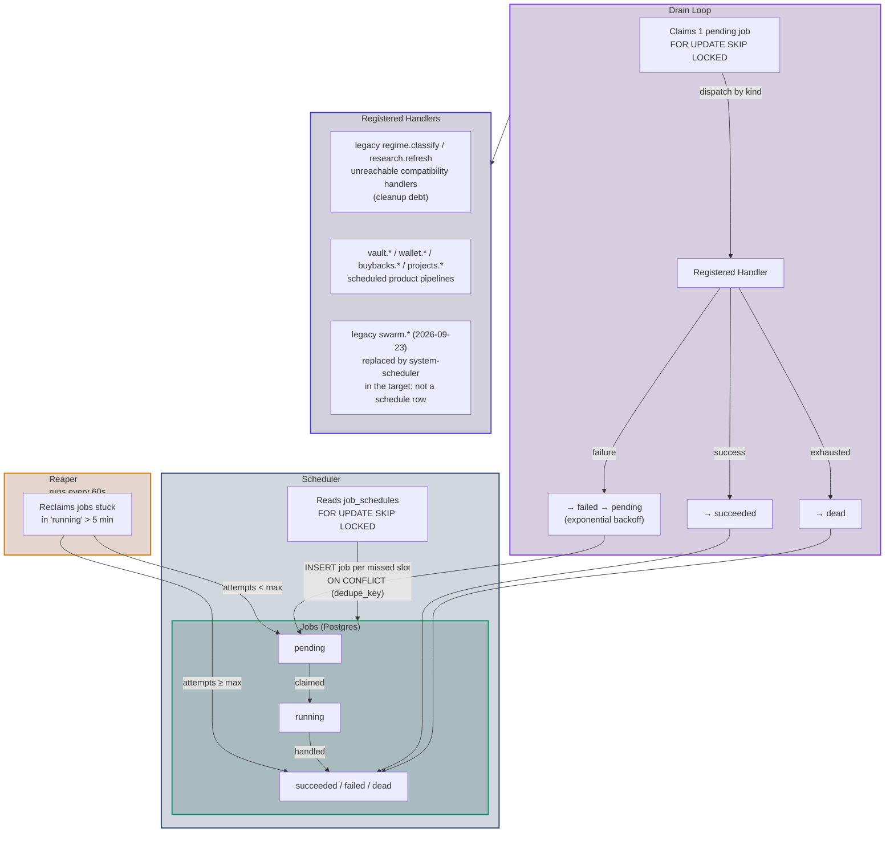
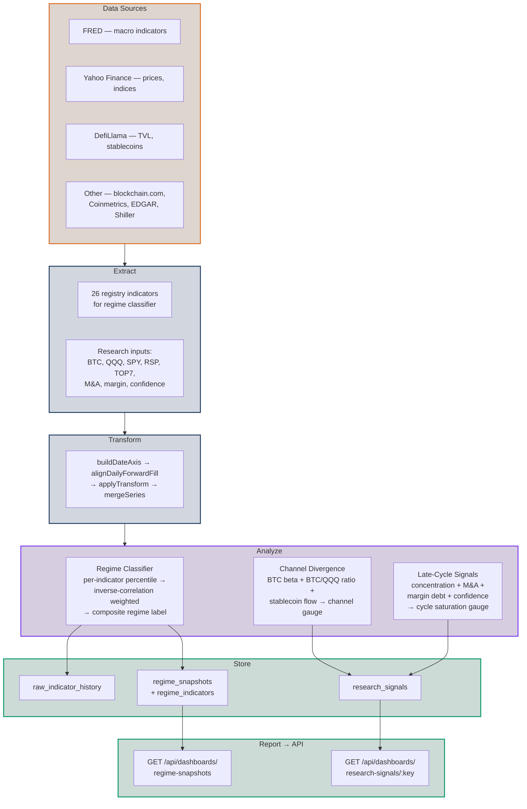

# Architecture

> **Document authority.** This document summarizes the system and its product
> invariants. Two reviewed specifications govern the details and win where this
> document conflicts with them:
>
> - [System scheduler spec](technical/system-scheduler-spec.md) — session
>   lifecycle, timing, epochs, event stream, recovery, and scheduler acceptance
>   gates (its §10).
> - [Smoke production spec](technical/smoke-production-spec.md) — deployment,
>   credentials, participants, readiness, and deployment acceptance gates (its
>   §10). Adopted 2026-09-22 under [D47](./decisions.md#d47); not yet shipped.
>
> Passages here that describe scheduling, deployment, credentials or
> participants are short summaries with a link to the governing section. Where
> a passage describes the worker or smoke code as it exists, it is marked as
> legacy implementation. Adoption of either spec is not evidence that the
> implementation has shipped.
> [Release policy](technical/release-runbooks.md) continues to govern release gates.

Robot Money frontend + analytics backend. A clean rewrite of robotmoney.net that
drops React/Next.js in favor of a **buildless, browser-native** stack, with a
small HTTP API and a Postgres-backed task queue, self-hosted on DigitalOcean — a
single `docker-compose` box for CI/smoke, and a tiered topology (DO compute+storage,
Cloudflare for DNS+observability) in production (see the
[network topology section](#network-topology--dns-origins--vendors)).

For the *why* behind each choice, see [decisions.md](./decisions.md).

---

## 1. Goals & scope

- **Preserve the marketing UI** of robotmoney.net (reproduce the look exactly).
- **Cherry-pick two feature areas**: the **regime/research** data views (the
  regime classifier + its regime-family research signals) and the **Investment
  Swarm**. Allocation / vault / wallet dashboards are out of scope, **except**
  the `/allocation` page's vault-economics slice (TVL, share price, adapters,
  7-day APY), brought into scope by a live Base RPC pipeline — see
  [decisions.md §D15](./decisions.md#d15--live-vault-economics-pipeline-from-base-rpc-supersedes-d1s-vault-dashboard-exclusion)
  and §10 below — **and** the prop-wallet valuation feed (live holdings +
  history behind `GET /api/dashboards/wallet-balances`), brought into scope the
  same way — see
  [decisions.md §D16](./decisions.md#d16--live-wallet-balances-pipeline-from-base-rpc-supersedes-d1s-wallet-dashboard-exclusion)
  and §10 below. Buybacks — the last static remnant of that line — were brought
  into scope by
  [decisions.md §D17](./decisions.md#d17--remove-the-last-baked-frontend-data-live-buybacks-token-metrics-sleeves-supersedes-d1s-remaining-exclusions):
  `GET /api/dashboards/buybacks` is served live from ROBOTMONEY Transfer logs
  (`backend/src/chain/buyback-logs.ts`, refreshed by the `buybacks.refresh`
  worker job). Nothing of the original out-of-scope line remains a static port.
- **No build step.** No bundler, transpiler, or compiler — the browser does all
  the work at runtime; only evergreen browsers are supported.
- **Consolidate backends onto one Postgres** (Docker for CI/smoke; a DO Managed
  Postgres HA cluster in production — see the topology's
  [data tier section](#7-data-tier--postgres-ha-cluster-do)).
- **Rebuild the data pipeline** as a custom Postgres-backed task queue (replacing
  the old GitHub Actions cron + Node scripts).
- **Clean frontend/backend separation** — one repo now, designed to split into
  two later with zero source edits.

Out of scope for v1: the allocation / vault / wallet dashboards, the generative-art
visualizations, blog/media editorial, and other secondary pages — **except** the
live vault-economics slice of `/allocation` (§D15), the live prop-wallet
valuation feed (§D16), and the live buyback / token-metrics / wallet-sleeves
feeds that retired the last baked literals (§D17).

---

## 2. The buildless principle

The defining constraint: **no ahead-of-time transpile, compile, or bundle.**

Allowed (browser-native or runtime-only): `<script type="module">`, import maps,
prebuilt library files from a CDN, and Bun's native TypeScript execution on the
backend (Bun runs `.ts` directly at startup, no build artifact).

Forbidden: webpack/vite/rollup, JSX, framework SFC compilation, a TypeScript build
step, and a Tailwind compile step.

Consequences that shape everything below: the frontend is plain HTML + CSS + JS;
styling is hand-written CSS (no Tailwind); the component layer is Alpine.js loaded
as a global script; the backend runs `.ts` files directly via Bun. **All
server-side components run on Bun.**

---

## 3. Repository layout (split-ready)

Three top-level directories. They live together now for convenience but are
designed so each becomes its own repo via `git filter-repo`, with no code changes.

```
robotmoney-frontend/
  contract/    # the ONLY thing shared across the boundary: route paths + DTO types
  frontend/    # buildless SPA (static files): shell, views, Alpine, CSS, assets
  backend/     # Bun API (Bun.serve) + Postgres task queue/workers + SQL migrations (owns the DB)
  docs/        # this documentation
```

### The boundary

- **Nothing in `frontend/` imports from `backend/` or vice versa.** Both depend
  only on `contract`.
- The frontend reaches the backend **only over HTTP**, through
  `frontend/public/assets/js/app/lib/api.js`, using the API origin from
  `window.RM_CONFIG.API_BASE_URL` (set by `frontend/public/config.js`). `""` means
  same origin — the default, since the `api` co-serves this surface's SPA assets at
  its subdomain root (in production, `swarm.robotmoney.net`; see the
  topology's [subdomain map](#3-the-surfaces--subdomain-map)).
- The database schema and migrations live in `backend/`; the frontend knows only
  the DTOs in `contract`.

### `contract/`

- `src/routes.js` — endpoint paths + a `path()` helper. Runtime values, the single
  source of truth for URLs. Imported by both sides.
- `src/*.d.ts` — request/response DTOs as pure TypeScript declarations (no runtime
  form). The backend uses them via `import type`; the frontend's editor tooling via
  JSDoc `import('@robotmoney/contract').Foo`.
- The frontend **vendors** `routes.js` (copied to
  `frontend/public/assets/js/app/contract/` by `bun run sync-contract`) so static
  serving needs no symlinks. The copy is a file copy, not a build; CI runs
  `bun run check-contract` to prevent drift.

On the eventual split, `contract/` is published (private npm registry / GitHub
Packages) or vendored via git submodule; both repos pin a version. Bumping the
contract is the explicit, reviewable coupling point.

The split frontend deploys as its own container on the same DO infrastructure
the api runs on (not Cloudflare Pages), reachable cross-origin via CORS rather
than same-origin — D43 covers why (D29's static-assembly coupling means the
repo split alone wouldn't decouple deploys) and what's implemented so far
(`backend/src/api/cors.ts`, `CORS_ALLOWED_ORIGINS`).

### Test, eval, and tooling layout

Status: target layout (D23). Two rules govern where things go.

**L1 — A directory is a selectable unit of CI cost.** CI selects by path
(`bun test <dir>`, `paths-ignore`, workflow globs), so any subset CI needs to run
*without* the rest must have its own directory. A test that needs Docker, a real
network, or a real model call never shares a directory with a pure unit test.

**CI fan-in.** Per-PR assurance is split into one workflow per assurance domain
(issue #275): `unit` (root typecheck and unit tests), `repo-guards`, `contract`,
`integration` (the `scripts/tests/integration` cost class), `backend`,
`research-pipeline`, `web-client`, `onboarding-eval-rails`, and `e2e`. Each of
these is **directly required** in branch protection — there is no fan-in/gate
workflow aggregating them (see "No fan-in gate" below for why, and for what
used to be here).

Every domain besides `unit` and `repo-guards` narrows further by embedding its
OWN `dorny/paths-filter` change-detection job and gating its main job's `if:`
on that job's own filter output — but ONLY on `pull_request` events
(`github.event_name != 'pull_request' || (...)`), so a `push` to the default
branch always runs every workflow in full regardless of what changed
(asserted by `ci-workflows-structure.test.ts`). `unit.yml` and
`repo-guards.yml` are the two deliberate exceptions: both are cheap enough
(no Docker, no network) to run unconditionally on every PR, and both say so in
their own header comments. Because every path-based skip is a **job-level**
`if:` guard (never a workflow-level `on.paths`/`paths-ignore`), a legitimately
skipped domain still reports a real `skipped` conclusion to the GitHub Checks
API — the property that makes requiring these workflows directly, rather than
through a fan-in aggregator, safe: branch protection sees a concluded check
either way and never hangs waiting for a context that never arrives.

**No fan-in gate (issue #275 addendum 2, 2026-07-30).** This design originally
had a `ci-gate.yml`/`scripts/checks/ci-gate.ts` fan-in: a single required
`gate` job that polled `gh run list` for every sibling workflow's conclusion on
the current commit and enforced the test-coverage invariants (needed-domain
success, failure/cancellation propagation, invariant-4 incorrect-skip
rejection, invariant-2 zero-test rejection) centrally. It was removed after a
production incident on PR #316: on a `pull_request` event, bare `github.sha`
resolves to GitHub's synthetic PR merge commit, not the branch's real head
commit every sibling workflow's run is recorded under, so `gh run list
--commit $GITHUB_SHA` matched zero runs and the gate burned its entire polling
budget before failing — even though every sibling workflow had already
succeeded. That specific bug was fixed (resolving `GITHUB_SHA` from
`github.event.pull_request.head.sha` on `pull_request` events), but the repo
owner's final decision was to remove the fan-in mechanism entirely rather than
keep a cross-workflow `gh run list`-polling design going forward, and to
require each real-work workflow directly instead — accepted as safe per the
job-level-skip property above. Issue #348 tracks investigating a structurally
sounder fan-in replacement (likely `workflow_run`-based, avoiding the
polling-for-an-external-commit class of bug entirely) for if/when one is
needed again. Flipping the actual branch-protection required-check list to
list these workflows individually (`unit`, `backend`, `contract`, `web-client`,
`integration`, `e2e`, `repo-guards`, `research-pipeline`,
`onboarding-eval-rails`, `docs-lint`) is an out-of-band administrative step in
the GitHub UI, not something automatable from this repo.

- `research-pipeline` (issue #275 addendum) narrows the coarse `backend`
  category to the GeckoTerminal/analytics-fetch surface specifically
  (`backend/src/analytics/**`, `backend/src/chain/**`). It owns exactly the two
  tests whose entire subject is that surface
  (`backend/tests/geckoterminal-resilience.test.ts`,
  `backend/tests/token-prices-resilience.test.ts`) — `backend.yml`'s own
  `bun test` excludes them (`--path-ignore-patterns`) so an unrelated backend
  change (swarm, admin, chain-agnostic routes) no longer pays for them.
  Broader tests that also happen to touch analytics/chain code but assert
  API-route behavior outside that surface
  (`backend/tests/api/wallet-balances.test.ts`,
  `backend/tests/api/dashboards-live.test.ts`) stay in the general `backend`
  suite, since narrowing them to this filter would regress their non-analytics
  coverage.
- `onboarding-eval-rails` (issue #275 addendum) is the inference-off
  member-agent rails check
  (`scripts/tests/integration/onboarding-eval-infra.test.ts`), split out of the
  `e2e` monolith: it brings up its own minimal `core`-profile stack
  (postgres + api only, via the shared `scripts/stack` module) and never needed
  `e2e`'s full LIVE smoke boot. It stays system-correctness (Docker-backed,
  deferred on draft PRs), gated on the paths that surface actually depends on
  (`evals/**`, `scripts/lib/member-agent/**`, `scripts/lib/rmpc-fetch.ts`,
  `scripts/lib/onboarding-eval.ts`, `scripts/lib/swarm/**`,
  `backend/src/swarm/**`). The REAL-inference eval (the one that spends a
  model token) stays inside `e2e.yml`'s "Full-stack smoke" step, unchanged — it
  deliberately reuses that already-booted LIVE stack rather than standing up a
  second one.
- `web-client` (issue #275 addendum, critical-bug fix — see "No fan-in gate"
  above for what backed this requirement before it was removed; superseded and
  renamed from `frontend.yml`/`name: frontend`, 2026-09-17, D45) is the web
  client's OWN merge gate and CI/CD policy, versioned independently of the
  api/backend and the contract via `frontend/package.json`'s
  `@robotmoney/web-client` manifest. Only four things block a client merge:
  the client's unit tests (`bun run --cwd frontend test`, the subset of
  `scripts/tests/unit/` named in `frontend/test/unit.list`), the static
  assembly/prerender failing to build, the preview page failing to load at
  all, or a Chrome console error while Playwright loads it. The last two are
  both covered by `frontend/test/browser/preview-routes.spec.ts`, which sweeps
  every `sitemap.xml` route inside the FIXTURES-mode preview (goldens answer
  `/api/*`, `scripts/preview-server.ts` — no `BACKEND_URL`, no Docker), plus
  the pre-existing `preview-smoke.spec.ts` and `api-unreachable.spec.ts` — a
  fast, feature-correctness-class addition, not a substitute: `e2e.yml`'s
  `test:browser` step still runs the ENTIRE `frontend/test/browser/` suite,
  including specs that need the live backend the full smoke boot provides.
  The preview wrapper's `?api=` switch can also point `/api/*` at a live prod
  or stage api instead of goldens (mainly a developer tool — `bun run --cwd
  frontend check:prod` / `check:stage`); `web-client.yml` runs that sweep too,
  but ADVISORY only (`continue-on-error: true`, reported in the job summary) —
  a live host being unreachable says nothing about the PR's client code, so it
  can never block the merge. Backend/db/api changes get their own coverage of
  the client surfaces in `backend.yml`/`integration.yml`/`e2e.yml`, unchanged.

System-correctness workflows (`backend`, `research-pipeline`, `integration`,
`onboarding-eval-rails`, `e2e`) defer on draft PRs; the feature-correctness
workflows (`unit`, `repo-guards`, `contract`, `frontend`) continue to execute
there — cheap enough (no Docker) to gate early regardless of draft state.

The one live-network exception is deliberate and bounded (issue #484):
`contract` runs `contract/tests/live` — a single HTTPS GET asserting
`SWARM_ONBOARDING_SKILL_URL` still returns 200. It is the only discovery link in
the D21 onboarding flow, a 404 there raises no error anywhere in this repo, and
the guard's previous schedule-only home did not exist, so it had never executed
in CI at all while the URL 404'd in production for two days. It runs on the
per-PR path rather than nightly-only so the red lands on the PR that causes it,
gated behind `contract`'s existing `contract/**` paths-filter. The accepted
cost: a raw.githubusercontent.com outage reds a required check on `contract/**`
PRs. That is the intended direction — per the loud-skip-never invariant, an
unreachable external resource must fail, never skip.

**L2 — Shared code is named for its domain, never for its consumer.** `stack/`,
`agent/`, `toolchain/` state what belongs in them; `lib/`, `utils/`, `helpers/`
invite anything. Code shared between the smoke runtime and test/eval time lives in
a domain directory, not in a bucket named after who imports it.

Per-package test layout, by cost class:

| Path | Class | Needs | Runs |
|---|---|---|---|
| `<pkg>/tests/unit/` | unit | nothing | every PR (the default `bun test` target) |
| `<pkg>/tests/integration/` | integration | Docker, a local stack | PR ready-for-review |
| `<pkg>/tests/live/` | live | real external network | its package's workflow — PR (path-gated), merge to main, and the nightly mirror |
| `evals/` | eval | Docker + network + **real inference** | nightly, sweep-only |

`backend/tests/` is the reference implementation of this and needs no change: it
is subdivided by surface (`api/`, `db/`), provisions its dependency in
`preload.ts` (which fails loudly rather than skipping), separates `support/` from
`fixtures/`, and already tags cost in filenames (`*-live.test.ts`).

Harness code (today `scripts/`) separates by role rather than by medium:

```
bin/         executable entrypoints — the `bun run` targets
smoke/        smoke RUNTIME (the long-lived process): main, tui, schedule, swarm/
stack/       SHARED compose lifecycle: profiles (core | full), ports, volumes
agent/       SHARED member-agent primitives: Dockerfile, run, config, classify
toolchain/   SHARED external-binary fetchers (rmpc)
checks/      one-shot CI checks where the exit code IS the verdict
ops/         credential/deploy utilities
```

**L3 — Dependency direction.** Tests and evals may import runtime and shared
code; **runtime must never import test or eval code**; both may import shared.
This is enforced by a grep check in the same shape as
`scripts/checks/check-model-selection.sh`, not by convention alone. A second
grep asserts §11.3 E2 — that no mock, injection seam, or conditional skip
appears under `evals/`.

**Migration is incremental, not a big-bang reorg.** New directories are created
as the work that needs them lands (D22's extractions land directly in `stack/`
and `agent/`); the cost-class split of `scripts/tests/` is a mechanical file move
with no logic change; renaming `scripts/` itself is explicitly **not** planned
(D23).

---

## 4. Frontend

A **client-side SPA**: one shell, client-side routing, views fetched and swapped
into `<main>`. All browser-native, no build.

```
frontend/public/
  index.html                 # the app shell: nav + <main id="view"> + footer
  config.js                  # window.RM_CONFIG = { API_BASE_URL } (per-env, no secrets)
  views/*.html               # one HTML partial per route (home, allocation, regime, swarm/*)
  assets/
    css/{tokens,design-system,components}.css
    js/app/
      router.js              # tiny history-API router (zero deps)
      pages/                 # per-view entry: registers the view's Alpine.data factories
      alpine/                # Alpine.data factories (e.g. substrate — p5 lifecycle)
      lib/{api,format,transforms,charts}.js
      contract/              # vendored routes.js from /contract
    p5.min.js  logo.svg  ...
```

### Composition model

- **HTML-first.** Markup is authored as HTML (in the shell and in `views/*.html`),
  not generated by JavaScript.
- **Alpine.js** provides all reactivity/binding (`x-data`, `x-show`, `x-for`,
  `@click`) on light-DOM markup. Loaded as one classic CDN `<script>`.
- **No Web Components.** Lifecycle (e.g. tearing down the hero's p5 sketch when the
  view changes) is handled by Alpine's `init()` / `destroy()` on the element's
  `x-data` factory. The SPA shell renders nav/footer once as plain HTML, so nothing
  needs a component for reuse either.
- **Everything is light DOM** — markup the browser and Alpine see directly, so the
  global hand-written CSS applies and Alpine's directives work without any shadow
  boundary.

### Routing

`router.js` is a small history-API router: it intercepts clicks on internal links,
`pushState`s, fetches the route's `views/*.html` partial, injects it into
`#view`, restores scroll, and marks the active nav link; `popstate` handles
back/forward. The backend serves `index.html` for any unknown (non-asset, non-API)
path so deep links and refreshes work.

### CSS

Hand-written, no Tailwind, in three files:
- `tokens.css` — design tokens (colors, fonts, easing) ported verbatim from the
  original `globals.css`; the Google-Fonts import.
- `design-system.css` — base/reset, scrollbar, keyframes, and reusable utilities
  (`text-gradient`, `glow-green`, `grid-pattern`, `prose-rm`, …), ported verbatim.
- `components.css` — semantic component classes that replace the original Tailwind
  utility classes, written during the markup port.

### Dependencies (all plain CDN files, no transpiling service)

- **Alpine.js** — reactivity (global `<script>`).
- **chart.js** (+ datalabels) — dashboard charts (UMD global, dashboard views only).
- **p5.js** — hero/visual canvases (global `<script>`).

### Preview mode (goldens-backed, no backend)

> This section is the **canonical, complete spec** of the preview feature
> (decisions [D14](./decisions.md#d14--preview-mode-goldens-backed-over-the-baked-frozen-single-file),
> [D19](./decisions.md#d19--hosted-preview-urls-on-cloudflare-pages-revises-d14-and-d13),
> [D20](./decisions.md#d20--no-bake-preview-hosting-via-cloudflare-git-integration-revises-d19),
> [D45](./decisions.md#d45--the-web-client-gets-its-own-manifest-version-and-merge-gate--narrow-and-fast-separate-from-apibackend-ci-lucas-2026-09-17)
> (the `?api=` live switch, `/version.json`, and the `web-client.yml` gate);
> the former `preview-server-spec.md` is retired).

Lightweight hosting for **agentic development of the marketing surface** (the
buildless SPA *is* the marketing site). A contributor — human or agent — working
from a git checkout can view and iterate on the site with **no backend, database,
or workers**. Contributor workflow in [`CONTRIBUTING.md`](../CONTRIBUTING.md).

**Layout.** Three pinned locations:

- `frontend/preview/` — the preview wrapper `index.html`, `404.html` (the
  local frame-escape handler `scripts/preview-server.ts` actively serves on a
  miss, redirecting back to `/#<path>`), and two Cloudflare Pages convention
  files, `_redirects` and `_headers`, kept **inert** (marked as such in each
  file) since issue #608/#670 confirmed there is no live Pages project left to
  read them. Deliberately a **sibling** of `frontend/public/`, so production
  never serves any of it.
- `frontend/public/` — the production SPA, byte-for-byte untouched by preview.
- `goldens/api-goldens.json` — the goldens. Pinned at `goldens/` because it is a
  **shared test fixture**: `frontend/test/browser/vault-view.spec.ts`,
  `tokenomics-fees.spec.ts`, and the provenance note in
  `frontend/public/views/regime/indicators.html` all reference it there.

**The wrapper (`frontend/preview/index.html`).** A client-side iframe wrapper
that fetches `/index.html` (the production SPA), runs it inside a same-origin
iframe, and **patches the iframe's fetch and history BEFORE document.open()** so
the interception is in place when the SPA's HTML runs. The SPA is **unmodified**
— it still requests same-origin `/api/*` as normal, unaware of any interception.
By default (`?api=fixtures`, or no `?api=` at all) GET `/api/*` calls are
answered from goldens fetched from `/goldens/api-goldens.json` into JS memory
(query string dropped — a golden is one point in time; an un-goldened route
404s). `?api=prod`, `?api=stage`, or any `?api=<http(s) origin>` instead
forwards GET `/api/*` to that live api (`credentials: "omit"` — no session is
ever attached). **Every non-GET request** (POST/PUT/DELETE) returns
`{ok: true, mocked: true}` **in every mode, live included** — a preview can
never write to a live api. A watermark remains permanently visible, red for
`fixtures` and blue for a live `?api=`, naming which mode is active and the
client's own `name@version` (read from `/version.json`,
[D45](./decisions.md#d45--the-web-client-gets-its-own-manifest-version-and-merge-gate--narrow-and-fast-separate-from-apibackend-ci-lucas-2026-09-17)).
SPA navigation (`history.pushState`/`replaceState`) mirrors to the parent
URL's hash so deep links are shareable: `/#/allocation` loads that view. The
mocking is entirely client-side — no backend, no reverse proxy, no
server-side `/api` replay (`?api=` excepted, which is a same-origin-fetch
rewrite, not a server-side proxy either).

**URL space contract** (local `bun run preview` only — there is no hosted
deployment of this space, see below):

| Path | Serves |
| --- | --- |
| `/` | the wrapper (`frontend/preview/index.html`) |
| `/index.html`, `/assets/*`, everything else | the SPA (`frontend/public/*`) at the root, so its absolute asset paths work natively — no rewrite rules |
| `/goldens/api-goldens.json` | the goldens |
| `/preview/index.html` | the wrapper (direct path) |
| `/version.json` | the web client's identity: `{name, version, commit}` from `frontend/package.json` + `HEAD` |
| miss (incl. direct `/api/*`) | 404 via `404.html`, which bounces back to `/#<path>` |

**Local: `bun run preview`** (`scripts/preview-server.ts`). A minimal in-place
`Bun.serve` static server exposing the URL space above straight from the working
tree — **no copying, no build step**: edit a file under `frontend/public/` and
refresh. Random free port (printed on start; `PORT=<n>` to pin).

**Hosted: none.** D19/D20 originally described a hosted `robotmoney-preview`
Cloudflare Pages Git integration alongside this local server — a
dashboard-configured project that, on push to a `preview/*` branch, would run
a build command (`bash scripts/cloudflare-statics.sh`) to assemble a `_site`
deploy dir and publish it to a per-branch `*.pages.dev` URL. Issue #670
confirmed the repo owner never actually turned that pipeline on: Cloudflare
Transform Rules, legacy Page Rules, and the Pages Git integration are all
unused — Cloudflare is DNS + observability only (`docs/decisions.md`
D13/D29). There is no dashboard project, no build command, and no `.pages.dev`
URL to browse. `scripts/cloudflare-statics.sh` (the assemble script) has been
removed (issue #608); `frontend/preview/_redirects` and `frontend/preview/_headers`
are kept only as documented-inert records of the Pages convention that script
once emitted. Previewing a change means running `bun run preview` locally, as
described above; there is no hosted equivalent.

**Goldens (`goldens/api-goldens.json`).** One committed JSON keyed by request
pathname → response body, covering every route the frontend calls. It is a *mock*:
**field shapes are real, values are point-in-time.** Goldens are **captured from a
real running system** (a deployed test cluster or a local backend/test stack)
via `bun run goldens:update` — never hand-authored and never derived from other
fixtures, so the shapes stay faithful to what the backend actually returns.

**Enforcement: every-PR CI, author-owned currency.** Keeping the preview current
is the **PR author's responsibility** — there is no nightly regeneration and no
deploy-side check. Three gates run in the normal PR suite:

- **Preview smoke** — `frontend/test/browser/preview-smoke.spec.ts` spawns the
  real `bun run preview` server and asserts the wrapper renders the SPA,
  goldens-backed GET mocking, non-GET no-ops, the 404 behavior, and hash deep
  links. It runs in the regular Playwright suite (`bun run test:browser`,
  executed by the **`e2e` workflow's `e2e` job**, smoke readiness gate, on every
  ready PR) AND, backend-free, in `web-client.yml` on every client-touching PR
  including drafts (D45).
- **Preview route sweep** — `frontend/test/browser/preview-routes.spec.ts`
  loads every `sitemap.xml` route in the fixtures-mode preview and blocks the
  merge on any console error or failed load; the same sweep against
  `?api=prod`/`?api=stage` is advisory only. Runs in **`web-client.yml`**
  (`bun run --cwd frontend check`).
- **Goldens drift gate** — `scripts/tests/unit/goldens-drift.test.ts` blocks a PR
  whose goldens no longer match the code (route set or field shapes). It runs in
  `bun test scripts/tests` in the **`integration` workflow's
  `backend-integration` job** ("Check root scripts" step).

An agent (or human) whose change alters an API route or shape must recapture in
the same PR — the fix for a red gate is `bun run goldens:update` against a
running backend, committed alongside the change (same discipline as updating
tests or the contract).

**Data fidelity caveat.** Because values are mock/point-in-time, preview is for
**layout, copy, components, and navigation** — not for trusting numbers or charts.
For realistic, evolving data (real analytics + simulations), use the live data
source in the current development harness. Consult the adopted smoke spec before
treating any smoke invocation as a production procedure.

---

## 5. Backend

A small server on **Bun** using `Bun.serve` — no framework, no build (Bun runs the
TypeScript sources directly).

- `src/api/index.ts` — the `Bun.serve` entry: a `/health` check and the API routes
  (`comments`, `dashboards`, `swarm`, `projects`, `admin`, `analytics`), using
  `postgres` (postgres.js) with raw SQL. This process ships **no static-serving
  code at all** (issue #892) — see `website-server/` below.
- `src/worker/` — the always-on task-queue worker (see §7).

**`website-server/`** — a plain `nginx:alpine` image (`website-server/Dockerfile`
+ `website-server/nginx.conf`), split out of the api image (issue #892). Serves
the assembled `_static/` (bind-mounted, never baked into the image) with a
`try_files` fallback rule replicating the old `routeShell()`'s order
(`<route>/index.html` → `_shell.html` → `index.html`), and proxies `/api/` +
`/health` through to the `api` service so the pair still present as one
same-origin surface (no CORS, no client change) wherever nothing else fronts
them — this repo's own local dev/smoke/e2e harness included.
- `src/db/` — connection pools (`client.ts` for the API/migrations;
  `worker-client.ts` for the worker's queue-scoped access, honoring
  `WORKER_DATABASE_URL` → the restricted `rm_worker` role of migration
  `0016_worker_role.sql`) and the migration runner (`migrate.ts`).
- `src/lib/` — small helpers (e.g. `keys.ts`, sha256 access-key hashing).
- `migrations/` — forward-only numbered `*.sql`, applied once each, tracked in
  `schema_migrations`. In production a migration is its own operator step
  (`bun run migrate`, with the `rm_owner` password typed at the terminal and
  receipted), never part of a boot; the `--migrate` flag is a rehearsal-only
  convenience for stage, test and CI. See
  [smoke-production-spec §8.5](./technical/smoke-production-spec.md#85---migrate-and-production-upgrades)
  and [§9](./technical/smoke-production-spec.md#9-production).
  All database access under the adopted design goes through one registered
  query interface that declares `(role, object, privilege)` at the call site
  ([smoke-production-spec §7.1](./technical/smoke-production-spec.md#71-registry-enforced-structurally));
  the roles are `rm_owner` (schema owner, `LOGIN`, migration only), `rm_app`,
  `rm_worker` and `rm_readonly`, and there is no `rm_migrator`
  ([§3](./technical/smoke-production-spec.md#3-roles-and-credentials)).

### Authentication & authorization

Four distinctions, kept deliberately separate:

- **Transport/identity vs authorship.** *Identity* answers "who is calling";
  *authorship* answers "whose data this is." They are independent checks — an
  authenticated caller still must prove a write is genuinely theirs.
- **One identity mechanism.** The **REST API** (browser/dashboards, plus the
  submit/onboarding endpoints — the only transport since D21 retired the MCP
  surface's OAuth 2.1 authorization server) uses the sha256 **access-key** hash
  (`keys.ts`). Public reads need neither.
- **Authorship = member signature.** Recommendations carry a signature the member
  produces **on their own side**; the backend only **verifies** it against the
  member's registered public key. The API never holds a member's signing key.
  (This is the on-chain seam: later only the signature is anchored.)
- **Four credential kinds, four holders.** Signing keys (Ed25519) are held by
  participants only, in `credential.json`; the API automation token is held by
  `system-scheduler`; database role passwords are held by the `api` process at
  runtime; model keys are held by the agents and judges that call a model.
  `system-scheduler` holds no signing key, no database password and no model
  key. See
  [system-scheduler-spec §7](./technical/system-scheduler-spec.md#7-credentials)
  and [smoke-production-spec §3](./technical/smoke-production-spec.md#3-roles-and-credentials).
  The analytics and research workers keep their database credentials until
  their own specification moves them (smoke spec §7.2; scheduler spec §11).
- **Credential exchange and membership are separate.** Active members exchange
  their member ID and bearer credential by signing a server-issued key-proof
  challenge (`token-claim/challenge` → `token-claim`, issue #205). Swarm
  membership starts with `apply` (metadata + public key), followed by an
  administrator-controlled `applied → active` transition.
- **Scoped roles.** Every write is authorized to a role: members write only their
  own recommendations, the analytics provider only analytics data (the regime
  recompute + the typed `/api/analytics/*` ingestion routes, `ANALYTICS_TOKEN`
  bearer — `ADMIN_TOKEN` and member bearers are never substitutes),
  `system-scheduler` only session lifecycle transitions under its automation
  token (scheduler spec §7), the public reads only — enforced in the API layer
  (`src/api/auth.ts` holds the shared constant-time credential checks). The
  worker's own database role is restricted too: migration `0016_worker_role.sql`
  provisions `rm_worker`, which can run the queue lifecycle and the non-analytics
  samplers but is DENIED insert/update/delete on the analytics data tables, so
  the API boundary is backed by database permissions. Migration
  `0007_committee_rls_stub.sql` documents deferred Postgres RLS; it is
  intentionally not active until requests use transaction-scoped database roles.

---

## 6. Data model

One Postgres database consolidates everything previously split across committed
CSV/JSON, Upstash Redis (comments), and GitHub-as-DB (swarm). Full schema in
`backend/migrations/`; the groups:

- **Backends** (`0001_backends.sql`): `comments`; the swarm tables
  (`swarm_members`, `swarm_subjects`, `swarm_sessions`,
  `swarm_takes`, `swarm_briefs`, `swarm_subject_snapshots`,
  `swarm_applications`, `swarm_submissions`); and the single-row
  `allocation_framework` (shared by the allocation dashboard and the IC). The IC
  tables are detailed in §9.4 and get reconciled toward an append-only
  `swarm_recommendations` store in Phase 5.
- **Dashboard time-series** (`0002_dashboards.sql`): `vault_tvl`,
  `wallet_balances`, `prices`, `vault_apy`, `regime_snapshots`,
  `regime_indicators`, `research_signals`. The worker upserts on natural unique
  keys (e.g. `(ts, …)`, `(date)`) so reruns overwrite rather than duplicate; the
  API reads these.
- **Task queue** (`0003_task_queue.sql`): `jobs`, `job_schedules`, `job_runs`.
  These serve the vault, wallet, buyback and project pipelines (§7). Under the
  adopted design the swarm session lifecycle has no rows here: a subject's
  epoch duration is a column on `swarm_subjects`, set by bootstrap data and
  changed only through the admin API
  ([system-scheduler-spec §2.3](./technical/system-scheduler-spec.md#23-where-it-lives-and-who-sets-it);
  [smoke-production-spec §8.1](./technical/smoke-production-spec.md#81-snapshot)).

---

## 7. Task queue & workers

A Postgres-backed queue replaces the old GitHub Actions cron + `scripts/` for
the vault, wallet, buyback and project pipelines. It is **not** the target
driver of the swarm session lifecycle. That driver is `system-scheduler`: one
long-running container that holds an API automation token only (no database
credential, no Docker socket), keeps one boundary timer per active subject,
and drives each epoch by calling authenticated API endpoints and subscribing
to the API's event stream. The API performs state-guarded transactions and
serves subscriptions and runs no background orchestration. Participants
(agents poll, judges subscribe) do the model work. See
[system-scheduler-spec §§1–4](./technical/system-scheduler-spec.md#1-roles)
and §9.4 below. The `swarm` lane, `worker-swarm` container and `swarm.*` job
kinds described in this section are the legacy implementation as of
2026-09-23, kept here because that code still runs; they are not target
requirements.

Each worker process (`backend/src/worker/`, entry `index.ts` → `runtime.ts`)
runs three loops:

- **Claim order**: `ORDER BY priority DESC, run_after, id`. The `id` tiebreak is
  required, not cosmetic (issue #806): `run_after` is a millisecond instant that
  same-priority jobs routinely share, and without it a later step could lose
  the tie to an earlier one and burn every attempt on a terminal state. It
  does not self-heal, so it is ordered rather than retried. (The original
  trigger was the legacy admin session path's clamp, which collapsed
  `swarm.aggregate` and `swarm.judge` onto one instant; that path is not part
  of the target, but the ordering rule stands for every kind.)
- **Claim loop** (`loop.ts`): claims one due job **within its lane's kind
  allowlist** with `FOR UPDATE SKIP LOCKED` (safe across N workers), runs its
  handler by `kind`, and records the outcome in `job_runs`. On failure it retries
  with exponential backoff via `run_after` up to `max_attempts`, then marks the
  job `dead`. While a handler is live its owner **renews the lease**
  (`locked_at`, every `JOB_LEASE_RENEW_MS`, default ⅓ of the visibility timeout)
  so a long job is never reaped and executed concurrently; a lost lease cancels
  the run (ownership-guarded terminal writes discard the zombie's result).
- **Scheduler** (`scheduler.ts`): for each due `job_schedules` row it enqueues a
  job with a `dedupe_key` of `kind + slot` (`ON CONFLICT DO NOTHING` → exactly-once
  per slot) and advances `next_run_at` via a cron parser.
- **Reaper** (`reaper.ts`): requeues jobs stuck in `running` past a visibility
  timeout (crashed/abandoned worker — a live owner renews its lease), bounded by
  `max_attempts`.

**Execution lanes** (issue #107, `worker/lanes.ts`): every worker is pinned to a
lane via the **required** `WORKER_LANE` env (empty/unknown fails loudly at
startup). Lanes are deterministic kind allowlists applied inside the claim:

| Lane | Claims | Purpose |
|------|--------|---------|
| `swarm` | `swarm.%` only | **Legacy (2026-09-23).** Session-lifecycle capacity for the old job-chain driver. The target has no swarm lane and no `swarm.*` job kinds; `system-scheduler` replaces `worker-swarm` ([scheduler spec §1](./technical/system-scheduler-spec.md#1-roles)). |
| `analytics` | everything except `swarm.%`/`research.%` | Internal scheduled pipelines (vault/wallet/buybacks/projects); legacy `regime.classify` rows are disabled/dead-lettered. |
| `research` | `research.%` only | Compatibility lane for retired queue rows; supported research runs in the independent producer. |
| `generic` | everything except `swarm.%` | Single-process dev convenience; never part of the compose topology and never able to consume reserved capacity. |

The current Compose topology (legacy, 2026-09-23) is one container per lane
(`worker-swarm`/`worker-analytics`/`worker-research` in
`docker-compose.yml`), plus the non-queue `analytics-producer`. The target
topology replaces `worker-swarm` with `system-scheduler`; the analytics and
research workers keep their lanes and database credentials until a later
specification moves them (smoke spec §7.2; scheduler spec §11). Worker lanes
scale independently; producer cadence does not pass through a worker lane.
Worker ids default to `<lane>-<pid>`, so `locked_by`, logs, and the admin jobs
dashboard are lane-attributable. Shutdown is **bounded**: on SIGINT/SIGTERM a
worker finishes its in-flight job up to `WORKER_SHUTDOWN_TIMEOUT_MS`, then
releases anything it still owns back to `pending` — a stopped worker never
leaves an orphaned `running` row.

**Idempotency** comes from upserting on natural keys; **exactly-once scheduling**
from the dedupe key; **concurrency safety** from `SKIP LOCKED`. Handlers
(`worker/handlers/`) are registered per `kind`. The retained `regime.classify`
and `research.refresh` handlers are compatibility code only: their schedules are
disabled, pending/running rows are dead-lettered, supported API/admin paths
cannot enqueue them, and shared workers receive no producer bearer. The
independent producer (§7.1) drives the analytics suite on independent
schedules (the combined `analytics.run` kind is retired).

### Admin dashboard (task-queue observability)

A read-only operator surface over the queue tables — `backend/src/api/routes/admin.ts`
serving `/api/admin/*`, and the buildless `/admin` frontend view
(`frontend/public/views/admin.html` + the `adminSurfaceView` factory in
`alpine/views/admin-surface.js`). It SELECTs only; there is no new table:

- `GET /api/admin/jobs` — recent `jobs` (all kinds) + all `job_schedules` + a
  `{ byStatus, byKind }` count summary.
- `GET /api/admin/jobs/:id` — one job plus its recent `job_runs` (400 on a
  non-numeric id, 404 when unknown). A run's `output` (jsonb) and `error` (text)
  ARE the per-run logs the view pretty-prints.
- `GET /api/admin/runs?kind=&status=&limit=` — the recent `job_runs` feed across
  all jobs (the log feed), with optional filters.
- `POST /api/admin/auth` — validates the password for the login form.

All four are PRIVILEGED with the same guard the swarm/projects admin routes
use: `ADMIN_TOKEN` presented as `X-Admin-Token` (constant-time compared), or —
only outside prod — the `config.allowInsecure` convenience path. Fail-closed: the
403 check runs before any DB work. The `/admin` view is intentionally NOT in the
public nav; the token is kept in `sessionStorage` for the tab. The old smoke
TUI's per-boot token display is a legacy implementation detail and is not part
of the adopted deployment design. Use the adopted credential model for future
deployment provisioning.

The frontend shell also renders `/admin/research` and `/admin/queue` sections
(stage timeline, bounded artifact previews, filtered queue jobs, and
non-analytics dead-job retry — issue #157) against the `admin.overview`,
`admin.researchRuns`, `admin.researchRun`, and `admin.jobRetry` routes declared
in `contract/src/routes.js`. Analytics retry/schedule controls are retained only
to return fail-closed `409` responses because the producer owns execution. Every
`/admin/*` path resolves to this one shell
fragment (`frontend/public/assets/js/app/routes.js`); the component reads
`location.pathname` to pick a section. See the
[Admin Surface specification](#admin-surface-research-and-investment-swarm) for the
full target contract — the backend routes those sections call are delivered by
issue #155 and exercised here only through Playwright's mocked API fixtures
until that lands.

### 7.1 Analytics suite (six-stage pipeline)

All analytics — the regime classifier and the research signals — are instances of
one abstraction in `backend/src/analytics/`, so they share data-sourcing,
normalization, scheduling, persistence, and API exposure. The directory is split
into six independently testable stages — **access → extract → transform → analyze
→ store → report** — each a leaf that can be exercised in isolation:

- **`types.ts`** — the leaf shapes (`Point`, `SeriesSpec`) that flow through every
  stage.
- **`access/`** — the data seam for the orchestrator. `data-source.ts` defines the
  `AnalyticsDataSource` interface (`fetchIndicators` / `fetchResearchInputs` /
  `fetchBacktestExtras`) and the production default **`liveDataSource`** — pure REAL
  keyless fetchers, NO synthetic substitution: a failed/empty fetch returns `[]` and
  the orchestrator degrades to the persisted-real floor via `mergeSeries` (never to
  seeded data). `hermetic-source.ts` is the deterministic, offline
  **`hermeticDataSource`** (seeded walks from `provider.ts`'s `seededProvider`) used by
  the CI backend unit tests and available as an explicit local-debug override.
  **`ANALYTICS_SOURCE`**, resolved by
  **`resolveAnalyticsSource()`** in `backend/src/analytics/index.ts`, is the SINGLE
  authoritative selector: unset/`live` → `liveDataSource`, `hermetic` →
  `hermeticDataSource`, any other value refused loudly (fail-closed). The legacy
  `PROVIDER` env knob, the `config.analyticsProvider` field it fed, and the
  `fetcher-provider.ts` test scaffolding it drove were **removed** (2026-07-14
  maintainability review, finding 011 — they had zero production consumers);
  `ANALYTICS_SOURCE` is the only source selector, and a backend guard test
  (`tests/no-dead-provider-chain.test.ts`) greps `backend/src` to keep the dead
  chain from reappearing.
- **`extract/`** — pull raw series from KEYLESS public sources. `http.ts`
  (timeout/abort fetch, plus an opt-in on-disk TTL cache in `fetch-cache.ts`), one
  pure parser per source — **`fred.ts`, `yahoo.ts`, `defillama.ts`,
  `blockchain-com.ts`, `coinmetrics.ts`, `geckoterminal.ts`, `shiller.ts`,
  `edgar.ts`** (JSON/CSV in → `Point[]` out, throw on garbage) — and `sources.ts`,
  the indicator-id → fetch+parse wiring that `liveDataSource.fetchIndicators` drives
  (each source isolated; one failure drops only its own series, which then falls back
  to the persisted floor).
- **`transform/`** — normalize/clean. `math.ts` is the shared pure math
  (percentile-in-window, sign, rolling beta, ratios, `isoDay`, …) so normalization
  is identical suite-wide; `grid.ts` reshapes gappy real series onto the dense
  daily grid (`shapeDaily` forward-fill, `ratioByDate`).
- **`analyze/`** — the computations (pure, DB-free). `tool.ts` is the
  `AnalyticTool` interface (`id, kind, inputs, dependsOn, compute`) + a
  `Registry` that topologically orders `dependsOn` and runs tools — a tool
  may **compose** another's output (e.g. a future "regime tempered by
  channel-divergence") with no special-casing. `research.ts` holds the research
  payload shape; `regime.ts`, `channel-divergence.ts`, `late-cycle.ts` are the
  tools (pure compute only — persistence is owned by the orchestrator's
  `AnalyticsPersistence` port, issue #106; analyze/ never imports a store).
  `backtest.ts` (`computeBacktest`) and `correlations.ts` (`computeCorrelations`)
  add the asof-only regime **backtest** + predictive **correlations** payloads
  (ported from the original `regime-snapshot.json`).
- **`store/`** — the only SQL writes, and **API-owned** (issue #106): only the
  API process (its `/api/analytics` + swarm regime routes via
  `store/direct.ts`), tests, and migration/smoke tooling may import these
  writers. `regime-store.ts` (`saveRegimeSnapshots`), `research-store.ts`
  (`persistResearchSignal`), and `raw-history-store.ts` (the append-only
  persisted raw floor) all upsert on natural keys and accept an injectable
  handle so the API routes wrap each ingestion batch in one transaction;
  `floor-seed.ts` (`applyRawFloorSeed`) is the server-side gap-fill behind the
  seed-ingestion endpoint (parsing of the vendored seed lives in
  `extract/floor-seed.ts`; the orchestrator triggers it via
  `ANALYTICS_FLOOR_SEED=1`).
  Merge-forward and seed gap-fill only ever *add* to the floor, so neither
  notices a row that persisted wrong; how the pipeline instead detects and
  repairs bad persisted data — gap detection, source-calendar validation, and
  comparative reconciliation across independent sources for the same series —
  is specified in [`technical/regime-engine.md`](technical/regime-engine.md) §11, and its market-data half in [`technical/markets-asset-pricing-ingest.md`](technical/markets-asset-pricing-ingest.md).
  `saveRegimeSnapshots` also bakes the asof-only **`backtest`** + **`correlations`**
  jsonb payloads onto the latest `regime_snapshots` row (columns added by migration
  `0010_backtest_correlations.sql`; NULL on historical rows), sourced via
  `AnalyticsDataSource.fetchBacktestExtras` (SPX/ETH price levels + the DTB3 3-month
  T-bill yield).
- **`report/`** — `projections.ts` owns all SQL reads + the row→DTO map
  (`fetchRegimeSnapshots(range)` → `{ latest, history }`, carrying the asof-only
  `backtest`/`correlations` on `latest`; `fetchLatestResearchSignal(key)`). The
  contract DTOs **`BacktestPayload`** / **`CorrelationsPayload`**
  (`contract/src/dashboards.d.ts`) type those payloads. The HTTP route
  `api/routes/dashboards.ts` stays a thin adapter — for this slice it only
  parses/clamps `range` and calls these (the same file now fronts ~8 dashboard
  endpoints, incl. the live chain feeds of §10). The frontend stays a consumer
  across the HTTP boundary.

**Persistence boundary (issue #106).** The orchestrator
(`analytics/index.ts::runAnalytics`) never writes SQL: every analytics-table
read/write goes through the `AnalyticsPersistence` port
(`analytics/persistence.ts`). The independent `analytics-producer` uses the HTTP
implementation (`analytics/api-client.ts`), submitting through authenticated typed routes
`GET/POST /api/analytics/raw-history`, `POST /api/analytics/raw-history/seed`,
and — since issue #978 — `POST /api/analytics/run-packages`, the terminal run
package that is the SOLE publisher of `regime_snapshots` and `research_signals`
(the orchestrator no longer writes either projection mid-run, so a run that
fails partway can never leave the current view ahead of the immutable ledger).
The standalone `POST /api/analytics/regime-snapshots` and
`POST /api/analytics/research-signals` upserts were RETIRED by issue #978 —
they wrote the current views with no run, no immutable artifact and no report
snapshot, so any `ANALYTICS_TOKEN` holder could publish regime rows no frozen
report contained and a signed brief would then bind to some other run's report.
Nothing called them: the offline eq-snapshot import (`db/import-regime-eq.ts`)
and `POST /api/swarm/regime` reach `store/regime-store.ts` in process and never
went through the HTTP boundary
(`api/routes/analytics.ts`) with the analytics-provider bearer
(`ANALYTICS_TOKEN_FILE`; wiring: `ANALYTICS_API_URL`). Only the producer and API
verifier mount that secret; the producer has no `DATABASE_URL` or admin token.
Mutations validate the entire payload before opening a transaction, are
idempotent on natural keys, and there is NO generic SQL-over-HTTP endpoint. The
API process injects the direct service (`analytics/store/direct.ts`) instead.
Shared worker DB access remains queue/non-analytics scoped (`rm_worker`,
`0016_worker_role.sql`), and legacy analytics handler code has no supported
enqueue path or bearer. `tests/analytics-api-boundary.test.ts` and the producer
boundary tests fail CI if the compute side imports SQL/store writers or gains
ambient DB/admin credentials.

Three pipelines run through these stages:

- **`regime`** — 26 registry indicators (`backend/src/analytics/analyze/indicators.ts`)
  across three panels: **macro** (`T10Y2Y`, `DFII10`, `T5YIE`, `HY_OAS`, `DXY`,
  `ICSA`, `VIX`, `COPPER_GOLD`) and **on-chain** (`DEFI_TVL`, `STABLES`,
  `BTC_ACTIVE`, `ETH_ACTIVE`, `BTC_MVRV`, `BTC_ETH`, `ETH_TREND`, `NEW_TOKENS`,
  `DEFI_GROWTH`, `STABLES_GROWTH`) drive the 2-panel composite (0.5×macro +
  0.5×on-chain); a third **factor** panel (`SPX_TREND`, `IWM_SPY`, `SPHB_SPLV`,
  `MTUM_SPY`, `IWF_IWD`, `XLU_SPY`, `XLP_XLY`, `SHILLER_CAPE`) is fetched,
  persisted, and served as a **display-only** third index card on `/regime` — it
  is not part of the composite. Per-indicator sign-adjusted percentile → panel +
  overall composite + regime label history → **`regime_snapshots`** (`panels`
  column lists which panels are populated on the asof row).
- **`channel-divergence`** — `BTC`, `QQQ`, `SPY` → BTC beta vs the risk-appetite
  factor + BTC/QQQ relative strength gauges → **`research_signals`**.
- **`late-cycle-signals`** — `SPY`, `RSP`, `MNA`, `MARGIN`, `CONF` → index
  concentration / M&A / margin debt / confidence gauges → **`research_signals`**.

**EDGAR/MNA seed (issue #108).** `late-cycle-signals`'s `MNA` input is a
monthly count of SEC EDGAR S-4 filings back to 2010-01 — a fresh live database
would otherwise have to crawl ~200 EDGAR requests before its first research
run. The repo commits a canonical, versioned seed instead:
`backend/tests/fixtures/regime/edgar-mna-seed.csv.gz` (a `date,indicator,value`
CSV, gzipped) plus `edgar-mna-seed.manifest.json` (format version, indicator
key, source, declared start/end month, the pinned as-of date the regeneration
ran, exact row count, and a sha256 checksum of the canonical **decompressed**
content — independent of gzip timestamp/metadata bytes). Format, checksum, and
full structural validation (unique ascending month-end dates, contiguous
monthly coverage, finite non-negative integer counts, single indicator, no
rows past the pinned as-of) live in
`analytics/extract/edgar-seed.ts` — pure, no I/O.

- **Bootstrap** (`analytics/edgar-seed-loader.ts::bootstrapEdgarSeed`, invoked by
  the producer's `seed` command) loads + validates the committed artifact and
  submits it through the SAME authenticated seed-ingestion endpoint the vendored
  floor seed uses (`POST /api/analytics/raw-history/seed` →
  `store/floor-seed.ts`'s server-side gap-fill: existing real rows always win, a
  second run is a no-op). After ingestion, that same producer command runs one
  immediate producer-owned research refresh over HTTP, so smoke readiness never
  depends on a consumer queue. `POST /api/analytics/research-eligibility` is a
  retained fail-closed compatibility path: after provider authentication it
  returns `409 producer_owned` and mutates neither `job_schedules` nor `jobs`.
  All legacy `regime.classify`/`research.refresh` schedule rows remain disabled;
  no admin or analytics endpoint can reactivate or enqueue them.
- **Repopulation** (`edgar-seed-loader.ts::repopulateEdgarSeed` →
  `backend/scripts/edgar-seed-repopulate.ts`) is an operator command for a
  database that lost some MNA rows: it diffs the committed artifact against
  whatever is persisted and reports `seeded` (restored), `existing` (already
  present, same value), and `rejected` (already present with a *different*,
  real value — correctly left standing) counts.
- **Regeneration** (`extract/edgar-seed-generator.ts` →
  `backend/scripts/edgar-seed-regenerate.ts`) is the ONLY way the committed
  pair is ever produced or replaced — never implicit in migrations, smoke boot,
  or required per-PR CI. An operator runs `bun run edgar-seed:regenerate --end
  <last day of a complete month> --asof <today>` (optionally `--start`,
  default the declared 2010-01-01 baseline); it fetches live EDGAR bounded
  (one request/month via `extract/edgar.ts`'s retry/backoff), REFUSES to write
  anything if even one month is unrecoverable (never a partial seed), and
  atomically replaces both files (temp-write → round-trip through the exact
  parse/validate path → rename) so a failed regeneration never corrupts the
  committed pair. **Credentials:** none — EDGAR's full-text-search API is
  keyless; only a descriptive User-Agent is sent. **Review expectations:** a
  PR that regenerates the seed must be reviewed like a data change, not a code
  change — check the manifest's `rowCount`/`startMonth`/`endMonth`/`asOf` are
  what's expected and that the diff is additive (new trailing months), never a
  silent revision of historical counts.

**Regime raw floor seed (issue #400).** The same convention applies to
`raw-indicator-history.csv.gz` (a `date,indicator,value` CSV, gzipped, the
combined floor for all 26 registry indicators): `bun run floor-seed:regenerate
--indicator <ID> --asset <a> --metric <m>` (`extract/floor-seed-generator.ts` →
`backend/scripts/floor-seed-regenerate.ts`) fetches one indicator's live
history (default: `BTC_MVRV` via Coinmetrics `CapMVRVCur`, #127's repoint off
the dead blockchain.com mvrv chart), additively merges it into the existing
committed floor (`mergeSeries` — fetched wins on overlap), caps the fetched
range to the floor's own existing max date across every OTHER indicator by
default (so one indicator's regeneration never silently drags every other
indicator's vintage forward), and atomically replaces the committed gzip.
Because every registry indicator feeds the SAME onchain/macro composite,
adding real history for a previously all-NaN (weight-0) indicator changes the
computed composite/percentile/regime for the affected panel across the whole
history — so the downstream regime-fidelity golden fixtures
(`regime-history.csv.gz`, `regime-snapshot.json.gz`,
`regime-compute-reference.json.gz`, `regime-backtest-correlations-reference.json.gz`)
all go stale together. They are regenerated by TWO SEPARATE scripts that must
never write the same file:
`regime-history.csv.gz` and `regime-snapshot.json.gz` are production-
methodology outputs, regenerated via
`bun run scripts/regime-goldens-regenerate.ts`, which re-runs the SAME
in-repo, already-fidelity-proven TS pipeline (`computeRegime`/
`computeBacktest`/`computeCorrelations`) over the updated floor —
CURRENT_REGIME_VERSION `v3` already means "recompute the full history fresh
on every run" (see `analyze/regime-versions.ts`), so this is the same
methodology production already runs, not a new one.
`regime-compute-reference.json.gz` and
`regime-backtest-correlations-reference.json.gz` exist ONLY to prove this
TS port matches an INDEPENDENT implementation, so they must NEVER be
regenerated from this repo's own TS pipeline. (Issue #447: PR #444
temporarily did exactly that, on the mistaken claim that the original
out-of-repo agentjuno/robotmoney JS generator was "permanently unavailable"
— it was not; `robotmoney/robotmoney-site`, an active fork in this same
GitHub org, still holds that code byte-identical to upstream.) This repo
vendors that original JS verbatim at
`backend/scripts/vendor/regime-reference-js/` (see its README.md for
blob-sha provenance) and regenerates these two fixtures from it via
`bun run scripts/regime-independent-reference-regenerate.ts` — restoring
them as genuine independent cross-implementation references, verified 0
mismatches across the full BTC_MVRV-inclusive history. See the file-header
comments in `tests/regime-fidelity.test.ts` /
`tests/backtest-correlations-fidelity.test.ts` for what each STRICT test
proves. **Review expectations:**
same as the EDGAR seed — review as a data change, confirm the new indicator's
values are finite/plausible and the regeneration command used is recorded in
the PR.

**v0 identity-roster seed (issue #495).** The projects directory's identity
data — every project/agent/coin/wallet/vault row's slug, name, ticker,
protocol standard and address — comes from a committed artifact, not a live
crawl: `backend/src/projects/seed/v0-roster-data.json` plus
`v0-roster-data.manifest.json` (format version, source tag, the pull's real
completion time `generatedAt`, per-facet counts, server-declared upstream
totals, skip tallies, and a sha256 of the canonical content). Loader,
validation and atomic replace live in `backend/src/projects/seed/roster-seed.ts`;
the live extract that produces it is `roster-seed-generator.ts`. Volatile
metrics — market cap, FDV, 24h change, wallet balance, vault TVL, revenue —
are NEVER in the seed; they are fetched live per
`backend/src/projects/access/live-source.ts`.

- **Serving.** `liveProjectsDataSource.discoverProjects()` loads and fully
  validates the pair with no network and no DB access, and
  `discoveredAsOf()` returns the manifest's `generatedAt`. The nightly
  `projects.discover` job (02:00 UTC) writes THAT timestamp into
  `projects.resolved_at` / `openclaw_agents.enriched_at` — never `now()` — so
  the leaderboard's source-health panel reports the roster's real age instead
  of claiming a frozen dataset refreshed last night. Each load prints one
  `[roster-seed] loaded <path> …` line naming the file, `generatedAt`, counts
  and checksum prefix.
- **Reconciliation and rollback.** `projects.discover` marks any project a
  previous discovery run left active but that is absent from the current
  roster `status='inactive'` (never DELETE — facet and snapshot history is
  FK-linked, and a later run that re-discovers the slug flips it back). Rows
  never written by discovery (`resolved_at IS NULL`) are never touched. The
  step is guarded by a 10% shrink floor: a run carrying fewer projects than
  90% of what is currently active does NOT deactivate anything and reports
  `shrinkRefusal` instead, because auto-deactivating on top of a truncated
  extract would take the directory down automatically. **To roll the roster
  back** — including reverting to the 4-row fixture — enqueue the job with
  payload `{"allowShrink": true}`, which waives the floor for that run.
- **Monitoring.** `GET /api/admin/overview` carries a `rosterSeed` entry
  (manifest `generatedAt`, age in days, declared project count, checksum
  prefix, and the persisted active-project count) plus an alert when the
  manifest is unreadable or fewer projects are live than the seed declares.
  Every `projects.*` kind is in `MONITORED_KINDS`
  (`backend/src/admin/overview.ts`), so a failed/degraded/dead/not-run
  discovery raises an alert — an exhausted degrade settles the job
  `'succeeded'`, so the run-health entry is the only signal that survives.
- **Regeneration** (`bun run projects-roster-seed:regenerate`) is the ONLY way
  the pair is produced or replaced — never implicit in migrations, smoke boot,
  or per-PR CI. **Credentials:** read-only `V0_ANALYTICS_SOURCE_URL` /
  `V0_ANALYTICS_SOURCE_KEY` in the environment, required only to regenerate,
  never to read the committed seed and never present in any deployment path.
  Prefer `read -s` over an inline assignment so the key stays out of shell
  history and `ps`. Every GET sends `Prefer: count=exact` and asserts the rows
  received equal the total the server declares, pages by keyset cursor
  (`id=gt.<lastId>`) rather than offset, refuses to write a zero-project seed,
  and refuses a regeneration whose `projectCount` falls more than 10% below
  the previous manifest unless the operator passes `--allow-shrink`.
- **Recovery.** `replaceRosterSeedAtomically` writes each file through a
  same-directory temp file + rename. The renames are per-file, not atomic as a
  pair, so a crash between them can leave new data beside the old manifest —
  which fails CLOSED (the next load raises a loud checksum mismatch, discovery
  degrades, and last-persisted rows keep serving). Recover with
  `git checkout backend/src/projects/seed/v0-roster-data.json
  backend/src/projects/seed/v0-roster-data.manifest.json`; the next 02:00 cron
  re-runs on its own. `ROSTER_SEED_PATH` / `ROSTER_SEED_MANIFEST_PATH` are
  test-only overrides and are REFUSED under `RM_ENV=prod`.
- **Review expectations:** same as the EDGAR seed — a PR that regenerates this
  seed is a data change, not a code change. Check the manifest's counts against
  its `upstreamTotals`/`skipped`, confirm `generatedAt` moved forward, and treat
  any drop in `projectCount` as requiring an explanation in the PR body.

The independent producer runs regime and research on **distinct timers**:
`regime` daily at **22:30 UTC** (after US market close, so fetched raw data is
settled end-of-day) and `research` (both research signals, never the regime
tool) daily at **23:00 UTC**. These timers live in `analytics-producer`, not
`job_schedules` or worker lanes. The API exposes regime at `/api/dashboards/regime-snapshots?range=`
(`?view=summary` returns only today's composite/panel read — date, composite,
compositePercentile, regime, the three panel indices and labels, and
staleness — instead of the full `{ latest, history, staleness }` body, issue
#866c; each `history[]` row also drops `backtest`/`correlations`/`indicators`/
`percentiles` — meaningful only on `latest` — via the shared `forHistory`
projection in `regime-projection.ts`, issue #866a) and each research signal at
`/api/dashboards/research-signals/:key`
(`?view=summary` returns only title/asof/question/summary/gauges/spec, dropping
the raw price series and indicators dict, issue #869b); the frontend
renders `/regime` (including the backtest + predictive-correlations panels) and the
`/research/*` views (mirroring the original site's surfaces). The regime DTO also
carries an explicit **staleness block** — `{ asof, serverDate, ageDays, stale,
thresholdDays }`, computed in `backend/src/analytics/report/regime-projection.ts`
(zero snapshots counts as stale, #124) — which `/regime` surfaces as a loud
staleness banner (`frontend/public/views/regime.html`). The existing legacy
smoke harness logs and repairs a frozen snapshot after boot classify; that
behavior is implementation detail, not a deployment preflight guarantee.
Adding an analytic =
write a tool + register it + add a job schedule + a route; nothing else changes.

---

## 8. Deployment

The [smoke production spec](./technical/smoke-production-spec.md) is the sole
adopted deployment design and is not yet shipped. This section records component
boundaries and the separate D13 network-topology decision; it does not provide
deployment commands, credential setup, or an alternative smoke lifecycle.
Use [release policy](./technical/release-runbooks.md) for release gates and
create an exact-SHA runbook when a release is scheduled and the required tools
exist.

The repository's Compose topology today contains Postgres, API, static web
server, and worker services (§7). The target adds `system-scheduler` (API
credential only) in place of `worker-swarm`, and standing participant
containers defined by the credential file. The adopted design owns how those
services are prepared, checked, replaced and kept running. Its credentials and
target identity rules are in smoke-production-spec §§3–5; participants and
readiness are in §6 (scheduler health in
[§6.3](./technical/smoke-production-spec.md#63-sessions-are-independent));
preflight is §7; production initialization, boot and migration are
[§8.5](./technical/smoke-production-spec.md#85---migrate-and-production-upgrades)
and [§9](./technical/smoke-production-spec.md#9-production). Production
migration is a separate operator step, never part of a boot.

The production DNS, vendor and service placement recorded by D13 is described
under [Network topology](#network-topology--dns-origins--vendors). That decision
does not change the adopted deployment mechanism. D13 is the accepted target
topology, not evidence that the current host matches it; verify deployed state at
the release commit.

**Preview mode** is a development surface backed by checked-in API goldens. Use
the local preview instructions in §4 and [CONTRIBUTING.md](../CONTRIBUTING.md)
for the current workflow. Preview hosting does not determine production
deployment behavior.

## 9. Investment Swarm (feature architecture)

> Status: design reference for the IC feature (built in Phase 5). It reuses the
> shared infrastructure above — the boundary (§3), the buildless frontend (§4), the
> Bun server (§5) and Postgres (§6) — and adds a signed-submission protocol
> over the REST API. Session timing and lifecycle are owned by
> [system-scheduler-spec](./technical/system-scheduler-spec.md); deployment,
> credentials and participants by
> [smoke-production-spec](./technical/smoke-production-spec.md). Neither is
> shipped yet; where this section names the legacy worker path it says so.

The IC's value is the **structured, signed, attributable recommendation record** —
not the reasoning. Swarm members are **autonomous third parties** who run their
own data/agent/model and publish their own memos; their only obligation is to POST
a schema-valid, **signed** recommendation before a session's window closes. Robot
Money is the **protocol host + optional data utility**, never a swarm
participant. **RM generates no member content**: a member who does not submit is
recorded as **absent**, never fabricated. No blockchain in v0 (signature anchoring
is a stubbed seam, §9.3).

**Concept model — one swarm, many of everything else.** There is exactly
**one** Investment Swarm. It has many **members** (the autonomous third parties
above, each with an analytical lens — macro risk, on-chain flows, momentum,
contrarian); it reviews many **subjects** (the portfolios/wallets under review,
e.g. `woon`/Woon Treasury, `mav`/Mav Holdings); and it runs many **sessions** —
one per **epoch** of a subject, back to back, so a subject can run several
sessions on one date. A session is identified by its id, not by a date; the
only uniqueness the database enforces is at most one `collecting` session per
subject ([scheduler spec §2.1](./technical/system-scheduler-spec.md#21-the-model)).
Each session advances through
`collecting → window_closed → aggregated → [judging → judged] → published`
(§9.4). `judged` is optional — see §9.7. Each member posts at most one signed **recommendation** (a "take") per
session; a non-submitting member is recorded **absent**, never fabricated. The
plurals (members / subjects / sessions / takes) are the moving parts — they are
**not** multiple swarms.

### 9.1 Where the IC lives

It spans the layers but only through the contract (§3).

| Layer | IC responsibility |
|---|---|
| `contract/` | `ROUTES.swarm` + `swarm.d.ts` DTOs — the only thing crossing boundaries. |
| `backend/` | API routes (`src/api/routes/swarm.ts`), swarm Postgres tables, and the state-guarded lifecycle transition endpoints that `system-scheduler` calls (§9.4). The `api` process is the only service in the swarm scope that holds a database credential. |
| `system-scheduler` | One container. Holds an API automation token only. Fires each subject's epoch boundary and drives settlement through the API; subscribes to the API's event stream. Not in `contract/`: it is an API client ([scheduler spec §1](./technical/system-scheduler-spec.md#1-roles)). |
| `frontend/` | Read-only swarm views (members/subjects/sessions/apply) reaching the API via `app/lib/api.js`. |

All three depend only on `contract`; `frontend/` reaches `backend/` solely over
HTTP. A member's agent participates the same way — plain HTTP calls to the REST
API, following the `swarm-onboarding` skill (§11 R4/R5) rather than
connecting to any RM-hosted service; nothing RM-hosted to install (D21 retired
the earlier MCP-server surface).

### 9.2 Actors & trust model

| Actor | Identity | Scoped writes | Reads |
|---|---|---|---|
| **Swarm member** | access-key hash for identity; **signing key** for authorship | their **own signed recommendations** (scoped to `member_id`) | briefs, regime, published sessions |
| **RM analytics provider** | service credential / role | **regime snapshots** (+ RM-run subject snapshots) | — |
| **`system-scheduler`** (the clock) | API automation token; no signing key, no database password, no model key | lifecycle transitions only: open, turn over, aggregate, request judging, finalize — each a state-guarded API call | subjects, sessions, the event stream |
| **Consensus judge** (a participant) | access key + its own signing key from `credential.json`; its own model key | its **own signed judgement** for a `judging` session | pending judging requests via its subscription |
| **API** | the only swarm-scope service with a database role password | performs every transition as one guarded transaction; serves subscriptions; no background orchestration | all |
| **Public reader** | anonymous | nothing | published sessions, regime, memo links |

**Core invariant:** every write is an authenticated, authorized, *scoped* action —
a member cannot write regime data; the analytics provider cannot post a
recommendation; neither can mutate sessions; the scheduler can move a session
between states but signs nothing and reads no table directly. Member,
judge and analytics-provider are *roles*; any can be a genuine third party
with no architectural change. Credential kinds and holders are in
[scheduler spec §7](./technical/system-scheduler-spec.md#7-credentials).

### 9.3 The protocol = two contracts

**Submission** (`SwarmSubmission` in `swarm.d.ts`, POST
`ROUTES.swarm.submit`): `{ memberId, date, subjectId, nonce, stance,
confidence, body | memoUrl, signature }`. The structured stance/confidence (+ typed
recommendation shape) is the canonical machine-readable commitment; long-form prose
can live at a member-hosted `memoUrl` the report links out to.

**Signature envelope** — two independent checks on every submission:
- **Transport/identity** (*who is calling*): the access-key hash
  (`backend/src/lib/keys.ts`, sha256, never plaintext).
- **Authorship** (*whose take this is*): the `signature` over the canonical payload,
  produced member-side and verified against the member's registered public key. **RM
  never holds the private key.**

v0 stores payload **and** signature in Postgres. Activating chain settlement later =
add an anchor step writing *only the signature* (or a commitment) to a contract —
nothing else changes.

### 9.4 Data model & session lifecycle

A swarm migration extends §6 with append-only, audit-flavored tables:
`swarm_members`, `swarm_member_keys` (public-key + access-key-hash
registry), `swarm_subjects`, `swarm_sessions`, `swarm_briefs`,
**`swarm_recommendations`** (append-only — payload + signature + nonce +
`revision` + `verified`; the canonical store behind a take/submission. Target:
one immutable take per member per epoch, identity `(session, member)`, a
resubmission returns the existing row ([D49](./decisions.md#d49)). Legacy rows
with `revision > 1` exist from the D33 era and stay readable; nothing is ever
edited in place),
`swarm_subject_snapshots`, and `audit_log` (actor, action, scope, ts). Regime
data is written by the analytics provider (§9.6).

**`system-scheduler` is the orchestrator** — there is no GitHub-Actions cron
and, in the target, no queue job for the swarm lifecycle. The full contract
is [system-scheduler-spec §§2–4](./technical/system-scheduler-spec.md#2-epochs);
this is the summary, not a second copy:

```
collecting → window_closed → aggregated → [judging → judged] → published
```

- **Epochs.** A subject's sessions run back to back. Its one scheduling
  parameter is its **epoch duration**, a column on the subject set by bootstrap
  data and changed afterwards only through the admin API. There is no
  `scheduled` state, no "brief opens later," no on/off switch and no idle gap
  (§§2.1–2.4).
- **Open is atomic.** Opening an epoch creates the session, publishes its
  brief and sets `window_closes_at = now + duration` in one API call. The
  session is `collecting` from its first instant (§4.1). A brief is keyed on
  its **session** (migration 0028), not on the day.
- **Window.** Members submit via the REST `submit` endpoint, which calls the
  domain handler. A submission after `window_closes_at` is refused regardless
  of state (§4.2).
- **Turnover.** At the boundary the scheduler calls **turn over** naming
  `expected_session_id`. In one transaction the API closes N (recording one
  durable `absent` agent-health event per seated member with no take, §9.4.1),
  opens N+1, and records the turnover. Turnover is bound to the named epoch;
  a retry or a stale timer never closes the successor (§4.3). An operator
  ending a window early uses the same endpoint. Deactivating a subject closes
  and settles its open epoch and opens no successor (§4.5).
- **Settlement** of N is independent of N+1's window and of every other
  subject (§4.4): **aggregate** (deterministic rollup **over the takes
  actually posted**; absences stay absent; **no host-authored takes**) →
  **judge** under the mode captured at turnover (`off` or `enforce`, D48;
  under `enforce` the API stores an absolute deadline and pushes the request
  to the judge participants) → **finalize** → **publish**.
- **Judging outcome** is decided once by finalize from stored instants and is
  one of `judged`, `no_consensus`, `not_judged`. It is recorded on the session
  separately from the lifecycle state, which ends at `published` in every case.
  Nothing is fabricated for a missing consensus.
- **Recovery.** The scheduler is either provably current (live stream, no
  sequence gap) or rebuilding from a full read; a missed boundary fires once
  on rebuild, never replayed into the past (§§3, 6).

Sessions run whether or not this host runs any in-house participant; third
parties may supply the entire roster
([smoke-production-spec §6.3](./technical/smoke-production-spec.md#63-sessions-are-independent)).

**Legacy implementation (as of 2026-09-23).** The running worker still drives
sessions through five `swarm.*` job kinds (`open_session`, `publish_brief`,
`close_window`, `aggregate`, `publish`, plus `judge`) on `job_schedules` cron
rows behind a `SWARM_SCHEDULES_ENABLED` switch, with a `scheduled` state and a
terminal `cancelled`. That path, the host session driver, and the `swarm`
worker lane are what the scheduler spec replaces; they are not target
requirements, and this document does not define how legacy in-flight sessions
convert.

#### 9.4.1 Agent health

A roster member missing its expected submission window, and a rejected/tampered
submission signature, were previously visible only in an agent's own stdout.
Both are now recorded on a durable, append-only `swarm_agent_health_events`
table (bounded, redacted `detail` — never a raw signature/public key/payload) and
exposed admin-only via `GET /api/swarm/admin/agent-health` (raw event history
+ per-type counts). There is no automatic dead-agent threshold — an operator reads
the history and decides.

### 9.5 Surfaces — one core, one transport

The backend is a **domain/service layer** (plain Bun/TS functions over Postgres:
`getRegime()`, `getBrief()`, `getSession()`, `verifyAndStoreSubmission()`,
`aggregateSession()`, …) where window enforcement, signature verification, and
authz live **once**. **REST/JSON** (`Bun.serve`, paths in `ROUTES.swarm`) is
the only transport — the website's transport and every member's transport (D21
retired the MCP transport that previously shared this layer). Reads public
(`members`, `subjects/:id`, `sessions`, `brief`); writes scoped (`apply` +
`apply/unlock`, `submit`, and a role-gated analytics `regime` write).

#### 9.5.1 Member surface — skill-taught, REST-only

A member's agent has nothing RM-hosted to connect to: it calls the REST API
directly. The **`swarm-onboarding` skill** — maintained for development and
evaluation at `frontend/public/skills/swarm-onboarding/SKILL.md` and
installed into the agent's own harness — is the procedure a member's owner
follows, and is itself the discovery mechanism. The production prompt retains
the published `robotmoney-core` URL; synchronizing an approved repo-owned skill
to that release location is a separate release concern, never a prerequisite
for local evaluation. It teaches installing and configuring the `rmpc` client
(keygen, canonical-payload signing) and then walks the agent through the REST
calls (`ROUTES.swarm.apply`, `signingPayload`, `submit`, `memos`).
**Signing stays member-side**: `rmpc` signs the canonical payload in the
member's own environment and the request carries the `signature`, which the
server only **verifies**. `ROUTES.swarm.signingPayload` returns the exact
canonical bytes to sign.

Endpoints exercised: **read** (`openSession`, `sessions`, `session`, `brief`,
`memberTakes`, `subjectSnapshots`); **write** (`signingPayload`, `submit` with
the member signature, `memos`). Participation is tool-agnostic and RM imposes
no model/framework/data source — the skill is documentation plus the `rmpc`
binary, not a service RM operates.

> Decision flag: member-side signing preserves the on-chain seam (§9.3) with a
> plain REST endpoint, at the cost of a member signing step. A simpler v0 could
> rely on the access-key hash alone and defer per-payload signatures, but that
> weakens the "signature anchors on-chain later" property. Default: keep member
> signing.

### 9.6 RM analytics provider (the data utility)

**Required boundary (D25).** The regime classifier runs on the provider's own
infrastructure and **submits computed regime snapshots through the authenticated
`/api/analytics` boundary under its exclusive scoped credential**
(`ANALYTICS_TOKEN`; issue #106 — never direct SQL), the same pattern as a member
posting a take, different scope. Members consume it **optionally** via the regime
read (`ROUTES.dashboards.regimeSnapshots`) and may record which RM tools vs.
their own data they used. The API validates and persists provider output; it
does not run the provider's classifier, and an admin credential cannot
substitute for the analytics role.

**Implemented boundary.** `analytics-producer` has no database or admin
credential, owns the regime/research cron timers, computes on its side, and
submits through the typed analytics routes. Its bearer is file-mounted only into
the producer and API verifier; shared workers, the smoke host, and swarm
members do not receive it. Consumer schedules are disabled and legacy queued
analytics jobs are dead-lettered. Admin retry/toggle/rerun/enqueue operations and
the retired research-eligibility endpoint fail closed, so no supported consumer
path can substitute for the producer. Remaining legacy handler/lane code and the
old smoke TUI's queue-based analytics display are compatibility/observability
debt, not active producer paths.

### 9.7 The consensus judge

The portfolio allocation remains the deterministic output of
`meanTakeWeights()`; a judge may explain the result but does not choose or
rewrite weights. A valid model-authored judgement is a separate, attributable
record. If judging is unavailable, the session may publish without a judgement;
the system must never manufacture a template opinion.

The accepted go-forward mode is `off | enforce` ([D48](./decisions.md#d48)).
Existing code may still expose `shadow` until that accepted change ships;
D48 records the replay prerequisite for removing it.

For deployment, the judge is a roster participant like an agent. It runs in
its own standing container, receives only its own signing key from
`credential.json`, and talks to the stack over HTTP. No worker judges inline,
and no container in the stack — participant or service — holds a Docker
socket: `bun smoke` starts every container from the host and exits, so
nothing spawns a container at runtime and nothing needs the means to. This
reverses `#1014`, which had one socket-holding `agent-launcher` service inject
the judge's `OPENCODE_API_KEY` into a container it spawned for each judging;
that launcher, its socket mount and its injection are gone. Roster, lifecycle
and credential delivery are defined only by
[smoke-production-spec §3](./technical/smoke-production-spec.md#3-roles-and-credentials)
and [§6](./technical/smoke-production-spec.md#6-participants-agents-and-judges).
The admin API remains the sole writer of `swarm_judge_config`.

Sessions run in epochs, timed per subject by `system-scheduler`, independent
of whether this host runs an in-house judge. There are no schedule rows and
nothing to enable: a subject's epoch duration is set at bootstrap and changed
only through the admin API. See
[system-scheduler-spec](./technical/system-scheduler-spec.md) for the
scheduling architecture and
[smoke-production-spec §6.3](./technical/smoke-production-spec.md#63-sessions-are-independent)
for deployment behavior; D48 records the separate judge-mode product decision.
### 9.8 Testing and deployment

The E2E suite verifies signed submissions, session publication and visible product
behavior against its test stack. That test harness is not the production
participant supervisor or roster source.

The adopted deployment design defines standing participant containers,
HTTP-only interaction, isolated per-take processes and credentials, and the
production roster in [smoke-production-spec §6](./technical/smoke-production-spec.md#6-participants-agents-and-judges).
CI database setup and role checks are specified in §7.3. These are cutover
requirements, not a claim that the current smoke implementation or every CI job
already satisfies them.
### 9.9 Implementation history

The Phase 5 build order and prototype reconciliation are historical. The feature
is implemented; current product behavior is described in §§9.1–9.8 and its
current contracts. Recover the original plan from Git when investigating the
implementation history.

## 10. Vault economics & wallet balances (live chain data)

Decision [D15](./decisions.md#d15--live-vault-economics-pipeline-from-base-rpc-supersedes-d1s-vault-dashboard-exclusion)
brought the `/allocation` page's vault-economics slice into scope, backed by a
real Base (chainId `8453`) JSON-RPC read pipeline — the first exception to the
allocation/vault/wallet out-of-scope line (§1). Decision
[D16](./decisions.md#d16--live-wallet-balances-pipeline-from-base-rpc-supersedes-d1s-wallet-dashboard-exclusion)
brought the prop-wallet valuation feed into scope the same way (§10.1). Decision
[D17](./decisions.md#d17--remove-the-last-baked-frontend-data-live-buybacks-token-metrics-sleeves-supersedes-d1s-remaining-exclusions)
(issue #111) then retired the last baked frontend literals entirely: buybacks
(`GET /api/dashboards/buybacks` — ROBOTMONEY Transfer-log reads in
`backend/src/chain/buyback-logs.ts`, refreshed by the `buybacks.refresh` job,
cron `15 */6 * * *`, persisted via migration `0015_buyback_swaps.sql`), token
metrics (`/token-metrics`), per-wallet sleeves (`/wallet-sleeves`), and the
`allocation_framework` read are all live endpoints now — nothing of the
original out-of-scope line remains static. Decision
[D24](./decisions.md#d24--postgres-as-the-indexer-of-record-for-vault-adapter-and-wallet-sleeve-samples-refines-d15d17)
(issue #294) then finished the "worker schedule, never the request path" rule
(established for wallet-balances below) for the two remaining request-time
`eth_call` feeds: vault-economics' per-adapter balances and wallet-sleeves'
per-wallet holdings now read exclusively from Postgres (`vault_adapter_samples`,
`wallet_sleeve_samples`) — **zero Base RPC and zero third-party price requests**
on either request path. The shared endpoint contract (DTOs, provenance fields,
degrade rules) those feeds were built against is the
[live-data contract section](#live-data-contract--4-new-dashboard-endpoints).

- **`backend/src/chain/base-rpc-client.ts`** — a minimal JSON-RPC client and,
  since D17, the **single RPC transport** for every chain read in the repo: no
  external chain SDK (ethers/viem), just `fetch` + hand-rolled 4-byte selector
  encoding and uint256 decoding for the read-only calls the dashboards need
  (`totalAssets()`, `totalSupply()`, `balanceOf(address)`, …). Two hardening
  layers (#119): `multicall3Aggregate3()` batches many sub-calls into one
  `eth_call` via Multicall3, and transient upstream statuses (429/502/503/504)
  get a bounded retry-with-backoff (honoring `Retry-After`) — a genuine failure
  still degrades honestly, never masked. Consumers include
  `vault-economics.ts`, `wallet-balances.ts`, `buyback-logs.ts`,
  `token-metrics.ts`, and `wallet-sleeves.ts`. Keeps the buildless-backend
  dependency footprint (§2) unchanged.
- **`backend/src/chain/vault-economics.ts`** (issue #294: rewritten to make
  Postgres the sole request-path source) — `fetchVaultEconomics()` makes
  **ZERO Base RPC calls**. Core totals (`tvlUsd`, `sharePrice`, `totalShares`)
  read the latest `vault_share_price_history` row; every **configured**
  adapter's `balanceUsd` (an unconfigured/placeholder adapter is never
  `eth_call`'d, at sample time or request time — see below) reads the latest
  `vault_adapter_samples` row for that `(vault_address, adapter_address)`;
  `idleUsdc` is derived as `tvlUsd - Σ adapter balanceUsd` (never its own
  chain read) once every configured adapter has a value. `stale` is true when
  the core row or any configured adapter's row is missing, itself marked
  non-`'live'` provenance, or older than
  `VAULT_ECONOMICS_FRESHNESS_BUDGET_MS` (1 hour) — never a fabricated number,
  never a 5xx. The **sampling** side (`vault.sample_share_price`,
  `vault.sample_adapters` worker jobs, `backend/src/worker/handlers/vault.ts`)
  is the only code that still performs the `totalAssets()`/`totalSupply()`/
  per-adapter `eth_call`s. `vault.sample_adapters` reads EVERY configured
  adapter in **one** `eth_call` via Multicall3 `aggregate3` (the same batching
  `wallet-valuation.ts` uses), not one read each: three separate reads per tick
  against the free public Base RPC is the per-IP burst that 429s on the shared
  CI runner (#285/#287) and leaves the adapters unsampled. Each sub-call still
  carries `allowFailure`, so one adapter's reverted read never erases another's
  persisted value, and an unreadable read persists no row rather than a
  fabricated zero. A tick that could not read every configured adapter returns
  a DEGRADED result (`{ ok: false }`, §worker loop) rather than a success, so
  the worker's exponential-backoff retry re-reads within the same slot instead
  of leaving the hour unsampled until the next cron tick.
  Both jobs get a
  boot-time one-shot enqueue mirroring `wallet.sample_balances`'s cold start.
  A 30s in-process cache still sits in front of the request-path reads.
- **Config, not on-chain discovery** — `config.vault` (`backend/src/config.ts`)
  holds the vault + USDC addresses (already documented publicly at
  `frontend/public/views/docs/skill/installation.html` and `skills.html`) and
  the three adapter entries, all overridable via env (`VAULT_ADDRESS`,
  `USDC_ADDRESS`, `ADAPTER_MORPHO_ADDRESS`, `ADAPTER_AAVE_ADDRESS`,
  `ADAPTER_COMPOUND_ADDRESS`). Since #112 the three adapter entries ship with
  **real Base mainnet defaults** (`config.ts`), so a stock deploy is
  `configured: true` out of the box; overriding one with a reserved
  placeholder-form address (`PLACEHOLDER_ADDRESS_RE`) flips it back to
  `configured: false`.
- **RPC provenance + per-adapter `configured` (issue #50).** `config.ts` exports
  `resolveBaseRpcSource()` (env `BASE_RPC_SOURCE`, fail-closed on an
  unrecognized value; unset/`live` → `"live"`, `"stub"` → `"stub"`) and
  `resolveVaultAdapters()` (per-adapter `configured: Boolean(ADAPTER_*_ADDRESS)`).
  As of #294, `resolveVaultAdapters()` is still resolved **at call time** by
  `vault-economics.ts` (not module load — env-overridden adapters are always
  reflected), but it now only decides which persisted `vault_adapter_samples`
  row to look up and whether an unconfigured adapter is presented as `null`; the
  actual `eth_call` gating (an adapter still at its placeholder address is
  `configured: false` and its `totalAssets()` is **never called**, at sample
  time — its `balanceUsd` is always `null`, never a live-looking `$0`) moved to
  the `vault.sample_adapters` worker job alongside it.
- **`vault_share_price_history`** (migration `0012_vault_share_price_history.sql`)
  — one row per `(vault_address, sample_hour)`, upserted by the hourly
  `vault.sample_share_price` job (`backend/src/worker/handlers/vault.ts`,
  seeded in `db/seed.ts`, cron `0 * * * *`). 7-day APY
  (`(1 + growth)^(365/daysElapsed) - 1`) is computed from these samples in
  `computeApy7d`; fewer than two samples in the lookback yields `null`.
- **`vault_adapter_samples`** (issue #294, migration
  `0021_chain_indexer_samples.sql`) — one row per
  `(vault_address, adapter_address, sample_hour)`, upserted by the hourly
  `vault.sample_adapters` job (`backend/src/worker/handlers/vault.ts`, seeded
  in `db/seed.ts`). Each row carries `balance_usd`, `configured`, and
  `provenance` (`'live' | 'stub' | 'stale' | 'seed'`); an adapter whose batched
  `totalAssets()` sub-call reverted, returned empty, or could not be read at all
  persists no row, leaving the previous sample intact.
- **`GET /api/dashboards/vault-economics`** (`ROUTES.dashboards.vaultEconomics`,
  `backend/src/api/routes/dashboards.ts`) returns
  `{ asOf, stale, source, tvlUsd, sharePrice, totalShares, idleUsdc, apy7d, adapters }`
  where `source` is `'live'` or `'stub'` (RPC provenance — never presented as
  live when the backend is running against the hermetic stub) and `adapters` is
  the three `{name, address, configured, balanceUsd, balanceObservedAt,
  provenance}` entries (`balanceObservedAt`/`provenance` added in #294, echoing
  the backing `vault_adapter_samples` row's `sampled_at`/`provenance` exactly).
  `allocationView()` (`frontend/public/assets/js/app/alpine/views.js`)
  fetches this on init and binds it into `views/allocation.html`, showing a
  `stale` badge, a non-live badge when `source === 'stub'`, an explicit
  "Not configured" cell for a placeholder adapter, and last-known/null text
  instead of the retired static 2026-06-26 literals.
- **Preview/smoke fidelity (D14)** — `goldens/api-goldens.json` carries a real
  captured `/api/dashboards/vault-economics` entry so `bun run preview` and the
  e2e Playwright spec (`frontend/test/browser/vault-view.spec.ts`) render
  this section offline.

### 10.1 Wallet balances (prop-wallet valuation)

Decision [D16](./decisions.md#d16--live-wallet-balances-pipeline-from-base-rpc-supersedes-d1s-wallet-dashboard-exclusion)
brought a live prop-wallet valuation feed into scope (issues #84/#90),
replacing the baked `WALLET_SNAPSHOT_TOTAL_USD` scalar (the `/allocation` hero)
and the static 99-day `walletPerfView` series (`/performance`) that used to be
hardcoded in `alpine/views.js`.

- **`backend/src/chain/wallet-balances.ts`** — values every configured prop
  wallet's tracked assets **on the worker schedule, never on the request path**
  (#119): the per-minute `wallet.sample_balances` job
  (`backend/src/worker/handlers/wallet.ts`, cron `* * * * *` in `db/seed.ts`)
  drives `sampleWalletBalances()`, which reads ERC-20 balances and native ETH
  via `base-rpc-client.ts`, ERC-4626 strategy shares via `convertToAssets()`,
  and an off-chain SP500 config size, each priced through the existing keyless
  `token-prices.ts` (pinned $1 for USDC, GeckoTerminal/Yahoo otherwise) — no new
  chain SDK, same buildless-dependency discipline as §10's vault-economics
  client. A 30s in-process cache on the **sampler** keeps back-to-back worker
  runs cheap; it plays no part in serving requests.
- **Per-holding degrade, batched reads.** All on-chain amounts of a sample are
  fetched in at most **two `multicall3Aggregate3()` batches** (one
  `balanceOf`/`getEthBalance` sub-call per asset × wallet, then one
  `convertToAssets()` round for strategy NAVs), so a full sample costs ≤2 RPC
  calls instead of the old ~23-call fan-out the public Base node 429'd (#119).
  Failure isolation is layered: a reverted sub-call inside a successful batch,
  or a failed price fetch, degrades only *that* holding to its last-persisted
  Postgres sample (`provenance: "stale"`); a whole-batch RPC failure degrades
  **all chain-read legs** of that sample together to their last-persisted
  values (the config-sized SP500 holding is never a chain read and is
  unaffected). `provenance` is one of `live` (real chain + price read), `stub`
  (hermetic `BASE_RPC_SOURCE`/`PRICE_SOURCE=stub` fixtures), `stale` (a failed
  live leg), or `seed` (a pre-launch history row backfilled from the ported
  baked constants — never presented as a live sample; see
  `backend/src/chain/wallet-history-seed.ts` and migration `0014`'s honesty
  invariant). A value is never fabricated and never silently frozen.
- **`valueLeg`'s default price reader is `providerWalletPriceReader`, not the
  persisted-fallback reader (issue #294 guardrail).** `sampleWalletBalances`
  (this sampler, feeding the out-of-scope `/api/dashboards/wallet-balances`
  request path) calls the shared `chain/wallet-valuation.ts::valueLeg` with
  **no explicit reader argument**, so it always inherits this default: a
  live-price-fetch failure with a successful chain read is `{ok: false}` and
  the WHOLE holding falls through to `lastPersistedHolding()`'s fully-stale
  snapshot (amount, price, and value all from the same persisted row) — never
  a blend of a fresh on-chain amount with a stale persisted price. The
  wallet-sleeves sampler (`sampleWalletSleeves`, §3) needs the opposite
  behavior for its own feed and gets it by passing
  `persistedFallbackWalletPriceReader` **explicitly** at its own call site
  (`backend/src/worker/handlers/wallet.ts`) — `valueLeg`'s default must never
  be changed to accommodate that, since every caller that omits the argument
  (this one included) would silently inherit the different failure mode.
- **`wallet_balance_samples`** persists the last-known amount/price/value per
  symbol (the degrade floor above); the continuous `history` series read by
  `fetchWalletBalances()` is sparse per day (some tracked assets are
  intermittent) and seeded once from the legacy baked series, then accumulated
  forward.
- **`GET /api/dashboards/wallet-balances`** (`ROUTES.dashboards.walletBalances`,
  `backend/src/api/routes/dashboards.ts`) returns
  `{ asOf, totalUsd, source, priceSource, holdings, history }`, served **purely
  from the last persisted per-symbol samples** via
  `fetchPersistedWalletBalances()` — zero RPC on the request path, so a client
  request can never hit the rate-limited public node; per-holding
  value/provenance reflects the last scheduled sample exactly, and a symbol
  with no sample yet is `stale` with null values, never a 5xx. The frontend
  (`frontend/public/assets/js/app/alpine/views.js`) fetches it for both the
  `/allocation` hero total and the `/performance` wallet-performance chart,
  replacing the retired static figures.

---

## 11. Projects directory (agentic-economy analytics)

A first-class read surface, ported off the deprecated `robotmoney-bot-analytics`
Supabase stack (`src/pages/Projects.tsx`) onto this repo's Postgres backend
across issues #70, #87, #91, #93, #96, #98. It lists onchain AI agents/coins/
wallets/vaults ("Zero Human Companies") the way the legacy site did, but reads
from this repo's own tables and pipelines instead of Supabase.

- **Data model** (`backend/migrations/0013_projects.sql`,
  `0014_projects_pipelines.sql`) — one identity row per project (`projects`:
  slug, display name, description, admin-managed `overview_short`/
  `overview_long`, coverage score, `has_*` facet flags) joined to four facet
  tables (`openclaw_agents`, `lobster_coins`, `agent_vaults`, `tracked_wallets`)
  and their daily-snapshot tables (`daily_agent_snapshots`,
  `daily_coin_snapshots`, `daily_tvl_snapshots`, `daily_wallet_snapshots`,
  `agent_revenue_daily`) — the append-only history each metric's sparkline/
  coverage scoring reads.
- **Read path** — `backend/src/projects/projections.ts` (`fetchProjects()`) is
  the single aggregation layer: joins the facets onto each project, sums
  wallet balances, builds a 30d primary-coin price sparkline (falling back to
  trailing agent activity/revenue for tokenless projects, #338), and applies
  the same `MIN_SCORE` coverage floor and sort order (sticky-pin → max market
  cap → coverage score) as the original page. `backend/src/api/routes/
  projects.ts` is a thin adapter exposing `GET /api/projects`
  (`ROUTES.projects.list`); `frontend/public/views/projects.html` renders it
  via the boot-registered `projectsView()` factory. There is no directory-wide
  revenue total on the DTO (issue #346 dropped it — see below).
- **Ingestion pipeline status — partially ported, not the full legacy suite.**
  `backend/src/worker/handlers/projects.ts` ports six of the ~25 legacy
  bot-analytics edge functions onto the task queue's kind→handler pattern
  (`projects.discover`, `.refresh_coins`, `.refresh_wallets`, `.sync_revenue`,
  `.snapshot_daily`, `.fetch_vaults`, `.recompute_coverage`), scheduled via
  `job_schedules` (`backend/src/db/seed.ts`) at the same cadence as the legacy
  crons. Within that ported set, coverage is uneven by design:
  - **Live and wired**: coin market data (CoinGecko `/coins/markets` +
    DexScreener best-pair fallback), Virtuals/x402 revenue sync, ERC-4626
    vault TVL reads (Base RPC), coverage-score recomputation, and (issue #346)
    per-wallet native-ETH balance on chain `"base"` — reusing the SAME
    batched-Multicall3 + GeckoTerminal-priced + persisted-fallback valuation
    machinery the prop-wallet feeds share (`chain/wallet-valuation.ts`), not a
    bespoke port (`backend/src/projects/access/live-source.ts`).
  - **Not yet live**: project *discovery* returns a curated static roster
    (`backend/src/projects/fixtures/dataset.ts`), not the legacy 1963-line
    autonomous multi-source crawler — a tracked follow-up. Wallet balance is
    live ONLY for `chain === "base"`; the discovery roster's handful of
    Ethereum/Solana treasuries have no RPC/pricing path in this codebase yet,
    so that ONE wallet's read throws (never a fabricated number) while every
    other wallet in the same `projects.refresh_wallets` run still updates
    (issue #346 also fixed a bug where one bad wallet used to abort the whole
    run instead of degrading alone).
  - A fresh deploy with no `PROJECTS_SOURCE=live` opt-in serves an empty
    directory (`{ projects: [] }`), not synthetic data — `selectProjectsDataSource()`
    (`backend/src/projects/access/select.ts`) is fail-safe toward the hermetic
    fixture source, and fails closed (refuses to boot the pipeline) if `prod`
    lacks the explicit live opt-in.
- **Degrade/honesty contract (issue #98, extended by #346).** Every pipeline
  handler extracts from its provider(s) *before* writing anything; on any
  failure it logs loudly, writes nothing (last-persisted rows are left
  intact), and returns `{ ok: false, status: "degraded" }` rather than a
  partial or fabricated write — the same discipline as the vault-economics
  (§10) and wallet-balances (§10.1) chain reads. Live provider fetches carry a
  hard timeout (`liveFetchTimeoutMs`, default 8s) so a stalled socket fails
  fast instead of pinning a worker slot. Issue #346 applies the D24
  "sample on a worker schedule, serve persisted rows on the request path,
  never fabricate on failure" pattern to the coin and wallet facets
  explicitly: every `ProjectCoin`/`ProjectWallet` row carries its own
  `refreshedAt` (ISO timestamp of the last successful sample, or `null` if
  never refreshed) and `stale` (true when missing or older than a small
  multiple of that facet's own refresh cadence — `COIN_REFRESH_FRESHNESS_
  BUDGET_MS`/`WALLET_REFRESH_FRESHNESS_BUDGET_MS`, `projects/projections.ts`)
  so a consumer can always see how old a served value is, never just a
  boolean. Revenue has no such treatment (and no DTO field at all) because no
  persisted, non-fabricated revenue source covers the directory as a whole —
  only a subset of Virtuals-protocol agents (`syncRevenue`'s DexScreener-
  derived fee estimate); the honest move was to drop the column rather than
  serve a partly-real, partly-empty figure as if it were uniform.
- **Admin-managed overviews, no AI enrichment (issue #93/#96).** `overview_short`/
  `overview_long`/`description` are free text written *only* through the
  privileged `POST /api/projects/admin/:slug` route
  (`updateProjectOverview()`, admin-token gated the same way swarm routes
  are). There is no LLM/AI call anywhere on the projects read or write path.
  The scheduled `projects.discover` upsert deliberately excludes
  `overview_short`/`overview_long` from its `ON CONFLICT DO UPDATE` set, so a
  re-run never clobbers admin-authored text.

---

## 12. Configuration delivery — the compose allowlist rail

*Absorbed from the retired `docs/technical/data-self-healing.md` §10.1. It is one
half of the silent-zero defect class — a wrong computation that reports success —
whose chain-read half lives in
[`technical/markets-asset-pricing-ingest.md`](./technical/markets-asset-pricing-ingest.md) §6.1.*


The mechanism here is a delivery boundary rather than a decoder, but the outcome
is identical: a live code path computes a wrong answer and reports it as `ok`.

**The compose `environment:` block is a test-enforced allowlist.** The `api`
service's block (`docker-compose.yml:170`) says so in its own comment
(`:170-177`): there is no `env_file:` in any compose file and `backend/Dockerfile`
sets no `ENV`, so **a variable not named there never reaches the container.**
That premise is asserted rather than assumed —
`scripts/tests/integration/smoke-compose-config.test.ts:520-529` greps all three
compose files for `env_file:` and the Dockerfile for `^ENV `, requiring `false`
for all four. **#641** records that roughly twenty variables read by
`backend/src/config.ts` sit in that undeliverable bucket, and **#643** proposes
the generalizing guard: a test that fails on any env name read on a live path
under `backend/src/` and absent from every compose `environment:` block, unless
explicitly listed as intentionally host-side-only. *(The allowlist mechanism and
its guard test are verified in this checkout; the ~20-variable count is #641's
and was not re-counted here.)*

Three filed instances, each a different route from that boundary to a quietly
wrong number:

- **`BUYBACK_FROM_BLOCK` (#640) — a typo permanently disables the indexer with
  no warning.** `backend/src/chain/buyback-logs.ts:215` reads
  `Number(process.env.BUYBACK_FROM_BLOCK ?? "0")`, and the only diagnostic is
  guarded by `floor <= 0` (`:216`, warning at `:222-224`). A typo such as
  `43,741,600` makes `Number()` return `NaN`; `NaN <= 0` is **false**, so the
  warning is skipped. `floor` then feeds `let from = Math.max(…)` at `:242-245`,
  whose two arms fall back to `floor` when the persisted scan cursor and
  `MAX(block_number)` are null — so on a fresh database `from` is `NaN`,
  `from <= latest` at `:253` is false, and the chunk loop never executes. Zero
  work, no warning, indefinitely. *(Code verified in this checkout.)*
- **`STRATEGY_VAULT_*_ADDRESS` (#642) — an undeliverable knob, and a false
  premise behind it.** *(Corrected 2026-08-16 — the original text of this bullet
  is retained below the correction, because how it went wrong is itself an
  instance of the failure mode this section is about.)*

  All five keys were undeliverable and `resolveStrategyVaults()` returned an
  empty list in every containerized deployment, so ZYFAI-SS1 and GIZA-SS1 NAV
  was pinned to idle-USDC-only. **That much held up.** What did not is the
  justification for the mechanism, and this document repeated it uncritically:
  *"the agent rotates vaults every 1-2 days"*. On-chain verification (Base
  mainnet, 2026-08-16) found no rotation — GIZA-SS1 holds `gtUSDCp`,
  `steakUSDC`, `aBasUSDC` and `cUSDCv3` **simultaneously**, which is a portfolio.
  The claim traces to the auto-loop's own default rationale in decision issue
  **#145**, whose checkboxes were never ticked; it was auto-applied at the
  seven-day timeout, then written into `backend/src/config.ts` citing "the #120
  investigation" as its source. #120 established no such thing.

  The corrected impact is also smaller than this bullet claimed. Both accounts
  are effectively empty: ZYFAI-SS1 holds 0.000044 USDC and no position at all;
  GIZA-SS1's positions are dust (`convertToAssets` returns 0 for both ERC-4626
  legs). **Present NAV impact ≈ $0** — it was a correctness defect, not
  "wrong numbers live in production now" as originally written here.

  Fixed by baking the verified addresses as constants (no env indirection, no
  new compose allowlist keys), splitting the ERC-4626 vault path from the
  underlying-denominated aToken path — `aBasUSDC` and `cUSDCv3` are **not**
  ERC-4626, so the original design would have reverted on them the moment the
  list was populated — and disclosing an idle-only NAV per leg as
  `WalletHolding.strategyNavIdleOnly`. See `docs/decisions.md` D35.

  *The lesson for this document: "cited in a source comment" is not
  verification. The original bullet correctly flagged its own live-impact claim
  as #642's finding rather than its own, but it passed the rotation claim
  through as fact because a code comment asserted it.*
- **SP500 sizing (#641) — a plausible dollar figure with no staleness signal.**
  `readChainAmounts` sets `{ ok: true, amount: SP500_SIZE }` unconditionally for
  the `config` valuation kind (`backend/src/chain/wallet-balances.ts`), so a
  stale size never degrades to `stale` the way a failed chain read does.
  *(Verified in this checkout.)* **#641 resolved only half of this**: it made
  `SP500_SIZE` a committed constant (`backend/src/config.ts`) and dropped the env
  override, which no container could receive anyway, so drift is now at least
  visible in a reviewed diff. The DTO still carries no signal distinguishing a
  stale size from a live read — deliberately, because an honest one needs a
  stated-at date to travel with the size (recorded at the `config` leg in
  `wallet-balances.ts`), which is a design question this section owns.

**Why this belongs here rather than only in #647.** Each of the three produces a
value that a source comparison either cannot see — SP500's *size* has no source
to compare against, which is the same fact that makes it unbackfillable
([`technical/markets-asset-pricing-ingest.md`](./technical/markets-asset-pricing-ingest.md) §8) —
or would misread as a genuine observation, since `indexed: 0` is a true
statement about an indexer that never ran. The design consequence is exactly the
one [`technical/regime-engine.md`](./technical/regime-engine.md) §11.2 draws for
`unexplained_absent`: **what a detector consumes must carry
whether the value was computable, not just what the value was.** An `ok: true`
that means "we did not even try" is indistinguishable from a real read at every
layer above it, and no amount of comparing numbers to sources recovers the
difference.


---

## Live-data contract — 4 new dashboard endpoints

Foundation contract for removing the last baked-in data from `/allocation`
(buyback table, token metrics, per-wallet sleeves, strategy/bucket target
weights). The parallel implementation workers build against **this** document so
the DTOs, provenance fields, modules, tables, and preview goldens are consistent
with the existing live dashboards (`vault-economics`, `wallet-balances`).

Everything here follows the **issue #50 honesty contract** already enforced by
`chain/vault-economics.ts` + `chain/wallet-balances.ts`:

- Every DTO carries provenance: `source` (`"live" | "stub"`) and either
  `stale: boolean` or a per-row `provenance` (`"live" | "stub" | "stale" |
  "seed"`), mirroring the existing dashboards.
- A value is **never fabricated**. A failed live read degrades to the
  last-persisted (`stale`) or seeded (`seed`) value with an explicit label, or
  to `null` — never a live-looking `$0`.
- Unconfigured / placeholder addresses (`config.isPlaceholderAddress`) are
  **never** `eth_call`ed.
- Resolvers (`resolveBaseRpcSource`, `resolvePriceSource`, …) are read **per
  request**, not at module load, so tests can flip env per case and provenance
  always tracks the current source.

Shared conventions (identical to `wallet-balances`):
- `asOf`: ISO-8601 timestamp of the read (`new Date(now).toISOString()`).
- `source`: `resolveBaseRpcSource()` result — always `"live"` in prod/smoke
  (issue #147 removed the hermetic CI/smoke layer); `"stub"` is still a valid
  value backend unit tests set directly via `BASE_RPC_SOURCE=stub`.
- Short-TTL in-process cache (`CACHE_TTL_MS = 30_000`) + a
  `_reset<Name>CacheForTests()` export, matching the existing modules.
- Handlers are thin adapters in `backend/src/api/routes/dashboards.ts` that just
  call the chain/db module (no query or DTO logic in the handler).

## Config the implementers consume (already shipped by this worker in `config.ts`)

| Getter | Returns | Real default (Base) |
|---|---|---|
| `resolveRobotmoneyToken(env)` | `string` | `0x65021a79aeef22b17cdc1b768f5e79a8618beba3` |
| `resolveWeth(env)` | `{ address, poolId }` | `0x4200…0006` |
| `resolvePropWallets(env)` | `string[]` (primary first) | `0xfbc2…c9d6`, `0x422c…8eee`, `0x8d0c…9442` |
| `resolveBuybackConfig(env)` | `{ primaryWallet, robotmoneyToken, wethToken, source }` | primary = `0xfbc2…c9d6` |
| `resolveTrackedAssets(env)` | `TrackedAsset[]` | ZYFAI-SS1 `0xc125…976d`, GIZA-SS1 `0x8e5c…8795` |
| `resolveVaultAdapters(env)` | `VaultAdapterConfig[]` (`configured:true` for real addr) | Morpho `0xa6ed…17e9`, Aave `0x2186…0bea`, Compound `0x8247…2652` |
| `isPlaceholderAddress(a)` | `boolean` | true for `0x1111…`/`0x7777…` etc. |
| `config.robotmoney`, `config.weth`, `config.propWallets`, `config.buyback` | load-time snapshots | — |

RPC client (shipped this worker): `chain/base-rpc-client.ts` now exports
`ethGetLogs(params, opts): Promise<EthLog[]>` (JSON-RPC `eth_getLogs`) with the
same throw-on-failure discipline as `ethCall` / `ethGetBalance`, plus the
existing `callBalanceOf` / `callTotalSupply` / `callConvertToAssets`.

---

## 1. Token buybacks — `GET /api/dashboards/buybacks`

- **Method**: GET (no query params).
- **Module/function**: `backend/src/chain/buyback-logs.ts` → `getBuybacks()`.
- **Source of truth**: robotmoney-site `wallet.ts::fetchBuybackTransactions` —
  Basescan/`eth_getLogs` of ROBOTMONEY `Transfer` events **into** the primary
  prop wallet (`config.buyback.primaryWallet`). WETH-spent / USD legs join the
  swap input. `config.buyback.source` drives live-vs-stub.
- **Postgres**: NEW table `buyback_swaps` (see migration note below) — the
  durable store. Live path reads `eth_getLogs`; on RPC failure degrade to the
  persisted rows marked `stale`; the historical 10-row set (all 2026-03-23,
  total `1.149114 WETH` / `$2,504.31` / `178.82M ROBOTMONEY`, real BaseScan tx
  hashes) is the `seed` provenance backfill (replaces `allocation.html:383-403`).

**DTO**
```ts
interface BuybackRow {
  date: string;              // ISO calendar day, e.g. "2026-03-23"
  txHash: string;            // 0x… Base tx hash (links to basescan.org/tx/…)
  wethSpent: number;         // WETH amount, 18dp normalized (e.g. 0.116534)
  valueUsd: number;          // USD value of the WETH spent (e.g. 253.97)
  robotmoneyReceived: number;// ROBOTMONEY tokens received (raw count, e.g. 18450000)
  provenance: "live" | "stub" | "stale" | "seed";
}
interface Buybacks {
  asOf: string;              // ISO timestamp
  source: "live" | "stub";
  stale: boolean;            // true if ANY row degraded to persisted/seed
  rows: BuybackRow[];        // newest-first
  totals: {
    wethSpent: number;       // 1.149114
    valueUsd: number;        // 2504.31
    robotmoneyReceived: number; // 178820000
  };
}
```

**Preview golden** (`goldens/api-goldens.json` → `routes["/api/dashboards/buybacks"]`):
```json
{
  "asOf": "2026-07-09T12:04:40.696Z",
  "source": "stub",
  "stale": false,
  "rows": [
    { "date": "2026-03-23", "txHash": "0xa19a086682db8ff57a94e8f594bb542c8e4ba1d8f79bf7ad48717be0587ffa37", "wethSpent": 0.116534, "valueUsd": 253.97, "robotmoneyReceived": 18450000, "provenance": "seed" },
    { "date": "2026-03-23", "txHash": "0x9ce840624ce3742bca40f6b672587dfa1ad85ac40476ecb7cb71938a170319bc", "wethSpent": 0.11591,  "valueUsd": 252.61, "robotmoneyReceived": 17810000, "provenance": "seed" },
    { "date": "2026-03-23", "txHash": "0x8dc090ca0ec59882d541dffd52adbe64adbdba4166dd63a230722d2ea0b29266", "wethSpent": 0.11591,  "valueUsd": 252.61, "robotmoneyReceived": 17770000, "provenance": "seed" },
    { "date": "2026-03-23", "txHash": "0x1e09868aa284f8a969f7a85a11758e896b786f5f78daf8b503274b2828209361", "wethSpent": 0.114375, "valueUsd": 249.26, "robotmoneyReceived": 18170000, "provenance": "seed" },
    { "date": "2026-03-23", "txHash": "0x79594aaa2a4b39bdcbc19ba9f39834963d0f00599b4437e17a517503f996450f", "wethSpent": 0.114375, "valueUsd": 249.26, "robotmoneyReceived": 18140000, "provenance": "seed" },
    { "date": "2026-03-23", "txHash": "0x9364ec11ec2543438b2c1efaee79aad6ecc2ef42606ca9efa9f8378ac4837eac", "wethSpent": 0.115006, "valueUsd": 250.64, "robotmoneyReceived": 18200000, "provenance": "seed" },
    { "date": "2026-03-23", "txHash": "0xd63e11167880ef5ca9d7dfeb2e361b355e93aa01317ccb9ab5bdf5918168eb74", "wethSpent": 0.114251, "valueUsd": 248.99, "robotmoneyReceived": 18040000, "provenance": "seed" },
    { "date": "2026-03-23", "txHash": "0xe6d8138395fb5815157cf1197570dd26c10f4fd3c3792e08fa9f38956811ec33", "wethSpent": 0.114251, "valueUsd": 248.99, "robotmoneyReceived": 17460000, "provenance": "seed" },
    { "date": "2026-03-23", "txHash": "0x81cf52a3f723c48a65c67999b5b4417a67b67687125aec29ba255246a6eba39f", "wethSpent": 0.114251, "valueUsd": 248.99, "robotmoneyReceived": 17430000, "provenance": "seed" },
    { "date": "2026-03-23", "txHash": "0x3c9718e37624c0de8b5e295b3e8a9cf5dc98dcd0d08cbad395551c2ce6f8eab9", "wethSpent": 0.114251, "valueUsd": 248.99, "robotmoneyReceived": 17370000, "provenance": "seed" }
  ],
  "totals": { "wethSpent": 1.149114, "valueUsd": 2504.31, "robotmoneyReceived": 178820000 }
}
```

---

## 2. Token metrics — `GET /api/dashboards/token-metrics`

- **Method**: GET (no query params).
- **Module/function**: `backend/src/chain/token-metrics.ts` → `getTokenMetrics()`.
- **Source of truth**: `config.robotmoney` — `totalSupply` via
  `callTotalSupply` (18dp), `priceUsd` via `fetchAssetPriceUsd` (GeckoTerminal,
  `resolvePriceSource()`), `marketCapUsd = totalSupply * priceUsd`. `feeSplit`
  is a fixed Clanker-pool config constant (Protocol 57 / Bankr 40 / Clanker 3);
  it is `managed`/static, not a chain read — label its `source` accordingly but
  keep it in the DTO so the frontend stops baking it.
- **Postgres**: none required for the live read; may reuse
  `vault_share_price_history`-style persistence if a `stale` fallback is added
  (optional — otherwise degrade price/supply legs to `null`).
- **Degrade**: a failed supply or price leg → that field `null` +
  `stale: true`; never a fabricated price.

**DTO**
```ts
interface TokenMetrics {
  robotmoney: {
    priceUsd: number | null;     // e.g. 0.00000451
    totalSupply: number | null;  // token count, 18dp normalized (e.g. 5.5e10)
    marketCapUsd: number | null; // priceUsd * totalSupply
  };
  feeSplit: { label: string; pct: number }[]; // fixed Clanker pool config
  asOf: string;
  source: "live" | "stub";
  stale: boolean;
}
```

**Preview golden** (`routes["/api/dashboards/token-metrics"]`):
```json
{
  "robotmoney": { "priceUsd": 0.00000451, "totalSupply": 55000000000, "marketCapUsd": 248050 },
  "feeSplit": [
    { "label": "Protocol", "pct": 57 },
    { "label": "Bankr", "pct": 40 },
    { "label": "Clanker", "pct": 3 }
  ],
  "asOf": "2026-07-09T12:04:40.696Z",
  "source": "stub",
  "stale": false
}
```

---

## 3. Wallet sleeves — `GET /api/dashboards/wallet-sleeves`

- **Method**: GET (no query params).
- **Module/function**: `backend/src/chain/wallet-sleeves.ts` → `getWalletSleeves()`.
- **Source of truth (issue #294): `wallet_sleeve_samples` in Postgres — ZERO
  RPC on the request path.** This is still the **per-wallet breakdown** the
  aggregate `wallet-balances` endpoint does NOT provide (`wallet_balance_samples`
  has no wallet dimension, `UNIQUE (sample_date, symbol)` only), but as of #294
  that breakdown is no longer served by a fresh per-wallet `eth_call` — it is
  populated ahead of time by the scheduled `wallet.sample_sleeves` worker job
  (`sampleWalletSleeves`, `backend/src/worker/handlers/wallet.ts`) into
  `wallet_sleeve_samples` (migration `0021_chain_indexer_samples.sql`,
  `UNIQUE (sample_date, wallet_address, symbol)`), and `getWalletSleeves()`
  reads that table only. Names/types come from the prop-wallet metadata:
  - `0xfbc2…c9d6` — "Bankr" / primary
  - `0x422c…8eee` — "Stablecoin Strategy 1" (delegated ZyfAI, ZYFAI-SS1)
  - `0x8d0c…9442` — "Stablecoin Strategy 2" (delegated Giza, GIZA-SS1)
- **Sampler valuation**: `sampleWalletSleeves` values each (wallet, symbol) leg
  with the same shared `resolveTrackedAssets` valuation kinds + `valueLeg`
  (`wallet-valuation.ts`) as `wallet-balances.ts::valueAsset`, keyed per wallet
  (never `sumOverWallets`), and passes `persistedFallbackWalletPriceReader`
  **explicitly** as `valueLeg`'s reader argument — a live price-provider hiccup
  degrades to a recent persisted per-symbol price rather than skipping the
  sample. This is a deliberate difference from `wallet-balances.ts`'s reader,
  which relies on `valueLeg`'s default (`providerWalletPriceReader`) and must
  not inherit the persisted-fallback behavior (see §10.1).
- **Request-path read**: `getWalletSleeves()` selects the latest
  `wallet_sleeve_samples` row per `(wallet_address, symbol)` — no chain call,
  no price fetch. A holding with no sample yet is `null` + provenance
  `"stale"`; a holding whose sample exceeds the freshness budget
  (`WALLET_SLEEVES_FRESHNESS_BUDGET_MS`, 5 minutes) is also `stale`, and its
  `observedAt` carries the sample's real `sampled_at`, never relabelled live.
  A sleeve's `stale` is true if any of its holdings is stale; the DTO's
  top-level `stale` is true if any sleeve is stale.
- **Postgres**: `wallet_sleeve_samples` is now the authoritative per-wallet
  store (migration `0021_chain_indexer_samples.sql`). A thrown RPC read inside
  the sampler persists no row — the previous sample is left intact, never a
  fabricated zero.

**DTO**
```ts
interface SleeveHolding {
  symbol: string;
  amount: number | null;
  priceUsd: number | null;
  valueUsd: number | null;
  provenance: "live" | "stub" | "stale" | "seed";
  observedAt?: string | null; // the backing sample's sampled_at
}
interface WalletSleeve {
  name: string;      // "Bankr" | "Stablecoin Strategy 1" | …
  address: string;   // 0x… (lowercased)
  type: string;      // "primary" | "strategy"
  totalUsd: number;  // sum of holdings[].valueUsd (nulls as 0)
  stale: boolean;    // true if any holding is stale (degraded or over freshness budget)
  holdings: SleeveHolding[];
  observedAt?: string | null; // newest holding sample's sampled_at
}
interface WalletSleeves {
  wallets: WalletSleeve[];
  asOf: string;
  source: "live" | "stub";
  stale: boolean; // true if any sleeve is stale
}
```

**Preview golden** (`routes["/api/dashboards/wallet-sleeves"]`):
```json
{
  "wallets": [
    { "name": "Bankr", "address": "0xfbc2cc30f0674ed0244ee1f0ba7864423230c9d6", "type": "primary", "totalUsd": 38331, "stale": false,
      "holdings": [
        { "symbol": "USDC", "amount": 9037.405, "priceUsd": 0.9983, "valueUsd": 9022, "provenance": "stub", "observedAt": "2026-07-09T12:04:40.696Z" },
        { "symbol": "ROBOTMONEY", "amount": 6499610000, "priceUsd": 0.00000451, "valueUsd": 29300, "provenance": "stub", "observedAt": "2026-07-09T12:04:40.696Z" },
        { "symbol": "BNKR", "amount": 25081.3083, "priceUsd": 0.000377, "valueUsd": 9, "provenance": "stub", "observedAt": "2026-07-09T12:04:40.696Z" }
      ], "observedAt": "2026-07-09T12:04:40.696Z" },
    { "name": "Stablecoin Strategy 1", "address": "0x422c906083ca40b7e055b811d517f03bbbef8eee", "type": "strategy", "totalUsd": 9022, "stale": false,
      "holdings": [
        { "symbol": "ZYFAI-SS1", "amount": 9037.405, "priceUsd": 0.9983, "valueUsd": 9022, "provenance": "stub", "observedAt": "2026-07-09T12:04:40.696Z" }
      ], "observedAt": "2026-07-09T12:04:40.696Z" },
    { "name": "Stablecoin Strategy 2", "address": "0x8d0c331e45beca4184b758f3049f8897aabb9442", "type": "strategy", "totalUsd": 8965, "stale": false,
      "holdings": [
        { "symbol": "GIZA-SS1", "amount": 8980.0, "priceUsd": 0.9983, "valueUsd": 8965, "provenance": "stub", "observedAt": "2026-07-09T12:04:40.696Z" }
      ], "observedAt": "2026-07-09T12:04:40.696Z" }
  ],
  "asOf": "2026-07-09T12:04:40.696Z",
  "source": "stub",
  "stale": false
}
```

---

## 4. Allocation framework — `GET /api/dashboards/allocation`

- **Method**: GET (no query params).
- **Module/function**: `backend/src/chain/allocation-framework.ts` (or a `db/` reader) →
  `getAllocationFramework()`. This is **admin/swarm-managed** data (no chain
  read, no AI enrichment — see the "projects overviews admin-managed" policy):
  it reads the single-row `allocation_framework` table.
- **Source of truth**: `robotmoney-site/data/swarm/allocation.json`
  (`buckets[].target_weight` + `items[].target_weight`, `vault_contract
  0x4f83…49dd`) seeded into `allocation_framework`. Replaces the baked bucket
  percentages in `allocation.html` (95% Conservative DeFi Yield / 5% Agent
  Tokens / 0% Protocol / 0% RWA and the per-item legend weights).
- **Postgres**: EXISTING table `allocation_framework`
  (`id=1, asof date, vault_contract text, buckets jsonb`) — currently unused,
  now the authoritative store. `strategy[]` (top-level pie) and `buckets[]`
  (2×2 cards) both project out of the `buckets` jsonb.
- **Provenance**: `managed: true` (admin-authored, not a live read); `source`
  reflects whether the row is present (`"live"` = DB row) vs a seed default.
  There is no `stale` chain concept here — the data is intentionally static
  until an admin rewrites it.

**DTO**
```ts
interface AllocationStrategy { label: string; targetPct: number }
interface AllocationItem     { label: string; targetPct: number }
interface AllocationBucket   { key: string; label: string; items: AllocationItem[] }
interface AllocationFramework {
  strategy: AllocationStrategy[]; // top-level pie (bucket target weights)
  buckets: AllocationBucket[];    // 2x2 detail cards
  asOf: string;                   // allocation_framework.asof (ISO day) or read time
  source: "live" | "stub";
  managed: true;                  // admin/swarm-authored, never chain-derived
}
```

**Preview golden** (`routes["/api/dashboards/allocation"]`):
```json
{
  "strategy": [
    { "label": "Conservative DeFi Yield", "targetPct": 95 },
    { "label": "Agent Tokens", "targetPct": 5 },
    { "label": "Protocol Tokens", "targetPct": 0 },
    { "label": "Real World Assets", "targetPct": 0 }
  ],
  "buckets": [
    { "key": "defi-yield", "label": "Conservative DeFi Yield", "items": [
      { "label": "Aave", "targetPct": 40 },
      { "label": "Morpho", "targetPct": 35 },
      { "label": "Compound", "targetPct": 25 }
    ] },
    { "key": "agent-tokens", "label": "Agent Tokens", "items": [
      { "label": "Juno", "targetPct": 100 }
    ] },
    { "key": "protocol-tokens", "label": "Protocol Tokens", "items": [] },
    { "key": "rwa", "label": "Real World Assets", "items": [] }
  ],
  "asOf": "2026-07-09",
  "source": "stub",
  "managed": true
}
```
> The bucket-item weights above are the shape/example only. The implementer
> seeds the exact `target_weight` values from
> `robotmoney-site/data/swarm/allocation.json`; do not invent weights the
> swarm data does not carry.

---

## Migration + goldens checklist for implementers

- **New migration** `backend/migrations/0015_buyback_swaps.sql`:
  `buyback_swaps(id bigserial pk, block_number bigint, tx_hash text UNIQUE,
  log_index int, occurred_on date, weth_spent numeric, value_usd numeric,
  robotmoney_received numeric, provenance text NOT NULL DEFAULT 'live',
  ingested_at timestamptz DEFAULT now())`. Natural key `tx_hash` (or
  `(tx_hash, log_index)`) so a re-run never duplicates a swap — same
  upsert-on-natural-key convention as `0012`/`0014`. Seed the 10 historical rows
  `ON CONFLICT DO NOTHING` with `provenance='seed'`.
- **Seed** `allocation_framework` (id=1) from
  `robotmoney-site/data/swarm/allocation.json` in `backend/src/db/seed.ts`.
- **Goldens**: every new route MUST have a `routes[...]` entry in
  `goldens/api-goldens.json` (preview 404s otherwise). Use the examples above as
  the shape; regenerate real values with `bun run goldens:update` against a
  running backend.
- **Frontend**: register the 4 new `ROUTES.dashboards.*` (already added:
  `buybacks`, `tokenMetrics`, `walletSleeves`, `allocation`) into the allocation
  view + Alpine so the baked tables in `frontend/public/views/allocation.html`
  are replaced by fetches.

---

## Smoke deployment

[Smoke production spec](./technical/smoke-production-spec.md) is the sole adopted
deployment design. It is approved for implementation and has not shipped; the
runtime implementation remains determined by the exact code being run.
[Release policy](./technical/release-runbooks.md) owns release gates, phases,
evidence and approval. This architecture document does not restate deployment
commands or mechanisms.

Product behavior for sessions, judging, analytics, and member onboarding is
specified in §§9 and 11 and their linked contracts. Do not infer participant
or scheduler deployment behavior from those product descriptions; use the
adopted smoke spec.

## 11. Member onboarding (normative spec)

Status: target product sequence. This section describes how a prospective swarm
member joins; it is separate from deployment participant provisioning. The
isolated onboarding eval and e2e suite exercise this signed-apply flow. The
credential-file roster in the adopted smoke spec is not populated by this flow.

### 11.1 Requirements

- **R1 — Human-provided identity.** The human owner of the agent provides identifying
  information (a username/display name, contact) for the application. A real person
  stands behind every member. The identity always originates with the human, but the
  application itself is submitted by the already-set-up agent — via the public
  API — or on the web form using the same agent-produced signed payload.
- **R2 — Server issues only an id.** When an application completes — over whichever
  channel it arrived (API or web form) — the system generates a unique id (a
  random UUID) for the prospective member, returns it, and exposes it on the public
  application-status page. That id is the only thing the server mints at application
  time; everything else in the application (identity, public key, signature) comes
  from the owner's side.
- **R3 — Keygen is never centralized.** The centralized system never generates keys.
  Ed25519 keygen always happens on the agent's machine; Robot Money never sees a private
  key at any point in the lifecycle.
  Because the key is applicant-chosen, the server must decide what is a key at
  all: `backend/src/lib/signing.ts` refuses the **14 low-order (torsion-subgroup)
  Ed25519 point encodings** at decode time (issue #789). For such a key the
  public 64-byte constant `0x01 || 0x00*63` satisfies the verification equation
  over *every* message, so admitting one would make every later signature check
  from that member vacuous — including the analyst signatures embedded in a
  consensus receipt. The reject table is libsodium's `ge25519_has_small_order()`
  blacklist, re-derived from the curve in
  `backend/tests/support/low-order-ed25519.ts`.

  **No API path can register such a key in `swarm_member_keys`.** The decode
  gate covers every path that *uses* a key; the four that *store* one apply the
  same predicate (`isRegistrablePublicKey`) before they INSERT, and each answers
  the one shared refusal sentence (`PUBLIC_KEY_REFUSAL`) rather than failing
  silently later:
  `POST /api/swarm/apply`, `POST /api/swarm/admin/members`,
  `POST /api/swarm/admin/members/:id/rotate-key`, and the privileged
  `POST /api/swarm/register`. Reactivation and a key-less rotation do not take a
  key at all — they carry the member's on-file one forward — so both re-screen
  what they carry and refuse rather than copy a pre-gate row into a new one.
  Stating it as an operator invariant: pasting a low-order key into the admin
  form is a `400` naming the reason, never an active member whose every take is
  refused at submit time and whose `publicKeyFingerprint` renders `null`.
  `backend/scripts/scan-low-order-keys.ts` is the read-only operator scan for
  keys registered before that gate existed; it reports rows it could not decode
  separately from hits, so a clean result means every row was read.
- **R4 — One-prompt setup.** Onboarding starts with a single copy-paste prompt the
  owner drops into their agent harness (canonical text in the participation
  quickstart). The prompt frames the swarm, states up front the bounds an
  agent needs in order to evaluate the request (key custody, and what a
  swarm signature does and does not authorize), tells the agent to install
  the **`swarm-onboarding` skill** into its own harness (the skill's exact
  file URL — agents sent to the repo root reported the skill did not exist), and
  tells it to **ask** the owner for the identity to apply under (R1). It carries
  no fill-in-the-blank placeholders: operators paste it verbatim, so a literal
  `<display name>` left in the text reaches the server as a real application.
  Nothing beyond pasting this prompt and answering that one question is required
  of the human at setup time.
- **R5 — Skill-based discovery.** The **`swarm-onboarding` skill** at
  `frontend/public/skills/swarm-onboarding/SKILL.md` is the repo-owned
  canonical development and evaluation statement of the application steps — set up `rmpc`,
  generate keys, submit the signed application over the REST API, wait for
  approval, then participate — **and** the detailed procedure: setting up the
  owner's agent runtime (Claude Code, OpenClaw, Codex, or OpenCode) and
  installing the `rmpc` binary (from `robotmoney-core`), which manages keygen
  and all signatures. There is no separate discovery tool or endpoint call —
  the eval fetches that exact file from its local API container, so uncommitted
  instruction changes are exercised without waiting for an external publish.
  Production keeps the existing published `robotmoney-core` URL; vendoring an
  approved skill there is a separate release process. (D21 retired the
  MCP-server `apply-how-to` tool that previously served this role; the skill
  now carries that property on its own.)
- **R6 — Setup-gated apply.** An application **cannot complete** unless the owner's
  agent smokenstrably works: the application carries the member's username, contact,
  and public key together with an `rmpc` signature over the canonical application
  payload, and the server verifies that signature against the submitted key before
  recording anything. Setup — `rmpc` install, keygen — therefore happens
  **before** apply, apply runs fully headlessly over the REST API
  (`ROUTES.swarm.apply`), and the review queue only ever contains
  applications whose toolchain is already proven; no separate setup-proof step
  exists.
- **R7 — Approval.** In production, the application waits for a human admin to
  approve it. An isolated onboarding evaluation may trigger approval through
  the same admin API; that is test-harness behavior, never production admission
  policy or participant-roster provisioning.
- **R8 — Isomorphism, no mocks: onboarding is an eval.** The application flow is
  exercised through (a) manual testing, (b) the isolated onboarding eval,
  (c) production, and (d) e2e tests. These use the real skill, the real
  `rmpc` binary, the real REST API, and real signature verification. In the smoke and
  e2e, the member's side is not a script: each new member is a **vanilla OpenCode
  agent container** handed the same canonical copy-paste prompt (R4) a human would
  paste, doing **real inference** — onboarding doubles as a continuous eval of
  whether our instructions alone are enough to onboard a fresh agent. There are no
  mocks, stubs, or alternative code paths; the only permitted differences are
  configuration (endpoints, credentials) and who triggers approval and when (R7).
  The container is a **vanilla OpenCode install** (D22) running the model
  `AGENT_MODEL` resolves against `scripts/lib/model-registry.ts` — by default
  `opencode/deepseek-v4-flash`, billed to the environment's own
  `OPENCODE_API_KEY`. The eval suite requires keyed access and rejects
  no-credential selections before Docker. There is **no inference-off mode** — an eval always makes a real model call, and a
  missing prerequisite (Docker, egress, or a funded key for a paid model) fails
  loudly rather than passing by absence. The eval's structure, scoring, and
  shared components are §11.3.

### 11.2 Sequence

1. **connect** — the owner pastes the canonical prompt (R4) into their agent harness.
2. **discover** — following the prompt, the agent installs the `swarm-onboarding`
   skill (R5) into its own harness, which supplies the current, detailed application
   steps.
3. **toolchain + keygen** — following the skill, the agent installs `rmpc`
   (R5) and `rmpc` generates the ed25519 keypair locally on the agent's machine (R3).
4. **apply (signed)** — headlessly, the agent submits the application: the owner's
   username and contact (R1) plus the public key and an `rmpc` signature over the
   canonical application payload (R6), over the REST API
   (`ROUTES.swarm.apply`); the web form accepts the same agent-produced signed
   payload. The server verifies the signature against the submitted key, records
   the application, and mints and returns the member's UUID (R2), which the status
   page tracks from then on. An unsigned or badly-signed submission never
   completes — so no human review time is ever spent on a broken toolchain.
5. **review / approve** — a human admin approves in production; the smoke auto-approves
   via the same admin API after 10 s (R7).
6. **claim + participate** — the member claims its bearer token by signing the server
   challenge (existing self-serve seating, issue #205), and from the next session on
   reads the brief and the research engine's signals over the REST API and submits
   `rmpc`-signed takes and memos (§6).

The apply payload (R1/R6) is deliberately minimal — name, contact, an optional
lens, and a public key — so a freshly-admitted member has no tagline, mandate,
biases, voice, mode, operator, or avatar; those fields render null (or a
lens-derived fallback) until the member fills them in itself. **After claim**,
the same bearer-authenticated member may call
`POST /api/swarm/members/:id/profile` (`ROUTES.swarm.memberProfile`,
issue #325) with any subset of `{tagline, mandate, biases, voiceMd, mode,
operator, avatar}` to author its own profile — the same fields the three
manifest-seeded members (`athena`, `woon`, `robotmoney`) carry by hand. The
write is partial (only the given fields change) and scoped to the caller's own
member id; no other member can ever write it.

An **operator** can, and only through the admin surface:
`POST /api/swarm/admin/members/:id/update` (`ROUTES.swarm.admin.memberUpdate`,
issue #567), behind `isPrivileged` like every other route in that dispatcher.
It is deliberately not a superset of the self-service route. It additionally
owns `{name, lens, contactEmail}` — the three fields set at apply time that a
member cannot rewrite about itself, and exactly the ones an operator has to
correct when an agent submits the wrong thing — and it accepts an explicit
`null` on every optional field to **clear** the column, which a member filling
in a blank profile never needs. It is versioned (`expectedVersion`, 409
`stale_version`) like the topic edit, and writes an audit row naming the fields
that changed plus the operator's optional `reason`. It changes no status (that
is deactivate/reactivate) and no credential (that is rotate-key).

The adopted deployment design does not run an onboarding admission loop or
derive its participant roster from smoke. Deployment participants come from the
explicit credential file in [smoke-production-spec §6](./technical/smoke-production-spec.md#6-participants-agents-and-judges).
The isolated onboarding eval observes the public application-status API and
reports an unsuccessful candidate as an eval result; it is not a production
deployment step.

### 11.3 Onboarding eval (normative)

Status: target design (D22). This section specifies the isolated onboarding
evaluation and its scoring. It is not a production deployment procedure or a
definition of the standing participant roster in the adopted smoke spec.

The local entrypoint is an eval-only native Bun test suite: `bun run eval`
discovers files under `evals/`, and Bun's normal path and
`--test-name-pattern` filters select cases. It is separate from the PR unit
suite. Every registered definition declares stable metadata, sample count,
timeout/budget, real `run(context)` execution and `score(results)` semantics.
Zero selected tests, zero executed samples, red scores and harness/configuration
errors are all non-zero results. The integrated admission case reuses
`scripts/onboarding-eval-local.ts`; it does not duplicate stack, observer, agent,
or telemetry logic.

Suite artifacts live at `.agents/evals/<suite-run-id>/`, with a manifest and
atomic summary above the existing per-case/sample redacted timelines. The suite,
eval, sample and model identifiers correlate every retained event. Domain
outcome remains data in the summary; the Bun verdict records whether the score
accepted that outcome.

**E1 — Vanilla install; the model is named in versioned source, never ambient.**
Every layer runs a **vanilla OpenCode install** — no repo-specific harness, no
pre-seeded state. Which model it runs is resolved from the versioned registry in
`scripts/lib/model-registry.ts` by the single `AGENT_MODEL` selector, billed to
the environment's own `OPENCODE_API_KEY`; the repo default is
`opencode/deepseek-v4-flash`. The **ids live in source**, so the environment
carries a selector (`deepseek`, `kimi/k2.6`) and never a raw model id, and an
unknown family or member **throws** rather than falling back — an eval can never
quietly run a model other than the one it was asked for. The executable suite
requires the single OpenCode credential and a funded registry selection; a
missing key or no-credential selector fails before Docker and never causes a
provider probe or model substitution.

This supersedes E1's original "keyless, no exceptions" mandate and its interim
optional no-credential mode. The pinned free model was saturated upstream and
made local iteration slow and misleading; the registry remains the source of
model identity while funded access is now a harness precondition. E2-E4 are
unchanged.

**E2 — No inference-off mode.** Every layer makes a real model call. There is no
mock, no injection seam on the eval's own path, no scripted fallback that performs
the agent's steps for it, and no conditional skip: a missing Docker daemon or
missing egress **throws**, failing the eval loudly. Inference-off *rails* checks
(`scripts/tests/integration/onboarding-eval-infra.test.ts`) remain valuable and remain
separate — they prove the machinery an eval rides on, and they are never a
substitute for one.

**E3 — Layers.** The eval is graded, not monolithic. Layers 0-3 run isolated
(fast, parallel, sharp diagnostics); layer 4 is the integrated run that proves the
agent can sequence the whole thing itself.

| # | Layer | Proves | Stack | Observed by |
|---|---|---|---|---|
| 0 | runtime | image, `opencode.json`, provider reachable | none | trivial task completes; distinguishes *dead* from *refused* |
| 1 | skill install | the agent can find and install `swarm-onboarding` | none | `SKILL.md` present on disk in the runtime's skill path |
| 2 | toolchain | the agent can install `rmpc` for its own arch | none | binary on PATH; `--help` lists `committee-identity` |
| 3 | keygen + signing | local ed25519 identity, byte-exact canonical payload | none | harness verifies the signature **offline** against `canonicalizeApplication` |
| 4 | admission | the full R4→R8 sequence, unaided | `core` | server-minted member reaches the active roster |

Layers 0-3 need **no server**. Layer 4 needs a `core` stack only — postgres and
the api — because apply/approve/claim is Postgres CRUD plus signature
verification and never touches the job queue. The eval never boots the full smoke
cluster: no worker lanes, no EDGAR seed, no frontend checks, no session drivers.

Layers 1-3 observe by inspecting the **stopped container's filesystem** before
removal, never by instructing the agent to emit artifacts — adding harness
instructions would edit the task under test. Layer 4 uses the canonical
`ONBOARDING_PROMPT` construction as its prefix, changing **only** the skill URL
to `${apiUrlInternal}/skills/swarm-onboarding/SKILL.md`: the prompt
asks the owner for identity rather than carrying blanks for a harness to
substitute, so the unattended run answers that question — alongside the existing
local-network note — in one clearly delimited block appended after the canonical
text. It then observes only server-side state, preserving the black-box property
where it matters most.

Layers 0-3 (issue #279) are implemented, named by claim, under
`evals/onboarding/isolated/`: `runtime.eval.test.ts`,
`skill-install.eval.test.ts`, `toolchain.eval.test.ts`,
`keygen-signing.eval.test.ts`, with shared support in
`evals/onboarding/support/`. They run ON DEMAND through the single
`bun run eval:onboarding:isolated` target, which runs `runtime` to completion in
its own `bun test` process before the other three (the ordering the gating
depends on). They are NOT on a schedule: issue #378 retired
`.github/workflows/onboarding-evals-nightly.yml`, which used to run them as a
`CI_CLASS: heavy`, schedule-only job. `runtime` gates the run: a red
`runtime` reports `skill-install`/`toolchain`/`keygen-signing` as
`not-measured`, never `failed` (`evals/onboarding/support/gating.ts`) — when
`runtime` is green the three are mutually independent. Layer 4 (admission) runs
in `.github/workflows/e2e.yml`, on every push to `main` and on that workflow's
nightly `schedule` mirror of it (E6).

**E4 — Scored by sampling.** Layer 4 runs K samples with a fresh identity and
container each. Every outcome is classified — `admitted`, `refused`,
`rate-limited`, `timed-out`, `navigation-failure` — and the **admission rate is
the reported metric**. A refusal is data, not flake: a rising refusal rate is a
regression in prompt quality, and this is the only instrument that surfaces it.
The scorecard asserts K samples actually ran, so a zero-sample run is red rather
than a vacuous green.

**E5 — Shared components, not parallel ones.** The eval is the smoke's onboarding
path with fewer services booted. Three components are shared by construction:

- **`scripts/lib/smoke-stack.ts`** — one bring-up with a `core`/`full` profile,
  free of module-scope side effects and of `process.env` reads or writes
  (compose's env map is built from an explicit config object and passed to that
  one child process). Consumed by the smoke (`full`), the eval (`core`), and the
  rails check (`core`, replacing its forked `bringUpInfra()`).
- **`runMemberAgent()`** — the member-agent container primitive (deterministic
  name, compose-run argv, pipe draining, guaranteed removal), extracted from
  `runOnboardingEval` so layers 0-3 and layer 4 launch containers the same way.
- **`classifyOutcome()`** — one definition, three consumers: the retry predicate
  in `runOnboardingEvalWithRetry`, the smoke's onboarding driver, and the eval's
  scorecard. A refusal is retryable under this classifier, which is why the smoke
  no longer forfeits a finite roster seat to one unlucky sample.

**A dead run's cause is read, never guessed (issue #527).** `opencode run
--format json` reports a failed model exchange as a first-class
`{"type":"error",…}` line on **stdout** — carrying the provider's typed
discriminator, message, HTTP status, `isRetryable` verdict and endpoint — and
writes nothing to stderr. `scripts/agent/transcript.ts`'s `transcriptErrors()`
is the one parser for it, and `scripts/agent/inference-failure.ts` turns those
events into a stable `InferenceFailureKind`: `exhausted-credits`,
`auth-rejected`, `quota-limited`, `throttled`, `provider-failure`,
`local-cli-failure`, `empty-response`, `timed-out`, `unclassified-error`.

Two rules govern that classification. **The typed discriminator decides** —
`exhausted-credits` fires on Zen's `CreditsError` and nothing else, never on an
"Insufficient balance" substring (prose is reworded upstream) and never on a
bare 401 (an invalid key returns the same status), because a wrong "top up the
balance" sends a maintainer to a billing page while the real fault goes unread.
**Nothing is ever softened** — every kind is a loud failure with no template
fallback and no skip; the kind changes only what the message says. Provider
text is redacted at parse time (credential values, `wrk_`/`acc_` identifiers,
workspace-scoped billing URLs), because these strings land in CI logs and PR
comments; the actionable "top up" instruction is rendered from the kind, never
scraped from the URL.

Both consumers of a dead run read it: the swarm boundary throws an
`InferenceFailure` carrying kind, provider and resolved model id
(`scripts/lib/swarm/inference.ts`), and `harnessFaultOf()` treats a
non-retryable 401/402/403 with no authored text as
`provider-rejected-harness-credential` — a `harness-error`, because an unfunded
or unauthorized key is the harness's own configuration failing, not a
measurement of the product. The conjunct matters: `opencode run` also issues a
small session-title call whose failure emits its own error event, so a run that
authored a take keeps its real result. Pinned by
`scripts/tests/unit/opencode-error-attribution.test.ts` (hermetic, against a
CI-captured payload) and `scripts/tests/unit/swarm-inference-opencode-argv.test.ts`
(through a fake CLI on the real spawn path, table-driven over every kind plus
the red control). This exists because on 2026-08-05 the Zen workspace ran out of
balance and every consumer reported the resulting `CreditsError / HTTP 401 /
isRetryable: false` as either an unspecified provider outage (six e2e failures,
three futile reruns, nobody told to top it up) or a red `navigation-failure`
against the onboarding instructions.

**E6 — CI placement: nightly mirrors the merge-to-main set.** The invariant
(issue #373, D26) is an *equality of sets*: **every** workflow that runs on
`push: branches: [main]` also runs on a nightly `schedule:`, and **nothing else
runs on a nightly schedule**. A red nightly therefore means exactly one thing —
the code on `main`, release code, is broken by an input that changed while
nobody was watching. No required reading, no "which suite was that and what are
its pass semantics".

The relationship is enforced mechanically, not by convention:
`scripts/tests/unit/nightly-mirrors-merge-set.test.ts` runs in the required
`unit` job, asserts the equality in **both** directions, names any workflow on
one side only, and additionally fails on any job or step gated with
`github.event_name == 'schedule'` — nightly must run the merge set's work, not
extra work. Cron minutes are staggered so the mirrors do not all start at once.

The real-inference admission's scheduled home is therefore
`.github/workflows/e2e.yml` itself, on the `schedule: 37 4 * * *` slot the
retired `swarm-opencode-nightly.yml` used to hold: `ONBOARDING_REAL_EVAL`
resolves to `"1"` on a `schedule` event exactly as it does on a `push`, so a
nightly spends **one** real admission. That is a smaller per-night sweep than the
retired nightly's models × identities, and a **larger denominator over time** —
thirty nights is thirty samples, read off run history rather than a bespoke
scorecard. The accepted tradeoff is time-to-detection: a shift in the admission
rate surfaces over about a week rather than in one night.

**Reporting rides on the admission that already runs.** No sampling loop, no
scorecard module, no second stack bring-up. The isolated eval harness
classifies the run with the existing `scripts/agent/classify-outcome.ts` and
renders a small structured record — outcome, resolved model id, duration, member
id, agent-liveness counts, and whether the sample belongs in the admission-rate
denominator — which `e2e.yml` folds into `$GITHUB_STEP_SUMMARY` and uploads as an
artifact with `if: always()`, on green and red runs alike. A `harness-error`
renders **distinctly** from a `refused` and is excluded from the denominator: it
measured nothing about the product. The renderer is pure and is unit-tested from
synthetic results in the required `unit` job
(`scripts/tests/unit/admission-record.test.ts`) — zero inference, no Docker.

A run of this eval is still **never** an acceptance criterion or test-plan item
on a pull request. It runs against `main`, so requiring it before merge would
gate a change on a job that only exists after that change lands; and a stochastic
measurement cannot gate a merge at all (D22 rule 4 — a single sample is a coin
flip reported as a verdict). It is post-merge monitoring — a model beginning to
refuse, a key running dry. The per-PR signal stays what it is: the inference-off
rails, plus the opt-in `real-eval` label for the one PR that needs an admission.

The `e2e` job's real-inference admission is **off by default on pull requests
and opt-in per PR** (D22 amendment "E6 (2026-07-28)"): add the label `real-eval`
to a PR and `ONBOARDING_REAL_EVAL` resolves to `"1"` for that PR's runs; remove
it and the PR is back to zero model spend. `labeled` is in the workflow's
`pull_request.types` so the label takes effect immediately, and the job guard
drops `labeled` events for any other label so tagging a PR does not boot the
live stack. That opt-in exists so a change *to this gate* can be exercised
before it merges — without it the gate is only reachable on `main`, where a
regression is discovered after the fact rather than on the PR that caused it.
It does not make the eval an acceptance criterion: the paragraph above still
holds for the nightly sweep.

**E7 — The harness plays the owner, and only the owner.** A prospective member
is a *pair*: a human owner and the agent they run. The eval automates the human
half and nothing else. Concretely, `scripts/lib/onboarding-eval.ts` supplies
exactly what an owner supplies before their agent ever starts —

- the display name and contact (R1). `ONBOARDING_PROMPT` carries no
  fill-in-the-blank placeholders for a harness to substitute (R4) — it **asks**
  its owner — so the harness answers that question in its appended note rather
  than rewriting the canonical text;
- the swarm API base URL for this run, because the ephemeral smoke stack
  cannot serve the production host the docs name;
- the keystore passphrase, exported into the agent's environment. The published
  `swarm-onboarding` skill tells the agent to ask its owner for this and to
  **wait** for them ("Tell me once it's set"), and forbids accepting the value
  in conversation. A headless container has no owner to answer, so an agent
  following the skill correctly *stops*. Supplying it is the owner's job, not a
  hint;
- a **vanilla** agent runtime with auto-approve, because R8 says the container
  is a vanilla OpenCode install. A harness-imposed permission denial measures
  our own sandbox, not our instructions.

Everything past that point — finding the skill, installing `rmpc`, keygen,
building the canonical payload, signing it, submitting it, waiting, claiming —
is the agent's own inference, and no harness-supplied string may name a tool, an
endpoint, a payload shape, or a step. Two outcomes are **product defects, not
eval flake, and are reported as results**: a *refusal* (the agent declines the
task — the measured refusals that shaped `ONBOARDING_PROMPT`'s opening bounds)
and a *stall* (the agent correctly waits on an owner who cannot answer). Both
mean the published instructions do not stand on their own.

**E8 — Retained, tailable, per-prospect transcripts (issue #317).** The
member-agent primitive already redacts and returns a transcript for every run
(`scripts/agent/member-agent.ts`), but until #317 the smoke's onboarding driver
only ever wrote it to the shared `.agents/smoke-<project>.log`, and only when
the prospect FAILED — a successful or still-running prospect left no
discoverable record, and the container's own filesystem is removed at
teardown (`--rm`). Rather than a second persistence mechanism, the standing
driver now wires in the SAME artifact primitive the local eval entrypoint
already used (`createOnboardingArtifactWriter` /
`scripts/lib/smoke-prospect-transcript.ts`), so both converge on one directory
per prospect:

```text
.agents/onboarding-evals/<composeProject>/<runId>/
  manifest.json         — candidate display name, smoke run, model, limits
  events.ndjson         — the consolidated lifecycle timeline: launch,
                          container-observed ("ready"), every redacted
                          agent/API/Postgres line, exit, cleanup
  agent.stdout.ndjson   — the agent's own redacted NDJSON, live-appended
  agent.stderr.log      — the agent's redacted stderr, live-appended
  services.log          — followed API/Postgres Compose lines
  result.json           — the classified outcome (§11.3 E4): branch, reason,
                           liveness/error evidence, memberId, steps, exit code
```

Every file is appended to synchronously as events arrive, so it is
**tail-able while the prospect's container is still running** and **remains
inspectable after the container is removed** — both live on the host, not
inside the container. `<composeProject>` is the isolated evaluation stack's
project name recorded in its manifest; `<runId>` is the
candidate's slug, printed in the log line `onboarding <name> transcript: …`
the driver emits the moment it starts an attempt. **Operator workflow:**

```bash
# while a prospect is in progress
tail -f .agents/onboarding-evals/<project>/<runId>/events.ndjson

# after success, failure, or container teardown
cat .agents/onboarding-evals/<project>/<runId>/result.json
```

A retried attempt (a `refused` or `rate-limited` first try —
`runOnboardingEvalWithRetry`) still lands in this ONE directory: the writer is
keyed by the prospect's base identity, and each attempt tags its own events
with its own attempt number, so a retried admission reads as one continuous
record rather than fragmenting across two. This directory is git-ignored
runtime state (`.agents/`), identical in that respect to the smoke log file and
the local eval's own artifacts (docs/reports/2026-07-29-local-onboarding-eval-assets.md).

---

## Admin Surface: Research and Investment Swarm

Status: implementation specification, realigned 2026-09-23 to the epoch model
of [system-scheduler-spec](./technical/system-scheduler-spec.md). The
session-lifecycle parts below describe the target; the shipped admin surface
still follows the older scheduled-session path until the scheduler ships.
Audience: engineering agents implementing the next admin phase
Route: `/admin` and `/admin/*` (not linked from public navigation)

## 1. Outcome

Build one authenticated operator surface that lets a Robot Money administrator:

1. diagnose every run of the research pipeline from source access through the
   public report;
2. inspect and safely rerun queue work;
3. create and manage Investment Swarm topics, including each topic's epoch
   duration;
4. add, activate, deactivate, and review swarm members;
5. observe each topic's current epoch (its `collecting` session and
   `window_closes_at`) and every session's lifecycle state, judging outcome
   and judging deadline, plus the scheduler's health;
6. inspect the exact roster, brief inputs, signed member recommendations,
   absences, aggregate, and publication for a session; and
7. see an immutable audit trail for every admin mutation.

An implementation is complete only when an admin can perform these workflows
without SQL access, shell access, or manual calls to the existing swarm
admin dispatcher.

## 2. Settled scope for this surface

These points are settled for this surface. Where one touches session timing or
lifecycle, the scheduler spec governs and this list only summarizes it:

- Keep the existing `ADMIN_TOKEN` and `X-Admin-Token` authentication model.
  Role-based admin accounts are out of scope for this phase.
- Keep the buildless Alpine frontend and the frontend-to-backend HTTP boundary.
- Research and queue admin requests still go through the Postgres queue. Swarm
  lifecycle actions do not: an admin action calls the same state-guarded API
  transition that `system-scheduler` calls (turn over with
  `expected_session_id`, aggregate, request judging, finalize), and the API
  performs it as one transaction
  ([scheduler spec §5](./technical/system-scheduler-spec.md#5-transitions-are-state-guarded)).
  The browser never runs domain operations itself.
- Preserve accepted swarm recommendations as append-only signed records.
  Admins cannot edit or delete them. Under [D49](./decisions.md#d49) a member
  files one take per epoch and cannot amend it; a changed view goes into the
  next epoch's take.
- “Remove member” means deactivate. No swarm member is hard-deleted.
- “Topic” is the UI term; `swarm_subjects` remains the database and API
  domain term.
- The target lifecycle states for a new session are `collecting`,
  `window_closed`, `aggregated`, `judging`, `judged` and `published`
  ([scheduler spec §4](./technical/system-scheduler-spec.md#4-the-session-lifecycle)).
  A session is `collecting` from the instant it opens; there is no
  `scheduled` state, no `brief_published` state, and no `cancelled` state for
  new epochs. `judging` and `judged` appear only under judge mode `enforce`;
  `aggregated → published` remains legal under `off`. The judging **outcome**
  (`judged`, `no_consensus`, `not_judged`) is a separate field on the
  published session, not a lifecycle state. Historical rows in `scheduled` or
  `cancelled` remain readable; how legacy in-flight sessions convert is a
  migration/release concern outside this document.
- A swarm session snapshots its expected roster when it opens, and the roster
  is frozen from that instant because the session is already `collecting`.
  Later global member changes do not rewrite that roster or historical quorum.
- Research recovery reruns a complete tool. Individual stages are not retried
  because the current stages share in-memory data and are not independently
  executable.
- Analytics natural-key rows remain current-value projections and may be
  upserted by a rerun. The new run/stage records preserve who ran what, the
  before/after checksums, warnings, and outcome; this phase does not introduce
  versioned copies of every raw time-series row.
- There are no swarm schedule rows, cron strings or enable switches in the
  target. A topic's epoch duration is its whole schedule: set by bootstrap data
  on a blank database, changed afterwards only through the admin API (US-C1),
  and never disabled. Schedule toggles in this UI concern analytics rows only.
  See [smoke-production-spec §6.3](./technical/smoke-production-spec.md#63-sessions-are-independent)
  and [scheduler spec §2](./technical/system-scheduler-spec.md#2-epochs).

## 3. Current product baseline

The implementation must extend, not replace, these pieces:

- `frontend/public/views/admin.html` and
  `frontend/public/assets/js/app/alpine/views/admin-jobs.js` provide the current
  password gate, five-second polling, schedules, queue jobs, runs, and JSON logs.
- `backend/src/api/routes/admin.ts` exposes `POST /api/admin/auth`,
  `GET /api/admin/jobs`, `GET /api/admin/jobs/:id`, and
  `GET /api/admin/runs`. These routes are read-only and fail closed before SQL.
- `jobs`, `job_schedules`, and `job_runs` are defined by migration `0003`.
  `jobs.status` currently allows `pending`, `running`, `succeeded`, `failed`, and
  `dead`; normal retry handling leaves the job `pending` and records `failed` or
  `degraded` on `job_runs`.
- Analytics runs through `runAnalytics()` and the stages described in
  `docs/architecture.md`: `access → extract → transform → analyze → store →
  report`. The independent producer owns `regime` at 22:30 UTC and `research`
  at 23:00 UTC; retired consumer job rows are observability/cleanup debt only.
- The independent analytics producer persists through the authenticated
  `/api/analytics/*` boundary and has no database credential. Migration `0016`
  continues denying the shared worker role writes to analytics tables. New
  analytics telemetry writes must respect the same boundary.
- The current swarm domain (legacy, 2026-09-23) supports public reads,
  applications, activation, signed submissions, memos, subject creation, and a
  scheduled-session lifecycle driven by queue jobs. Every target transition is
  state-guarded and returns the original result when repeated
  ([scheduler spec §5](./technical/system-scheduler-spec.md#5-transitions-are-state-guarded));
  this plan adds those guards where they are missing.
- Canonical accepted takes live in `swarm_recommendations`, one per
  `(session_id, member_id)` ([D49](./decisions.md#d49), which supersedes
  D33's capped revisions). A resubmission on that key returns the existing
  row. Legacy sessions may hold several `revision` rows per member; reads of
  those sessions still resolve latest-per-member. Replay protection on
  `(member_id, nonce)` is unchanged.
  Invalid signatures are rejected before insert and are not retained. The admin
  UI therefore shows accepted submissions only; rejected submission-attempt
  forensics are out of scope.
- Public swarm DTOs intentionally omit secrets and admin metadata. Admin DTOs
  must be new types rather than widening public responses with contact or key
  information.

## 4. User stories and required behavior

### US-A1 — Sign in and retain a tab session

As an admin, I can enter the admin password once and use all admin sections in
that browser tab.

Acceptance:

- The existing `rm_admin_token` `sessionStorage` key is retained.
- Every admin request sends `X-Admin-Token`.
- Any 403 clears the stored token, stops polling, clears sensitive state, and
  returns to the login form with “Session expired — sign in again.”
- The token never appears in a URL, log, audit row, or rendered JSON payload.

### US-A2 — See operational health

As an admin, I can see current failures, stale research, active swarm work,
each topic's current epoch, and scheduler health on one page.

Acceptance:

- Overview cards show queue counts, stale analytics outputs, historical retired
  consumer-job health, any accidentally enabled legacy analytics schedule,
  each active topic's `collecting` session with its `window_closes_at`, every
  session still settling with its state (and judging deadline when
  `judging`), and the scheduler's health. Producer-native cadence/run health
  remains an observability follow-up.
- Scheduler health comes from `system-scheduler`'s health endpoint as defined
  in [smoke-production-spec §6.3](./technical/smoke-production-spec.md#63-sessions-are-independent):
  authenticated, stream synchronized, initial rebuild complete, and no
  exhausted work. A degradation is shown with its subject or session and last
  error. A session waiting on its judging deadline, or published
  `no_consensus`, is not a health failure. The UI offers no restart control;
  recovery is an operator restart of the scheduler container.
- Alerts distinguish `not_run`, `running`, `degraded`, `failed`, `dead`,
  `stale`, and `healthy`.
- A “running too long” alert means `jobs.status = 'running'` and
  `locked_at < now() - JOB_VISIBILITY_TIMEOUT`; it does not guess from average
  duration.
- Regime staleness uses the existing regime projection’s staleness block.
- Each research signal is stale when its latest `research_signals.date` is more
  than two UTC calendar days behind the API server date. Use a named constant
  `RESEARCH_STALE_DAYS = 2` in the admin projection.

### US-R1 — List and filter research runs

As an admin, I can find a run by job kind, tool, as-of date, status, or job id.

Acceptance:

- One producer regime execution creates one analytics run with the `regime` tool.
- One producer research execution creates one analytics run containing
  `channel-divergence` and `late-cycle-signals` tool traces.
- Admin rerun/retry endpoints reject analytics execution with `409`; they never
  enqueue `regime.classify` or `research.refresh`.
- The list shows run id, optional legacy job id, attempt, source mode, as-of date, tools,
  current stage, status, warning count, start, finish, and duration.

### US-R2 — Inspect every research stage

As an admin, I can open a research run and understand what happened at every
stage without reading arbitrary console logs.

Acceptance:

| Stage | Required recorded detail |
|---|---|
| `access` | `ANALYTICS_SOURCE` result (`live` or `hermetic`), requested tool inputs, persisted-floor row counts, floor-seed result, and cache configuration; never headers or tokens |
| `extract` | source and indicator/input keys, request outcome, timeout/error summary, fetched point counts, first/last date, and persisted-floor fallback use |
| `transform` | tool, date range, alignment mode, raw/aligned/transformed counts, missing/forward-filled/zero-filled counts, and bounded preview |
| `analyze` | tool, dependency list, methodology/version, output summary, insufficient-history warnings, and output checksum |
| `store` | authenticated API operation, target table, natural keys/counts, inserted-or-updated result, before/after checksum, and transaction outcome |
| `report` | public route checked, returned as-of date, payload checksum, staleness result, and whether it matches the stored output |

Stage states are `pending`, `running`, `succeeded`, `warning`, `failed`, and
`skipped`. A stage with zero rows is never silently shown as succeeded: it is
either `warning` with fallback detail or `failed` when no usable data exists.

The detail page links back to the queue job and exposes redacted `job_runs`
output/error. It displays at most 250 preview points per artifact. Complete
persisted raw history is fetched on demand by indicator/date range; it is not
copied into telemetry JSON.

### US-R3 — Navigate research datapoints

As an admin, I can move from a source indicator to stored data and the public
report it affects.

Acceptance:

- `regime` shows all registry indicators, their source, transform, latest raw
  date/value, transformed value, signed percentile, panel weight, and raw
  history range from `raw_indicator_history`.
- `channel-divergence` and `late-cycle-signals` expose the persisted payload for
  the selected `(signal_key, date)` and its bounded source/transform previews.
- A raw-series request accepts an indicator, start date, end date, and limit;
  it cannot execute arbitrary SQL or request an unregistered table.
- Links open the corresponding public `/regime` or `/research/:key` page in a
  separate tab.

### US-R4 — Keep producer execution outside admin authority

As an admin, I can inspect analytics results without gaining the producer's
credential or a consumer-queue path that impersonates it.

Acceptance:

- Research rerun, analytics job retry, and analytics schedule-toggle endpoints
  return `409` without inserting a job or changing a schedule.
- The swarm admin dispatcher accepts lifecycle actions only; it cannot
  enqueue `regime.classify` or `research.refresh`.
- The retired authenticated `research-eligibility` path returns
  `409 producer_owned` and performs zero queue/schedule mutations.
- Operational reruns execute from the independent producer environment under
  its own scoped credential, not through `ADMIN_TOKEN`.

### US-Q1 — Inspect and retry queue work

As an admin, I can filter queue jobs and create a safe retry of dead work.

Acceptance:

- Existing queue screens remain available under `/admin/queue`.
- Filters cover kind, job status, run status, scope type/id, and created range.
- Job detail includes payload, dedupe key, worker lock, attempts, every run, and
  any linked analytics run or swarm session.
- “Retry” is available only for a `dead` job. It clones kind/payload/priority into
  a new pending job, gives it a unique manual dedupe key, and audits the source
  and new job ids. It never changes the dead row.
- Schedule editing is limited to enabled/disabled for existing analytics
  schedules. Cron, timezone, kind, and payload are read-only in this phase.
- No swarm lifecycle work appears in this queue in the target: sessions are
  driven by `system-scheduler` through the API, and a topic's epoch duration
  (US-C1) is the only schedule
  ([smoke-production-spec §6.3](./technical/smoke-production-spec.md#63-sessions-are-independent)).
  Legacy `swarm.*` rows from the pre-scheduler worker are history only.

### US-C1 — Create and edit a swarm topic

As a swarm manager, I can add a topic, set its epoch duration, and make it
eligible for sessions.

Acceptance:

- Create and edit support every durable `swarm_subjects` field, including the
  **epoch duration**. That duration is the topic's whole schedule
  ([scheduler spec §2.2](./technical/system-scheduler-spec.md#22-the-one-duration)).
- Changing the duration is an ordinary authenticated update. It publishes
  `subject.changed`; the current window keeps the `window_closes_at` it was
  opened with, and the epoch opened at the next boundary uses the new value
  (scheduler spec §6.2). No restart is needed.
- Activating a topic causes the scheduler to open its first epoch; the admin
  surface does not open sessions itself (scheduler spec §3).
- New topic ids match `^[a-z0-9][a-z0-9-]{1,63}$` and are immutable after create.
- Required fields are id, name, operator, thesis, source type,
  recommendation type, and epoch duration.
- Source type is `rpc`, `manual`, `vault_tvl`, or `framework`.
- Recommendation type is `position_actions` or `bucket_weights`.
- Wallet and NFT entries have `address`, `chain`, and optional `label` strings.
  `framework` requires an empty wallet array; `rpc` requires at least one wallet.
- `linkedMemberId`, when present, must reference an existing member.
- Deactivation sets `status = 'inactive'`, closes the topic's open epoch
  (recording absences as a boundary would), opens no successor, and lets
  settlement of that closed epoch run to `published`
  ([scheduler spec §4.5](./technical/system-scheduler-spec.md#45-deactivating-a-subject)).
  Old sessions, briefs, snapshots, and recommendations are unchanged.
- Edits require the current `version`; a stale version returns 409.

### US-C2 — Review and manage swarm members

As a swarm manager, I can review applications and manually manage the
roster without destroying history.

Acceptance:

- Roster filters are `applied`, `active`, and `inactive`.
- Member detail includes profile fields, contact email, application status,
  timestamps, active-key metadata, participation history, and audit events.
  It never returns `token_hash` or any bearer token already issued.
- Activating an applicant uses the existing pending public key, marks the
  application approved, and returns a new bearer token exactly once. The UI
  presents a copy-and-dismiss panel and cannot retrieve the token later.
- Manual add requires name, public key, and optional profile/contact fields. It
  creates an active member, one active key, and returns a bearer token exactly
  once. It does NOT take a member id (issue #690): the id is generated with
  `crypto.randomUUID()` — the same mint the public apply path uses — and returned
  as `member.id`, so the admin surface is no longer a way to create a member
  whose id is a human slug. A body still carrying `memberId` is refused with a
  400 naming the field rather than seated under a different id. Duplicate
  detection is on the public key, not the id: re-submitting a credential that
  already belongs to a member is a 409.
- Deactivate changes the member to `inactive` and deactivates all member keys in
  the same transaction. Existing recommendations and roster snapshots remain.
- Reactivate requires a new public key. It inserts a new active key, keeps old
  keys inactive, returns a new bearer token once, and sets status active.
- Key rotation for an active member likewise requires a new public key and
  atomically revokes old keys before issuing a new token.
- Rejecting an application sets its application status to `rejected`, sets the
  member inactive, and leaves its key inactive.
- `SWARM_ROSTER_CAP` is HARD-ENFORCED on every transition-to-active. The
  production admin API (manual add, activate/approve, reactivate — and the smoke
  `registerMember` shortcut) refuses an admission that would exceed the cap with
  a 409, race-safely (a transaction-scoped advisory lock serializes admissions
  so two concurrent activations cannot both slip past the last free seat).
- All writes require the current member `version`; stale writes return 409.

### US-C3 — Observe a topic's current epoch and its sessions

As a swarm manager, I can see which session each topic is collecting now, when
its window closes, and where every earlier session stands in settlement.

Acceptance:

- There is no session create form. Sessions are opened by `system-scheduler`
  (first epoch on activation or rebuild, every later one at turnover) through
  the API's atomic open, which creates the session, publishes its brief and
  sets `window_closes_at = open instant + epoch duration`
  ([scheduler spec §4.1](./technical/system-scheduler-spec.md#41-epoch-open)).
  The admin surface reads the result; it does not choose instants.
- The topic detail shows the current `collecting` session (at most one per
  topic, enforced by the database) with its `window_closes_at` in UTC and
  browser-local time, a countdown, and the epoch duration the next window will
  use.
- Session identity is the session id. Several sessions per topic on one date
  are normal; the display date is derived from the open instant and is not a
  key.
- Session detail presents the lifecycle state, the transition history from
  `swarm_session_events`, the judge mode captured at turnover, the judging
  deadline while `judging`, the judging outcome once `published`
  (`judged`, `no_consensus`, `not_judged`), expected roster, response count,
  and the next legal transition.
- The expected roster is snapshotted into `swarm_session_members` when the
  session opens and is immutable from that instant, because the session is
  already `collecting`. Members activated afterwards join the next epoch.
  There is no pre-collection roster-edit step.
- The legacy scheduled-session path (brief-open, window-close and publish
  timestamps; five one-off `swarm.*` jobs; `MIN_SESSION_STEP_MS` clamps) is
  what shipped before the scheduler and is not a target requirement.

### US-C4 — Operate guarded swarm transitions

As a swarm manager, I can fire a lifecycle step by hand without creating
impossible state.

The transition contract lives in
[scheduler spec §§4–5](./technical/system-scheduler-spec.md#4-the-session-lifecycle);
this surface exposes those same endpoints and adds nothing to them. Summary:

| Action | Effect | Guard |
|---|---|---|
| turn over (`expected_session_id`) | closes the named `collecting` session (absences recorded), opens the next epoch, records the turnover — one transaction | the named session must be the topic's current `collecting` one; otherwise the original result or a reasoned no-op (§4.3) |
| aggregate | `window_closed → aggregated`, deterministic, over accepted takes only | state guard (§5) |
| request judging | `aggregated → judging`; stores the absolute deadline | mode captured at turnover is `enforce`; under `off` finalize is called directly (§4.4) |
| finalize | decides the outcome from stored instants and publishes: `→ published` | state-guarded and time-guarded: under `enforce` with no eligible consensus it refuses until the deadline (§4.4) |

An operator ending a window early is a turnover with the same
`expected_session_id`; it is not a distinct "early close" and never targets
the successor. There is no reopen, no cancel and no `shadow` mode in the
target ([D48](./decisions.md#d48)). Every other call returns 409 with a
reason. A repeated call for a transition that already happened returns the
original result; it must not rewrite timestamps.
`published` is terminal.

Manual actions are synchronous calls to the same state-guarded API endpoints
the scheduler uses; they return the transition's result, not a job id. The
scheduler learns of them by event (`epoch.turned_over`, `session.judged`) and
continues the chain (scheduler spec §6.2).

### US-C5 — Inspect member datapoints and aggregation

As a swarm manager, I can inspect what every expected member supplied and
how the aggregate was derived.

Acceptance:

- The roster matrix derives one row per `swarm_session_members` row and
  reports `expected`, `submitted`, or `absent` (`excused` appears only on
  legacy sessions that had a pre-collection roster edit; the target has none).
- `submitted` includes recommendation id, stance, confidence, received time,
  verification state, body, memo URL, nonce, signature, and canonical payload.
  Signature and payload are admin-only and rendered in a collapsed disclosure.
- The UI can filter and sort by roster state, stance, confidence, received time,
  and member.
- The aggregate denominator comes from non-excused session roster rows, never
  the current global active-member query.
- The aggregate view shows stance counts, mean confidence, expected/submitted/
  absent counts, consensus, disagreements, actions or weights, and the source
  recommendation ids used.
- No admin endpoint can update `swarm_recommendations`, and no code path
  anywhere UPDATEs an accepted take's content ([D49](./decisions.md#d49)).

### US-A3 — Inspect audit history

As an admin, I can determine who or what changed operational state and why.

Acceptance:

- Every admin mutation records actor `admin`, action, target, reason, request id,
  before summary, after summary, outcome, timestamp, and related job/session ids.
- Existing public/member events remain visible (`public:apply` and member
  submission events).
- Audit rows are append-only through the application. No delete/update endpoint
  exists.
- Secrets, token hashes, bearer tokens, signatures, full recommendation bodies,
  and request headers are excluded from audit JSON.

## 5. Database migration

Add one forward migration, `backend/migrations/0017_admin_surface.sql`. It must be
idempotent in the same style as existing migrations and preserve all current
rows.

### 5.1 Queue extensions

Add to `jobs`:

```sql
scope_type     text,
scope_id       text,
requested_by   text,
audit_request_id uuid
```

Add index `(scope_type, scope_id, id DESC)`. Replace the jobs status check so it
also allows `cancelled`. Do not remove the currently allowed `failed` value even
though normal retries use `pending`; existing deployments may contain it.

### 5.2 Research telemetry

Create `analytics_runs`:

```text
id uuid primary key default gen_random_uuid()
job_id bigint references jobs(id) on delete set null
job_kind text not null
attempt int not null
asof date not null
source_mode text not null check (live, hermetic)
tools jsonb not null                         -- JSON array of allowed tool ids
status text not null check (running, succeeded, warning, failed)
current_stage text
code_version text not null default 'unknown'
warning_count int not null default 0
warnings jsonb not null default []
error text
started_at timestamptz not null default now()
finished_at timestamptz
created_by text not null                     -- scheduler or admin
audit_request_id uuid
```

Index `(started_at DESC)`, `(job_id, attempt)`, and `(asof DESC, job_kind)`.
There is no uniqueness constraint on job/attempt because telemetry failure and a
subsequent retry must not block a new trace; list projection selects the latest
trace and flags duplicates.

Create `analytics_stage_runs`:

```text
id bigserial primary key
analytics_run_id uuid references analytics_runs(id) on delete cascade
tool_id text not null
stage text not null check (access, extract, transform, analyze, store, report)
sequence smallint not null
status text not null check (pending, running, succeeded, warning, failed, skipped)
started_at timestamptz
finished_at timestamptz
summary jsonb not null default {}
error text
unique (analytics_run_id, tool_id, stage)
```

Create `analytics_artifacts`:

```text
id bigserial primary key
analytics_run_id uuid references analytics_runs(id) on delete cascade
stage_run_id bigint references analytics_stage_runs(id) on delete cascade
tool_id text not null
kind text not null
artifact_key text not null
checksum text
row_count int
first_date date
last_date date
preview jsonb                            -- maximum 250 points/items
storage_ref jsonb not null default {}    -- allowlisted table/key/date reference
created_at timestamptz not null default now()
```

Index `(analytics_run_id, tool_id)` and `(artifact_key, created_at DESC)`.
Telemetry tables are analytics-owned: migration `0017` must explicitly revoke
worker `INSERT/UPDATE/DELETE` on them. Worker telemetry is written through new
analytics-provider endpoints, never the worker SQL connection.

### 5.3 Swarm integrity and scheduling

Add `version int NOT NULL DEFAULT 1` and `updated_at timestamptz NOT NULL DEFAULT
now()` to `swarm_members`, `swarm_subjects`, and `swarm_sessions`.

**Shipped history (migration `0017`, before the scheduler spec).** That
migration added `brief_opens_at`, `publish_at` and `cancelled_at` to
`swarm_sessions`. They served the scheduled-session path and are not target
schema guidance: the target session carries `window_closes_at`, the judge
mode captured at turnover, the judging request instant and deadline, the
consensus acceptance instant, the judging outcome, and `published_at`. The
subject carries its epoch duration. The enforced uniqueness is at most one
`collecting` session per subject; there is no `(date, subject_id)`
uniqueness, because a subject runs many epochs per day and a session's
display date is not its identity
([scheduler spec §2.1](./technical/system-scheduler-spec.md#21-the-model)).
The exact migration that lands these, and what happens to legacy columns and
in-flight rows, is release work outside this document.

Keep existing `window_closes_at` and `published_at`. Add a state check for the
target states in section 2 while still admitting the legacy values present in
existing rows. Validate existing values before validating the
constraint. Add foreign keys from sessions/recommendations/snapshots/briefs to
subjects only after a migration query proves there are no orphan subject ids;
otherwise insert placeholder inactive subjects for the orphan ids first.

Create `swarm_session_members`:

```text
session_id uuid references swarm_sessions(id) on delete cascade
member_id text references swarm_members(id)
member_name text not null
member_lens text
status text not null default 'expected' check (expected, excused)
included_at timestamptz not null default now()
excused_at timestamptz
reason text
primary key (session_id, member_id)
```

Backfill existing sessions from the historical evidence available:

- insert every member that submitted to the session as `expected` using current
  name/lens snapshots;
- for sessions with `swarm_recommendation.quorum.active`, add currently
  active members until the recorded active count is reached, ordered by member
  id; and
- if the exact historical roster cannot be reconstructed, retain the row set and
  add an audit event `backfill_session_roster` with `scope.approximate = true`.

Create `swarm_session_events`:

```text
id bigserial primary key
session_id uuid references swarm_sessions(id) on delete cascade
from_state text
to_state text not null
action text not null
actor text not null
reason text
job_id bigint references jobs(id) on delete set null
at timestamptz not null default now()
```

Index `(session_id, at)`. Backfill one `backfill` event per existing session using
its current state and `generated_at`.

Add checks for member status (`applied`, `active`, `inactive`), subject status
(`active`, `inactive`), and application status (`pending`, `approved`,
`rejected`). Normalize unknown existing values to `inactive`/`rejected` before
validating.

### 5.4 Audit extension

Extend existing `audit_log` without removing `scope`:

```text
request_id uuid default gen_random_uuid()
target_type text
target_id text
reason text
before_state jsonb
after_state jsonb
outcome text not null default 'succeeded'
job_id bigint references jobs(id) on delete set null
session_id uuid references swarm_sessions(id) on delete set null
```

Index `(at DESC)`, `(target_type, target_id, at DESC)`, and `request_id`.

## 6. Backend implementation

### 6.1 Boundaries and module placement

- Keep `handleAdmin` as the single `/api/admin/*` dispatcher, but split SQL and
  domain logic into `backend/src/admin/` projections/services so the route does
  not become a monolith.
- Add admin DTOs to `contract/src/admin.d.ts` and routes to
  `contract/src/routes.js`/`routes.d.ts`. Run `scripts/sync-contract.ts` so the
  browser contract copy stays generated from the canonical contract.
- Add swarm mutations to `backend/src/swarm/domain.ts` or focused
  modules under `backend/src/swarm/`; both REST and workers call the same
  functions.
- Add an optional analytics trace observer to `runAnalytics`. The compute path
  must remain usable with a no-op observer in tests and non-worker callers.
- Change `JobHandler` to `(payload, context)`, where context is
  `{ jobId, kind, attempt, workerId }`, and pass it from `processOneJob`. Existing
  non-admin handlers may ignore the second argument.

### 6.2 Analytics telemetry write path

Add analytics-provider-only endpoints alongside existing ingestion routes:

- `POST /api/analytics/runs` — begin a trace;
- `PATCH /api/analytics/runs/:id` — finish/update run status;
- `PUT /api/analytics/runs/:id/stages/:tool/:stage` — idempotently start or
  finish one stage;
- `POST /api/analytics/runs/:id/artifacts` — add bounded artifact metadata.

They use `ANALYTICS_TOKEN`, validate complete payloads before transactions, and
redact/reject forbidden keys matching `token`, `authorization`, `header`,
`cookie`, `secret`, or `password` case-insensitively. Preview payloads larger
than 256 KiB or more than 250 entries return 400.

Telemetry is best-effort with respect to analytics computation: inability to
begin or update telemetry does not prevent canonical analytics persistence. The
handler must include `telemetryWarning` in `job_runs.output`; the admin overview
then flags “completed without trace.” Canonical data failures still fail the job.

Instrument actual code boundaries:

- source selection/floor loading in `analytics/index.ts` emits `access`;
- per-source fetch outcomes in `analytics/extract/sources.ts` and data-source
  adapters emit `extract` summaries;
- alignment and `applyTransform` emit `transform` summaries;
- each pure tool computation emits `analyze`;
- each `AnalyticsPersistence` call emits `store`; and
- after store, the worker fetches the relevant public dashboard route and emits
  `report` verification.

### 6.3 Admin read/write API

All routes below require `X-Admin-Token`. Validate auth before parsing bodies or
querying SQL. List routes accept `limit` default 50/max 200 and opaque cursor;
responses are `{ items, nextCursor }`. Invalid input is 400, unauthenticated is
403 (matching current admin behavior), missing is 404, stale version/illegal
state is 409, accepted queue work is 202, and successful synchronous mutation is
200 or 201.

| Method and route | Purpose |
|---|---|
| `GET /api/admin/overview` | health cards and alert feed |
| `GET /api/admin/jobs` | extend existing list with filters and scope fields |
| `GET /api/admin/jobs/:id` | extend existing detail with domain links |
| `POST /api/admin/jobs/:id/retry` | clone a non-analytics dead job; analytics kinds return `409` |
| `GET /api/admin/runs` | retain queue-run feed and add filters |
| `PATCH /api/admin/schedules/:id` | retired analytics control; returns `409` without mutation |
| `GET /api/admin/research/runs` | analytics-run list |
| `GET /api/admin/research/runs/:id` | stages, artifacts, linked queue runs |
| `GET /api/admin/research/series/:indicator` | allowlisted raw history range |
| `GET /api/admin/research/signals/:key/:date` | stored signal payload |
| `POST /api/admin/research/rerun` | retired producer control; returns `409` without enqueue |
| `GET /api/admin/swarm/overview` | session/member/topic summary |
| `GET/POST /api/admin/swarm/subjects` | list/create topics |
| `GET/PATCH /api/admin/swarm/subjects/:id` | topic detail/edit, including the epoch duration; detail carries the current `collecting` session and its `window_closes_at` |
| `POST /api/admin/swarm/subjects/:id/deactivate` | deactivate topic: closes and settles its open epoch, opens no successor |
| `GET /api/admin/swarm/members` | all statuses/applications |
| `GET /api/admin/swarm/members/:id` | private admin member projection |
| `POST /api/admin/swarm/members` | manual active member add — `{ name, publicKey, lens?, contact? }`; the id is GENERATED (`crypto.randomUUID()`) and returned as `member.id`, and a body carrying `memberId` is refused with 400 (issue #690) |
| `PATCH /api/admin/swarm/members/:id` | profile fields only |
| `POST /api/admin/swarm/members/:id/activate` | activate applicant |
| `POST /api/admin/swarm/members/:id/deactivate` | deactivate and revoke keys |
| `POST /api/admin/swarm/members/:id/reactivate` | new key/token and activate |
| `POST /api/admin/swarm/members/:id/rotate-key` | rotate active key/token |
| `POST /api/admin/swarm/members/:id/reject` | reject application |
| `GET /api/admin/swarm/sessions` | list sessions (no create: the scheduler opens sessions) |
| `GET /api/admin/swarm/sessions/:id` | complete operational session DTO: state, events, captured judge mode, judging deadline, judging outcome |
| `POST /api/admin/swarm/sessions/:id/actions/:action` | fire one state-guarded transition synchronously (`turn_over`, `aggregate`, `request_judging`, `finalize`) |
| `GET /api/admin/audit` | filtered append-only audit list |

Mutation request and response shapes are fixed as follows. Unknown fields are
rejected with 400 rather than ignored.

```ts
type AdminReason = string; // trimmed, 10..500 characters

type ResearchRerunRequest = {
  kind: "regime.classify" | "research.refresh";
  asof: string; // YYYY-MM-DD
  toolId?: "channel-divergence" | "late-cycle-signals"; // research only
  reason: AdminReason;
};

type TopicWriteRequest = {
  version?: number; // absent on create, required on edit/deactivate
  id?: string; // required on create, forbidden on edit
  name: string;
  status?: "active" | "inactive"; // create defaults active
  operator: string;
  homepage?: string | null;
  xHandle?: string | null;
  thesisBlurb: string;
  wallets: Array<{ address: string; chain: string; label?: string }>;
  nftContracts: Array<{ address: string; chain: string; label?: string }>;
  source: { type: "rpc" | "manual" | "vault_tvl" | "framework" };
  recommendationType: "position_actions" | "bucket_weights";
  linkedMemberId?: string | null;
  structuralNotes: string[];
  lastReviewed?: string | null; // YYYY-MM-DD
  epochDurationSeconds: number; // the topic's whole schedule (scheduler spec §2.2)
  reason: AdminReason;
};

type MemberProfileWrite = {
  version: number; // profile edit only
  name: string;
  tagline?: string | null;
  lens?: string | null;
  mandate?: string | null;
  biases?: unknown;
  voiceMd?: string | null;
  mode?: string | null;
  operator?: string | null;
  avatar?: unknown;
  contactEmail?: string | null;
  reason: AdminReason;
};

type ManualMemberCreateRequest = Omit<MemberProfileWrite, "version"> & {
  memberId: string;
  publicKey: string;
};

type MemberStatusRequest = {
  version: number;
  publicKey?: string; // required for reactivate and rotate-key; forbidden otherwise
  reason: AdminReason;
};

// No SessionCreateRequest and no RosterPatchRequest: sessions are opened by
// system-scheduler and the roster is frozen at open (US-C3).

type SessionActionRequest = {
  version: number;
  action: "turn_over" | "aggregate" | "request_judging" | "finalize";
  expectedSessionId?: string; // required for turn_over; the epoch being closed
  reason?: AdminReason; // required for a manual turn_over before window_closes_at
};

type TopicDeactivateRequest = { version: number; reason: AdminReason };
type DeadJobRetryRequest = { reason: AdminReason };
type ScheduleToggleRequest = { enabled: boolean; reason: AdminReason };
```

Create responses are `{ item, auditRequestId }` with status 201. Synchronous
updates are `{ item, auditRequestId }`. A response that reveals a newly issued
member credential additionally contains `credential: { token }`; that property
is produced only by create/activate/reactivate/rotate and is never persisted in
an API response table. Enqueued operations return
`{ jobId, auditRequestId, existing: boolean }` with status 202. A 409 response is
`{ error, code: "stale_version" | "invalid_transition" | "duplicate", current? }`.

A manual lifecycle action calls the same state-guarded transition endpoint
that `system-scheduler` calls and returns its result synchronously with
status 200. A transition that already happened returns the original result
(the API distinguishes "already done" from "not allowed"); an invalid one is
409 `invalid_transition` with a reason. No queue job is created. The scheduler
receives the change on the event stream and continues settlement; the
operator does not drive later steps by hand unless a step is stuck
([scheduler spec §§4.6, 5, 6.2](./technical/system-scheduler-spec.md#46-transition-calls-that-fail)).

The generic existing `/api/swarm/admin/:action` endpoints remain for smoke
compatibility but the new browser must not call them. Mark `reset` and
`subject_fixtures` dev/smoke-only and return 403 for them when `RM_ENV=prod`.

### 6.4 Required domain corrections

Before wiring UI controls, bring the domain in line with
[scheduler spec §§4–5](./technical/system-scheduler-spec.md#4-the-session-lifecycle):

- Opening an epoch is one transaction: create the session in `collecting`,
  snapshot the roster, publish the brief, set `window_closes_at`. Two
  concurrent first-openings for one subject yield one session; the second
  call returns it. Nothing resets an existing session to an earlier state.
- Brief regime data and research signals must be the latest rows at or before
  the open instant; do not require an exact signal date and do not read
  future data.
- Turnover must check `expected_session_id` against the subject's current
  `collecting` session, close it, record absences, open the successor and
  record the turnover in one transaction; a zero-row guarded update is a
  reasoned no-op (or the original result), never a reported transition that
  did not occur.
- `submitRecommendation` must refuse after `window_closes_at` regardless of
  state, and must require an `expected` roster row for the member.
- `aggregateSession` must require `window_closed`, read expected members from
  `swarm_session_members`, and use the latest subject snapshot at or before
  the open instant.
- Request-judging must store the request instant and the absolute deadline;
  finalize must decide `judged` / `no_consensus` / `not_judged` from stored
  instants only, be time-guarded under `enforce`, and never re-decide.
- Every transition must return the original result when repeated.
- `registerMember` remains a smoke helper and is not used for production admin
  workflows. It is idempotent by member id (`ON CONFLICT (id) DO UPDATE`,
  rebinding the key and minting a token, with the roster cap exempting an
  existing member), which is what lets a restarted smoke re-adopt a persona
  rather than admit a duplicate.
- `resetSessions` is REMOVED — it TRUNCATEd published session/brief/
  recommendation/memo history so a smoke could reuse today's date. See §5's
  "the database dates a session" note.
- Every transition writes `swarm_session_events` and `audit_log` in the same
  transaction as the state update.

## 7. Frontend implementation

### 7.1 Routing and structure

Use one admin shell for:

- `/admin`
- `/admin/research`
- `/admin/research/runs/:id`
- `/admin/queue`
- `/admin/swarm`
- `/admin/swarm/subjects/:id`
- `/admin/swarm/members/:id`
- `/admin/swarm/sessions/:id`
- `/admin/audit`

Update `frontend/public/assets/js/app/routes.js` so every `/admin` subpath maps to
`/views/admin.html`; otherwise the current catch-all will request nonexistent
view fragments. The shell reads `location.pathname`, uses `history.pushState`,
and listens for `popstate`. It remains absent from public navigation.

Replace `adminJobsView` with one `adminSurfaceView` Alpine factory and move
section-specific fetch/state helpers into modules under
`alpine/views/admin/`. Register the factory at boot in `alpine/views.js`; inline
scripts in the injected HTML fragment will not execute.

### 7.2 Common UI behavior

- Persistent left/top admin navigation, page title, last-refreshed timestamp,
  refresh, pause polling, and sign out.
- Poll overview/active records every five seconds only while `document.hidden`
  is false. Lists and historical detail do not continuously poll.
- Preserve list filters in query parameters and record selection in the path.
- Every empty, loading, error, stale, and unauthorized state has visible text.
- Show UTC first for epoch windows and judging deadlines, with browser-local
  time secondary.
- Render JSON in collapsed, copyable `<pre>` blocks. Never inject payload HTML.
- Mutation buttons disable while pending. Success links to the created job or
  record; errors remain beside the form.
- Confirmation dialogs name the target, explain historical impact, and require
  the reason before enabling destructive/exceptional actions.
- Token reveal is a one-time modal with copy and acknowledgement. Clearing or
  navigating away destroys the plaintext value from Alpine state.

## 8. Verification

### 8.1 Backend/database tests

Add tests proving:

- every new admin route rejects a missing/wrong token before SQL;
- telemetry endpoints reject admin/member credentials and accept only the
  analytics-provider bearer;
- worker-role SQL writes to all three telemetry tables are denied;
- migration backfills existing sessions and does not orphan historical data;
- topic validation, uniqueness, optimistic concurrency, and deactivation;
- member activate/manual-add/deactivate/reactivate/rotate/reject transactions,
  including one-time token behavior and key revocation;
- opening an epoch snapshots the roster, publishes the brief and sets
  `window_closes_at` in one transaction, and creates no queue job;
- changing a topic's epoch duration leaves the current window's
  `window_closes_at` unchanged and applies at the next boundary;
- turnover with a stale `expected_session_id` returns the original result or
  a reasoned no-op and never closes the successor;
- each legal state transition, every illegal transition (including reopen,
  cancel and `shadow`, which return 409), and repeated calls returning the
  original result;
- finalize decides `judged` / `no_consensus` / `not_judged` from stored
  instants and is refused early under `enforce` with no eligible consensus;
- deactivating a topic closes and settles its open epoch and opens none;
  the scheduler-side gates themselves are
  [scheduler spec §10](./technical/system-scheduler-spec.md#10-acceptance-gates);
- member changes after session creation do not alter historical quorum;
- submissions from members outside the session roster are rejected;
- aggregation uses the roster snapshot and at-or-before data only;
- analytics run/stage/artifact recording, redaction, preview limits, and missing
  telemetry warning behavior;
- dead-job retry clones rather than mutates; and
- analytics retry/rerun/schedule paths return `409` with zero queue/schedule
  mutation; swarm smoke rows remain protected too.

### 8.2 Browser tests

Expand `frontend/test/browser/admin-view.spec.ts` into focused cases for:

- login, persisted tab session, 403 logout, navigation, and browser back/forward;
- overview alerts and polling pause;
- research list filters, stage timeline, artifact preview, raw-series navigation,
  and retired-rerun warning;
- queue filters, job detail, non-analytics dead-job retry, and fail-closed legacy
  schedule controls;
- topic create/edit/deactivate validation;
- member application activation, manual add, one-time token modal,
  deactivation, and participation history;
- topic epoch-duration edit, current-epoch card with UTC/local
  `window_closes_at` and countdown, roster snapshot, transition controls,
  invalid-action disabled states, judging deadline and outcome, and scheduler
  degradation display;
- recommendation matrix, signature/payload disclosure, aggregate derivation,
  and absences; and
- audit filters and redaction.

Use mocked API fixtures for browser rendering and backend integration tests for
domain correctness. Do not place real admin, analytics, or member credentials in
fixtures or snapshots.

### 8.3 Required repository checks

Run at minimum:

```text
bun run test
(cd backend && bun run test)
bunx playwright test frontend/test/browser/admin-view.spec.ts
bun run check-contract
bun run typecheck
```

Also run the repository’s analytics boundary, worker-role, swarm lifecycle,
and frontend route guard tests touched by these changes.

## 9. Delivery order

Implement in this order so every phase leaves a usable product:

1. migration `0017`, constraints, roster/session-event backfill, and audit helper;
2. guarded swarm domain transitions and roster-based aggregation;
3. admin DTOs/routes and queue scope/retry/schedule services;
4. analytics telemetry tables, authenticated write client, observer, and stage
   instrumentation;
5. admin shell, routing, overview, queue, and research read-only views;
6. topic (including epoch duration), member, and lifecycle mutation UI;
7. audit UI, all browser tests, integration tests, and documentation updates.

The first production deployment must run the migration before API or worker code
that writes the new columns/tables. API can be deployed next, workers after the
analytics telemetry endpoints exist, and the frontend last.

## 10. Definition of done

The phase is done when all user stories in section 4 pass, no existing public
swarm/research route regresses, production admin and telemetry routes fail
closed, a research job can be traced through all six stages, and a swarm
manager can create a topic and set its epoch duration, manage members,
observe the current epoch and each session's state and judging outcome,
inspect every accepted member datapoint, fire guarded lifecycle transitions,
and explain every mutation from the audit log.

---

## Network topology — DNS, origins & vendors

How `robotmoney.network` presents several independent product surfaces as one
seamless site, organized by a clean **separation of concerns** — both across
infrastructure tiers and across **two vendors**. This document is cross-cutting:
it spans the **marketing** site, **this repo** (Investment Swarm + analytics),
and the **on-chain dapp** (`robotmoney-core`). It is a companion to
the rest of this document (this frontend's internals) and
[decisions.md](./decisions.md); the production topology here is decision **D13**,
which supersedes the single-box parts of D8/D11 (see [§10](#10-relationship-to-existing-decisions)).
**D21** retires D18's fourth subdomain, `mcp.` — REST is the only surface
members use (see [§10](#10-relationship-to-existing-decisions)).



Only `api` (and, until their own specification moves them, the analytics and
research workers) hold a database credential; `system-scheduler` and every
participant reach the stack over HTTP only, and no container holds a Docker
socket ([smoke-production-spec §3](./technical/smoke-production-spec.md#3-roles-and-credentials),
[scheduler spec §7](./technical/system-scheduler-spec.md#7-credentials)).

---

## 1. Principle — two separations of concern

**By tier.** Three surfaces with different lifecycles and infra, deployed
independently:

- **Static tier** — asset delivery. No runtime dependency on anything else; serves
  even when the API and data tiers are down (**fail-open**).
- **API tier** — request/response compute. Stateless services.
- **Data tier** — durable state. One high-availability database.

**By vendor.** Each vendor owns one job, and **no routing software runs anywhere**:

- **Cloudflare — DNS + observability.** Authoritative DNS, proxied TLS/DDoS, and
  monitoring (Health Checks, analytics, Logpush). This is *configuration, not code*
  — no Worker, no reverse proxy.
- **DigitalOcean — compute + storage.** Droplets, Spaces (+CDN), and Managed
  Postgres.

Because Cloudflare runs no routing code and DigitalOcean has no managed
path-router, surfaces are addressed by **subdomain** (host-based routing via plain
DNS), not by path prefix. The seamless look is carried by the **shared design
layer** (ARCHITECTURE §4), not by a shared origin.

---

## 2. The vendor split

| Vendor | Owns | Form |
|--------|------|------|
| **Cloudflare** | DNS, TLS, DDoS, **observability** (Health Checks, analytics, Logpush) | Configuration only — **no software** |
| **DigitalOcean** | **Compute** (Droplets), **storage** (Spaces + CDN), **data** (Managed Postgres HA) | The running system |

**Rule of thumb: Cloudflare resolves and watches; DigitalOcean runs and stores.**
All deployable software lives on DigitalOcean.

---

## 3. The surfaces — subdomain map

Each surface is its own hostname, resolved by a plain DNS record:

| Hostname | Surface | Tier → home | Source |
|----------|---------|-------------|--------|
| `robotmoney.network`, `www.` | Marketing | Static → **DO Spaces CDN** | marketing UI (this repo, D1) |
| `swarm.robotmoney.net` | IC + analytics (REST — the only member surface, D21) | API → **DO droplet** (Bun) + Data → **Postgres HA** | `robotmoney-frontend` (this repo) |
| `app.robotmoney.net` | Dapp | API → **DO droplet** (`rmpc` + gateway) | `robotmoney-core` |

Each app is served at **its own root**, so there is **no path-prefix and no
base-path handling** — the SPA history router (D4) and import maps (D2) work
unmodified. The SPA and its API are **same-origin** on the same subdomain (no CORS
within a surface).

> **D21.** The MCP server previously had its own subdomain and port here
> (`mcp.`, port `8443` — D18). D21 retired the MCP transport; members now use
> `swarm.`'s REST API like every other client, so the fourth subdomain and
> its §3.1 provisioning (Cloudflare alternate port, `MCP_PORT`, firewall rule)
> no longer apply. Actually decommissioning the DNS record, firewall rule, and
> `mcp` container is tracked as D21's follow-up implementation work.

---

## 4. DNS & TLS — how each hostname resolves

- **Marketing** (`robotmoney.network` via CNAME-flattening, and `www`) → a **DNS-only**
  (grey-cloud) CNAME to the **DO Spaces CDN endpoint**. This is the CDN's native
  host-based usage: DO delivers, caches, and terminates TLS with its **custom-domain
  certificate**. Cloudflare does *not* sit in the data path here, so there is **no
  double-CDN** (§7).
- **App subdomains** (`swarm.`, `app.`) → **proxied** (orange-cloud) records to
  the droplet. Cloudflare presents its edge certificate to users and provides
  TLS/DDoS plus traffic analytics; the droplet serves a **Cloudflare Origin CA
  certificate** to the proxy. The droplet's **DO Cloud Firewall** allows ingress
  only from Cloudflare's IP ranges.
- **(Optional hardening)** a **Cloudflare Tunnel** can replace the proxied-DNS +
  firewall approach for *zero* public ingress, at the cost of running the
  `cloudflared` connector on the droplet. Default is proxied DNS + firewall (no
  connector to run).

---

## 5. Static tier — marketing (DO Spaces CDN)

The static marketing assets (the marketing UI preserved per D1) are uploaded to a
**DigitalOcean Space with its CDN enabled**, served on the apex/`www` hostname.
The tier has **no runtime dependency on the API or data tiers** — it is pure static
— so when a droplet or Postgres is unavailable, marketing **still serves
(fail-open)**. Any dynamic data a marketing page wants is fetched client-side and
must **degrade gracefully**; the page never hard-depends on the API.

---

## 6. API tier — services on DO droplets

Request/response services run on **DigitalOcean Droplets**, one surface per
subdomain:

- **`swarm.`** — this repo's Bun `api`, the analytics/research `worker`
  lanes, `system-scheduler` (target; API credential only, replaces
  `worker-swarm`), and the standing participant containers from the credential
  file; `website-server` (issue #892) co-serves this surface's SPA assets
  (`STATIC_DIR`) same-origin at the subdomain root, proxying `/api/` through
  to `api`.
- **`app.`** — the `rmpc` daemon + on-chain gateway (`robotmoney-core`).

Ingress is Cloudflare-proxied DNS locked to Cloudflare IPs by a DO Cloud Firewall
(§4). Droplets are used because Cloudflare has no always-on instance and the `rmpc`
daemon must stay synced to chain head — a scale-to-zero model is wrong for it.

---

## 7. Data tier — Postgres HA cluster (DO)

Durable state is a **DigitalOcean Managed Postgres high-availability cluster**:
primary + standby with automated failover, daily backups, and point-in-time
recovery. Application services connect under separate scoped roles; participants
and the analytics producer have no database credential. See
[smoke-production-spec §3](./technical/smoke-production-spec.md#3-roles-and-credentials).
This refines D8's one-Postgres principle. CI and local stage database modes are
defined by the adopted spec, not D8's retired environment flags.

---

## 8. No double-CDN

Marketing's CDN is **DO Spaces CDN**, reached **DNS-only** (§4), so Cloudflare adds
no second cache in front of it — one cache, one invalidation path (purge is a DO
operation). The proxied app subdomains are dynamic; Cloudflare passes them through.

---

## 9. Seamless without a single origin, and observability

**Seamless look** does not require one origin — it comes from the shared design
layer (`tokens.css` + shared nav/footer chrome; ARCHITECTURE §4), identical on
every subdomain. Shared login/session works by setting cookies on
`.robotmoney.net`. Cross-surface API calls (rare — each surface mostly calls its
own same-host API) use CORS.

**Observability** is Cloudflare's second job, complemented by DO:

- **Cloudflare** — **Health Checks** probe each surface's `/health`; traffic +
  security **analytics** and **Logpush** per hostname.
- **DigitalOcean** — droplet **Monitoring/alerts**, **Uptime** checks, and Managed
  Postgres metrics (replication lag, failover, connections).
- **`/health` JSON contract** (the keystone) — every surface returns the same shape
  and checks its own deps: marketing trivially `200`; IC = Postgres; dapp =
  `rmpc` alive + gateway + RPC reachable + chain-head lag below threshold. The api
  surface adds one field, `handle_namespace` (`clean` / `unchecked` /
  `overridden`), reporting what its boot-time handle/id namespace guard concluded
  (D34) — the status code stays `200` in all three cases, because these probes key
  on `.ok` and failing them for a slow database would cascade a whole-site restart
  loop. Log lines are **not** a detection path in this deployment: nothing above
  scrapes container logs, so anything an operator must be able to notice has to be
  in this payload. The one state this payload cannot report is a **black-holed**
  database (packets dropped, no RST): `/health`'s own `SELECT 1` runs on the
  shared pool, which sets no timeouts, so the request is closed by Bun's idle
  timeout (10s by default, coarsely enforced — measured 8–12s) before it answers
  at all. That is a pre-existing property of `/health`
  rather than anything D34 introduced — a database that *rejects* connections
  answers immediately — and in that state the container log is the only signal.
- **Fail-open** keeps a single failed tier from cascading; the static marketing
  tier in particular stays up independently.

---

## 10. Relationship to existing decisions

- **D13 (vendor-split tiered topology)** — **surface list refined by D18, then
  D18 superseded by D21:** MCP (`mcp.`) was documented as a fourth
  subdomain-routed surface (D18); D21 retired the MCP transport entirely, so
  the surface map is back to three subdomains — `swarm.` serves REST to
  every client, member and browser alike.
- **D11 (single box, no reverse proxy)** — D13 records production's vendor-split
  topology; D47 owns deployment lifecycle. D11's old service and smoke details
  are historical.
- **D8 (one Postgres)** — D13 records the production managed cluster; D47
  supersedes D8's old environment-mode selection.
- **D10 (split-ready repos)** — reinforced: each surface is already an independent
  host, so a repo split stays mechanical.
- **D4 (SPA history router)** — works **unmodified at the subdomain root**; the
  earlier path-prefix/base-path concern is gone.
- **D2 (buildless)** — import maps resolve at the root, no base-path rewriting.

---

## 11. Task queue topology

The Postgres-backed task queue replaces the old GitHub Actions cron for the
vault, wallet, buyback and project pipelines. Three concurrent loops run
inside the `worker` process for that work. Analytics/research producer cadence
is outside this topology. The swarm session lifecycle is also outside it in
the target: `system-scheduler` drives epochs through the API and no `swarm.*`
job kind or `job_schedules` row exists for it
([scheduler spec §§1–4](./technical/system-scheduler-spec.md#1-roles);
summary in §9.4 above). The registered legacy analytics handlers shown below
are unreachable compatibility debt: their rows are disabled/dead-lettered, no
supported endpoint enqueues them, and shared workers have no producer
credential.



## 12. Analytics pipeline — producer executions

The analytics suite runs as two independent-producer timers: `regime` daily at
22:30 UTC and `research` daily at 23:00 UTC. Neither timer creates a consumer
queue job; computed output is submitted through authenticated REST.
It drives three compute pipelines through a shared 6-stage access → extract →
transform → analyze → store → report flow:



---

## Documentation map

The `docs/` directory holds the repository's durable technical documentation.
The GitHub Plan issue is the canonical execution queue; do not add mutable
roadmaps, task checklists, or phase ordering to `docs/`.

## Canonical documents

- [Architecture](./architecture.md) — product and system boundaries, runtime
  components, data flow, and the D13 network topology.
- [Decisions](./decisions.md) — accepted decision records; D47 owns deployment
  mechanism authority and D48 records the judge-mode product decision.
- [System scheduler spec](./technical/system-scheduler-spec.md) — session
  lifecycle, epoch timing, the API event stream, recovery after downtime, and
  the scheduler acceptance gates. Prescriptive; not yet shipped.
- [Smoke production spec](./technical/smoke-production-spec.md) — sole adopted
  deployment design: deployment lifecycle, credentials, participants,
  readiness, and the deployment acceptance gates. Approved for implementation
  but not yet shipped.
- [Release-runbook policy](./technical/release-runbooks.md) — gates, phases,
  evidence, and approval for future releases.
- [Credential doctor](./runbooks/credential-doctor.md) — legacy GitHub secret
  utility, not the adopted deployment credential path.
- [Bot-analytics UI port plan](./bot-analytics-ui-port-plan.md) — the canonical
  spec for the Analytics Surface dashboard port (issues #379-#402 and
  siblings), with its companion
  [original-app](./bot-analytics-ui-port/inventory-original.md) and
  [current-repo](./bot-analytics-ui-port/inventory-current.md) inventories.

## Reviews and investigations

Point-in-time review artifacts live under [`code-review/`](./code-review/).
Resolved debugging notes live under [`archive/`](./archive/), with their
original dates and findings preserved. Archived material is evidence, not a
statement of current behavior; update the canonical document when a finding
changes a system commitment.
