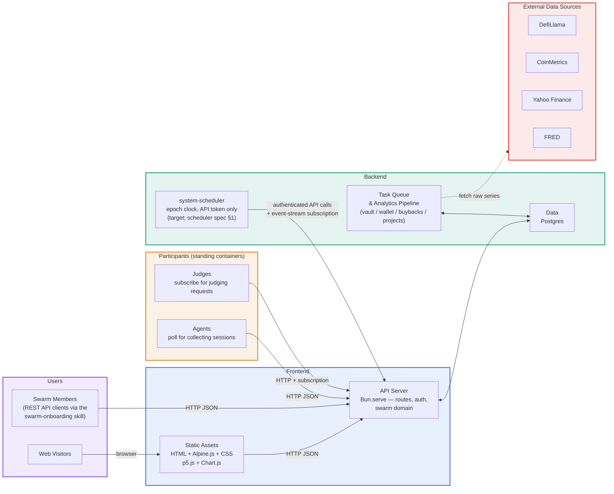

# Network topology

Part of the [architecture](README.md). Split out of the former single `docs/architecture.md` on 2026-09-23; section numbering inside is unchanged so old citations still resolve.

## Network topology — DNS, origins & vendors

How `robotmoney.network` presents several independent product surfaces as one
seamless site, organized by a clean **separation of concerns** — both across
infrastructure tiers and across **two vendors**. This document is cross-cutting:
it spans the **marketing** site, **this repo** (Investment Swarm + analytics),
and the **on-chain dapp** (`robotmoney-core`). It is a companion to
the rest of this document (this frontend's internals) and
[decisions.md](../decisions.md); the production topology here is decision **D13**,
which supersedes the single-box parts of D8/D11 (see [§10](#10-relationship-to-existing-decisions)).
**D21** retires D18's fourth subdomain, `mcp.` — REST is the only surface
members use (see [§10](#10-relationship-to-existing-decisions)).

Only `api` and the pipeline worker hold a database credential;
`system-scheduler`, `analytics-producer` and every participant reach the stack
over HTTP only, and no container holds a Docker
socket ([smoke-production-spec §3](../technical/smoke-production-spec.md#3-roles-and-credentials),
[scheduler spec §7](../technical/system-scheduler-spec.md#7-credentials)).

---

## 1. Principle — two separations of concern

**By tier.** Three surfaces with different lifecycles and infra, deployed
independently:

- **Static tier** — asset delivery. No runtime dependency on anything else; serves
  even when the API and data tiers are down (**fail-open**).
- **API tier** — request/response compute. Stateless services.
- **Data tier** — durable state. One high-availability database.

**By vendor.** Each vendor owns one job, and **no routing software runs anywhere**:

- **Cloudflare — DNS + observability.** Authoritative DNS, proxied TLS/DDoS, and
  monitoring (Health Checks, analytics, Logpush). This is *configuration, not code*
  — no Worker, no reverse proxy.
- **DigitalOcean — compute + storage.** Droplets, Spaces (+CDN), and Managed
  Postgres.

Because Cloudflare runs no routing code and DigitalOcean has no managed
path-router, surfaces are addressed by **subdomain** (host-based routing via plain
DNS), not by path prefix. The seamless look is carried by the **shared design
layer** (ARCHITECTURE §4), not by a shared origin.

---

## 2. The vendor split

| Vendor | Owns | Form |
|--------|------|------|
| **Cloudflare** | DNS, TLS, DDoS, **observability** (Health Checks, analytics, Logpush) | Configuration only — **no software** |
| **DigitalOcean** | **Compute** (Droplets), **storage** (Spaces + CDN), **data** (Managed Postgres HA) | The running system |

**Rule of thumb: Cloudflare resolves and watches; DigitalOcean runs and stores.**
All deployable software lives on DigitalOcean.

---

## 3. The surfaces — subdomain map

Each surface is its own hostname, resolved by a plain DNS record:

| Hostname | Surface | Tier → home | Source |
|----------|---------|-------------|--------|
| `robotmoney.network`, `www.` | Marketing | Static → **DO Spaces CDN** | marketing UI (this repo, D1) |
| `swarm.robotmoney.net` | IC + analytics (REST — the only member surface, D21) | API → **DO droplet** (Bun) + Data → **Postgres HA** | `robotmoney-frontend` (this repo) |
| `app.robotmoney.net` | Dapp | API → **DO droplet** (`rmpc` + gateway) | `robotmoney-core` |

Each app is served at **its own root**, so there is **no path-prefix and no
base-path handling** — the SPA history router (D4) and import maps (D2) work
unmodified. The SPA and its API are **same-origin** on the same subdomain (no CORS
within a surface).

> **D21.** The MCP server previously had its own subdomain and port here
> (`mcp.`, port `8443` — D18). D21 retired the MCP transport; members now use
> `swarm.`'s REST API like every other client, so the fourth subdomain and
> its §3.1 provisioning (Cloudflare alternate port, `MCP_PORT`, firewall rule)
> no longer apply. Actually decommissioning the DNS record, firewall rule, and
> `mcp` container is tracked as D21's follow-up implementation work.

---

## 4. DNS & TLS — how each hostname resolves

- **Marketing** (`robotmoney.network` via CNAME-flattening, and `www`) → a **DNS-only**
  (grey-cloud) CNAME to the **DO Spaces CDN endpoint**. This is the CDN's native
  host-based usage: DO delivers, caches, and terminates TLS with its **custom-domain
  certificate**. Cloudflare does *not* sit in the data path here, so there is **no
  double-CDN** (§7).
- **App subdomains** (`swarm.`, `app.`) → **proxied** (orange-cloud) records to
  the droplet. Cloudflare presents its edge certificate to users and provides
  TLS/DDoS plus traffic analytics; the droplet serves a **Cloudflare Origin CA
  certificate** to the proxy. The droplet's **DO Cloud Firewall** allows ingress
  only from Cloudflare's IP ranges.
- **(Optional hardening)** a **Cloudflare Tunnel** can replace the proxied-DNS +
  firewall approach for *zero* public ingress, at the cost of running the
  `cloudflared` connector on the droplet. Default is proxied DNS + firewall (no
  connector to run).

---

## 5. Static tier — marketing (DO Spaces CDN)

The static marketing assets (the marketing UI preserved per D1) are uploaded to a
**DigitalOcean Space with its CDN enabled**, served on the apex/`www` hostname.
The tier has **no runtime dependency on the API or data tiers** — it is pure static
— so when a droplet or Postgres is unavailable, marketing **still serves
(fail-open)**. Any dynamic data a marketing page wants is fetched client-side and
must **degrade gracefully**; the page never hard-depends on the API.

---

## 6. API tier — services on DO droplets

Request/response services run on **DigitalOcean Droplets**, one surface per
subdomain:

- **`swarm.`** — this repo's Bun `api`, the pipeline `worker`,
  `analytics-producer`, `system-scheduler` (API credential only; it replaced the container
  formerly called `worker-swarm`), and the standing participant containers from the credential
  file; `website-server` (issue #892) co-serves this surface's SPA assets
  (`STATIC_DIR`) same-origin at the subdomain root, proxying `/api/` through
  to `api`.
- **`app.`** — the `rmpc` daemon + on-chain gateway (`robotmoney-core`).

Ingress is Cloudflare-proxied DNS locked to Cloudflare IPs by a DO Cloud Firewall
(§4). Droplets are used because Cloudflare has no always-on instance and the `rmpc`
daemon must stay synced to chain head — a scale-to-zero model is wrong for it.

---

## 7. Data tier — Postgres HA cluster (DO)

Durable state is a **DigitalOcean Managed Postgres high-availability cluster**:
primary + standby with automated failover, daily backups, and point-in-time
recovery. Application services connect under separate scoped roles; participants
and the analytics producer have no database credential. See
[smoke-production-spec §3](../technical/smoke-production-spec.md#3-roles-and-credentials).
This refines D8's one-Postgres principle. CI and local stage database modes are
defined by the adopted spec, not D8's retired environment flags.

---

## 8. No double-CDN

Marketing's CDN is **DO Spaces CDN**, reached **DNS-only** (§4), so Cloudflare adds
no second cache in front of it — one cache, one invalidation path (purge is a DO
operation). The proxied app subdomains are dynamic; Cloudflare passes them through.

---

## 9. Seamless without a single origin, and observability

**Seamless look** does not require one origin — it comes from the shared design
layer (`tokens.css` + shared nav/footer chrome; ARCHITECTURE §4), identical on
every subdomain. Shared login/session works by setting cookies on
`.robotmoney.net`. Cross-surface API calls (rare — each surface mostly calls its
own same-host API) use CORS.

**Observability** is Cloudflare's second job, complemented by DO:

- **Cloudflare** — **Health Checks** probe each surface's `/health`; traffic +
  security **analytics** and **Logpush** per hostname.
- **DigitalOcean** — droplet **Monitoring/alerts**, **Uptime** checks, and Managed
  Postgres metrics (replication lag, failover, connections).
- **`/health` JSON contract** (the keystone) — every surface returns the same shape
  and checks its own deps: marketing trivially `200`; IC = Postgres; dapp =
  `rmpc` alive + gateway + RPC reachable + chain-head lag below threshold. The api
  surface adds one field, `handle_namespace` (`clean` / `unchecked` /
  `overridden`), reporting what its boot-time handle/id namespace guard concluded
  (D34) — the status code stays `200` in all three cases, because these probes key
  on `.ok` and failing them for a slow database would cascade a whole-site restart
  loop. Log lines are **not** a detection path in this deployment: nothing above
  scrapes container logs, so anything an operator must be able to notice has to be
  in this payload. The one state this payload cannot report is a **black-holed**
  database (packets dropped, no RST): `/health`'s own `SELECT 1` runs on the
  shared pool, which sets no timeouts, so the request is closed by Bun's idle
  timeout (10s by default, coarsely enforced — measured 8–12s) before it answers
  at all. That is a pre-existing property of `/health`
  rather than anything D34 introduced — a database that *rejects* connections
  answers immediately — and in that state the container log is the only signal.
- **Fail-open** keeps a single failed tier from cascading; the static marketing
  tier in particular stays up independently.

---

## 10. Relationship to existing decisions

- **D13 (vendor-split tiered topology)** — **surface list refined by D18, then
  D18 superseded by D21:** MCP (`mcp.`) was documented as a fourth
  subdomain-routed surface (D18); D21 retired the MCP transport entirely, so
  the surface map is back to three subdomains — `swarm.` serves REST to
  every client, member and browser alike.
- **D11 (single box, no reverse proxy)** — D13 records production's vendor-split
  topology; D47 owns deployment lifecycle. D11's old service and smoke details
  are historical.
- **D8 (one Postgres)** — D13 records the production managed cluster; D47
  supersedes D8's old environment-mode selection.
- **D10 (split-ready repos)** — reinforced: each surface is already an independent
  host, so a repo split stays mechanical.
- **D4 (SPA history router)** — works **unmodified at the subdomain root**; the
  earlier path-prefix/base-path concern is gone.
- **D2 (buildless)** — import maps resolve at the root, no base-path rewriting.

---
