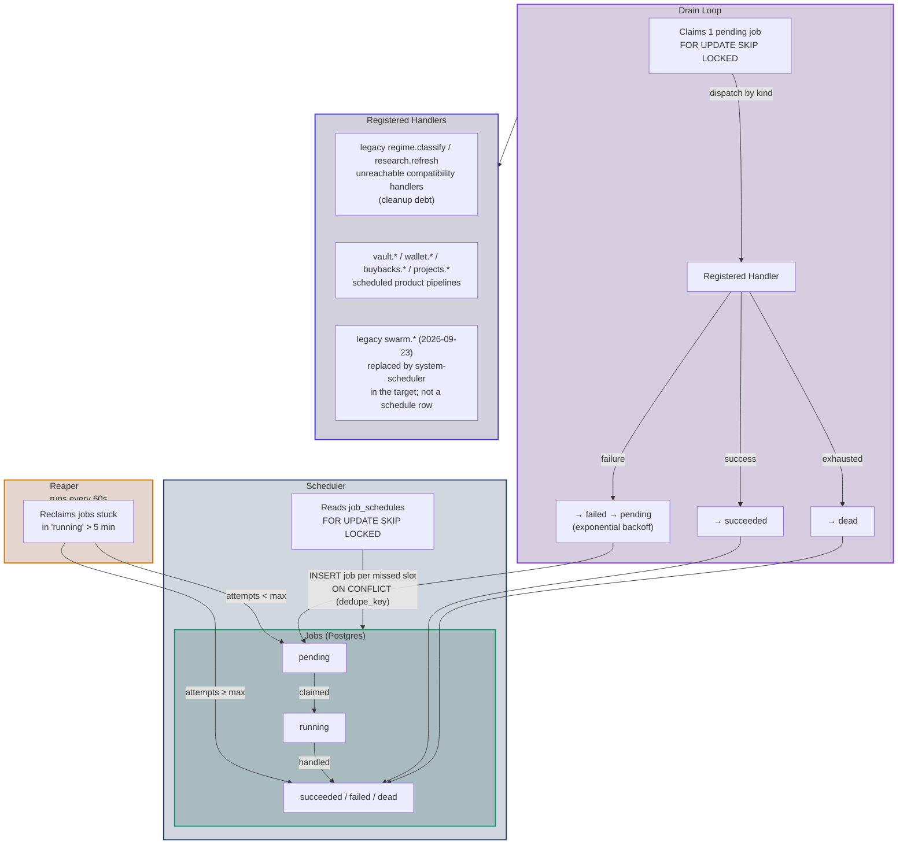
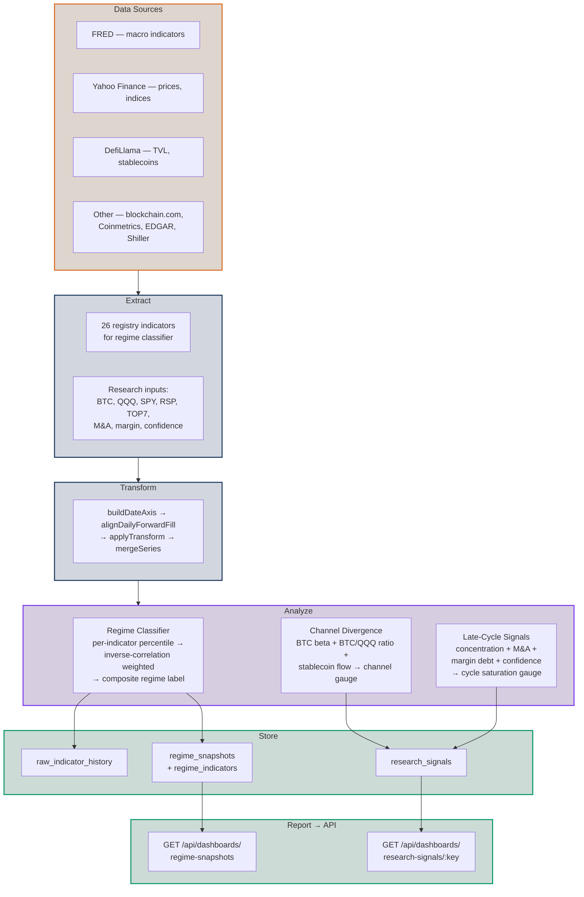

# Task queue and workers

Part of the [architecture](README.md). Split out of the former single `docs/architecture.md` on 2026-09-23; section numbering inside is unchanged so old citations still resolve.

## 7. Task queue & workers

A Postgres-backed queue replaces the old GitHub Actions cron + `scripts/` for
the vault, wallet, buyback and project pipelines. It is **not** the target
driver of the swarm session lifecycle. That driver is `system-scheduler`: one
long-running container that holds an API automation token only (no database
credential, no Docker socket), keeps one boundary timer per active subject,
and drives each epoch by calling authenticated API endpoints and subscribing
to the API's event stream. The API performs state-guarded transactions and
serves subscriptions and runs no background orchestration. Participants
(agents poll, judges subscribe) do the model work. See
[system-scheduler-spec §§1–4](../technical/system-scheduler-spec.md#1-roles)
and §9.4 below. The `swarm` lane, the `worker-swarm` container and the five
`swarm.*` job kinds are GONE as of issue #1026 W4: the lane is no longer in
`worker/lanes.ts`, the container is no longer in any composition, the schedule
rows are deleted by migration 0072, and nothing enqueues those kinds. What
this section describes below is the queue that remains, which the vault,
wallet, buyback and project pipelines depend on.

Each worker process (`backend/src/worker/`, entry `index.ts` → `runtime.ts`)
runs three loops:

- **Claim order**: `ORDER BY priority DESC, run_after, id`. The `id` tiebreak is
  required, not cosmetic (issue #806): `run_after` is a millisecond instant that
  same-priority jobs routinely share, and without it a later step could lose
  the tie to an earlier one and burn every attempt on a terminal state. It
  does not self-heal, so it is ordered rather than retried. (The original
  trigger was the legacy admin session path's clamp, which collapsed
  `swarm.aggregate` and `swarm.judge` onto one instant; that path is not part
  of the target, but the ordering rule stands for every kind.)
- **Claim loop** (`loop.ts`): claims one due job **within its lane's kind
  allowlist** with `FOR UPDATE SKIP LOCKED` (safe across N workers), runs its
  handler by `kind`, and records the outcome in `job_runs`. On failure it retries
  with exponential backoff via `run_after` up to `max_attempts`, then marks the
  job `dead`. While a handler is live its owner **renews the lease**
  (`locked_at`, every `JOB_LEASE_RENEW_MS`, default ⅓ of the visibility timeout)
  so a long job is never reaped and executed concurrently; a lost lease cancels
  the run (ownership-guarded terminal writes discard the zombie's result).
- **Scheduler** (`scheduler.ts`): for each due `job_schedules` row it enqueues a
  job with a `dedupe_key` of `kind + slot` (`ON CONFLICT DO NOTHING` → exactly-once
  per slot) and advances `next_run_at` via a cron parser.
- **Reaper** (`reaper.ts`): requeues jobs stuck in `running` past a visibility
  timeout (crashed/abandoned worker — a live owner renews its lease), bounded by
  `max_attempts`.

**Execution lanes** (issue #107, `worker/lanes.ts`): every worker is pinned to a
lane via the **required** `WORKER_LANE` env (empty/unknown fails loudly at
startup). Lanes are deterministic kind allowlists applied inside the claim:

| Lane | Claims | Purpose |
|------|--------|---------|
| `analytics` | everything except `research.%` | Internal scheduled pipelines (vault/wallet/buybacks/projects); legacy `regime.classify` rows are disabled/dead-lettered. |
| `research` | `research.%` only | Compatibility lane for retired queue rows; supported research runs in the independent producer. Removed under smoke spec §7.2 (2026-09-24). |
| `generic` | everything | Single-process dev convenience; never part of the compose topology. |

There is no `swarm` lane. It was removed with the job chain it reserved
capacity for ([scheduler spec §1](../technical/system-scheduler-spec.md#1-roles):
`system-scheduler` "replaces the process formerly called `worker-swarm`"), and
the `swarm.%` exclusions the other lanes carried went with it — an exclusion
for a kind nothing can enqueue is a rule a reader has to look up to discover is
dead.

The Compose topology is one container per surviving lane
(`worker-analytics`/`worker-research` in `docker-compose.yml`), the non-queue
`analytics-producer`, and `system-scheduler`, which is not a queue lane at all
— it holds one API token, no database credential, and drives epochs over HTTP.
The pipeline worker (`worker-analytics`, lane `analytics`, running the vault,
wallet, buyback and project jobs) holds `rm_worker` and runs preflight checks
1–3 at startup; `worker-research` serves only retired rows and is removed
([smoke spec §7.2](../technical/smoke-production-spec.md#72-one-library-three-callers)). Worker lanes
scale independently; producer cadence does not pass through a worker lane.
Worker ids default to `<lane>-<pid>`, so `locked_by`, logs, and the admin jobs
dashboard are lane-attributable. Shutdown is **bounded**: on SIGINT/SIGTERM a
worker finishes its in-flight job up to `WORKER_SHUTDOWN_TIMEOUT_MS`, then
releases anything it still owns back to `pending` — a stopped worker never
leaves an orphaned `running` row.

**Idempotency** comes from upserting on natural keys; **exactly-once scheduling**
from the dedupe key; **concurrency safety** from `SKIP LOCKED`. Handlers
(`worker/handlers/`) are registered per `kind`. The retained `regime.classify`
and `research.refresh` handlers are compatibility code only: their schedules are
disabled, pending/running rows are dead-lettered, supported API/admin paths
cannot enqueue them, and shared workers receive no producer bearer. The
independent producer (§7.1) drives the analytics suite on independent
schedules (the combined `analytics.run` kind is retired).

### Admin dashboard (task-queue observability)

A read-only operator surface over the queue tables — `backend/src/api/routes/admin.ts`
serving `/api/admin/*`, and the buildless `/admin` frontend view
(`frontend/public/views/admin.html` + the `adminSurfaceView` factory in
`alpine/views/admin-surface.js`). It SELECTs only; there is no new table:

- `GET /api/admin/jobs` — recent `jobs` (all kinds) + all `job_schedules` + a
  `{ byStatus, byKind }` count summary.
- `GET /api/admin/jobs/:id` — one job plus its recent `job_runs` (400 on a
  non-numeric id, 404 when unknown). A run's `output` (jsonb) and `error` (text)
  ARE the per-run logs the view pretty-prints.
- `GET /api/admin/runs?kind=&status=&limit=` — the recent `job_runs` feed across
  all jobs (the log feed), with optional filters.
- `POST /api/admin/auth` — validates the password for the login form.

All four are PRIVILEGED with the same guard the swarm/projects admin routes
use: the operator's admin service token presented as `X-Admin-Token` and
validated against the API's token store (smoke spec §3; this replaces the
`ADMIN_TOKEN` environment variable), or —
only outside prod — the `config.allowInsecure` convenience path. Fail-closed: the
403 check runs before any DB work. The `/admin` view is intentionally NOT in the
public nav; the token is kept in `sessionStorage` for the tab. The old smoke
TUI's per-boot token display is a legacy implementation detail and is not part
of the adopted deployment design. Use the adopted credential model for future
deployment provisioning.

The frontend shell also renders `/admin/research` and `/admin/queue` sections
(stage timeline, bounded artifact previews, filtered queue jobs, and
non-analytics dead-job retry — issue #157) against the `admin.overview`,
`admin.researchRuns`, `admin.researchRun`, and `admin.jobRetry` routes declared
in `contract/src/routes.js`. Analytics retry/schedule controls are retained only
to return fail-closed `409` responses because the producer owns execution. Every
`/admin/*` path resolves to this one shell
fragment (`frontend/public/assets/js/app/routes.js`); the component reads
`location.pathname` to pick a section. See the
[Admin Surface specification](admin-surface.md#admin-surface-research-and-investment-swarm) for the
full target contract — the backend routes those sections call are delivered by
issue #155 and exercised here only through Playwright's mocked API fixtures
until that lands.

### 7.1 Analytics suite (six-stage pipeline)

All analytics — the regime classifier and the research signals — are instances of
one abstraction in `backend/src/analytics/`, so they share data-sourcing,
normalization, scheduling, persistence, and API exposure. The directory is split
into six independently testable stages — **access → extract → transform → analyze
→ store → report** — each a leaf that can be exercised in isolation:

- **`types.ts`** — the leaf shapes (`Point`, `SeriesSpec`) that flow through every
  stage.
- **`access/`** — the data seam for the orchestrator. `data-source.ts` defines the
  `AnalyticsDataSource` interface (`fetchIndicators` / `fetchResearchInputs` /
  `fetchBacktestExtras`) and the production default **`liveDataSource`** — pure REAL
  keyless fetchers, NO synthetic substitution: a failed/empty fetch returns `[]` and
  the orchestrator degrades to the persisted-real floor via `mergeSeries` (never to
  seeded data). `hermetic-source.ts` is the deterministic, offline
  **`hermeticDataSource`** (seeded walks from `provider.ts`'s `seededProvider`) used by
  the CI backend unit tests and available as an explicit local-debug override.
  **`ANALYTICS_SOURCE`**, resolved by
  **`resolveAnalyticsSource()`** in `backend/src/analytics/index.ts`, is the SINGLE
  authoritative selector: unset/`live` → `liveDataSource`, `hermetic` →
  `hermeticDataSource`, any other value refused loudly (fail-closed). The legacy
  `PROVIDER` env knob, the `config.analyticsProvider` field it fed, and the
  `fetcher-provider.ts` test scaffolding it drove were **removed** (2026-07-14
  maintainability review, finding 011 — they had zero production consumers);
  `ANALYTICS_SOURCE` is the only source selector, and a backend guard test
  (`tests/no-dead-provider-chain.test.ts`) greps `backend/src` to keep the dead
  chain from reappearing.
- **`extract/`** — pull raw series from KEYLESS public sources. `http.ts`
  (timeout/abort fetch, plus an opt-in on-disk TTL cache in `fetch-cache.ts`), one
  pure parser per source — **`fred.ts`, `yahoo.ts`, `defillama.ts`,
  `blockchain-com.ts`, `coinmetrics.ts`, `geckoterminal.ts`, `shiller.ts`,
  `edgar.ts`** (JSON/CSV in → `Point[]` out, throw on garbage) — and `sources.ts`,
  the indicator-id → fetch+parse wiring that `liveDataSource.fetchIndicators` drives
  (each source isolated; one failure drops only its own series, which then falls back
  to the persisted floor).
- **`transform/`** — normalize/clean. `math.ts` is the shared pure math
  (percentile-in-window, sign, rolling beta, ratios, `isoDay`, …) so normalization
  is identical suite-wide; `grid.ts` reshapes gappy real series onto the dense
  daily grid (`shapeDaily` forward-fill, `ratioByDate`).
- **`analyze/`** — the computations (pure, DB-free). `tool.ts` is the
  `AnalyticTool` interface (`id, kind, inputs, dependsOn, compute`) + a
  `Registry` that topologically orders `dependsOn` and runs tools — a tool
  may **compose** another's output (e.g. a future "regime tempered by
  channel-divergence") with no special-casing. `research.ts` holds the research
  payload shape; `regime.ts`, `channel-divergence.ts`, `late-cycle.ts` are the
  tools (pure compute only — persistence is owned by the orchestrator's
  `AnalyticsPersistence` port, issue #106; analyze/ never imports a store).
  `backtest.ts` (`computeBacktest`) and `correlations.ts` (`computeCorrelations`)
  add the asof-only regime **backtest** + predictive **correlations** payloads
  (ported from the original `regime-snapshot.json`).
- **`store/`** — the only SQL writes, and **API-owned** (issue #106): only the
  API process (its `/api/analytics` + swarm regime routes via
  `store/direct.ts`), tests, and migration/smoke tooling may import these
  writers. `regime-store.ts` (`saveRegimeSnapshots`), `research-store.ts`
  (`persistResearchSignal`), and `raw-history-store.ts` (the append-only
  persisted raw floor) all upsert on natural keys and accept an injectable
  handle so the API routes wrap each ingestion batch in one transaction;
  `floor-seed.ts` (`applyRawFloorSeed`) is the server-side gap-fill behind the
  seed-ingestion endpoint (parsing of the vendored seed lives in
  `extract/floor-seed.ts`; the orchestrator triggers it via
  `ANALYTICS_FLOOR_SEED=1`).
  Merge-forward and seed gap-fill only ever *add* to the floor, so neither
  notices a row that persisted wrong; how the pipeline instead detects and
  repairs bad persisted data — gap detection, source-calendar validation, and
  comparative reconciliation across independent sources for the same series —
  is specified in [`technical/regime-engine.md`](../technical/regime-engine.md) §11, and its market-data half in [`technical/markets-asset-pricing-ingest.md`](../technical/markets-asset-pricing-ingest.md).
  `saveRegimeSnapshots` also bakes the asof-only **`backtest`** + **`correlations`**
  jsonb payloads onto the latest `regime_snapshots` row (columns added by migration
  `0010_backtest_correlations.sql`; NULL on historical rows), sourced via
  `AnalyticsDataSource.fetchBacktestExtras` (SPX/ETH price levels + the DTB3 3-month
  T-bill yield).
- **`report/`** — `projections.ts` owns all SQL reads + the row→DTO map
  (`fetchRegimeSnapshots(range)` → `{ latest, history }`, carrying the asof-only
  `backtest`/`correlations` on `latest`; `fetchLatestResearchSignal(key)`). The
  contract DTOs **`BacktestPayload`** / **`CorrelationsPayload`**
  (`contract/src/dashboards.d.ts`) type those payloads. The HTTP route
  `api/routes/dashboards.ts` stays a thin adapter — for this slice it only
  parses/clamps `range` and calls these (the same file now fronts ~8 dashboard
  endpoints, incl. the live chain feeds of §10). The frontend stays a consumer
  across the HTTP boundary.

**Persistence boundary (issue #106).** The orchestrator
(`analytics/index.ts::runAnalytics`) never writes SQL: every analytics-table
read/write goes through the `AnalyticsPersistence` port
(`analytics/persistence.ts`). The independent `analytics-producer` uses the HTTP
implementation (`analytics/api-client.ts`), submitting through authenticated typed routes
`GET/POST /api/analytics/raw-history`, `POST /api/analytics/raw-history/seed`,
and — since issue #978 — `POST /api/analytics/run-packages`, the terminal run
package that is the SOLE publisher of `regime_snapshots` and `research_signals`
(the orchestrator no longer writes either projection mid-run, so a run that
fails partway can never leave the current view ahead of the immutable ledger).
The standalone `POST /api/analytics/regime-snapshots` and
`POST /api/analytics/research-signals` upserts were RETIRED by issue #978 —
they wrote the current views with no run, no immutable artifact and no report
snapshot, so any `ANALYTICS_TOKEN` holder could publish regime rows no frozen
report contained and a signed brief would then bind to some other run's report.
Nothing called them: the offline eq-snapshot import (`db/import-regime-eq.ts`)
and `POST /api/swarm/regime` reach `store/regime-store.ts` in process and never
went through the HTTP boundary
(`api/routes/analytics.ts`) with the analytics-provider bearer
(a per-instance token file validated against the API's token store, smoke
spec §3; wiring: `ANALYTICS_API_URL`). Only the producer mounts that file; the producer has no `DATABASE_URL` or admin token.
Mutations validate the entire payload before opening a transaction, are
idempotent on natural keys, and there is NO generic SQL-over-HTTP endpoint. The
API process injects the direct service (`analytics/store/direct.ts`) instead.
Shared worker DB access remains queue/non-analytics scoped (`rm_worker`,
`0016_worker_role.sql`), and legacy analytics handler code has no supported
enqueue path or bearer. `tests/analytics-api-boundary.test.ts` and the producer
boundary tests fail CI if the compute side imports SQL/store writers or gains
ambient DB/admin credentials.

Three pipelines run through these stages:

- **`regime`** — 26 registry indicators (`backend/src/analytics/analyze/indicators.ts`)
  across three panels: **macro** (`T10Y2Y`, `DFII10`, `T5YIE`, `HY_OAS`, `DXY`,
  `ICSA`, `VIX`, `COPPER_GOLD`) and **on-chain** (`DEFI_TVL`, `STABLES`,
  `BTC_ACTIVE`, `ETH_ACTIVE`, `BTC_MVRV`, `BTC_ETH`, `ETH_TREND`, `NEW_TOKENS`,
  `DEFI_GROWTH`, `STABLES_GROWTH`) drive the 2-panel composite (0.5×macro +
  0.5×on-chain); a third **factor** panel (`SPX_TREND`, `IWM_SPY`, `SPHB_SPLV`,
  `MTUM_SPY`, `IWF_IWD`, `XLU_SPY`, `XLP_XLY`, `SHILLER_CAPE`) is fetched,
  persisted, and served as a **display-only** third index card on `/regime` — it
  is not part of the composite. Per-indicator sign-adjusted percentile → panel +
  overall composite + regime label history → **`regime_snapshots`** (`panels`
  column lists which panels are populated on the asof row).
- **`channel-divergence`** — `BTC`, `QQQ`, `SPY` → BTC beta vs the risk-appetite
  factor + BTC/QQQ relative strength gauges → **`research_signals`**.
- **`late-cycle-signals`** — `SPY`, `RSP`, `MNA`, `MARGIN`, `CONF` → index
  concentration / M&A / margin debt / confidence gauges → **`research_signals`**.

**EDGAR/MNA seed (issue #108).** `late-cycle-signals`'s `MNA` input is a
monthly count of SEC EDGAR S-4 filings back to 2010-01 — a fresh live database
would otherwise have to crawl ~200 EDGAR requests before its first research
run. The repo commits a canonical, versioned seed instead:
`backend/tests/fixtures/regime/edgar-mna-seed.csv.gz` (a `date,indicator,value`
CSV, gzipped) plus `edgar-mna-seed.manifest.json` (format version, indicator
key, source, declared start/end month, the pinned as-of date the regeneration
ran, exact row count, and a sha256 checksum of the canonical **decompressed**
content — independent of gzip timestamp/metadata bytes). Format, checksum, and
full structural validation (unique ascending month-end dates, contiguous
monthly coverage, finite non-negative integer counts, single indicator, no
rows past the pinned as-of) live in
`analytics/extract/edgar-seed.ts` — pure, no I/O.

- **Bootstrap** (`analytics/edgar-seed-loader.ts::bootstrapEdgarSeed`, invoked by
  the producer's `seed` command) loads + validates the committed artifact and
  submits it through the SAME authenticated seed-ingestion endpoint the vendored
  floor seed uses (`POST /api/analytics/raw-history/seed` →
  `store/floor-seed.ts`'s server-side gap-fill: existing real rows always win, a
  second run is a no-op). After ingestion, that same producer command runs one
  immediate producer-owned research refresh over HTTP, so smoke readiness never
  depends on a consumer queue. `POST /api/analytics/research-eligibility` is a
  retained fail-closed compatibility path: after provider authentication it
  returns `409 producer_owned` and mutates neither `job_schedules` nor `jobs`.
  All legacy `regime.classify`/`research.refresh` schedule rows remain disabled;
  no admin or analytics endpoint can reactivate or enqueue them.
- **Repopulation** (`edgar-seed-loader.ts::repopulateEdgarSeed` →
  `backend/scripts/edgar-seed-repopulate.ts`) is an operator command for a
  database that lost some MNA rows: it diffs the committed artifact against
  whatever is persisted and reports `seeded` (restored), `existing` (already
  present, same value), and `rejected` (already present with a *different*,
  real value — correctly left standing) counts.
- **Regeneration** (`extract/edgar-seed-generator.ts` →
  `backend/scripts/edgar-seed-regenerate.ts`) is the ONLY way the committed
  pair is ever produced or replaced — never implicit in migrations, smoke boot,
  or required per-PR CI. An operator runs `bun run edgar-seed:regenerate --end
  <last day of a complete month> --asof <today>` (optionally `--start`,
  default the declared 2010-01-01 baseline); it fetches live EDGAR bounded
  (one request/month via `extract/edgar.ts`'s retry/backoff), REFUSES to write
  anything if even one month is unrecoverable (never a partial seed), and
  atomically replaces both files (temp-write → round-trip through the exact
  parse/validate path → rename) so a failed regeneration never corrupts the
  committed pair. **Credentials:** none — EDGAR's full-text-search API is
  keyless; only a descriptive User-Agent is sent. **Review expectations:** a
  PR that regenerates the seed must be reviewed like a data change, not a code
  change — check the manifest's `rowCount`/`startMonth`/`endMonth`/`asOf` are
  what's expected and that the diff is additive (new trailing months), never a
  silent revision of historical counts.

**Regime raw floor seed (issue #400).** The same convention applies to
`raw-indicator-history.csv.gz` (a `date,indicator,value` CSV, gzipped, the
combined floor for all 26 registry indicators): `bun run floor-seed:regenerate
--indicator <ID> --asset <a> --metric <m>` (`extract/floor-seed-generator.ts` →
`backend/scripts/floor-seed-regenerate.ts`) fetches one indicator's live
history (default: `BTC_MVRV` via Coinmetrics `CapMVRVCur`, #127's repoint off
the dead blockchain.com mvrv chart), additively merges it into the existing
committed floor (`mergeSeries` — fetched wins on overlap), caps the fetched
range to the floor's own existing max date across every OTHER indicator by
default (so one indicator's regeneration never silently drags every other
indicator's vintage forward), and atomically replaces the committed gzip.
Because every registry indicator feeds the SAME onchain/macro composite,
adding real history for a previously all-NaN (weight-0) indicator changes the
computed composite/percentile/regime for the affected panel across the whole
history — so the downstream regime-fidelity golden fixtures
(`regime-history.csv.gz`, `regime-snapshot.json.gz`,
`regime-compute-reference.json.gz`, `regime-backtest-correlations-reference.json.gz`)
all go stale together. They are regenerated by TWO SEPARATE scripts that must
never write the same file:
`regime-history.csv.gz` and `regime-snapshot.json.gz` are production-
methodology outputs, regenerated via
`bun run scripts/regime-goldens-regenerate.ts`, which re-runs the SAME
in-repo, already-fidelity-proven TS pipeline (`computeRegime`/
`computeBacktest`/`computeCorrelations`) over the updated floor —
CURRENT_REGIME_VERSION `v3` already means "recompute the full history fresh
on every run" (see `analyze/regime-versions.ts`), so this is the same
methodology production already runs, not a new one.
`regime-compute-reference.json.gz` and
`regime-backtest-correlations-reference.json.gz` exist ONLY to prove this
TS port matches an INDEPENDENT implementation, so they must NEVER be
regenerated from this repo's own TS pipeline. (Issue #447: PR #444
temporarily did exactly that, on the mistaken claim that the original
out-of-repo agentjuno/robotmoney JS generator was "permanently unavailable"
— it was not; `robotmoney/robotmoney-site`, an active fork in this same
GitHub org, still holds that code byte-identical to upstream.) This repo
vendors that original JS verbatim at
`backend/scripts/vendor/regime-reference-js/` (see its README.md for
blob-sha provenance) and regenerates these two fixtures from it via
`bun run scripts/regime-independent-reference-regenerate.ts` — restoring
them as genuine independent cross-implementation references, verified 0
mismatches across the full BTC_MVRV-inclusive history. See the file-header
comments in `tests/regime-fidelity.test.ts` /
`tests/backtest-correlations-fidelity.test.ts` for what each STRICT test
proves. **Review expectations:**
same as the EDGAR seed — review as a data change, confirm the new indicator's
values are finite/plausible and the regeneration command used is recorded in
the PR.

**v0 identity-roster seed (issue #495).** The projects directory's identity
data — every project/agent/coin/wallet/vault row's slug, name, ticker,
protocol standard and address — comes from a committed artifact, not a live
crawl: `backend/src/projects/seed/v0-roster-data.json` plus
`v0-roster-data.manifest.json` (format version, source tag, the pull's real
completion time `generatedAt`, per-facet counts, server-declared upstream
totals, skip tallies, and a sha256 of the canonical content). Loader,
validation and atomic replace live in `backend/src/projects/seed/roster-seed.ts`;
the live extract that produces it is `roster-seed-generator.ts`. Volatile
metrics — market cap, FDV, 24h change, wallet balance, vault TVL, revenue —
are NEVER in the seed; they are fetched live per
`backend/src/projects/access/live-source.ts`.

- **Serving.** `liveProjectsDataSource.discoverProjects()` loads and fully
  validates the pair with no network and no DB access, and
  `discoveredAsOf()` returns the manifest's `generatedAt`. The nightly
  `projects.discover` job (02:00 UTC) writes THAT timestamp into
  `projects.resolved_at` / `openclaw_agents.enriched_at` — never `now()` — so
  the leaderboard's source-health panel reports the roster's real age instead
  of claiming a frozen dataset refreshed last night. Each load prints one
  `[roster-seed] loaded <path> …` line naming the file, `generatedAt`, counts
  and checksum prefix.
- **Reconciliation and rollback.** `projects.discover` marks any project a
  previous discovery run left active but that is absent from the current
  roster `status='inactive'` (never DELETE — facet and snapshot history is
  FK-linked, and a later run that re-discovers the slug flips it back). Rows
  never written by discovery (`resolved_at IS NULL`) are never touched. The
  step is guarded by a 10% shrink floor: a run carrying fewer projects than
  90% of what is currently active does NOT deactivate anything and reports
  `shrinkRefusal` instead, because auto-deactivating on top of a truncated
  extract would take the directory down automatically. **To roll the roster
  back** — including reverting to the 4-row fixture — enqueue the job with
  payload `{"allowShrink": true}`, which waives the floor for that run.
- **Monitoring.** `GET /api/admin/overview` carries a `rosterSeed` entry
  (manifest `generatedAt`, age in days, declared project count, checksum
  prefix, and the persisted active-project count) plus an alert when the
  manifest is unreadable or fewer projects are live than the seed declares.
  Every `projects.*` kind is in `MONITORED_KINDS`
  (`backend/src/admin/overview.ts`), so a failed/degraded/dead/not-run
  discovery raises an alert — an exhausted degrade settles the job
  `'succeeded'`, so the run-health entry is the only signal that survives.
- **Regeneration** (`bun run projects-roster-seed:regenerate`) is the ONLY way
  the pair is produced or replaced — never implicit in migrations, smoke boot,
  or per-PR CI. **Credentials:** read-only `V0_ANALYTICS_SOURCE_URL` /
  `V0_ANALYTICS_SOURCE_KEY` in the environment, required only to regenerate,
  never to read the committed seed and never present in any deployment path.
  Prefer `read -s` over an inline assignment so the key stays out of shell
  history and `ps`. Every GET sends `Prefer: count=exact` and asserts the rows
  received equal the total the server declares, pages by keyset cursor
  (`id=gt.<lastId>`) rather than offset, refuses to write a zero-project seed,
  and refuses a regeneration whose `projectCount` falls more than 10% below
  the previous manifest unless the operator passes `--allow-shrink`.
- **Recovery.** `replaceRosterSeedAtomically` writes each file through a
  same-directory temp file + rename. The renames are per-file, not atomic as a
  pair, so a crash between them can leave new data beside the old manifest —
  which fails CLOSED (the next load raises a loud checksum mismatch, discovery
  degrades, and last-persisted rows keep serving). Recover with
  `git checkout backend/src/projects/seed/v0-roster-data.json
  backend/src/projects/seed/v0-roster-data.manifest.json`; the next 02:00 cron
  re-runs on its own. `ROSTER_SEED_PATH` / `ROSTER_SEED_MANIFEST_PATH` are
  test-only overrides and are REFUSED under `RM_ENV=prod`.
- **Review expectations:** same as the EDGAR seed — a PR that regenerates this
  seed is a data change, not a code change. Check the manifest's counts against
  its `upstreamTotals`/`skipped`, confirm `generatedAt` moved forward, and treat
  any drop in `projectCount` as requiring an explanation in the PR body.

The independent producer runs regime and research on **distinct timers**:
`regime` daily at **22:30 UTC** (after US market close, so fetched raw data is
settled end-of-day) and `research` (both research signals, never the regime
tool) daily at **23:00 UTC**. These timers live in `analytics-producer`, not
`job_schedules` or worker lanes. The API exposes regime at `/api/dashboards/regime-snapshots?range=`
(`?view=summary` returns only today's composite/panel read — date, composite,
compositePercentile, regime, the three panel indices and labels, and
staleness — instead of the full `{ latest, history, staleness }` body, issue
#866c; each `history[]` row also drops `backtest`/`correlations`/`indicators`/
`percentiles` — meaningful only on `latest` — via the shared `forHistory`
projection in `regime-projection.ts`, issue #866a) and each research signal at
`/api/dashboards/research-signals/:key`
(`?view=summary` returns only title/asof/question/summary/gauges/spec, dropping
the raw price series and indicators dict, issue #869b); the frontend
renders `/regime` (including the backtest + predictive-correlations panels) and the
`/research/*` views (mirroring the original site's surfaces). The regime DTO also
carries an explicit **staleness block** — `{ asof, serverDate, ageDays, stale,
thresholdDays }`, computed in `backend/src/analytics/report/regime-projection.ts`
(zero snapshots counts as stale, #124) — which `/regime` surfaces as a loud
staleness banner (`frontend/public/views/regime.html`). The existing legacy
smoke harness logs and repairs a frozen snapshot after boot classify; that
behavior is implementation detail, not a deployment preflight guarantee.
Adding an analytic =
write a tool + register it + add a job schedule + a route; nothing else changes.

---

## 11. Task queue topology

The Postgres-backed task queue replaces the old GitHub Actions cron for the
vault, wallet, buyback and project pipelines. Three concurrent loops run
inside the `worker` process for that work. Analytics/research producer cadence
is outside this topology. The swarm session lifecycle is also outside it in
the target: `system-scheduler` drives epochs through the API and no `swarm.*`
job kind or `job_schedules` row exists for it
([scheduler spec §§1–4](../technical/system-scheduler-spec.md#1-roles);
summary in §9.4 above). The registered legacy analytics handlers shown below
are unreachable compatibility debt: their rows are disabled/dead-lettered, no
supported endpoint enqueues them, and shared workers have no producer
credential.

## 12. Analytics pipeline — producer executions

The analytics suite runs as two independent-producer timers: `regime` daily at
22:30 UTC and `research` daily at 23:00 UTC. Neither timer creates a consumer
queue job; computed output is submitted through authenticated REST.
It drives three compute pipelines through a shared 6-stage access → extract →
transform → analyze → store → report flow:

---
