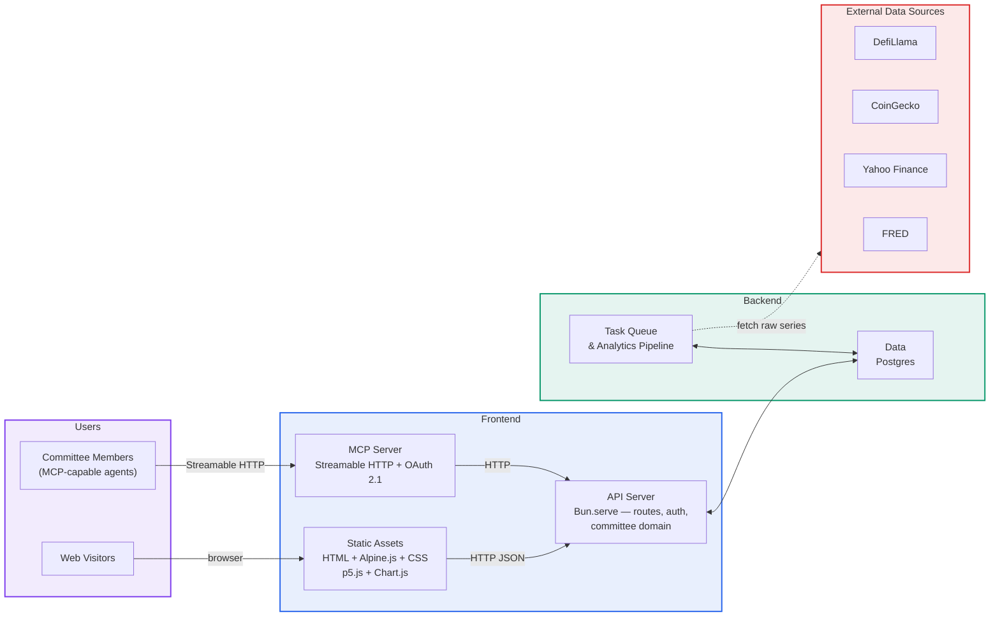

# Robot Money — Coarse Architecture

```mermaid
flowchart LR
    subgraph Users["Users"]
        Visitors["Web Visitors"]
        Members["Committee Members<br/>(MCP-capable agents)"]
    end

    subgraph Frontend["Frontend"]
        Static["Static Assets<br/>HTML + Alpine.js + CSS<br/>p5.js + Chart.js"]
        API["API Server<br/>Bun.serve — routes, auth,<br/>committee domain"]
        MCP["MCP Server<br/>Streamable HTTP + OAuth 2.1"]
    end

    subgraph Backend["Backend"]
        Worker["Task Queue<br/>& Analytics Pipeline"]
        DB["Data<br/>Postgres"]
    end

    subgraph External["External Data Sources"]
        direction LR
        Sources1["DefiLlama"]
        Sources2["CoinGecko"]
        Sources3["Yahoo Finance"]
        Sources4["FRED"]
    end

    Visitors -->|browser| Static
    Static -->|HTTP JSON| API
    Members -->|Streamable HTTP| MCP
    MCP -->|HTTP| API
    API <--> DB
    Worker <--> DB
    Worker -.->|fetch raw series| External

    style Users fill:#7c3aed1a,stroke:#7c3aed,stroke-width:2px
    style Frontend fill:#2563eb1a,stroke:#2563eb,stroke-width:2px
    style Backend fill:#0596691a,stroke:#059669,stroke-width:2px
    style External fill:#dc26261a,stroke:#dc2626,stroke-width:2px
```
