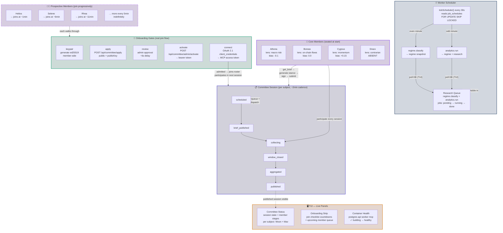

# Robot Money — Demo: Actors & Sequence

```mermaid
flowchart TB
    subgraph Scheduler["⏱ Worker Scheduler"]
        SC["tickScheduler() every 30s<br/>reads job_schedules<br/>FOR UPDATE SKIP LOCKED"]
        SC -->|even minute| R["regime.classify<br/>→ regime snapshot"]
        SC -->|odd minute| A["analytics.run<br/>→ regime + research"]
        R -->|"poll DB (TUI)"| TP
        A -->|"poll DB (TUI)"| TP
    end

    subgraph Core["👥 Core Members (seated at start)"]
        direction TB
        M1["Athena<br/>lens: macro risk<br/>bias: -0.1"]
        M2["Boreas<br/>lens: on-chain flows<br/>bias: 0.0"]
        M3["Cygnus<br/>lens: momentum<br/>bias: +0.15"]
        M4["Draco<br/>lens: contrarian<br/>ABSENT"]
    end

    subgraph Prospects["🧑‍🚀 Prospective Members (join progressively)"]
        direction TB
        N1["Helios<br/>→ joins at ~1min"]
        N2["Selene<br/>→ joins at ~6min"]
        N3["Rhea<br/>→ joins at ~11min"]
        NX["… more every 5min<br/>indefinitely"]
    end

    subgraph Session["📋 Committee Session (per subject, ~2min cadence)"]
        direction LR
        S1["scheduled"]
        S2["brief_published"]
        S3["collecting"]
        S4["window_closed"]
        S5["aggregated"]
        S6["published"]
    end

    subgraph Onboarding["📝 Onboarding Gates (real join flow)"]
        direction LR
        O1["keypair<br/>generate ed25519<br/>member-side"]
        O2["apply<br/>POST /api/committee/apply<br/>public + publicKey"]
        O3["review<br/>admin approval<br/>~6s delay"]
        O4["activate<br/>POST /api/committee/admin/activate<br/>→ bearer token"]
        O5["connect<br/>OAuth 2.1 client_credentials<br/>→ MCP access token"]
    end

    subgraph TUI["🖥 TUI — Live Panels"]
        TP["Research Queue<br/>regime.classify + analytics.run<br/>jobs: pending → running → done"]
        TP2["Committee Status<br/>session state + member stages<br/>per subject: Woon + Mav"]
        TP3["Onboarding Strip<br/>join checklist countdowns<br/>+ upcoming member queue"]
        TP4["Container Health<br/>postgres api worker mcp<br/>✓ building → healthy"]
    end

    Scheduler -.->|results visible in| TP

    Core -->|"get_brief →<br/>generate stance →<br/>sign → submit"| Session
    Core -->|"participate every session"| S3

    Prospects -->|"each walks through"| Onboarding
    O5 -->|"admitted → joins roster<br/>participates in next session"| Session

    Session -->|"worker enqueue +<br/>claim + dispatch"| S1
    S1 --> S2 --> S3 --> S4 --> S5 --> S6
    S6 -.->|"published session visible"| TP2

    style Scheduler fill:#1e3a5f33,stroke:#1e3a5f,stroke-width:2px
    style Core fill:#3b076433,stroke:#7c3aed,stroke-width:2px
    style Prospects fill:#3b076433,stroke:#a855f7,stroke-width:2px,stroke-dasharray:5 5
    style Session fill:#1e1b4b33,stroke:#4338ca,stroke-width:2px
    style Onboarding fill:#064e3b33,stroke:#059669,stroke-width:2px
    style TUI fill:#78350f33,stroke:#d97706,stroke-width:2px
```

