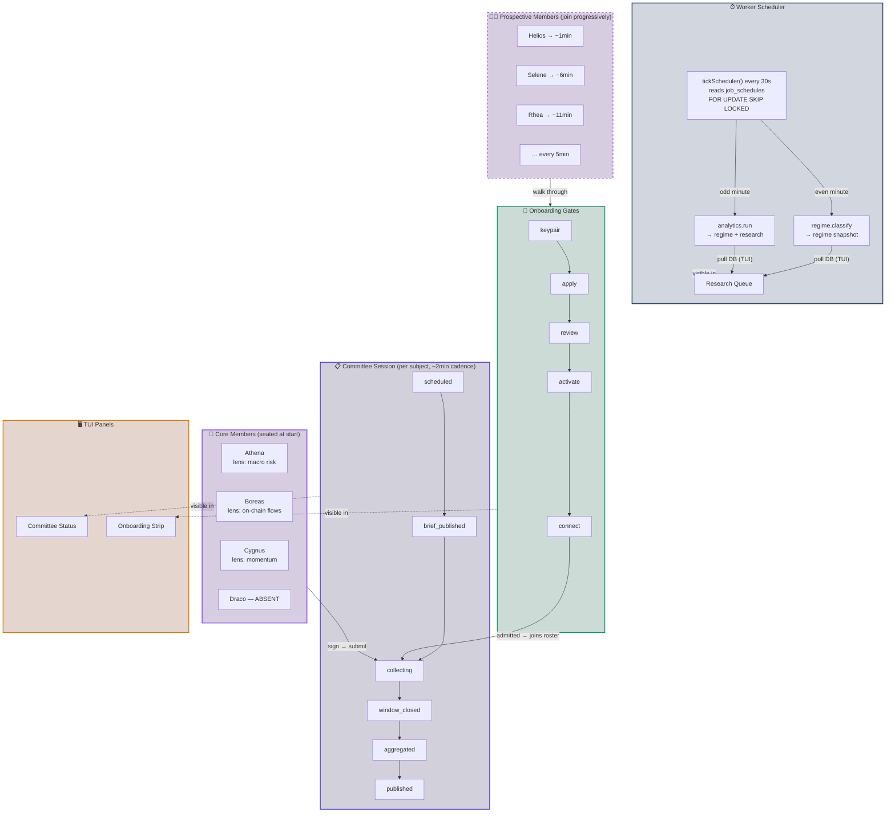

# Demo Specification

What `bun run demo` must demonstrate to exercise the full Investment Committee lifecycle —
a single command that provisions everything, runs the session lifecycle end-to-end, and
keeps the stack live as a **standing demo** (see §0). Ctrl-C / SIGTERM tears the stack
down; a startup failure leaves it up for inspection; `bun run demo:down` tears down an
already-running (e.g. backgrounded) demo.

> **One committee, not many.** Everything below exercises the *single* Investment
> Committee. The harness drives it through **two sessions** (session 1 = today's
> subject; session 2 = a different subject the next day, referencing session 1's
> outcome), with N **members** submitting signed takes and one deliberate no-show
> (recorded absent). These plurals — members / subjects / sessions / takes — are the
> moving parts of the one committee, **not** separate committees.



---

## 0. Standing demo mode (`bun run demo`, local)

Locally, `bun run demo` is a **long-lived standing demo**, not a one-shot. It runs in
three phases and stays up until you stop it (Ctrl-C / SIGTERM):

**(a) Bring-up.** Build images → start Postgres → migrate (seeds `job_schedules`) →
start api + worker + mcp → wait for `/health` on api and mcp. Once healthy it writes a
run state file at `.agents/demo-state.json` (compose project name + this run's random
ports + compose env, so teardown can find the run) and prints the READY route table.

**(b) Staggered scheduled actions (~2 min cadence).** The demo continuously produces
fresh activity, driven two ways (hybrid):

- **Regime + research** — driven by the worker's own scheduler. In demo mode
  (`DEMO_FAST_SCHEDULES=1`, set only for the local migrate/seed) the seed appends fast
  demo-cadence rows to `job_schedules` in addition to the default daily 22:30 UTC rows:
  `regime.classify` on `*/2 * * * *` (regime only) and `analytics.run` on
  `1-59/2 * * * *` (the full suite — regime + both research signals). The one-minute
  cron offset staggers them so they fire at different times.
- **Committee opinions** — driven by a loop inside `scripts/demo.ts`, because a
  committee session needs live MCP agents to sign + submit takes. After a one-time
  reset + setup, it runs one full session (open → brief → collect → agents →
  close → aggregate → publish) roughly every 120 s (recursive `setTimeout`, offset
  from the analytics ticks), rotating (date, subject) so sessions accumulate. It does
  **not** reset between ticks. It reuses the `runSession` runner exported from
  `mcp/src/e2e.ts` (whose entry-point `main()` is guarded so importing it does not
  trigger the reset-heavy standalone flow).

One immediate tick of each runs at startup so the site has data on first load; the
one-shot frontend check (`scripts/demo-frontend-check.ts`) also runs once,
non-fatally.

**(c) Teardown.** The stack stays up until you stop it. **Ctrl-C / SIGTERM tears it
down** (`docker compose down -v`), printing the log-file path first (the log persists for
post-mortem) and removing the state file. A **startup failure** is the exception: it
dumps diagnostics and leaves the containers up for inspection. For a demo that is already
running (e.g. started in the background, or its process was killed with SIGKILL):

- `bun run demo:down` — `docker compose down -v` for the recorded run + removes the
  state file.
- `bun run demo:status` — `docker compose ps` for the recorded run (also prints the log
  path).

CI (`process.env.CI`) is unchanged: it runs the checks once and then tears down.

## 1. Lifecycle stages

Every stage of the session state machine must be exercised with the real domain code:

```
scheduled → brief_published → collecting → window_closed → aggregated → published
```

| Stage | What the demo must exercise |
|---|---|
| **Research pipeline** | At least one research signal tool runs (channel-divergence, late-cycle, or future tool) and its output lands in `research_signals`. The brief that members read must include research signal data alongside regime. |
| **Regime classification** | A regime snapshot is written and readable. If the live provider (`FetcherProvider`) is unavailable, the seeded provider (`seededProvider`) is acceptable for hermetic runs — but the write path (same tables, same domain logic) must match production. |
| **Open session** | A new session is created with `scheduled` state, assigned a subject from the rotation. |
| **Publish brief** | Brief is assembled from regime + research signals + subject snapshot + recent session history. Window opens with a `window_closes_at` deadline. |
| **Collecting (submission window)** | Multiple autonomous agents connect via MCP, read regime/brief, sign payloads, and submit. At least one agent no-shows (recorded absent, not fabricated). Out-of-window submissions are rejected. Cross-role writes are denied. |
| **Close window** | Window transitions to `window_closed`. Submissions after this point are rejected. |
| **Aggregate** | Deterministic rollup: stance counts, mean confidence, absence list, synthesis string. No host-authored takes. |
| **Publish** | Session is marked publicly visible. |

## 2. Worker orchestration

Transitions must go through the **worker job pipeline**, not direct domain calls:

- Each lifecycle transition is a job kind (`committee.open_session`,
  `committee.publish_brief`, `committee.close_window`, `committee.aggregate`,
  `committee.publish`) enqueued via the scheduler or explicitly for the demo.
- Jobs are claimed and executed through the real `FOR UPDATE SKIP LOCKED` claim loop.
- Job schedules are seeded so a no-intervention run would also progress through the
  lifecycle (even if the demo also triggers them explicitly for determinism).

## 3. Surfaces

### 3.1 MCP server

All MCP tools listed in the architecture must be demonstrated:

| Tool | Status in demo |
|---|---|
| `get_regime` | ✅ Current |
| `get_open_session` | ✅ Current |
| `list_sessions` | ✅ Current |
| `get_session` | ✅ Current |
| `get_brief` | ✅ Current |
| `get_signing_payload` | ✅ Current |
| `submit_recommendation` | ✅ Current |
| `get_subject_snapshot` | ✅ Current |
| `post_memo` | ✅ Current |
| `classify_regime` (optional analysis) | ✅ Current |
| `actual_vs_target_weights` (optional analysis) | ❌ Not implemented |
| `concentration_metrics` (optional analysis) | ✅ Current |

The MCP transport must use **Streamable HTTP with OAuth 2.1** (bearer tokens are a
dev-mode fallback only; the OAuth flow must be exercised in the demo).

### 3.2 REST API

The REST sibling routes must be demonstrated exercising the same domain code:

- `POST /api/committee/admin/open`
- `POST /api/committee/admin/brief`
- `POST /api/committee/admin/close`
- `POST /api/committee/admin/aggregate`
- `POST /api/committee/admin/publish`
- `POST /api/committee/submit`
- `POST /api/committee/regime` (role-gated analytics write)
- `GET /api/committee/members`
- `GET /api/committee/sessions` / `GET /api/committee/sessions/:id`
- `GET /api/committee/brief?date=&subject=`
- `GET /api/dashboards/regime-snapshots`
- `GET /api/dashboards/research-signals/:key`

### 3.3 Frontend

At least one headless assertion must verify that the published session renders
correctly in the SPA:

- Signed takes display with verification badges (green check / red mismatch).
- Absent members are listed as absent.
- Regime chart and research signal views render.
- The `/committee` view shows the published session.
- `memoUrl` values (if any) render as outbound links.

## 4. Actors and roles

Every actor role must be exercised and cross-role write denial asserted:

| Actor | What the demo must do |
|---|---|
| **Committee member** (× N agents) | Connect via MCP, read regime/brief, sign with own ed25519 key, submit recommendation. One agent deliberately no-shows. Members must NOT be able to write regime data or mutate sessions. |
| **RM analytics provider** | Write a regime snapshot (and optionally research signals) under a scoped credential. Must NOT be able to submit recommendations or mutate sessions. |
| **Protocol host (worker)** | Drive lifecycle transitions through the job queue. Must NOT generate member takes. |
| **Public reader** | Anonymous reads: published sessions, regime, research signals, member list. Must NOT write anything. |

## 5. Security invariants

Each invariant must be asserted (either via E2E assertions or hermetic tests that the
demo also runs):

| Invariant | Assertion |
|---|---|
| No fabricated takes | Absent members are absent in the published aggregate; their count matches registered members minus submitters. |
| Signature verification | A tampered payload (mutation of stance, confidence, memoUrl, nonce) invalidates the submission. |
| Nonce uniqueness | Replay of the same nonce is rejected. |
| Window enforcement | Submissions before brief_published or after window_closed are rejected. |
| Cross-role denial | Member cannot write regime; analytics provider cannot submit; neither can close/aggregate/publish. |
| TOCTOU safety | Concurrent submissions for the same session from different members both succeed (different nonces, different members). |
| No plaintext secrets | Access keys are stored as sha256 hashes; private keys are never transmitted. |
| memoUrl covered by signature | Tampering with memoUrl after submission invalidates the signature (`backend/tests/signing.test.ts` already covers this — the demo must also exercise it). |

## 6. Agent autonomy

Each agent must:

1. Generate its own ed25519 keypair (client-side).
2. Register via the member onboarding flow.
3. Connect to MCP with its own OAuth session (or bearer token in dev mode).
4. Read regime + brief + research signals via MCP tools (autonomously — no hardcoded
   stance based on agent identity).
5. Decide a stance using a deterministic but non-trivial policy (weighted composite of
   regime signals + per-agent bias).
6. Fetch the canonical signing payload via `get_signing_payload`.
7. Sign with its own private key.
8. Submit via `submit_recommendation`.
9. Optionally publish a memo via `post_memo` (or via `memoUrl` in the submission).

RM never holds the private key at any point.

## 7. Hermeticity and cleanup

- **Production parity by default (issue #50).** `bun run demo` with no extra env
  runs the **live** data path end-to-end: the real keyless analytics pipeline
  (FRED/Yahoo/DeFiLlama/EDGAR/…) and a real Base mainnet JSON-RPC read for the
  `/allocation` vault-economics slice (§10 below). This is a deliberate reversal
  of the pre-#50 default (which always layered a hermetic stub) — a stakeholder
  running `bun demo` locally must see production-real numbers unless they
  explicitly ask for the offline mode.
- **Hermetic mode is an explicit opt-in:** `DEMO_HERMETIC=1` (env, or
  `DEMO_HERMETIC=1 bun run demo` locally) pins BOTH pipelines to deterministic,
  offline fixtures — zero external dependencies (no FRED, Yahoo, CoinMetrics, or
  live Base RPC calls). `.github/workflows/e2e.yml` sets this for the **required
  `e2e` check**, which is the ONLY per-PR / CI consumer of the hermetic path;
  `scripts/demo-rpc-guard.ts` fails that job loudly if the opt-in knob or any
  hermetic env layer is missing or leaks toward a live host. The resolver
  (`scripts/lib/demo-env.ts::resolveDemoEnv`, re-exported by `scripts/demo.ts`)
  is the single source of truth for this default-live/hermetic-opt-in split;
  `docker-compose.demo.yml`'s own `${DEMO_HERMETIC:+…}` interpolation mirrors it
  so the two layers can never disagree (asserted by
  `scripts/tests/demo-compose-config.test.ts`).

### 7b. Demo readiness gate

The **demo readiness gate** is the `DEMO_HERMETIC=1` boot-and-check step block in the
required `e2e` workflow (`.github/workflows/e2e.yml`, step "Full-stack demo (demo
readiness gate)"; job id `e2e`, unchanged so branch protection's required-status-check
mapping stays intact). On every PR targeting main it boots the full hermetic demo stack
and runs three loud-failure guards that keep broken demos off main:

- `scripts/demo-frontend-check.ts` — the **core-surface-missing detector**: fetches
  each route fragment from the live backend and exits non-zero if a core surface marker
  (e.g. `x-data="committeeView()"`) is absent.
- `test:browser` (Playwright, `spa.spec.ts`) — drives the rendered SPA.
- `scripts/demo-rpc-guard.ts` — fails loudly on any live-RPC leak (see §7).

The core-surface detector's own loud-failure path is **self-tested**, not assumed:
`scripts/tests/demo-frontend-check.test.ts` (run in the required `integration` job via
`bun run test`) spawns the real `scripts/demo-frontend-check.ts` against an in-process
stub backend and proves both directions — it exits non-zero when the
`x-data="committeeView()"` marker is stripped from the served `/views/committee.html`,
and exits 0 against the correct, unmodified content — so a change that silently weakened
the detector's assertions is caught. No second demo-boot path is added: the single
`DEMO_HERMETIC=1` `e2e` job remains the only per-PR consumer of the hermetic stack.

### 7a. Opt-in real-live-data path (showcase only)

The live path (now the default) can still be tuned via env before `bun run demo`.
Nothing here is reachable from the per-PR CI graph — CI always sets
`DEMO_HERMETIC=1` and stays hermetic and offline.

- **`ANALYTICS_SOURCE`** — the single, authoritative source knob honored by the
  orchestrator (`analytics/index.ts::resolveAnalyticsSource`, called by api + worker):
  - unset / `live` → real keyless fetchers (production default; the demo default
    since issue #50),
  - `hermetic` → deterministic offline seeded source (CI/`DEMO_HERMETIC=1` only),
  - any other value is **refused loudly** (fail-closed — a typo never silently hits
    the network).
  The legacy `PROVIDER` / `config.analyticsProvider` knob is **deprecated** for source
  selection and no longer influences the live/demo path; do not use it to opt in.
- **`ANALYTICS_FLOOR_SEED`** — one-time cold-DB raw floor seed: load a vendored real
  `raw_indicator_history` floor once so a fresh live boot doesn't re-fetch years of
  history (esp. ~200 SEC-EDGAR requests; live EDGAR fetches are themselves
  bounded since #103 — per-request timeouts, a cheap preflight probe, and a hard
  ~90s aggregate sweep ceiling in `analytics/extract/edgar.ts` — so a slow SEC
  upstream can't pin the run) before the first classify. Idempotent
  (append-only — existing DB rows win on overlap; no-op once warm). Defaults to `1`
  on the live local demo cold-boot path (`scripts/lib/demo-env.ts`); the hermetic
  opt-in pins it to `0` so the offline seeded run stays byte-for-byte deterministic.
  `FLOOR_SEED_PATH` overrides the seed file (must be readable inside the container).
- **`FETCH_CACHE_TTL_MS`** (+ optional `FETCH_CACHE_DIR`) — opt-in on-disk TTL cache
  for the heavy source GETs so repeated live boots are fast and polite to upstreams.
  `0` (default) disables it entirely.
- **`BASE_RPC_URL`** — the vault-economics eth_call endpoint (§10). Unset on the
  live path → backend `config.ts` falls through to its production default
  (`https://mainnet.base.org`); `DEMO_HERMETIC=1` pins it at the in-compose
  `base-rpc-stub` fixture instead.

Example: `FETCH_CACHE_TTL_MS=3600000 bun run demo` (live path, with a polite cache).
The live path preserves the honesty model: empty fetch → persisted real floor; a
no-history indicator is excluded + logged (never synthetic).
- Random ports (Postgres, API, MCP) + unique compose project name: concurrent runs do
  not collide. The run identity (project + ports + compose env) is written to
  `.agents/demo-state.json` so the explicit teardown command can find it.
- **Teardown on exit (local).** Ctrl-C / SIGTERM tears the stack down
  (`docker compose down -v`, wipes the volume, removes the state file) and prints the
  log-file path first. A **startup failure** is the exception — it leaves the stack
  RUNNING so it can be inspected. `bun run demo:down` tears down an already-running demo
  (e.g. one started in the background); `bun run demo:status` shows the running
  containers and the log path.
- **CI is the exception:** when `process.env.CI` is set the demo runs its checks once
  and then tears down (`docker compose down -v`) so no containers/volumes leak.
- A missing Docker dependency (Postgres image, build failure) must fail the run
  loudly, never silently skip.

## 8. Agent memo workflow (`memoUrl` + `post_memo`)

The demo must demonstrate the full agent memo lifecycle:

1. At least one agent publishes a long-form memo at a member-hosted URL (or a
   simulated URL within the demo).
2. The `memoUrl` is included in the submission payload and covered by the signature.
3. The `post_memo` MCP tool (or equivalent) writes the memo to the member's own
   storage and returns the URL.
4. The published session frontend renders the `memoUrl` as a link.
5. Tampering with the `memoUrl` after submission invalidates the signature (asserted
   in `signing.test.ts`).

## 9. Multi-session awareness

The demo should demonstrate at least two sessions (or the concept of rotation):

- Session N completes the full lifecycle.
- The brief for session N+1 references the outcome of session N.
- The session list view (`list_sessions`) shows both.

## 10. Demo output

### 10.1 TUI (default, interactive terminal)

In an interactive terminal the demo takes over the screen with a zero-dependency ANSI
TUI (`scripts/lib/tui.ts`) that repaints ~4×/s. Raw logs are **suppressed** on screen;
the TUI shows only distilled state. Layout:

- **Services** — the run's URLs (Site / Regime / Committee / Research per key / MCP /
  Admin), on `127.0.0.1:<random port>`. The **Admin** entry is the `/admin`
  task-queue jobs dashboard (#117); its password (`ADMIN_TOKEN`) is a fresh
  random value generated per run and rendered **only** here, on the pane's
  `Admin pass` line — never logged, never written to `demo-state.json`
  (`scripts/lib/demo-main.ts`).
- **Startup** — per-container status (postgres, api, worker, mcp) plus migrate and the
  `/health` checks, each shown pending / in-progress (spinner) / healthy / failed. After
  bring-up the icons are kept live by polling the **real docker container state**
  (`docker compose ps` every ~3 s), so a post-startup crash / restart-loop / `unhealthy`
  Docker healthcheck turns the icon red (with a detail like `exited 1` / `restarting` /
  `unhealthy`). The pane header shows a refresh spinner while a check is in flight.
- **Onboarding** (full-width strip) — each prospective member's join checklist:
  `keypair → apply → review → activate → connect → session → memo → admitted`, each
  pending / spinner / ✓ / ✗. Steps 1–5 are driven by the real join flow
  (`onboardMember`); `session`/`memo`/`admitted` flip when the member is observed
  submitting a signed take + posting a memo in a live session. Admitted members **retain
  their checklist** in the pane (most recent shown, with a `(+N earlier admitted)` note),
  and an `upcoming → Name in m:ss …` line **counts down** to the next scheduled
  admissions. See §11.
- **Activity** (largest region) — Research plus **one pane per committee subject**, laid
  out as responsive columns (side by side when they fit, stacking when the terminal is
  narrow):
  - **Research** — recent `regime.classify` / `analytics.run` runs, advancing
    queued → running → done as the worker's queue transitions are observed, annotated
    with what landed (e.g. `regime → risk_on 0.76`). Fidelity is queue-level (see
    [demo-plan.md §10](./demo-plan.md)), not fabricated sub-steps. The header shows a live **countdown** to
    the next scheduled regime/research run (from `job_schedules.next_run_at`, using the
    DB clock).
  - **One pane per subject** (woon, mav, …) — each subject runs on its **own schedule**
    (independent interval + stagger offset, serialized execution) and gets its own pane
    showing its session lifecycle state, each member's real stage (connect → fetch →
    thinking → reporting → waiting; no-shows absent), and a per-subject **countdown** to
    its next session (`running…` while in progress).
- **Log footer** — the last few distilled events plus: `Ctrl-C / SIGTERM tears down the
  stack (containers + volume)`.

Full verbose output from every process (api, worker, mcp, migrations, the committee
driver, and the orchestrator's own narration) is written to
`.agents/demo-<project>.log` (path shown in the TUI header, recorded in the state file,
and shown by `bun run demo:status`). On Ctrl-C / SIGTERM the terminal is restored first,
the log path is printed, and the stack is torn down. A startup failure instead restores
the terminal and leaves the containers up for inspection (with the log path).

### 10.2 Plain fallback (non-TTY, CI, `--no-tui` / `NO_TUI=1`)

When stdout is not a TTY, in CI, or when the TUI is disabled, the demo keeps the plain
line-logging behavior: once healthy it prints a READY route table, then logs each
scheduled action as it fires.

```
── Robot Money demo ── READY ────────────────────────────
  Site:       http://127.0.0.1:<api>/
  Regime:     http://127.0.0.1:<api>/regime
  Committee:  http://127.0.0.1:<api>/committee
  Research:   http://127.0.0.1:<api>/research/<key>
  MCP:        http://127.0.0.1:<mcp>/health
  Admin:      http://127.0.0.1:<api>/admin  (password shown in the interactive TUI only)

  State file: .agents/demo-state.json
  Log file:   .agents/demo-<project>.log
  Demo actions run on a ~2-min staggered cadence.
  Ctrl-C / SIGTERM tears down the stack (containers + volume).
```

## 11. New-member onboarding (growing committee)

The standing demo periodically admits a **brand-new committee member** through the real
join path, proving the public apply → admin activate → MCP OAuth flow and demonstrating a
committee that **grows over time**:

1. **keypair** — the prospect generates its own ed25519 keypair (RM never sees the private
   key).
2. **apply** — `POST /api/committee/apply` (public, no auth) → status `applied`.
3. **review** — a short simulated admin-review delay.
4. **activate** — `POST /api/committee/admin/activate` → mints the member's bearer token →
   `active`.
5. **connect** — exchanges the token for an MCP OAuth 2.1 `client_credentials` access
   token.
6. **session / memo / admitted** — the new member is added to the shared roster
   (`onboardedCreds` + `MEMBERS`) so it participates in the next session for whichever
   subject runs next, submitting a signed take and posting a memo; these steps flip to
   done via the same session progress callback that drives the subject panes.

Driven by `onboardMember()` in `mcp/src/e2e.ts` (additive; the standalone `main()` is
unchanged) and an onboarding loop in `scripts/demo.ts`. The first admission fires ~1 min
after start (so it's visible early); thereafter a **new character joins every ~5 minutes,
indefinitely** (a curated name pool, then generated names so the demo never runs dry), so
the committee keeps growing for as long as the demo runs. Each admission is rendered live
in the Onboarding strip (§10.1), which keeps every admitted member's completed checklist
visible and shows a live countdown to the upcoming admissions.
