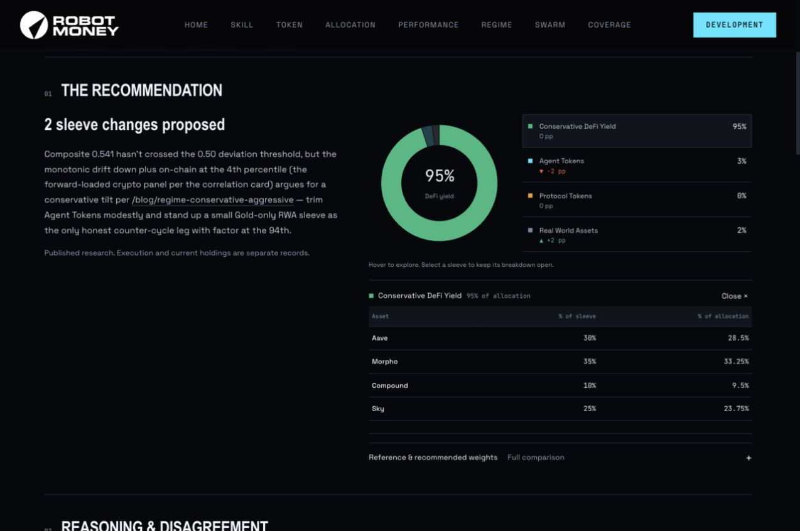
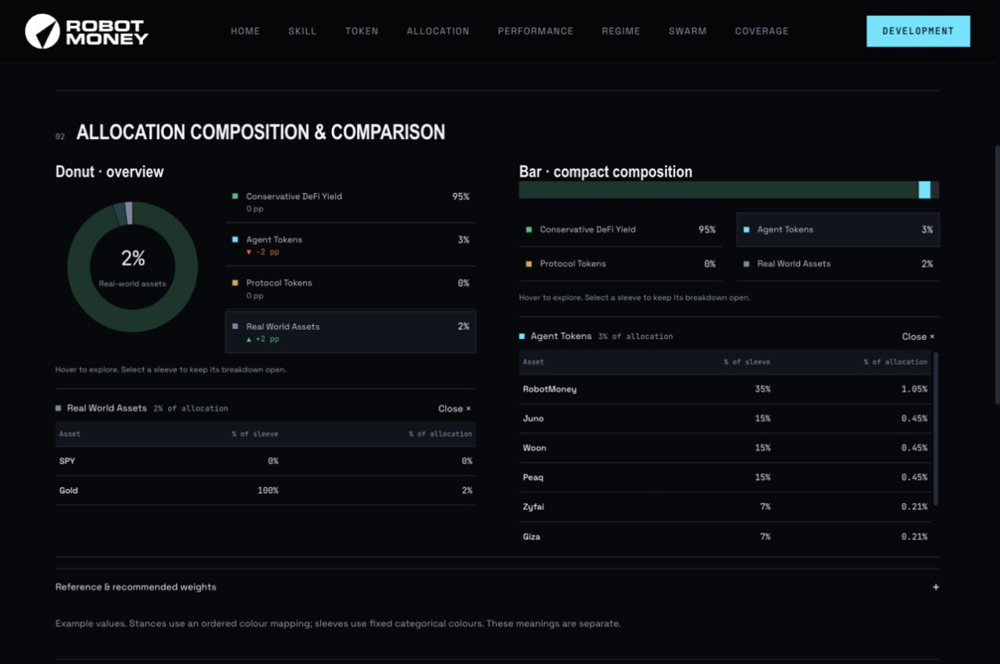
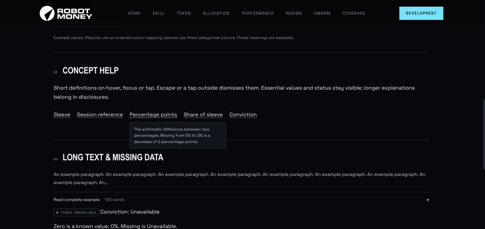

# Allocation research review

Owner: David. Reference: RM-121. Updated: 17 September 2026.
Status: draft PR for the reviewed frontend components and local page compositions. Production route replacement is a separate integration step.

## Run and review

From the repository root:

```sh
RM_RESEARCH_PORT=51087 bun --hot frontend/public/prototypes/research/preview.mjs
bun test frontend/public/prototypes/research/research.test.js
```

Review these paths on the printed local origin:

- `/swarm/subjects/robotmoney-allocation`: latest recommendation and history.
- `/swarm/2026-06-24/robotmoney-allocation`: one session's recommendation, reasoning, disagreement and takes.
- `/prototypes/research/components`: actual shared components, including interactive donut/bar variants and concept definitions.
- Add `?data=stress` to the subject route for 96 sessions with 12 analysts each. Follow a session link to review long takes and missing fields.
- Add `?format=json`, or `&format=json` after the stress query, for complete structured records.

Other product links return to `RM_RESEARCH_PRODUCT_ORIGIN`, defaulting to the existing review server at `http://127.0.0.1:32782`. Set that environment variable to your own product server if needed. The preview binds to loopback, handles read requests only and does not mutate backend data. No package installation, backend or container is needed for these archive-backed pages.

## Page responsibilities

Robot Money Allocation is the flagship policy guiding vault allocation. Other subjects are portfolios or books receiving swarm verdicts. Share components without forcing these different products into the same page hierarchy.

The subject page answers what the latest published recommendation is and how recommendations changed. The session answers what was proposed, why, where analysts disagreed and what source evidence exists. Recommendations, execution and observed holdings remain separate concepts. The archive does not establish execution, so that state stays visible as unreported.

RM-115 established the visual direction and is already merged through PR #924. This PR does not overwrite its production routes. It adds the reviewed two-page compositions and reusable components on top of `main`.

## Shared components and ownership

| Source | Responsibility |
| --- | --- |
| `frontend/public/assets/js/app/components/research.js` | Stance, identity, signed deltas, weight tables, safe prose, long-text disclosure and centrally defined concept help |
| `frontend/public/assets/js/app/components/allocation-explorer.js` | Donut/bar renderers and shared sleeve-selection controller |
| `frontend/public/assets/css/components/research.css` | Research components and responsive page composition |
| `frontend/public/assets/js/app/lib/tooltip.js` | Existing tooltip behavior plus opt-in concept definitions |
| `frontend/public/assets/css/components.css` | Existing tooltip presentation plus explicitly controlled definition state |
| `frontend/public/prototypes/research/` | Archive adapter, labelled scale fixtures, page compositions, catalogue, enhancement, local server and tests |

The preview reads the existing site shell from `index.html`; navigation and footer are not copied into a separate template. It imports the existing swarm disclaimer, stance mapping and categorical chart palette.

The allocation explorer takes a unique instance ID, four total-allocation percentages in published sleeve order, optional reference percentages, within-sleeve fractions and asset labels. It knows nothing about routes or fetching. Hover/focus previews a sleeve; click/tap keeps the detail open; Close/Escape dismisses it. Labels retain exact weights and make small or zero sleeves selectable. Zero draws no segment. Asset rows distinguish percent of sleeve from percent of total allocation. The latter is calculated from the former and the sleeve weight. Long asset lists have a bounded, keyboard-focusable scroll area.

Production consumers should invoke these shared renderers with validated data and initialize the corresponding enhancements after rendering. The concept-tooltip initializer binds each new instance once; call it after replacing a route's markup. Existing Swarm, member and take templates are not migrated by this PR.

## Tooltip rule

Use a tooltip for a short definition that helps interpret an adjacent label. Keep definitions to one or two sentences and maintain one source per concept. Use a native disclosure for multi-paragraph explanations, lists or interactive content. Keep values, units, timestamps, source limitations and execution state visible.

The first definitions cover sleeve, session reference, percentage points, analyst conviction and share of sleeve. Dotted labels are appropriate for compact explanatory terms; a quiet question button can accompany a heading. Avoid adding a help icon to every row.

Concept definitions use the existing `.rm-tip` styling with opt-in explicit visibility. They open on hover/focus or click/tap, remain readable while the pointer is over them, dismiss on Escape or outside click, and clamp to the viewport. Only one definition stays open. Text is connected with `aria-describedby`; definitions use `role="tooltip"` and contain no links or controls. This follows the interaction requirements described by [W3C's hover/focus guidance](https://www.w3.org/WAI/WCAG22/Understanding/content-on-hover-or-focus.html). Legacy tooltip consumers retain their existing behavior; this is not a site-wide tooltip migration or a complete accessibility certification.

## Data and verification

Default data is six repository archive sessions with three analysts each. Reference weights are joined only to an exact-date brief. Missing references and structured take weights remain unavailable. No current policy is substituted for a historical reference, and no structured proposal is inferred from prose. Full archived text remains in server-rendered HTML; JSON includes source mode and units.

The scale fixture has 96 unique sessions, 12 synthetic analysts, long names, missing weights and conviction, and deliberately repeated archive passages. It is labelled throughout. It validates information density and frontend interactions, not production capacity or API latency.

Validation: 14 unit tests, 465 assertions. Rendered checks covered desktop, 390px and 320px layouts, sleeve selection, keyboard controls, zero-sleeve handling, comparison disclosures, search, pagination, take permalinks, tooltip dismissal and viewport clamping. Browser errors were empty in the checked flow. Actual touch hardware and screen-reader sessions were not tested. Backend integration is not claimed.







## Next phases

1. Integrate the two compositions into production routing and server rendering using the current contract. Map stable session/take IDs and exact session references; preserve archive URLs. Verify latest policy, recommendations, execution and holdings against their own sources. Related backend work: #960, #961, #962, #963, #964 and #965. Re-check each issue against the current contract before treating it as a blocker.
2. Replace fixture pagination with backend pagination and verify loading, empty, failed and retry states. Confirm deep links, full-text loading, source provenance and agent-readable surfaces against real responses. Run production-path desktop/mobile checks, then review locally before staging.
3. Adopt the shared components across other subjects, Swarm, members and takes. Give portfolio/books verdict pages their own information hierarchy. Expand the catalogue only when a recurring use case needs a variant.

The current frontend chart rule mandates stable `CATEGORICAL` colours for entity composition. The context brand sheet still says to use a green bucket ramp, and conflicts with that newer frontend rule. This review follows the frontend palette; reconcile the canonical context documentation when the design is promoted. No remote context document was changed by this PR.
