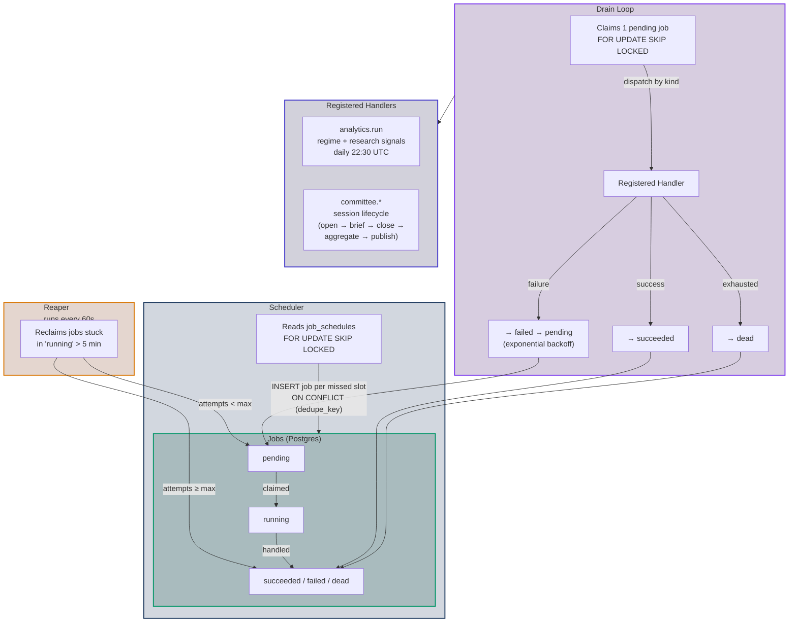

# Robot Money — Task Queue Topology

```mermaid
flowchart TB
    subgraph Scheduler["Scheduler<br/>runs every 30s"]
        SC["Reads job_schedules<br/>FOR UPDATE SKIP LOCKED"]
        SC -->|"INSERT job per missed slot<br/>ON CONFLICT (dedupe_key)"| Jobs
    end

    subgraph Jobs["Jobs (Postgres)"]
        direction LR
        Pending["pending"]
        Running["running"]
        Done["succeeded / failed / dead"]
    end

    subgraph DrainLoop["Drain Loop<br/>polls every 2s"]
        DC["Claims 1 pending job<br/>FOR UPDATE SKIP LOCKED"]
        DC -->|dispatch by kind| Handler["Registered Handler"]
        Handler -->|success| Succeed["→ succeeded"]
        Handler -->|failure| Retry["→ failed → pending<br/>(exponential backoff)"]
        Handler -->|exhausted| Kill["→ dead"]
    end

    subgraph Reaper["Reaper<br/>runs every 60s"]
        RP["Reclaims jobs stuck<br/>in 'running' > 5 min"]
        RP -->|"attempts < max"| Pending
        RP -->|"attempts ≥ max"| Done
    end

    subgraph Handlers["Registered Handlers"]
        H1["analytics.run<br/>regime + research signals<br/>daily 22:30 UTC"]
        H2["committee.*<br/>session lifecycle<br/>(open → brief → close →<br/>aggregate → publish)"]
    end

    Pending -->|"claimed"| Running
    Running -->|"handled"| Done

    DrainLoop --> Handlers
    Succeed --> Done
    Retry --> Pending
    Kill --> Done

    style Scheduler fill:#1e3a5f33,stroke:#1e3a5f,stroke-width:2px
    style Jobs fill:#064e3b33,stroke:#059669,stroke-width:2px
    style DrainLoop fill:#3b076433,stroke:#7c3aed,stroke-width:2px
    style Reaper fill:#78350f33,stroke:#d97706,stroke-width:2px
    style Handlers fill:#1e1b4b33,stroke:#4338ca,stroke-width:2px
```

