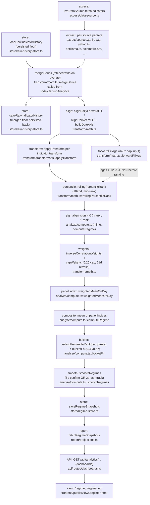

# The regime engine — methodology, provenance, and the newbie test

This is the canonical methodology document for the market-regime classifier:
what it computes, why it is built the way it is, and where the numbers a user
sees actually come from. It intentionally does **not** re-explain the six-stage
access → extract → transform → analyze → store → report plumbing, the
persistence boundary, or the seed-artifact tooling — that's
[`architecture.md` §7.1](../architecture.md#71-analytics-suite-six-stage-pipeline),
and this document links into it rather than restating it.

Companion document: [`research-signals.md`](research-signals.md) covers the two
research signals (`channel-divergence`, `late-cycle-signals`), which share this
engine's math library but are a **separate** analysis with its own percentile
convention.

> **Provenance note.** This document was written from `backend/src/analytics/**`,
> `docs/architecture.md` §7.1,
> [`docs/code-review/20260814-review-data-integrity-macro-index-discrepancy.md`](../code-review/20260814-review-data-integrity-macro-index-discrepancy.md),
> and [`docs/audits/v0-v1-parity/A1-regime-core-procedures.md`](../audits/v0-v1-parity/A1-regime-core-procedures.md).
> Issue #613 also asked for this to be cross-referenced against v0's
> `docs/regime/CONTEXT.md` in the separate `agentjuno/robotmoney` repository.
> That repository was not reachable while writing this document. Every claim
> below is grounded in this repo's source and the two audit documents above;
> the "Why" section reasons from that evidence rather than restating v0's own
> stated rationale, which remains **unverified against source**. If you can
> reach v0's `CONTEXT.md`, diff it against §4 below and correct anything that
> disagrees.

## 1. The one-sentence answer

**`backend/src/analytics/analyze/compute.ts`'s `computeRegime`, invoked by
`analytics/index.ts::runAnalytics`, is the file that computes the published
macro/on-chain regime index.** `contract/src/regime.js` is the shared
0.33/0.67 bucketing *rule* (not the composite math), and
`backend/src/analytics/analyze/regime.ts` is a dead, unused second
implementation — see §7.

## 2. Indicator universe

26 registry entries in `backend/src/analytics/analyze/indicators.ts` (`INDICATORS`),
split across three panels:

| Panel | Count | Members | In the published composite? |
|---|---|---|---|
| `macro` | 8 | `T10Y2Y`, `DFII10`, `T5YIE`, `HY_OAS`, `DXY`, `ICSA`, `VIX`, `COPPER_GOLD` | Yes |
| `onchain` | 10 | `DEFI_TVL`, `STABLES`, `BTC_ACTIVE`, `ETH_ACTIVE`, `BTC_MVRV`, `BTC_ETH`, `ETH_TREND`, `NEW_TOKENS`, `DEFI_GROWTH`, `STABLES_GROWTH` | Yes |
| `factor` | 8 | `SPX_TREND`, `IWM_SPY`, `SPHB_SPLV`, `MTUM_SPY`, `IWF_IWD`, `XLU_SPY`, `XLP_XLY`, `SHILLER_CAPE` | **No** — fetched and persisted (feeds `/regime_eq`'s extended 3-panel view), but `PANELS = ["macro", "onchain"]` (`indicators.ts:464`) excludes it from `/regime`'s composite |

Trap for a reader skimming `indicators.ts` top to bottom: `SPX_TREND` and
`IWM_SPY` are listed physically inside the file's "MACRO" comment block
(`indicators.ts:169-200`) but their `panel` field is `"factor"`, not `"macro"`.
The panel field, not file position, decides membership — `architecture.md`
§7.1's own panel roster (`architecture.md:715-722`) already lists them under
`factor` for this reason.

Every indicator entry carries `id`, `panel`, `source`, `sign`, `transform`,
`unit`, plus human-facing `description`/`derivation`/`interpretation` prose —
read the entry itself (`indicators.ts`) for what a specific indicator means and
why its sign is what it is; that prose is intentionally the primary source and
is not duplicated here.

## 3. Transforms

Every indicator declares a `transform` field, applied to its aligned daily
series **before** percentile ranking (`applyTransform`,
`backend/src/analytics/transform/transforms.ts:14`). Three transforms are in
production use:

| Transform | Used by | What it does |
|---|---|---|
| `level` | 21 of 26 indicators (everything not listed below) | Identity — the raw (or ratio, e.g. `COPPER_GOLD`, `IWM_SPY`) value, unchanged |
| `trend_50_200` | `SPX_TREND`, `ETH_TREND` | `SMA(50) / SMA(200)` of the underlying price — itself a level (a ratio around 1), not a rate of change |
| `change90` | `DEFI_GROWTH`, `STABLES_GROWTH` | 90-day percent change: `(x[t] − x[t−90]) / x[t−90]` |

`applyTransform` also implements `change30`, `sma4`, `sma7`, and
`rolling_sum_7` (ported from v0, IDENTICAL per A1's coverage table), but no
registry indicator currently uses them — dead-but-faithfully-ported code, not
a gap.

**Why "level-only" is the default, and what the two exceptions buy.** See §4.

## 4. Percentile, sign alignment, and weights

1. **Rolling percentile rank** (`rollingPercentileRank`,
   `backend/src/analytics/transform/math.ts:176`) — for each indicator, each
   day's transformed value is ranked against the trailing
   **1095-day (365×3, `ROLLING_WINDOW_DAYS`, `indicators.ts:466`) window of
   itself**: `(below + 0.5·equal) / n`, mid-rank tie handling, `NaN` until at
   least 30 finite observations exist in the window. Every indicator is
   compared only to its own history — a macro spread in percentage points and
   a DeFi TVL figure in tens of billions of dollars become directly
   comparable 0..1 quantities without any manual unit reconciliation.
2. **Sign alignment** — `sign >= 0 ? rank : 1 - rank` (inline in
   `computeRegime`, `analyze/compute.ts:83`), driven by the indicator's `sign`
   field. After this step, `1.0` always means "most risk-on this indicator has
   been in three years," regardless of whether the raw series moves with or
   against risk appetite.
3. **Point-in-time inverse-correlation weights**
   (`inverseCorrelationWeights`, `transform/math.ts:201`, plus `capWeights`,
   `transform/math.ts:250`) — computed **per panel, per day**, over the same
   trailing 1095-day window of *sign-aligned* percentiles, but only recomputed
   every **21 days** (`WEIGHT_REFRESH_DAYS`, `analyze/compute.ts:86`) plus
   always on the final day. An indicator's weight is inversely proportional to
   its average absolute correlation with the rest of its panel (a lower
   `avgAbs`, floored at 0.05, gives more weight — an indicator that moves
   independently of its panel-mates earns more say), then capped at **0.25**
   and the excess proportionally redistributed (20-iteration fixed point).
   Indicators with fewer than 60 finite observations in the window get weight
   0 (`minValidObs`).

## 5. Panel → composite → bucketing → smoothing

- **Panel index** — the weighted mean of that panel's sign-aligned percentiles
  on each day (`weightedMeanOnDay`, `analyze/compute.ts:249`), using the
  weights from step 3 above.
- **Composite** — the arithmetic mean of whichever panel indices are finite
  that day (`computeRegime`, `analyze/compute.ts:113-125`). `/regime` runs
  this over `PANELS = ["macro", "onchain"]` (so composite = 0.5×macro +
  0.5×onchain when both resolve); `/regime_eq` runs the same function again
  with `["macro", "onchain", "factor"]` for the extended 3-panel view
  (`analytics/index.ts` calls `computeRegime` twice, once per panel set — see
  `r2`/`r3` in `runAnalytics`).
- **Bucketing** — the composite is itself percentile-ranked against its own
  trailing 1095-day window (same `rollingPercentileRank`), then bucketed by
  `bucketFn` (`analyze/compute.ts:267`): `< 0.33 → risk_off`,
  `> 0.67 → risk_on` (strict, exclusive upper), else `neutral`. `NaN → null`.
  **This is the production classifier function** — see §7 for why
  `contract/src/regime.js`'s `classifyRegime` is a *different, secondary*
  function that exists for other surfaces to reuse the same 0.33/0.67
  thresholds, not the thing that labels `/regime`.
- **Smoothing** — `smoothRegimes` (`analyze/compute.ts:172`) turns the raw
  daily bucket into the published label via **5-day confirmation** (a new
  bucket must hold for `CONFIRMATION_DAYS = 5` consecutive days before the
  published label moves) **OR 2σ fast-track** (`FAST_TRACK_SIGMA = 2.0`): if
  the day-over-day change in the composite's percentile exceeds 2 standard
  deviations of the trailing `SIGMA_LOOKBACK_DAYS = 252` daily deltas (needs
  ≥30 deltas), and the move is *directionally consistent* with the new bucket
  (moving down into `risk_off`, up into `risk_on`, or landing on `neutral`),
  the label jumps immediately instead of waiting for confirmation. This is
  what lets the classifier react same-day to a real shock (e.g. a VIX spike)
  while still ignoring one noisy day near a threshold.

## 6. The "why"

The design choices above are not arbitrary; each earns something. This
section reasons from the evidence this repo actually has (source + the two
audit docs) — see the provenance note at the top of this document for what
could not be checked against v0's own stated rationale.

**Why percentile-rank each indicator against its own history, rather than
some fixed threshold?** The 26 indicators span wildly different units — basis
points, an index level, a dollar TVL figure, an address count, a ratio.
Percentile-in-own-window turns every one of them into a directly comparable
0..1 "how extreme is this, for this indicator" reading with no manual
per-indicator threshold tuning, and it degrades gracefully as an indicator's
long-run level structurally drifts (e.g. DeFi TVL is arguably in a different
regime at $10B than at $100B — a fixed dollar threshold would silently stop
meaning what it meant when it was chosen; a rolling percentile does not).

**Why `level` is the default transform, and why the two exceptions
(`trend_50_200`, `change90`) exist.** The percentile-rank step already
performs the normalization that a differencing transform would otherwise be
used for — turning "how does today's level compare to itself" into a
comparable statistic does not require first turning the level into a rate of
change. Differencing the input *before* ranking would also discard exactly
the level information the percentile needs to answer "is HY_OAS wide or
tight right now" — a level question, not a rate-of-change one. The two
non-`level` transforms exist because, for those specific series, a raw level
percentile would carry little or no signal:
- `trend_50_200` (`SPX_TREND`, `ETH_TREND`): the raw index/price level itself
  is not risk information (SPX at 5,000 says nothing about regime by itself),
  but the classic `SMA(50)/SMA(200)` "golden cross / death cross" ratio is a
  well-established, noise-filtered trend statistic — and the ratio, not the
  underlying price, is what gets percentile-ranked.
- `change90` (`DEFI_GROWTH`, `STABLES_GROWTH`): DeFi TVL and stablecoin float
  are structurally-growing series over the multi-year window the percentile
  rank uses — a level percentile on either would sit permanently near the top
  of its own 1095-day range and stop discriminating. The 90-day percent
  change instead captures *flow* (is capital actively expanding or
  contracting the ecosystem right now), which is the risk-appetite question
  these two indicators exist to answer; `DEFI_TVL`/`STABLES` (the plain
  levels) stay in the registry alongside them because position and flow are
  different questions that both matter.

**Why daily forward-fill across mismatched publication calendars, rather
than ranking each indicator only on the days its own source actually
publishes ("native cadence")?** Every registry indicator is aligned onto one
shared daily `dateAxis` (`buildDateAxis`, `transform/math.ts:342`) via
`alignDailyForwardFill` (`transform/math.ts:278`) — regardless of whether the
underlying source is weekly (`ICSA`), business-daily (most FRED/yahoo
series), 24/7 (on-chain/crypto), or monthly (`SHILLER_CAPE`). This is a
**publication-cadence step function**: between real prints, an indicator's
transformed value is held flat at its last real observation, and every panel
and the composite still update daily because the *other* indicators keep
moving. The documented alternative — "native-cadence" ranking, comparing a
weekly print only against other weekly prints — was evaluated directly in
the 2026-08-14 code-review
([§14.3](../code-review/20260814-review-data-integrity-macro-index-discrepancy.md#143-what-is-the-correct-calculation-for-the-product)):
it is statistically defensible and lands within ~0.005 of the current-vintage
daily-forward-fill result on the audited indicators, but it is **not what
either dashboard's own published methodology text says**
(`"rolling 3-year percentile rank per indicator, sign-aligned"`), and adopting
it would be a methodology change requiring a version relock
(`analyze/regime-versions.ts::CURRENT_REGIME_VERSION`), not a bug fix. A
point-in-time release-calendar fill (ranking each day only against what was
*known* on that day) was also considered and ruled out for the same reason:
`mergeSeries`' documented contract — fetched wins on overlap, so source
revisions land — commits the pipeline to **current-vintage**, not
point-in-time, semantics (§7 covers the one place v0 *does* implement a
point-in-time-flavored publication model, and why v1 deliberately does not
copy it).

**Why 21-day weight refresh, not daily?** Recomputing the full pairwise
correlation matrix for a panel is the most expensive step in the pipeline;
21 days (roughly monthly) is frequent enough that the weighting adapts to a
real regime shift within about a month, without paying that cost — or
introducing that much extra weight-series noise — every single day. The
final day is always recomputed regardless of the 21-day cadence, so the
published "as-of" weights are never more than one refresh cycle stale from
the pipeline's own perspective, and never stale relative to the day being
published.

**Why 0.25 as the correlation-weight cap?** It bounds how much any single
indicator inside a panel can dominate a weighted mean — with a cap of 0.25,
no fewer than 4 indicators can jointly account for the entire panel weight
even in the degenerate case where every other indicator is fully redundant
with its neighbors. `HY_OAS` sits at or near this cap in production (see §8's
HY_OAS discussion) precisely because it is the macro panel's least-correlated
member — the cap keeps that fact from letting one indicator's idiosyncratic
noise dominate the panel.

## 7. Canonical vs. dead classifiers — do not reconcile against the wrong file

Two other files in this repo compute something that looks like a regime
classification. Neither is the production path:

- **`backend/src/analytics/analyze/regime.ts`** (`regimeTool`) is a complete,
  **dead-in-production**, second implementation: 11 hardcoded indicators (not
  the 26-entry registry), static literal weights (not inverse-correlation),
  a 90-day window (not 1095), `percentileInWindow` (not
  `rollingPercentileRank` — see `research-signals.md` §2 for why that
  distinction matters), no 5-day/2σ smoothing, and 4-decimal rounding
  throughout. Its only importer repo-wide is `backend/tests/analytics.test.ts`.
  It previously had a false "CANON" pointer aimed at it from
  `contract/src/regime.js`'s header — corrected as part of this revamp (see
  A1 finding F4 for the full comparison table).
- **`contract/src/regime.js`**'s `classifyRegime`/`REGIME_RISK_OFF`/`REGIME_RISK_ON`
  are the shared 0.33/0.67 **bucketing rule**, reused by the swarm domain
  layer and the swarm memo builder so a composite score is never
  independently re-thresholded on two different surfaces. It is legitimately
  canonical for *that* narrow purpose (turning a bare composite number into a
  label anywhere outside the regime pipeline itself), but it is not the
  regime *engine* — the composite it classifies has to come from somewhere,
  and that somewhere is `compute.ts`. It also disagrees with `bucketFn` at
  the exact `0.67` boundary and on `NaN` (A1 finding F7) — off the hot path
  today (its only consumers are the swarm smoke-synthesis path and the dead
  `regimeTool`), but a reason not to treat it as a drop-in replacement for
  `bucketFn` either.

**The one production classifier is `bucketFn` in `analyze/compute.ts:267`,**
fed by `computeRegime`, invoked from `analytics/index.ts::runAnalytics`. If
you're reconciling a published regime label against the methodology, this is
the function to read.

`backend/src/analytics/transform/math.ts` has an analogous trap one layer
down — four pairs of look-alike exports where the short, attractive name is
**not** the one the regime core uses. See the file's own header comment
(added as part of this revamp) for the full pairing; the short version: use
`rollingPercentileRank`, not `percentileInWindow`, for anything meant to
match this document.

## 8. Data flow

Every stage above is orchestrated end to end by
`backend/src/analytics/index.ts::runAnalytics` — the entry point named in
`README.md`'s pointer paragraph.

## 9. Deliberate v0 divergences

v1's regime **procedure** (the pure math in `compute.ts`/`indicators.ts`/
`transform/`) is proven bit-identical to v0's over both sides' real floors
(A1's verdict). The **published output** still diverges, deliberately, in
three places:

1. **Full recompute vs. frozen-vintage** (A1 finding F3, **BLOCKS-PARITY**).
   v0's cron (`update.js::mergeFrozenIntoResult`) overwrites every freshly
   computed historical day with whatever value was originally locked in on
   the day it was first computed, leaving only "today" mutable — a mosaic of
   original vintages. v1 has no analogue:
   `analyze/regime-versions.ts::CURRENT_REGIME_VERSION = "v3"` explicitly
   means "no frozen lockout — every run recomputes the full history on
   best-available raw data," and `analytics/index.ts::runAnalytics` persists
   every row from that fresh recompute, every run. Measured effect on v0's
   own real data: max |Δcomposite| 0.0725, max |Δpercentile| 0.249, 9 regime
   labels differ over 2,960 published rows — before accounting for anything
   else. This is a deliberate design choice (current-vintage numbers that
   never silently disagree with the methodology that produced them), not an
   unresolved bug; see A1 F3 for the full measurement.
2. **120-day forward-fill cap** (#402, A1 finding F1, **NUMERIC-RISK,
   currently zero real-data exposure**). v0 carries a stale forward-filled
   value forward with full panel weight forever. v1's `ages` mechanism
   (`forwardFillAge`, consumed by `computeRegime`'s optional `ages` parameter,
   `analyze/compute.ts:56-70`) nulls out a day's value **before** percentile
   ranking once its last real observation is more than
   `MAX_FORWARD_FILL_DAYS = 120` days old — so a long-dead indicator's weight
   decays to 0 (via `inverseCorrelationWeights`' `minValidObs` floor) rather
   than permanently dragging a stale reading through the composite. Exposure
   is zero today because the seeded floor is dense (every axis day has a
   "real" row by construction); it becomes live the moment v1 accumulates
   enough of its own sparse post-seed history that a feed outage could
   plausibly exceed 120 days. See `forward_fill_age_days`/
   `forward_fill_expired` in §10 for how this surfaces at the API.
3. **BTC_MVRV source** (A1 finding F2, **BLOCKS-PARITY**). v0's registry
   entry sources BTC_MVRV from `blockchain_com`'s `mvrv` chart, and v0's own
   live floor has **zero** rows for it (the chart was pulled upstream) — so
   in v0 today this indicator is silently all-NaN and excluded (weight 0).
   v1 repoints it to `coinmetrics`'s `CapMVRVCur` metric
   (`indicators.ts` BTC_MVRV entry, `#127`) and carries a full history,
   making it a full-weight onchain-panel member. Toggling this one input
   alone, over v0's own compute engine and v0's own floor, changes 2,993 of
   3,098 composite days and 159 of 3,098 regime labels (A1 F2) — this single
   difference is by itself enough to make the published series visibly
   different from v0's, independent of anything else on this list.

## 10. Floor & seed provenance

**Storage contract.** `raw_indicator_history` persists the **sparse merged
real observations only** — never a dense forward-filled view
(`store/raw-history-store.ts`). Forward-filling happens at **read** time
(`alignDailyForwardFill`, called from `analytics/index.ts::runAnalytics`),
never at write time. This is the deliberate divergence from v0's own storage
shape (v0's `writeRawHistoryCsv` persists the dense aligned series — see A1's
`writeLongHistoryCsv` row) and it is *why* v1 can compute an honest
`forward_fill_age_days` per indicator per day (`forwardFillAge`,
`transform/math.ts:309`, surfaced on every indicator in the regime snapshot
by `buildRichIndicators`, `analytics/index.ts:529-549`): `0` on a day with a
real print, the day count since the last real observation otherwise, `NaN`
before any observation has ever been seen, reset to `0` immediately on the
next real print (no special-case "recovery" code path). `forward_fill_expired`
is simply `forward_fill_age_days > MAX_FORWARD_FILL_DAYS`, the same 120-day
constant §9.2 describes. How this field participates in the broader
detect/repair story for bad persisted data (as opposed to the single
120-day cap above) is out of scope here — see
[`data-self-healing.md`](data-self-healing.md).

**D6 — the fabricated-row pollution finding, and its current status.** The
2026-08-14 code-review
([§6](../code-review/20260814-review-data-integrity-macro-index-discrepancy.md#6-d1--critical--v0-persists-its-own-forward-fills-as-real-observations),
[§14.4](../code-review/20260814-review-data-integrity-macro-index-discrepancy.md#144-seed-and-source-window-findings))
found that the vendored floor-seed fixture
(`backend/tests/fixtures/regime/raw-indicator-history.csv.gz`), inherited from
v0's own polluted dense CSV, carried 110 ICSA rows and 14 DXY rows dated on
days those sources have never published on (ICSA is FRED's weekly,
week-ending-Saturday series; DXY/`DTWEXBGS` is business-day-only) — a
composition defect in v0's write path (v0 persists its own forward-fills as
if they were real observations; see the linked §6 for the full mechanism)
that v1's fixture inherited by vendoring v0's floor as its seed. **This has
since been fixed as a code/data change, not merely documented**: issue #616
(PR #630, 2026-08-14) added `generateFullUniversePurge`
(`extract/floor-seed-generator.ts`) — a regeneration mode that rebuilds the
entire committed seed from this repo's own live fetchers, purging every
recoverable indicator's history and preserving only the calendar-filtered,
genuinely-unrecoverable spans (§10's HY_OAS discussion below, plus
`NEW_TOKENS`, `BTC_ACTIVE`, `SHILLER_CAPE` —
`extract/floor-seed-generator.ts::UNRECOVERABLE_PRESERVE_IDS`) — and a
publication-calendar validator, `extract/floor-seed-calendar.ts::sourceCalendar`
/ `validateFloorCalendar`, that makes a row dated on a day its source could
never publish **unrepresentable** in the committed fixture going forward
(`backend/tests/floor-seed-calendar-guard.test.ts` asserts the committed
fixture has zero violations). A database seeded *before* that regeneration
landed is cleaned at deploy time: `store/seed-provenance.ts::verifySeedProvenance`
runs the same calendar check against every persisted `source='seed'` row and
deletes the calendar-invalid ones, wired into `prod-bootstrap.ts` as the
`seed-provenance:verify` step on every deploy
([D38](../decisions.md#d38--seed-provenance-verify-runs-as-a-prod-bootstrapts-deploy-step-not-a-worker-cron-issue-638)).
Treat "the seed fixture is polluted" as a **historical** finding from here on
— verify against `floor-seed-calendar-guard.test.ts` if you need current
proof, rather than re-deriving it from the CSV by hand.

**D7 — HY_OAS pre-history is unrecoverable from source, by construction, not
by bug.** FRED serves `BAMLH0A0HYM2` (the HY OAS credit spread) only as a
trailing **~3-year window**, regardless of the `cosd` (custom-start-date)
query parameter — verified directly against the live endpoint
(`cosd=2010-01-01` still returns rows starting 2023-08-15, 787 observations,
in the 2026-08-14 capture; see
[§14.4](../code-review/20260814-review-data-integrity-macro-index-discrepancy.md#144-seed-and-source-window-findings)
and `extract/floor-seed-generator.ts:126-137` for the current, corrected
citation of this finding). Consequence: HY_OAS's pre-2023-08-15 history exists
**only** in the persisted floor — a live fetch alone can never rebuild it,
which is exactly why HY_OAS is one of the four indicators
`generateFullUniversePurge` preserves rather than purges (calendar-filtered,
merged with the live fetch, fetched-wins-on-overlap — the same honest
`mergeSeries` semantics used everywhere else). This is not an outstanding
gap: the append-only merge against the preserved pre-window span plus every
subsequent day's live fetch already delivers, and keeps growing, more than
three years of real HY_OAS history — `backend/tests/api/regime-fetchers.test.ts`
and `regime-fetchers-fallback.test.ts` (issue #634 / PR #715) pin this
behavior with a mocked truncated response and prove the merge recovers the
pre-window span, and prove a failed/thrown HY_OAS fetch degrades to the
persisted floor rather than crashing the run. The one measurable downstream
effect (A1/code-review D4): HY_OAS's inverse-correlation weight sits at or
near the 0.25 cap in v1, secondary to and downstream of this history-span
difference from v0's own (differently-provenanced) floor — not a weighting
bug.

## See also

- [`architecture.md` §7.1](../architecture.md#71-analytics-suite-six-stage-pipeline) — the six-stage plumbing this document deliberately does not restate.
- [`research-signals.md`](research-signals.md) — `channel-divergence` / `late-cycle-signals`, and why their percentile convention now matches this document's (§4) by design, correcting an earlier divergence.
- [`data-self-healing.md`](data-self-healing.md) — the broader detect/repair design for bad persisted analytics data (status: design proposal, partially built).
- [`docs/audits/v0-v1-parity/A1-regime-core-procedures.md`](../audits/v0-v1-parity/A1-regime-core-procedures.md) — the full executed-evidence procedural parity audit (findings F1-F8) this document's §7 and §9 summarize.
- [`docs/code-review/20260814-review-data-integrity-macro-index-discrepancy.md`](../code-review/20260814-review-data-integrity-macro-index-discrepancy.md) — the full D1-D7 data-integrity investigation this document's §10 summarizes.
- [`docs/decisions.md` D38](../decisions.md#d38--seed-provenance-verify-runs-as-a-prod-bootstrapts-deploy-step-not-a-worker-cron-issue-638) — why the seed-provenance cleanup runs where it runs.
