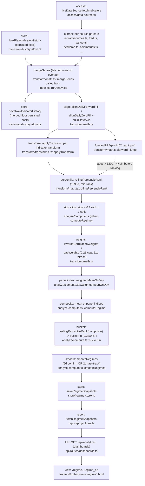

# The regime engine — methodology, provenance, and the newbie test

This is the canonical methodology document for the market-regime classifier:
what it computes, why it is built the way it is, and where the numbers a user
sees actually come from. It intentionally does **not** re-explain the six-stage
access → extract → transform → analyze → store → report plumbing, the
persistence boundary, or the seed-artifact tooling — that's
[`architecture.md` §7.1](../architecture.md#71-analytics-suite-six-stage-pipeline),
and this document links into it rather than restating it.

Companion document: [`research-signals.md`](research-signals.md) covers the two
research signals (`channel-divergence`, `late-cycle-signals`), which share this
engine's math library but are a **separate** analysis with its own percentile
convention.

> **Provenance note.** This document was written from `backend/src/analytics/**`,
> `docs/architecture.md` §7.1,
> [`docs/code-review/20260814-review-data-integrity-macro-index-discrepancy.md`](../code-review/20260814-review-data-integrity-macro-index-discrepancy.md),
> and [`docs/audits/v0-v1-parity/A1-regime-core-procedures.md`](../audits/v0-v1-parity/A1-regime-core-procedures.md).
> Issue #613 also asked for this to be cross-referenced against v0's
> `docs/regime/CONTEXT.md` in the separate `agentjuno/robotmoney` repository.
> That repository was not reachable while writing this document. Every claim
> below is grounded in this repo's source and the two audit documents above;
> the "Why" section reasons from that evidence rather than restating v0's own
> stated rationale, which remains **unverified against source**. If you can
> reach v0's `CONTEXT.md`, diff it against §4 below and correct anything that
> disagrees.

## 1. The one-sentence answer

**`backend/src/analytics/analyze/compute.ts`'s `computeRegime`, invoked by
`analytics/index.ts::runAnalytics`, is the file that computes the published
macro/on-chain regime index.** `contract/src/regime.js` is the shared
0.33/0.67 bucketing *rule* (not the composite math), and
`backend/src/analytics/analyze/regime.ts` is a dead, unused second
implementation — see §7.

## 2. Indicator universe

26 registry entries in `backend/src/analytics/analyze/indicators.ts` (`INDICATORS`),
split across three panels:

| Panel | Count | Members | In the published composite? |
|---|---|---|---|
| `macro` | 8 | `T10Y2Y`, `DFII10`, `T5YIE`, `HY_OAS`, `DXY`, `ICSA`, `VIX`, `COPPER_GOLD` | Yes |
| `onchain` | 10 | `DEFI_TVL`, `STABLES`, `BTC_ACTIVE`, `ETH_ACTIVE`, `BTC_MVRV`, `BTC_ETH`, `ETH_TREND`, `NEW_TOKENS`, `DEFI_GROWTH`, `STABLES_GROWTH` | Yes |
| `factor` | 8 | `SPX_TREND`, `IWM_SPY`, `SPHB_SPLV`, `MTUM_SPY`, `IWF_IWD`, `XLU_SPY`, `XLP_XLY`, `SHILLER_CAPE` | **No** — fetched and persisted (feeds `/regime_eq`'s extended 3-panel view), but `PANELS = ["macro", "onchain"]` (`indicators.ts:464`) excludes it from `/regime`'s composite |

Trap for a reader skimming `indicators.ts` top to bottom: `SPX_TREND` and
`IWM_SPY` are listed physically inside the file's "MACRO" comment block
(`indicators.ts:169-200`) but their `panel` field is `"factor"`, not `"macro"`.
The panel field, not file position, decides membership — `architecture.md`
§7.1's own panel roster (`architecture.md:715-722`) already lists them under
`factor` for this reason.

Every indicator entry carries `id`, `panel`, `source`, `sign`, `transform`,
`unit`, plus human-facing `description`/`derivation`/`interpretation` prose —
read the entry itself (`indicators.ts`) for what a specific indicator means and
why its sign is what it is; that prose is intentionally the primary source and
is not duplicated here.

## 3. Transforms

Every indicator declares a `transform` field, applied to its aligned daily
series **before** percentile ranking (`applyTransform`,
`backend/src/analytics/transform/transforms.ts:14`). Three transforms are in
production use:

| Transform | Used by | What it does |
|---|---|---|
| `level` | 21 of 26 indicators (everything not listed below) | Identity — the raw (or ratio, e.g. `COPPER_GOLD`, `IWM_SPY`) value, unchanged |
| `trend_50_200` | `SPX_TREND`, `ETH_TREND` | `SMA(50) / SMA(200)` of the underlying price — itself a level (a ratio around 1), not a rate of change |
| `change90` | `DEFI_GROWTH`, `STABLES_GROWTH` | 90-day percent change: `(x[t] − x[t−90]) / x[t−90]` |

`applyTransform` also implements `change30`, `sma4`, `sma7`, and
`rolling_sum_7` (ported from v0, IDENTICAL per A1's coverage table), but no
registry indicator currently uses them — dead-but-faithfully-ported code, not
a gap.

**Why "level-only" is the default, and what the two exceptions buy.** See §4.

## 4. Percentile, sign alignment, and weights

1. **Rolling percentile rank** (`rollingPercentileRank`,
   `backend/src/analytics/transform/math.ts:176`) — for each indicator, each
   day's transformed value is ranked against the trailing
   **1095-day (365×3, `ROLLING_WINDOW_DAYS`, `indicators.ts:466`) window of
   itself**: `(below + 0.5·equal) / n`, mid-rank tie handling, `NaN` until at
   least 30 finite observations exist in the window. Every indicator is
   compared only to its own history — a macro spread in percentage points and
   a DeFi TVL figure in tens of billions of dollars become directly
   comparable 0..1 quantities without any manual unit reconciliation.
2. **Sign alignment** — `sign >= 0 ? rank : 1 - rank` (inline in
   `computeRegime`, `analyze/compute.ts:83`), driven by the indicator's `sign`
   field. After this step, `1.0` always means "most risk-on this indicator has
   been in three years," regardless of whether the raw series moves with or
   against risk appetite.
3. **Point-in-time inverse-correlation weights**
   (`inverseCorrelationWeights`, `transform/math.ts:201`, plus `capWeights`,
   `transform/math.ts:250`) — computed **per panel, per day**, over the same
   trailing 1095-day window of *sign-aligned* percentiles, but only recomputed
   every **21 days** (`WEIGHT_REFRESH_DAYS`, `analyze/compute.ts:86`) plus
   always on the final day. An indicator's weight is inversely proportional to
   its average absolute correlation with the rest of its panel (a lower
   `avgAbs`, floored at 0.05, gives more weight — an indicator that moves
   independently of its panel-mates earns more say), then capped at **0.25**
   and the excess proportionally redistributed (20-iteration fixed point).
   Indicators with fewer than 60 finite observations in the window get weight
   0 (`minValidObs`).

## 5. Panel → composite → bucketing → smoothing

- **Panel index** — the weighted mean of that panel's sign-aligned percentiles
  on each day (`weightedMeanOnDay`, `analyze/compute.ts:249`), using the
  weights from step 3 above.
- **Composite** — the arithmetic mean of whichever panel indices are finite
  that day (`computeRegime`, `analyze/compute.ts:113-125`). `/regime` runs
  this over `PANELS = ["macro", "onchain"]` (so composite = 0.5×macro +
  0.5×onchain when both resolve); `/regime_eq` runs the same function again
  with `["macro", "onchain", "factor"]` for the extended 3-panel view
  (`analytics/index.ts` calls `computeRegime` twice, once per panel set — see
  `r2`/`r3` in `runAnalytics`).
- **Bucketing** — the composite is itself percentile-ranked against its own
  trailing 1095-day window (same `rollingPercentileRank`), then bucketed by
  `bucketFn` (`analyze/compute.ts:267`): `< 0.33 → risk_off`,
  `> 0.67 → risk_on` (strict, exclusive upper), else `neutral`. `NaN → null`.
  **This is the production classifier function** — see §7 for why
  `contract/src/regime.js`'s `classifyRegime` is a *different, secondary*
  function that exists for other surfaces to reuse the same 0.33/0.67
  thresholds, not the thing that labels `/regime`.
- **Smoothing** — `smoothRegimes` (`analyze/compute.ts:172`) turns the raw
  daily bucket into the published label via **5-day confirmation** (a new
  bucket must hold for `CONFIRMATION_DAYS = 5` consecutive days before the
  published label moves) **OR 2σ fast-track** (`FAST_TRACK_SIGMA = 2.0`): if
  the day-over-day change in the composite's percentile exceeds 2 standard
  deviations of the trailing `SIGMA_LOOKBACK_DAYS = 252` daily deltas (needs
  ≥30 deltas), and the move is *directionally consistent* with the new bucket
  (moving down into `risk_off`, up into `risk_on`, or landing on `neutral`),
  the label jumps immediately instead of waiting for confirmation. This is
  what lets the classifier react same-day to a real shock (e.g. a VIX spike)
  while still ignoring one noisy day near a threshold.

## 6. The "why"

The design choices above are not arbitrary; each earns something. This
section reasons from the evidence this repo actually has (source + the two
audit docs) — see the provenance note at the top of this document for what
could not be checked against v0's own stated rationale.

**Why percentile-rank each indicator against its own history, rather than
some fixed threshold?** The 26 indicators span wildly different units — basis
points, an index level, a dollar TVL figure, an address count, a ratio.
Percentile-in-own-window turns every one of them into a directly comparable
0..1 "how extreme is this, for this indicator" reading with no manual
per-indicator threshold tuning, and it degrades gracefully as an indicator's
long-run level structurally drifts (e.g. DeFi TVL is arguably in a different
regime at $10B than at $100B — a fixed dollar threshold would silently stop
meaning what it meant when it was chosen; a rolling percentile does not).

**Why `level` is the default transform, and why the two exceptions
(`trend_50_200`, `change90`) exist.** The percentile-rank step already
performs the normalization that a differencing transform would otherwise be
used for — turning "how does today's level compare to itself" into a
comparable statistic does not require first turning the level into a rate of
change. Differencing the input *before* ranking would also discard exactly
the level information the percentile needs to answer "is HY_OAS wide or
tight right now" — a level question, not a rate-of-change one. The two
non-`level` transforms exist because, for those specific series, a raw level
percentile would carry little or no signal:
- `trend_50_200` (`SPX_TREND`, `ETH_TREND`): the raw index/price level itself
  is not risk information (SPX at 5,000 says nothing about regime by itself),
  but the classic `SMA(50)/SMA(200)` "golden cross / death cross" ratio is a
  well-established, noise-filtered trend statistic — and the ratio, not the
  underlying price, is what gets percentile-ranked.
- `change90` (`DEFI_GROWTH`, `STABLES_GROWTH`): DeFi TVL and stablecoin float
  are structurally-growing series over the multi-year window the percentile
  rank uses — a level percentile on either would sit permanently near the top
  of its own 1095-day range and stop discriminating. The 90-day percent
  change instead captures *flow* (is capital actively expanding or
  contracting the ecosystem right now), which is the risk-appetite question
  these two indicators exist to answer; `DEFI_TVL`/`STABLES` (the plain
  levels) stay in the registry alongside them because position and flow are
  different questions that both matter.

**Why daily forward-fill across mismatched publication calendars, rather
than ranking each indicator only on the days its own source actually
publishes ("native cadence")?** Every registry indicator is aligned onto one
shared daily `dateAxis` (`buildDateAxis`, `transform/math.ts:342`) via
`alignDailyForwardFill` (`transform/math.ts:278`) — regardless of whether the
underlying source is weekly (`ICSA`), business-daily (most FRED/yahoo
series), 24/7 (on-chain/crypto), or monthly (`SHILLER_CAPE`). This is a
**publication-cadence step function**: between real prints, an indicator's
transformed value is held flat at its last real observation, and every panel
and the composite still update daily because the *other* indicators keep
moving. The documented alternative — "native-cadence" ranking, comparing a
weekly print only against other weekly prints — was evaluated directly in
the 2026-08-14 code-review
([§14.3](../code-review/20260814-review-data-integrity-macro-index-discrepancy.md#143-what-is-the-correct-calculation-for-the-product)):
it is statistically defensible and lands within ~0.005 of the current-vintage
daily-forward-fill result on the audited indicators, but it is **not what
either dashboard's own published methodology text says**
(`"rolling 3-year percentile rank per indicator, sign-aligned"`), and adopting
it would be a methodology change requiring a version relock
(`analyze/regime-versions.ts::CURRENT_REGIME_VERSION`), not a bug fix. A
point-in-time release-calendar fill (ranking each day only against what was
*known* on that day) was also considered and ruled out for the same reason:
`mergeSeries`' documented contract — fetched wins on overlap, so source
revisions land — commits the pipeline to **current-vintage**, not
point-in-time, semantics (§7 covers the one place v0 *does* implement a
point-in-time-flavored publication model, and why v1 deliberately does not
copy it).

**Why 21-day weight refresh, not daily?** Recomputing the full pairwise
correlation matrix for a panel is the most expensive step in the pipeline;
21 days (roughly monthly) is frequent enough that the weighting adapts to a
real regime shift within about a month, without paying that cost — or
introducing that much extra weight-series noise — every single day. The
final day is always recomputed regardless of the 21-day cadence, so the
published "as-of" weights are never more than one refresh cycle stale from
the pipeline's own perspective, and never stale relative to the day being
published.

**Why 0.25 as the correlation-weight cap?** It bounds how much any single
indicator inside a panel can dominate a weighted mean — with a cap of 0.25,
no fewer than 4 indicators can jointly account for the entire panel weight
even in the degenerate case where every other indicator is fully redundant
with its neighbors. `HY_OAS` sits at or near this cap in production (see §8's
HY_OAS discussion) precisely because it is the macro panel's least-correlated
member — the cap keeps that fact from letting one indicator's idiosyncratic
noise dominate the panel.

## 7. Canonical vs. dead classifiers — do not reconcile against the wrong file

Two other files in this repo compute something that looks like a regime
classification. Neither is the production path:

- **`backend/src/analytics/analyze/regime.ts`** (`regimeTool`) is a complete,
  **dead-in-production**, second implementation: 11 hardcoded indicators (not
  the 26-entry registry), static literal weights (not inverse-correlation),
  a 90-day window (not 1095), `percentileInWindow` (not
  `rollingPercentileRank` — see `research-signals.md` §2 for why that
  distinction matters), no 5-day/2σ smoothing, and 4-decimal rounding
  throughout. Its only importer repo-wide is `backend/tests/analytics.test.ts`.
  It previously had a false "CANON" pointer aimed at it from
  `contract/src/regime.js`'s header — corrected as part of this revamp (see
  A1 finding F4 for the full comparison table).
- **`contract/src/regime.js`**'s `classifyRegime`/`REGIME_RISK_OFF`/`REGIME_RISK_ON`
  are the shared 0.33/0.67 **bucketing rule**, reused by the swarm domain
  layer and the swarm memo builder so a composite score is never
  independently re-thresholded on two different surfaces. It is legitimately
  canonical for *that* narrow purpose (turning a bare composite number into a
  label anywhere outside the regime pipeline itself), but it is not the
  regime *engine* — the composite it classifies has to come from somewhere,
  and that somewhere is `compute.ts`. It also disagrees with `bucketFn` at
  the exact `0.67` boundary and on `NaN` (A1 finding F7) — off the hot path
  today (its only consumers are the swarm smoke-synthesis path and the dead
  `regimeTool`), but a reason not to treat it as a drop-in replacement for
  `bucketFn` either.

**The one production classifier is `bucketFn` in `analyze/compute.ts:267`,**
fed by `computeRegime`, invoked from `analytics/index.ts::runAnalytics`. If
you're reconciling a published regime label against the methodology, this is
the function to read.

`backend/src/analytics/transform/math.ts` has an analogous trap one layer
down — four pairs of look-alike exports where the short, attractive name is
**not** the one the regime core uses. See the file's own header comment
(added as part of this revamp) for the full pairing; the short version: use
`rollingPercentileRank`, not `percentileInWindow`, for anything meant to
match this document.

## 8. Data flow

Every stage above is orchestrated end to end by
`backend/src/analytics/index.ts::runAnalytics` — the entry point named in
`README.md`'s pointer paragraph.

## 9. Deliberate v0 divergences

v1's regime **procedure** (the pure math in `compute.ts`/`indicators.ts`/
`transform/`) is proven bit-identical to v0's over both sides' real floors
(A1's verdict). The **published output** still diverges, deliberately, in
three places:

1. **Full recompute vs. frozen-vintage** (A1 finding F3, **BLOCKS-PARITY**).
   v0's cron (`update.js::mergeFrozenIntoResult`) overwrites every freshly
   computed historical day with whatever value was originally locked in on
   the day it was first computed, leaving only "today" mutable — a mosaic of
   original vintages. v1 has no analogue:
   `analyze/regime-versions.ts::CURRENT_REGIME_VERSION = "v3"` explicitly
   means "no frozen lockout — every run recomputes the full history on
   best-available raw data," and `analytics/index.ts::runAnalytics` persists
   every row from that fresh recompute, every run. Measured effect on v0's
   own real data: max |Δcomposite| 0.0725, max |Δpercentile| 0.249, 9 regime
   labels differ over 2,960 published rows — before accounting for anything
   else. This is a deliberate design choice (current-vintage numbers that
   never silently disagree with the methodology that produced them), not an
   unresolved bug; see A1 F3 for the full measurement.
2. **120-day forward-fill cap** (#402, A1 finding F1, **NUMERIC-RISK,
   currently zero real-data exposure**). v0 carries a stale forward-filled
   value forward with full panel weight forever. v1's `ages` mechanism
   (`forwardFillAge`, consumed by `computeRegime`'s optional `ages` parameter,
   `analyze/compute.ts:56-70`) nulls out a day's value **before** percentile
   ranking once its last real observation is more than
   `MAX_FORWARD_FILL_DAYS = 120` days old — so a long-dead indicator's weight
   decays to 0 (via `inverseCorrelationWeights`' `minValidObs` floor) rather
   than permanently dragging a stale reading through the composite. Exposure
   is zero today because the seeded floor is dense (every axis day has a
   "real" row by construction); it becomes live the moment v1 accumulates
   enough of its own sparse post-seed history that a feed outage could
   plausibly exceed 120 days. See `forward_fill_age_days`/
   `forward_fill_expired` in §10 for how this surfaces at the API.
3. **BTC_MVRV source** (A1 finding F2, **BLOCKS-PARITY**). v0's registry
   entry sources BTC_MVRV from `blockchain_com`'s `mvrv` chart, and v0's own
   live floor has **zero** rows for it (the chart was pulled upstream) — so
   in v0 today this indicator is silently all-NaN and excluded (weight 0).
   v1 repoints it to `coinmetrics`'s `CapMVRVCur` metric
   (`indicators.ts` BTC_MVRV entry, `#127`) and carries a full history,
   making it a full-weight onchain-panel member. Toggling this one input
   alone, over v0's own compute engine and v0's own floor, changes 2,993 of
   3,098 composite days and 159 of 3,098 regime labels (A1 F2) — this single
   difference is by itself enough to make the published series visibly
   different from v0's, independent of anything else on this list.

## 10. Floor & seed provenance

**Storage contract.** `raw_indicator_history` persists the **sparse merged
real observations only** — never a dense forward-filled view
(`store/raw-history-store.ts`). Forward-filling happens at **read** time
(`alignDailyForwardFill`, called from `analytics/index.ts::runAnalytics`),
never at write time. This is the deliberate divergence from v0's own storage
shape (v0's `writeRawHistoryCsv` persists the dense aligned series — see A1's
`writeLongHistoryCsv` row) and it is *why* v1 can compute an honest
`forward_fill_age_days` per indicator per day (`forwardFillAge`,
`transform/math.ts:309`, surfaced on every indicator in the regime snapshot
by `buildRichIndicators`, `analytics/index.ts:529-549`): `0` on a day with a
real print, the day count since the last real observation otherwise, `NaN`
before any observation has ever been seen, reset to `0` immediately on the
next real print (no special-case "recovery" code path). `forward_fill_expired`
is simply `forward_fill_age_days > MAX_FORWARD_FILL_DAYS`, the same 120-day
constant §9.2 describes. How this field participates in the broader
detect/repair story for bad persisted data (as opposed to the single
120-day cap above) is out of scope here — see
§11 below.

**D6 — the fabricated-row pollution finding, and its current status.** The
2026-08-14 code-review
([§6](../code-review/20260814-review-data-integrity-macro-index-discrepancy.md#6-d1--critical--v0-persists-its-own-forward-fills-as-real-observations),
[§14.4](../code-review/20260814-review-data-integrity-macro-index-discrepancy.md#144-seed-and-source-window-findings))
found that the vendored floor-seed fixture
(`backend/tests/fixtures/regime/raw-indicator-history.csv.gz`), inherited from
v0's own polluted dense CSV, carried 110 ICSA rows and 14 DXY rows dated on
days those sources have never published on (ICSA is FRED's weekly,
week-ending-Saturday series; DXY/`DTWEXBGS` is business-day-only) — a
composition defect in v0's write path (v0 persists its own forward-fills as
if they were real observations; see the linked §6 for the full mechanism)
that v1's fixture inherited by vendoring v0's floor as its seed. **This has
since been fixed as a code/data change, not merely documented**: issue #616
(PR #630, 2026-08-14) added `generateFullUniversePurge`
(`extract/floor-seed-generator.ts`) — a regeneration mode that rebuilds the
entire committed seed from this repo's own live fetchers, purging every
recoverable indicator's history and preserving only the calendar-filtered,
genuinely-unrecoverable spans (§10's HY_OAS discussion below, plus
`NEW_TOKENS`, `BTC_ACTIVE`, `SHILLER_CAPE` —
`extract/floor-seed-generator.ts::UNRECOVERABLE_PRESERVE_IDS`) — and a
publication-calendar validator, `extract/floor-seed-calendar.ts::sourceCalendar`
/ `validateFloorCalendar`, that makes a row dated on a day its source could
never publish **unrepresentable** in the committed fixture going forward
(`backend/tests/floor-seed-calendar-guard.test.ts` asserts the committed
fixture has zero violations). A database seeded *before* that regeneration
landed is cleaned at deploy time: `store/seed-provenance.ts::verifySeedProvenance`
runs the same calendar check against every persisted `source='seed'` row and
deletes the calendar-invalid ones, wired into `prod-bootstrap.ts` as the
`seed-provenance:verify` step on every deploy
([D38](../decisions.md#d38--seed-provenance-verify-runs-as-a-prod-bootstrapts-deploy-step-not-a-worker-cron-issue-638)).
Treat "the seed fixture is polluted" as a **historical** finding from here on
— verify against `floor-seed-calendar-guard.test.ts` if you need current
proof, rather than re-deriving it from the CSV by hand.

**D7 — HY_OAS pre-history is unrecoverable from source, by construction, not
by bug.** FRED serves `BAMLH0A0HYM2` (the HY OAS credit spread) only as a
trailing **~3-year window**, regardless of the `cosd` (custom-start-date)
query parameter — verified directly against the live endpoint
(`cosd=2010-01-01` still returns rows starting 2023-08-15, 787 observations,
in the 2026-08-14 capture; see
[§14.4](../code-review/20260814-review-data-integrity-macro-index-discrepancy.md#144-seed-and-source-window-findings)
and `extract/floor-seed-generator.ts:126-137` for the current, corrected
citation of this finding). Consequence: HY_OAS's pre-2023-08-15 history exists
**only** in the persisted floor — a live fetch alone can never rebuild it,
which is exactly why HY_OAS is one of the four indicators
`generateFullUniversePurge` preserves rather than purges (calendar-filtered,
merged with the live fetch, fetched-wins-on-overlap — the same honest
`mergeSeries` semantics used everywhere else). This is not an outstanding
gap: the append-only merge against the preserved pre-window span plus every
subsequent day's live fetch already delivers, and keeps growing, more than
three years of real HY_OAS history — `backend/tests/api/regime-fetchers.test.ts`
and `regime-fetchers-fallback.test.ts` (issue #634 / PR #715) pin this
behavior with a mocked truncated response and prove the merge recovers the
pre-window span, and prove a failed/thrown HY_OAS fetch degrades to the
persisted floor rather than crashing the run. The one measurable downstream
effect (A1/code-review D4): HY_OAS's inverse-correlation weight sits at or
near the 0.25 cap in v1, secondary to and downstream of this history-span
difference from v0's own (differently-provenanced) floor — not a weighting
bug.

## 11. Detecting and repairing bad persisted analytics state

*Absorbed from the retired `docs/technical/data-self-healing.md`, which this section and
[`markets-asset-pricing-ingest.md`](./markets-asset-pricing-ingest.md) jointly
replace. That document's market-data half — chain balance ingest, asset pricing,
the gap detector as it applies to the AUM series, and the Class C repair
driver — lives in the markets document; everything below is the analytics and
regime-engine half, moved here verbatim.*

**Reading the cross-references.** Section numbers below have been renumbered
into this document's scheme (§11.1–§11.9). A reference written `[markets §3.2]`
points at the correspondingly numbered section of
[`markets-asset-pricing-ingest.md`](./markets-asset-pricing-ingest.md), and
`[architecture.md §12]` at [`../architecture.md`](../architecture.md). The
decision register (§11.9) is carried verbatim, including the market-data
decisions PD1, PD6 and PD7, whose *current* status is tracked in
[markets §8] rather than here.

**Status.** This is a design proposal, partially built. Class A gained one
behavioural consumer in #646 (the producer's `catchUpMissedIndicatorDays`);
Class B self-heals through its own producer catch-up; the Class A *reconciler*
of §11.5 — source-revision detection, the five-verdict classifier, quarantine
storage and the revision log — remains unfiled. Verify deliverables against the
tree, never against issue status.

### 11.1 The defect taxonomy

Persisted state can be wrong in four distinct ways. They are separated here
because **three of the four need a different detector each, and the fourth needs
a label rather than a detector** — and conflating them is how a self-healer
becomes a self-destroyer.

| Class | Shape | Canonical instance | Detector needed |
|---|---|---|---|
| **Absent** | the row should exist and does not | 42 missing AUM days on `/performance` | gap detector — enumerate expected keys, diff against persisted |
| **Structurally impossible** | a row exists on a date the source could never publish | v0's ICSA rows on non-Saturdays; DXY weekend rows (D1) | calendar validator — pure, offline, needs no network |
| **Present and wrong** | right shape, right date, wrong value | a vendor revision we never re-fetched; a correctly-labelled `live` row carrying a stale carry | source reconciler — re-fetch and compare key-by-key |
| **Unverifiable** | outside what the source can still re-serve | `HY_OAS` pre-history (D7): FRED serves `BAMLH0A0HYM2` only as a trailing ~3y window, and the `cosd=2010` workaround does not work for this series | none possible — disclose, never repair |

The state of play is uneven and worth stating bluntly:

- **Absent** has partial machinery: a gap detector is merged in `main`
  (`backend/src/ops/gap-detector.ts`), read-only, with no repair path.
- **Structurally impossible** has partial machinery: a calendar validator is
  merged, but runs offline against a committed fixture and classifies most of
  the registry as unconstrained.
- **Present and wrong** has **none**. Nothing in this repo ever re-asks a source
  about a date it already gave us. A persisted row that is present,
  calendar-valid, and simply wrong is invisible forever.
- **Unverifiable** has no machinery and needs none, but it needs a *label*, so
  that "we checked and it was fine" and "we cannot check" are distinguishable.

### 11.2 The five verdicts

Every persisted key inside a verification window classifies as exactly one of
five verdicts. The classifier is pure: it takes the persisted rows, the source
response, and the series' declared calendar, and returns verdicts. It does not
write.

| Verdict | Meaning | Action |
|---|---|---|
| `confirmed` | source has the key; value matches within tolerance | stamp `last_verified_at`; **no write to `value`** |
| `revised` | source has the key; value differs | **repair** — upsert the source value; this is exactly the existing documented *"fetched wins on overlap so source corrections / revisions land"* contract, applied on a schedule rather than only on the daily fetch |
| `fabricated` | source lacks the key **and** the declared calendar says the source could never publish that date | **quarantine**, reversibly; never hard-delete |
| `unexplained_absent` | source lacks the key but the calendar permits it — holiday, degraded source, vendor outage | **never touch**; count, and alarm once it persists across N consecutive runs |
| `unverifiable` | key predates the source's re-servable window (D7's `HY_OAS`) | leave, count, disclose |

**A repair is not a republication.** Under the decided publication model (PD10,
§11.8), `revised` and `fabricated` change the persisted floor and therefore the
*next candidate* computation; they do not change a published figure until an
admin publishes that candidate. Every repair must also write an immutable
revision record — §11.7.1 — which is what makes the eventual version bump
explicable.

#### 11.2.1 Why `unexplained_absent` is the whole safety argument

The difference between a self-healer and a self-destroyer is one bad inference:
*the source didn't give me this key, therefore this key is fake.*

That inference is wrong whenever the source is degraded rather than
authoritative. A vendor returning **HTTP 200 with a truncated window** is the
canonical case — well-formed, parseable, no error to catch, and simply missing
half of history. Classify that as `fabricated` and the system deletes correct
data at scale, in a single automated batch, with the audit trail saying it was
repairing itself.

So `fabricated` requires **two** independent conditions, not one: the source
must lack the key, *and* the declared publication calendar must say the source
could never have published that date. Non-Saturday `ICSA` rows satisfy both, and
that is exactly the audit's structural proof — FRED's ICSA has observations only
on Saturdays, 867 of 867 since 2010, so *"dates without observations cannot be
revised — they never existed."* A missing Tuesday `DXY` row satisfies only the
first, and lands in `unexplained_absent`, where nothing touches it.

Two further guardrails on the classifier, both drawn directly from the audit:

- **Do not equate repeated values with fabricated rows.** The audit is explicit:
  in the vendored seed, the 125 `ICSA` rows carrying `215000` classify as 110
  source-absent, 13 genuine observations, and 2 source-overlap rows that live
  refresh corrects. `119.2868` is `DTWEXBGS`'s genuine value for Friday
  2026-05-22. *"The values are real; only their dates are fabricated."*
  Classification is by **source key**, never by value repetition.
- **A truncated window classifies as a window, not as rows.** If the source's
  response is short or degenerate, the whole compared window goes to
  `unexplained_absent` and the batch mutates nothing — see [markets §6.4].

### 11.3 Class A — `raw_indicator_history`, re-fetchable

This is where the defect class actually occurred and where every source is an
ordinary HTTP re-fetch the pipeline already performs. It gets **full comparative
reconciliation**: re-fetch the source's re-servable window, classify every
persisted key against it, repair `revised`, quarantine `fabricated`, leave the
rest.

Design points specific to Class A:

- **Cadence tolerance replaces row count as the freshness test.** Each series
  asserts its last *real* observation is within its declared publication
  cadence. This is the audit's highest-value recommendation ("cheapest first")
  and catches D1, D2, and D3 in one check. D2 is the shape it catches:
  `SHILLER_CAPE` frozen at 2023-09-01 while the fetch summary prints a healthy
  tick because 1,713 rows came back. Row count is not freshness. The same
  pattern is live in v1's own extractor — `backend/src/analytics/extract/sources.ts:113-116`
  logs `EMPTY` versus `ok` purely on `data.length === 0`.
- **Reconciliation fetches must bypass the TTL cache**
  (`backend/src/analytics/extract/fetch-cache.ts`), or the loop compares
  persisted state against our own cached copy of it and always agrees.
- **Cadence must be declared once.** It is currently declared twice and the two
  already disagree: `backend/src/analytics/analyze/indicators.ts:113` says
  `DTWEXBGS` is *"Published weekly (not the daily DXY ICE futures index)"*,
  while `floor-seed-calendar.ts:48` classifies every `fred` source
  `business_day`. The audit's structural proof — `DTWEXBGS` publishes business
  days only, so v0's weekend rows are fabricated — and FRED's `D`-prefix
  convention both say `business_day` is correct, so **the prose is wrong and the
  code copy is the one driving production deletes** (`store/seed-provenance.ts:58-61`
  issues `DELETE FROM raw_indicator_history … AND source = 'seed'`). Promoting
  cadence to single-source-of-truth registry metadata, consumed by the calendar
  validator rather than restated in it, makes the contradiction
  unrepresentable. Tracked as **#637**.
- **Cadence: incremental daily over a trailing window, full weekly**, mirroring
  `selectEdgarRefreshTier` (`edgar-incremental-refresh.ts:101-107`). Whatever
  producer kind carries it must join the producer's armed-schedule liveness
  check — the requirement, with its `path:line` anchor and the scheduler-wedge
  failure class it guards against, is stated once in §11.5's scope list.

### 11.4 Class B — `research_signals`, recompute-and-compare

Class B rows are derived from inputs we still hold, so the executor is
**recompute the signal for the day and compare against what is persisted**,
rather than re-fetch. A divergence means either an input changed (legitimate —
repair) or the computation changed (a methodology change, which must not be
silently backfilled over history; that is a version-relock decision, not a
repair).

One integration hazard to record now: **the existing producer catch-up computes
its own missing-days set and does not consume the gap detector.** That catch-up
is in `main`: `catchUpMissedResearchDays` (`backend/src/producer/index.ts:108`)
walks back `CATCHUP_WINDOW_DAYS = 14` (`:73`), asks
`GET /api/analytics/research-signals/dates?since=` which days already exist
(`:111`–`:117`), and re-runs the missing ones (`:123`) — on boot (`:262`) and
again on every daily `research` fire (`:229`). That makes `research_signals` the
only series that genuinely self-heals today. But it enumerates missing days by
its own presence query, not through `detectAllGaps`, so two independent notions
of "which days are missing" now exist in `main` and will drift. Unifying them —
the catch-up consuming the detector rather than duplicating it — is the right
shape. *(Verified against `main` at `7b92a8c`.)*

### 11.5 Specification — the Class A source reconciler

This is one issue, unfiled. Its gating, stated once and precisely because the
rest of the document refers here for it: **§11.5 is not gated on PD1** — Class A
sources are ordinary HTTP re-fetches the pipeline already performs, so nothing
here touches a chain read or depends on the archive-read decision landing either
way. **Its mutating half — the quarantine executor and quarantine storage — is
gated on PD5**, and **its operator-facing surface — anything that shows a
quarantined row — is gated on PD4.** The detection, classification, alerting,
revision-log, and dispatcher halves are gated on neither and can proceed. It is
the work that closes the audit's **D5** (§11) and, per PD9, the workstream that
should build the shared dispatcher.

Its canonical anchors are `docs/architecture.md`'s analytics pipeline and the
`AnalyticsPersistence` boundary (#106), and **D16**'s honesty invariant — which
this work extends from write time to standing verification (see PD4 for the one
place that extension needs ratifying).

**In scope.**

- Cadence and source-window verifiability promoted onto the indicator registry
  (`backend/src/analytics/analyze/indicators.ts`), with
  `sourceCalendar()` (`extract/floor-seed-calendar.ts:44-54`) reading that
  declaration rather than re-deriving it, and the `DTWEXBGS` weekly-versus-
  business-day contradiction resolved in favour of the structurally-proven
  calendar (§11.3, **#637**).
- A **pure** classifier producing the five verdicts of §11.2, reusing
  `validateFloorCalendar` / `filterCalendarValid` / `forwardFillAge` /
  `mergeSeries` rather than reimplementing them.
- A generalized batch-divergence guard modelled on `assessEdgarBatchDivergence`
  (`extract/edgar-fetch-plan.ts:309-368`), applied server-side before any repair
  commits ([markets §6.4]).
- Quarantine storage: repaired-away rows moved or flagged reversibly and excluded
  from every read path, plus a `last_verified_at` column on
  `raw_indicator_history` so an unchecked row is distinguishable from a confirmed
  one. Next migration ordinal in this checkout is `0032`.
- **An immutable revision log** (§11.7.1), written by every repair and every
  quarantine: series, natural key, prior value, new value, verdict, run,
  source evidence, timestamp. It is the same record quarantine needs to be
  genuinely reversible, and the same record that explains a version bump under
  PD10 — so it is one mechanism serving three purposes and must not be deferred
  to a follow-up.
- A new authenticated analytics verb for submitting a reconciliation report and
  its proposed repairs — none of the eight existing verbs
  (`contract/src/routes.js:210-228`) is delete- or quarantine-shaped — with
  validation and guards applied before the transaction opens.
- A `reconcile` producer kind on its own cron, incremental daily over a trailing
  window and full weekly, mirroring `selectEdgarRefreshTier`
  (`edgar-incremental-refresh.ts:101-107`), added to `checkArmedSchedules`'s kind
  list (`backend/src/producer/index.ts:317`, today `["regime", "research"]`) so
  liveness covers it. Reconciliation fetches must bypass the
  `extract/fetch-cache.ts` TTL cache.
- Class A execution across `raw_indicator_history` — every indicator, every
  source — which is where the defect class actually occurred.
- Integrity alerts joined into the existing `GET /api/admin/overview` alerts feed
  (`backend/src/admin/overview.ts:75`, `AlertLevel`), not a parallel dashboard.

**Out of scope**, each named so the boundary is deliberate rather than
accidental: Class B recompute-and-compare for `research_signals` (§11.4); **Class
C**, which is out of scope here on **cost** grounds and not impossibility ([markets §5],
PD6) and is separately gated on PD1; backfilling `source` on the pre-`0024` NULL
rows; the six persisted series carrying no provenance column at all, and
`swarm/domain.ts:1285`'s synthetic `regime_snapshots` rows written with no
`source` in demo and stage *(both inherited from the draft; **unverified** here)*;
unifying the four provenance vocabularies or adding CHECK constraints to them
([markets §8]); and any change to v0 (`agentjuno/robotmoney`).

**Acceptance criteria.** Each asserts a *caller*, not just a mechanism — the
failure mode §11 documents this codebase repeating.

- Publication cadence and source-window verifiability are declared once, on the
  indicator registry, and `sourceCalendar` derives from that declaration; the
  `DTWEXBGS` contradiction between `analyze/indicators.ts` and
  `extract/floor-seed-calendar.ts` is resolved in favour of the
  structurally-proven calendar.
- A pure classifier assigns every persisted key in a verification window exactly
  one of `confirmed` / `revised` / `fabricated` / `unexplained_absent` /
  `unverifiable`.
- A source returning a truncated or degenerate window classifies its **whole
  window** `unexplained_absent` and mutates nothing.
- `revised` keys are repaired by upsert to the source value; `fabricated` keys
  are quarantined reversibly and excluded from every read path; **no path
  hard-deletes.**
- The batch-divergence guard refuses an entire repair batch and raises an alert
  when the degeneracy, rewrite-ratio, or aggregate-drift bounds are exceeded, and
  the refusal is enforced in the API process rather than only in the producer.
- `raw_indicator_history` records when each row was last verified against source,
  so an unverified row is distinguishable from a confirmed one.
- Every repair and every quarantine writes an immutable revision record carrying
  its prior value, new value, verdict, run, and source evidence, and a
  quarantined row is restorable from that record alone.
- A refused batch raises an operator alert in `GET /api/admin/overview`, so a
  refusal is never indistinguishable from a clean run (§11.7.2).
- The producer submits reconciliation reports and proposed repairs only through
  the new authenticated analytics route, and acquires no `DATABASE_URL`.
- Reconciliation runs on its own cron — incremental daily, full weekly — and is
  included in the producer's armed-schedule liveness check.
- A series whose last real observation exceeds its declared cadence tolerance
  raises an alert in `GET /api/admin/overview` **regardless of how many rows it
  holds**.
- Running reconciliation twice with no source change makes no writes on the
  second run.

**Test plan.** All tests execute in the required backend job. DB-backed tests use
the same ephemeral Postgres as `backend/tests/floor-seed.test.ts`; a missing
fixture or an absent database **fails loudly and never skips**. The four
`source-reconciliation` suites below do not exist yet, so they are named
descriptively rather than by filename:
`scripts/tests/unit/test-path-citations.test.ts` requires every concrete test
path cited in `docs/**` to resolve on disk, and that gate cannot distinguish a
proposed path from a stale one.

- A **`source-reconciliation` classifier suite**, added under `backend/tests/`,
  executes the classifier over a recorded canonical FRED response plus a
  deliberately polluted floor, and asserts the known source-absent `ICSA`/`DXY`
  keys from the D6 inventory classify `fabricated` while genuine observations
  that merely repeat a value classify `confirmed` — the audit's explicit warning
  that repeated values can be genuine (§11.2).
- The same classifier suite asserts a revised source value is upserted, and that
  a key outside the source's re-servable window classifies `unverifiable` and is
  left untouched.
- A **`source-reconciliation` batch-guard suite**, added under `backend/tests/`,
  feeds a truncated response and a degenerate one, and asserts the batch is
  refused whole, an alert is raised, and both row count and values are unchanged.
- A **`source-reconciliation` repair suite**, added under `backend/tests/`, runs
  the repair against ephemeral Postgres and asserts quarantined rows disappear
  from the read path, remain recoverable, and that a second identical run writes
  nothing.
- A **`source-reconciliation` freshness suite**, added under `backend/tests/`,
  asserts a series with many rows but a stale last real observation raises a
  freshness alert — the D2/D3 shape.
- `backend/tests/api/analytics-write.test.ts` executes the new authenticated
  route and asserts an unauthenticated call is refused and that guard violations
  are rejected server-side.
- `backend/tests/producer-liveness.test.ts` asserts the reconcile cron is armed
  and covered by the producer's armed-schedule check.

### 11.6 The append-only tension, met head-on

Any quarantine mechanism collides with an existing, explicitly stated invariant,
and the collision must be argued rather than skated past. **Ratifying the reading
argued here is PD5** — the argument below is what PD5 recommends adopting, not
something this document can settle on its own.
`backend/src/analytics/store/raw-history-store.ts:1-6` does not merely *describe*
the floor as append-only — it makes never-deleting the **stated basis of the
honesty guarantee**, verbatim:

> Store stage: the append-only persisted-real floor for raw indicator inputs.
> `raw_indicator_history` holds one row per (date, indicator); the orchestrator
> loads this floor, merges freshly-fetched points over it (fetched wins on
> overlap, never deletes — see mergeSeries), and writes the merged result back.
> **This is what keeps the pipeline honest: a failed/empty fetch degrades to real
> persisted history, never to synthetic data.**

Four observations resolve this, in order.

**1. The comment's own justification is a threat model about an absent answer,
not a universal retention rule.** The stated harm is *"a failed/empty fetch"*
erasing real history and leaving synthetic data in its place. That is a claim
about what must survive a **degraded source**. It is not a claim that a row which
was **never an observation** must be retained forever — and it cannot be, because
the rows in question are precisely the ones the comment is defending *against*
("never to synthetic data"). Quarantining a calendar-invalid row serves the
comment's goal rather than violating it: it removes synthetic data from the read
path while leaving every real persisted observation exactly where it was.

**2. The executed guard for that threat model must not weaken, and does not.**
`backend/tests/analytics-suite.test.ts:148` is the test that encodes it —
*"append-only raw floor persisted; a later EMPTY fetch never erases it"* — and it
re-runs the pipeline with an `AnalyticsDataSource` returning `[]` for every
indicator (the stub is `:156-168`, the re-run `:169`), asserting the persisted
floor survives at `:170-171` — `expect(t10After).toBe(t10Rows)`, *"floor intact
— nothing erased by an empty fetch"*. **Hard invariant this design preserves: an
empty or failed fetch must still never remove anything.** That is exactly why
the classifier requires two independent
conditions for `fabricated` (§11.2) and why a degenerate response sends its whole
window to `unexplained_absent` ([markets §6.4]). A quarantine triggered by source absence
alone would break this test, and breaking this test means the design is wrong,
not the test.

**3. "Append-only" already has a shipped exception in code.** `--purge`
full-universe seed regeneration (#616, merged in `03a2b01`) is non-additive by
construction: `backend/scripts/floor-seed-regenerate.ts:49-59` invokes
`generateFullUniversePurge`, and
`backend/src/analytics/extract/floor-seed-generator.ts:111-119` states the floor
is *"fully purged — only freshly fetched rows survive"*. It carries both of the
guards this design generalizes — a source-calendar validity filter
(`filterCalendarValid` on both the preserved and fetched sides, `:176-177`) and
refuse-if-zero-rows (`:173`, *"refusing a purge that would delete its entire
history"*; plus `:185-186`, refusing to write if any calendar-invalid row
survived filtering, and `:83` for the per-indicator path). So the precedent for
"remove a row that the source calendar says was never an observation, under a
refuse-on-degeneracy guard" is already merged. Quarantine is a *weaker*
operation than `--purge`: reversible, per-key, and read-path-scoped rather than
whole-artifact.

**4. The canonical prose describing that exception is already stale.**
[architecture.md](../architecture.md) §"Regime raw floor seed (issue #400)" still
describes `floor-seed:regenerate` as only additive and per-indicator —
`docs/architecture.md:780-787`, *"additively merges it into the existing
committed floor (`mergeSeries` — fetched wins on overlap)"* — with no mention of
`--purge`, the full-universe mode, or the calendar filter. That prose predates
#616/#630 and does not describe current behaviour. **Recorded here as a
discrepancy only; this document does not edit `architecture.md`.** Whoever files
the reconciliation work should also file the doc correction, because a reader who
consults architecture.md today will conclude that a non-additive floor rewrite
has no precedent, which is the exact reasoning this subsection exists to
forestall.

### 11.7 Disclosure of corrections

Everything in §11.2 through §11.6 is about changing numbers. A `revised` verdict
rewrites an observation; a `fabricated` verdict removes one. Both are correct
operations — and under the decided publication model (PD10, §11.8) **neither
touches a published figure directly**: a repair changes the *candidate*, and
published versions are frozen. §11.2 already states this as a rule — *a repair is
not a republication.* The reader who saw a figure yesterday and reloads today
into a silently different one, with no way to tell an honest correction from an
unstable methodology, a bug, or a system quietly editing its own history — that
failure is what the frozen model makes **impossible by construction**, not what
this section needs to warn against.

The magnitude such corrections can carry is still worth recording, and it is not
speculative. The originating audit measured it: cleaning v0's floor moved the
macro index from `0.610602` to `0.653632`, and `ICSA` alone contributed
`+0.039932` of the `0.046607` v1-v0 gap — **about 86% of it**, from one
indicator's source-absent keys. That restatement happened under v0's and v1's
**current, unfrozen** behaviour, where a recompute overwrites published state in
place (§11.8.3); it is the size of the thing the publish gate now stands in front
of, not an effect that can still occur silently here once §11.8 ships.

What the frozen model does **not** remove are two residual honesty risks, and
they are what this section is about:

- **A publish action that moves figures without saying which, and why.**
  Freezing relocates the restatement from every recompute to the moment an
  admin publishes a new version; it does not explain it. An unexplained version
  bump is the same honesty failure at a coarser grain — the reader can now see
  *that* something changed, and still cannot tell correction from bug from
  methodology drift. Disclosure is what closes that gap: the revision log
  (§11.7.1) records the causes, and the version diff carries them to each
  audience (§11.7.2, §11.7.3).
- **A published version left standing on data since proven fabricated.**
  Freezing cuts both ways: it protects readers from silent change, and it
  protects a wrong figure from correction. What happens to that version —
  annotate, or serve unmarked, or withdraw — is **PD15**.

Detection and repair without disclosure is still not self-healing — it is a
self-editing archive with a delay stage. The frozen model gives disclosure a
place to happen, at the publish gate; it does not perform it. This section
states what disclosure requires; §11.8 states the publication model itself.

#### 11.7.1 A revision log is a hard prerequisite, and does not exist

`raw_indicator_history` is `(date, indicator, value, source)`
(`backend/migrations/0009_analytics_v2.sql:29-33` plus
`0024_analytics_provenance_source.sql:21`), and the writer is destructive:
`backend/src/analytics/store/raw-history-store.ts:68-69` issues

> `INSERT INTO raw_indicator_history … ON CONFLICT (date, indicator) DO UPDATE
> SET value = EXCLUDED.value, source = EXCLUDED.source`

with the module's own comment at `:45` noting that `ON CONFLICT` overwrites
`source` along with `value`. After that statement runs, **"this row changed" and
"this row was always this" are indistinguishable.** There is no prior value, no
timestamp, and nothing that records why.

So every repair must write an **immutable revision record**, and this is a
prerequisite of the repair executor rather than a follow-up to it. Each record
carries:

- the **series** and the **natural key** it applies to (for Class A, `(date,
  indicator)`);
- the **prior value** and the **new value** — or, for a quarantine, the prior
  value and the fact of removal;
- the **verdict** that produced it (§11.2);
- the **reconciliation run** that proposed it, so a batch is reconstructable as a
  batch and not only row by row;
- the **source evidence** that justified it — what the source returned for that
  key, at what time, from which endpoint;
- a **timestamp**.

**This is the same record quarantine needs to be genuinely reversible** ([markets §4.3]).
A quarantine that only sets a flag can be undone; a quarantine that can explain
what was removed, why, on whose evidence, and in which run is the thing an
operator can actually audit and revert. One mechanism, two uses — and building it
once avoids the alternative, which is a flag column now and a forensics
reconstruction later from data that was never kept.

Note also the interaction with `last_verified_at` ([markets §4.3]): that column answers
*when was this row last checked*, and the revision log answers *what has this row
been*. Neither substitutes for the other, and the second is the one disclosure
depends on.

#### 11.7.2 Three audiences, three different needs

Disclosure is not one feature. Three consumers need different things from the
same event, and collapsing them produces a mechanism that serves none of them.

**Operators need to know a discrepancy was FOUND** — immediately, and
independently of whether anything was repaired. This explicitly includes the
cases the system **refuses** to act on: a batch refused by the blast-radius guard
([markets §6.4]) means the reconciler saw something it could not safely touch, which is
strictly more urgent than a repair it could. A refusal that is silent is the
worst outcome available, because it looks identical to a clean run. Route this
through the existing alerts feed — `GET /api/admin/overview`
(`backend/src/admin/overview.ts:75`, `AlertLevel`) — per [markets §2]'s no-new-operator-
surface constraint.

**API consumers need a machine-readable restatement signal.** A cache, a
downstream report, or an external agent must be able to distinguish *"the number
I already had has changed"* from *"I asked for a different window this time"*.
Without that signal the only way to detect a restatement from outside is to diff
two payloads and guess, which every consumer would then have to implement
separately and inconsistently. §11.8's published version is the natural carrier for
this, which is one of the reasons the frozen model makes the rest of this section
cheap rather than expensive.

**Dashboard readers need a plain explanation at the point of the number** — not
in a changelog, not on an admin page. **Use the seam-banner pattern #615
established for gaps** rather than inventing a second disclosure vocabulary: that
work already had to solve "explain, in place, why this series is not what you
expect", and a restated figure is the same problem with a different cause. Two
vocabularies for "this data is not straightforward" would be a worse outcome than
either alone. *(Verified in `main`: `seamMessage()` at
`frontend/public/assets/js/app/alpine/views/wallet-perf.js:124-137` composes at
most two sentences — a seed-share disclosure when `seedShare > 0.5` (`:126-131`)
and an unrecoverable-gap-day count when `gapDayCount > 0` (`:133-135`) — and
returns `null` when neither applies (`:136`). Its inputs are computed from the
endpoint's `historyProvenance` map and the dense calendar at `:87-92`; the banner
renders at `frontend/public/views/performance.html:50-53`, hidden by
`x-show="…&& seamMessage()"`. That "silent when there is nothing to say" property
is the part worth copying.)*

#### 11.7.3 Derived-output amplification — disclose the figure, not the row

The most important property of a correction in this system is that **it does not
change one number.**

A raw revision changes every figure computed from that series, across the whole
window the computation spans. One corrected `ICSA` observation moves that
indicator's percentile, the macro panel index, the composite, and potentially the
**regime label** — for every date inside the 1095-day rolling window, not only
for the corrected date. The audit's measured `0.610602 → 0.653632` move is
exactly this effect: a set of raw keys changed, and a whole index moved. That
move describes v0's and v1's **current, unfrozen** behaviour, where the
recompute lands on readers directly; under §11.8 the identical cause produces a
**candidate version whose diff against the published one spans the same blast
radius**, waiting at the publish gate.

The consequence for disclosure is a rule, not a nuance: **the version diff must
be expressed at the level of the published FIGURE, not the raw row.** Saying
"one observation was corrected" while the diff moves an entire history of
composite figures is technically true and materially misleading — it invites
the reader to assume a localized fix. What a reader needs to know is which
published figures move between version N and N+1 and over what span, which is a
statement about outputs. The revision log (§11.7.1) records the causes; the
disclosure describes the effects; and the two are joined by §11.8's version diff,
which is the only artifact that actually knows the full blast radius of a
recompute.

### 11.8 Frozen, versioned publication

**Decided by the product owner on 2026-08-15** (PD10). This is settled, not
proposed. What follows states the model, what already exists, what it reverses,
and why it is a verification instrument and not merely a publishing workflow.

#### 11.8.1 The model

- **Historical reports are FROZEN.** Published figures do not change under
  readers.
- They are **VERSIONED**, and the version is **DISPLAYED**.
- An admin may **refresh calculations**, which computes a **next** version.
- **Computing a next version does NOT publish it.** Publishing is a separate,
  explicit admin action.
- A newly computed version **identical to the prior one is a NOOP** — which is
  equivalent to a passing audit, and is the normal expected outcome.

That last property is the one to keep in view: under this model the *routine*
result of a refresh is "nothing changed", and a non-empty diff is the exception
that demands attention. That inverts today's arrangement, where a recompute
overwrites published state unconditionally and a change is invisible by
construction.

#### 11.8.2 What already exists

`regime_snapshots` already carries a `version` column — `version text`, added by
`backend/migrations/0009_analytics_v2.sql:23`, and named in that migration's own
header (`:4`) as part of the ported `computeRegime` output. The value is
`CURRENT_REGIME_VERSION`, exported from
`backend/src/analytics/analyze/regime-versions.ts:8` as `"v3"`; it is stamped
onto every snapshot at `backend/src/analytics/index.ts:497`, written and read
through `backend/src/analytics/store/regime-store.ts` (`:39` in the insert column
list, `:46` in the bound values, `:67` as `version = EXCLUDED.version` on
conflict, `:99` when reading a row back), and reaches the DTO at
`contract/src/dashboards.d.ts:259` as `version?: string | null`.

**Most of the machinery is therefore already built, and this is the single most
important practical fact in this section.** `regime-versions.ts` states in its own
comment that under v3 *"every run recomputes the full history on best-available
raw data"* — so the **full-history recompute already runs, daily.** What the
decided model needs is not a new computation. It needs three things layered onto
one that already exists:

1. stop that recompute overwriting published state;
2. diff the candidate against the published version;
3. gate publication behind an explicit admin action.

**The cost is in the publish workflow, not in the computation.** Anyone sizing
this work from the words "versioned historical reports" will overestimate it
substantially.

One schema fact bounds the work in the other direction, and must not be missed:
**`regime_snapshots` cannot currently hold two versions of the same date.** Its
primary key is `date` alone (`backend/migrations/0002_dashboards.sql:53`), and the
upsert overwrites `version` in place (`regime-store.ts:67`). Holding a
computed-but-unpublished candidate alongside the published row is therefore a
schema change and not merely a code change — an unavoidable cost of the model —
and retaining a *superseded* version is a further one, which is PD12.

#### 11.8.3 This reverses v3's stated semantics, and should be v4

Today `version` is a **methodology tag**: which algorithm produced the row. It is
not a publication vintage. `regime-versions.ts:1-7` says so directly — it
describes itself as a *"Methodology version tag stamped on every persisted regime
snapshot row"*, and v3 explicitly disclaims freezing:

> v3: point-in-time inverse-correlation weighting (trailing 3y window per day,
> 21-day refresh, 25% cap), **no frozen lockout** — every run recomputes the full
> history on best-available raw data. Raw inputs remain strictly append-only
> (`raw_indicator_history` via `mergeSeries`); only the DERIVED labels are
> recomputed.

**v0 was the frozen one.** Its `data/regime/regime-history.csv` is frozen-vintage
via `mergeFrozenIntoResult` (`update.js:131`), so a published row stayed as
published unless a deliberate relock was performed with `rebuild.js --version` —
and the audit's judgement on that arrangement is the relevant precedent here:
*"That is a product decision, not a code fix, and should be taken explicitly."*
The audit records elsewhere that v0 *"handles the point-in-time concern at the
publication layer instead (frozen `regime-history.csv`), which is a deliberate,
documented choice."* *(Both quoted from
`docs/code-review/20260814-review-data-integrity-macro-index-discrepancy.md`;
the v0 file and line are the audit's, **unverified** in this repository, which
does not contain v0.)*

So the decided model returns to freezing, and adds an explicit publish gate v0
did not have. Because that changes **what a published number means** — from "the
current best recomputation" to "the figure published as version N" — it is a
methodology-level change and should be tagged **v4**.

**Recommendation: record it as a `docs/decisions.md` entry, not only here.** A
change to the meaning of a published figure is exactly the class of thing
`decisions.md` exists for, and the negative example is already in this document:
"Open Question 9" is load-bearing and has no canonical record anywhere (PD3),
which is why reversing it is awkward. Do not create a second instance of that
problem. The entry should state the model of §11.8.1, tag the methodology `v4`, and
name the `regime-versions.ts` comment it displaces — which, as with PD3, **must
be edited in the same diff**, or the repo ships a `v4` whose own version file
still says there is no frozen lockout.

#### 11.8.4 Noop-as-audit is a first-class verification instrument

The most valuable property of this model is not that readers get stable numbers.
It is that **comparing a candidate recompute against the published version
detects three distinct causes of change at once:**

1. **the source revised its data** — what the Class A reconciler (§11.5) is built
   to find;
2. **we repaired our own persisted data** — the reconciler's own writes, and the
   Class C backfill's;
3. **our own computation changed.**

**The third is invisible to a reconciler that only compares stored values against
sources**, and that blind spot is not hypothetical. A refactor that silently
shifts the composite — a changed window boundary, a reordered fold, a corrected-
looking rounding change — leaves every raw row exactly as the source has it. A
value-level reconciler compares those rows to the source, finds perfect
agreement, and reports a clean run while the published index has moved. Under
this model the same change surfaces immediately, as a **non-empty candidate diff
against an unchanged published version**: nothing in the inputs moved, so
anything that moved is us.

That makes the periodic candidate recompute a **standing verification of the
computation itself**, in the §11 sense — a comparison performed on a schedule
whose null result is meaningful. It is the only mechanism in this design that
covers the computation layer at all; §11.2's verdicts cover stored values, and §11.4's
Class B recompute covers one series' outputs against its own inputs, but neither
notices a methodology drift that is internally consistent.

Two design requirements follow.

**The revision log explains the version bump.** The diff between two versions says
*what* changed — which figures, over which span (§11.7.3). The revision records of
§11.7.1 say *why*: which source keys were revised or quarantined, on what evidence,
in which run. A version bump with a non-empty diff and no corresponding revision
records is precisely case 3 above, and should be read as such rather than
explained away.

**A published version must be resolvable.** An external citation of a figure —
in a report, a post, another system's stored copy — stays meaningful only if the
version it was read under can still be resolved to the figures it published.
Whether superseded versions are retained and served is PD12, and it is the
question that decides whether that property actually holds.

#### 11.8.5 A trap: `analytics_submissions` is unrelated

`backend/migrations/0023_analytics_submissions.sql` looks like an existing
approval workflow to build on — its header comment even reads *"No auto-publish:
everything lands 'pending'"* (`:5`), and it carries a
`status … CHECK (status IN ('pending', 'accepted', 'rejected'))` (`:14`). **It is
not related.** The same header describes it as *"public, anonymous
agent-onboarding / community-commit submissions"* mirroring
`committee_applications` (`:1-4`); it moderates third-party submissions, not the
publication of computed analytics. The name and the no-auto-publish comment make
this a very plausible wrong connection, which is why it is recorded here.

### 11.9 Decision register (absorbed verbatim)

Thirteen choices are outstanding and two are settled. None of them is an
implementation detail that can be decided inside a pull request. They are
numbered **PD1–PD15** and referenced by those tags throughout the rest of the
document. Each states what must be decided, what is blocked until it is, the
options with their consequences, and a recommendation. The landscape first, in
one table; the detail follows.

| PD | Question | Status | Recommendation |
|---|---|---|---|
| PD1 | File the archive-read `decision:` issue? | FILED — **#709**, awaiting resolution | File it |
| PD2 | D16: clarifying note, or superseding ADR? | OPEN | Clarifying cross-reference |
| PD3 | How to record the Open Question 9 reversal? | OPEN | New `decisions.md` entry |
| PD4 | Is quarantine compatible with D16's closed enumeration? | OPEN | Ratify the presentation-only reading |
| PD5 | What does "append-only" permit? | OPEN | Ratify the §11.6 reading |
| PD6 | RPC budget: backfill vs the live sampler | OPEN | Keyed provider |
| PD7 | SP500 in the backfill? | OPEN | Skip, do not approximate |
| PD8 | Fill the two seed-omission days? | OPEN | Leave them |
| PD9 | Who builds the remediation dispatcher? | OPEN | The Class A reconciler |
| PD10 | Restate, or freeze, published reports? | DECIDED | Frozen, versioned, publish-gated; ratify as `v4` |
| PD11 | Version granularity | OPEN | Whole snapshot series |
| PD12 | Retain and serve superseded versions? | OPEN | Retain unbounded |
| PD13 | Candidate recompute: scheduled, or on demand? | OPEN | Scheduled, never auto-publishing |
| PD14 | Is the version always displayed? | DECIDED (§11.8.1) | Always displayed |
| PD15 | A published version built on later-quarantined data? | OPEN | Serve with a correction banner |

**PD10 is DECIDED** — the product owner settled the restate-versus-freeze
question on 2026-08-15 in favour of frozen, versioned publication with an
explicit publish gate. It stays in this register so the decision is visible, and
it is marked resolved so nobody re-opens it. Its model is §11.8; PD11–PD13 are the
sub-questions it does **not** settle, and PD15 is the retrospective question its
own model opens. PD14 is settled by the decision's own statement (§11.8.1).

The rest are not equally urgent, and the shape of the dependency matters:

- **PD1 blocks code.** Three of [markets §5]'s four unfiled issues cannot start until it
  lands; [markets §3.4] is the exception, because it makes no archive read.
- **PD2 and PD3 block nothing today, and surface as a reviewer's objection at
  merge time** — the most expensive moment — if left unresolved. Each is a
  recorded statement that the design contradicts or extends.
- **PD4 and PD5 gate identified halves of the reconciler**, stated precisely in
  §11.5: PD5 gates its mutating half (the quarantine executor and storage) and
  PD4 its operator-facing surface. Both therefore block the first repair
  executor — specifically, not vaguely — while the detection, classification,
  and alerting halves proceed.
- **PD6 and PD9 are shape decisions that get more expensive with delay.** PD6
  fixes the RPC budget before a limiter is written; PD9 names the dispatcher's
  owner before two of them exist. Both are cheap to honour up front and mean
  rework afterwards — and PD6 additionally carries a spend question that only its
  recommended option answers.
- **PD7 and PD8 are scoping judgements** on individual series; both are cheap,
  and both default to *do less*.
- **PD11 and PD12 are schema decisions and must be taken before the migration
  is written**, since both change what a row's key is. PD13 is cheap and
  reversible, and is listed only so it is chosen rather than defaulted; PD14 is
  closed, because §11.8.1's decided model already answers it.
- **PD15 is a product-level question** opened by PD10's own model, and it awaits
  the product owner the way PD10 did.

#### PD1 — File the `decision:` issue for archive-capable chain reads

**What must be decided.** Whether the backend may pass a historical block tag on
RPC reads it already issues, in order to reconstruct chain-derived history.

**Blocked until it is.** The whole of [markets §5] and three of the four work items in
[markets §5] — block-addressable reads ([markets §5.2]), historical price resolution ([markets §3.2]),
and the repair driver ([markets §5]). [markets §3.4], the RPC batching and rate limiting, is
**not** blocked: it makes no archive read and independently improves the live
path. That is the archive-specific backfill workstream, and it is the only work
this decision blocks: the Class A reconciler (§11.5) makes no chain read and is
independent of the outcome either way.

**Status — FILED as #709 (2026-08-20), awaiting resolution.** It carries the
argument below, the scope fence (no indexer, no new vendor, no standing
reconciliation loop, no independent RPC limiter, no live-path change), and the
required failure semantics. What it still owes is the decision itself: an
explicit approve/reject in the issue, and — on approval — a `docs/decisions.md`
entry that also settles **PD2** (D16 clarification) and **PD3** (the
Open-Question-9 reversal). Until that entry exists the implementation stands on
an unratified premise, and should be read that way.

**Verified state at filing time.** Re-checked with `gh issue list` on
2026-08-15: **no `decision:` issue for archive-capable reads existed.** The open
`decision:` issues were **#623** (docs-diff whitespace CI check) and **#629**
(Cloudflare dashboard access); the closed ones are #621, #583, #524, #520, #502,
#447, #342, #228, #163, #145, and #99. None concerns chain reads.

**Why it is a decision and not a task.** Three recorded statements currently read
as asserting this data is unreachable, so an implementer who simply writes the
code is contradicting the written record in three places at once:

1. **D16** rejects *"An archive indexer to reconstruct gap-free pre-launch
   history"* as *"explicitly out of scope for #84"* (`docs/decisions.md:368-371`).
2. `backend/src/chain/token-prices.ts:10-15` states historical valuation comes
   from the persisted `wallet_balance_samples` series, *"NOT from a re-fetched
   OHLCV series, which resolves Open Question 9"*.
3. **#294**'s out-of-scope list — *"the indexer accumulates forward only."*
   *(unverified here — issue text, not re-read in this checkout.)*

**The counter-argument to put to the decision.** An archive *indexer* means
ingesting and persisting chain history yourself. What [markets §5.2] proposes is a block
tag on reads the app already makes, against a node that already answers — no
indexer, no new vendor, no new persisted chain events, and no change whatsoever
to any caller that keeps reading `latest`. The empirical basis is in [markets §5]:
`https://mainnet.base.org`, the default `BASE_RPC_URL`, answers archive state
queries at 40 / 90 / 180 / 365-day depth, and returns a correct `"0x"` rather
than a `latest` fallback at a pre-deployment block.

**Options.**

- **File it, settle it, then build** — one issue of cost, and it converts three
  standing contradictions into one recorded position. It also forces the
  distinction the work depends on (PD2): read-only historical *reads* versus
  writing archive-derived rows into `wallet_balance_samples`.
- **Build first and record afterwards** — cheapest this week and the most
  expensive later. Three decisions contradict the work, so the change arrives at
  review with the written record against it; the likely outcome is the work is
  blocked at merge, which is where it is hardest to unwind.
- **Abandon Class C repair and disclose the hole permanently** — coherent, but
  it makes the AUM gap (42 days as of 2026-08-15) permanent *and* growing: the
  hole's width is (DB bootstrap date) − 2026-06-26, so it re-opens wider on
  every database rebuild (§11).

**Recommendation: file it.** It is the single unfiled prerequisite in front of
three issues, its cost is one issue body, and the argument for it is already
written (above, and [markets §5]). Filing it also produces the artifact PD2 and PD3
need, since the decision issue is the natural place to record both the D16
clarification and the Open-Question-9 reversal.

#### PD2 — D16: a clarifying cross-reference, or a superseding entry?

**What must be decided.** Whether D16 needs only a clarifying note, or a real
superseding ADR.

**Blocked until it is.** Nothing immediately — but [markets §5]'s repair driver writes
rows into `wallet_balance_samples`, and that is precisely the operation whose
legitimacy turns on the answer. Deciding late means deciding under deadline.

**Options and consequences.**

- **A clarifying cross-reference on D16.** D16's rejection names a *component* —
  *"an archive indexer to reconstruct gap-free pre-launch history"* — and scopes
  it *"explicitly out of scope for #84"* (`docs/decisions.md:368-371`). A block
  tag on reads the app already issues is not that component. What the 2026-08-15
  archive finding actually contests is the **unstated premise** inside *"a full
  indexer is more machinery than the feature needs"*: namely that reaching this
  data requires a full indexer at all. Saying so is a clarification, and it costs
  a paragraph.
- **A superseding entry.** Heavier, and it overstates what changed: D16's
  reasoning about #84's scope was correct on its own terms and is not being
  reversed.

**Recommendation: a clarifying cross-reference** — on the reasoning above, which
is already the position this document has argued since its first draft.

**The threshold that flips this, stated so it is not crossed by accident.** Using
historical reads to **backfill `wallet_balance_samples`** does need a real ADR,
because D16 commits that table to a specific shape (`docs/decisions.md:339-345`):
*"seeded once with a pre-launch history backfilled from the retired baked
constants (`chain/wallet-history-seed.ts`, marked `provenance: 'seed'`, never
`'live'`)"*, then accumulated forward by the per-minute sampler. Writing
archive-derived rows into it changes both the seeded-once-then-accumulate-forward
shape and the `provenance: 'seed'` labelling contract. **Read-only gap detection
using historical reads does not cross that threshold** — it writes nothing and
changes no committed shape, so it can proceed on the clarification alone.

#### PD3 — "Open Question 9" needs a new decision entry, because it has no canonical record

**What must be decided.** How to record the reversal of a resolution that exists
nowhere except a source comment.

**Blocked until it is.** [markets §3.2], historical price resolution — the one work item
that genuinely reverses the recorded position rather than clarifying it.

**The problem.** `grep -rn "Open Question" docs/` returns nothing but this
document. Open Question 9's resolution lives at exactly one place in the repo:
`backend/src/chain/token-prices.ts:10-15`, asserting historical valuation comes
from persisted samples *"NOT from a re-fetched OHLCV series, which resolves Open
Question 9"*. So a historical price resolver **cannot be recorded as superseding
any numbered decision, because there is no numbered decision to supersede.**

**Options.**

- **A new decision entry in `decisions.md`** that states the position, cites the
  comment it displaces, and gives the reason (the OHLCV endpoint does reach back
  far enough for the target window; [markets §3.2]). Costs a paragraph, and leaves the
  repo with a canonical record where it currently has none.
- **Amend only the source comment.** Cheaper, and it recreates the exact defect:
  a load-bearing position recorded in one comment that no `docs/` reader can
  find.
- **Fold it into PD1's issue and never promote it to `decisions.md`.** An issue
  is not canon; the next reader greps `docs/` and finds the old position.

**Recommendation: a new decision entry**, and a hard requirement on any change
that reverses it — **it must edit `token-prices.ts:10-15` in the same diff.**
Leaving that comment intact leaves an actively false statement at the exact spot
a future reader will consult when asking whether historical prices may be
re-fetched. The comment's stated reason (*"GeckoTerminal OHLCV may not reach back
to Mar 18 for illiquid ROBOTMONEY/BNKR"*) is an empirical claim, and [markets §3.2]'s
measured ~6-month server window is the evidence that decides it.

#### PD4 — D16's honesty enumeration is closed; a quarantined row is a fourth state

**What must be decided.** Whether quarantine ([markets §4.3]) is compatible with D16's
enumeration as written, or requires that enumeration to be extended.

**Blocked until it is.** Nothing in the storage layer, but the reconciler's
whole operator-facing surface — anything that would *show* what was quarantined
(§11.5 states the reconciler's gating precisely).

**The tension, and the evidence.** D16 states the honesty invariant as a
**closed list** of three admitted states, and a quarantined row is a fourth
thing the list does not admit. The full quotation, the presentation-only
reading, and its consequences are stated once, in **[markets §2]**'s D15/D16 bullet —
this register entry carries the decision and points there for the argument.

**Options.**

- **Ratify the presentation-only reading** ([markets §2]): the enumeration governs what
  is *presented*; a quarantined row is excluded from every candidate computation
  and read path, so it is not presented as anything; a `revised` row needs no
  accommodation, being a real read. Cost: one sentence of ratification. Risk:
  the reading is only sound while the exclusion is total.
- **Extend the enumeration by a decision entry now.** More durable, and it
  pre-authorizes an operator surface nobody has yet designed — which is how
  enumerations acquire states that never ship.

**Recommendation: ratify the presentation-only reading**, and treat the second
option as **required, not optional, the moment a quarantined row reaches a
DTO** — an operator surface listing what was quarantined, or a per-point flag
that survives into a chart payload. At that point it is being presented, the
read-path-exclusion argument evaporates, and the enumeration must be extended in
a decision entry **first**, not in the same PR that ships the renderer.

**Scope qualifier — the argument holds prospectively only.** The
presentation-only reading covers rows quarantined *before* they reach any
published version. It does not cover the retrospective case: a version already
**published** from figures computed with the row, then retained and served
under PD12, keeps presenting figures derived from it — there the exclusion is
not total, and the reading above does not apply. That case is **PD15**, and
ratifying PD4 does not settle it.

#### PD5 — Ratify what "append-only" means before quarantine is built

**What must be decided.** Whether removing a row from the read path is compatible
with the append-only invariant, explicitly, rather than by implication.

**Blocked until it is.** [markets §4.3]'s quarantine storage, and therefore the `fabricated`
verdict's executor — which is to say, the half of the reconciler that mutates
anything.

**The tension, and the evidence.** `raw-history-store.ts:1-6` makes
never-deleting the **stated basis of the honesty guarantee**, not a mere
description. The verbatim quotation, the four observations that resolve the
tension, the `--purge` shipped precedent, and the stale-`architecture.md` note
are all stated once, in **§11.6** — this register entry carries the decision and
points there for the argument.

**Options.**

- **Ratify the reading §11.6 argues.** The comment's justification is a threat
  model about an *absent answer*, not a universal retention rule: the harm it
  names is a failed or empty fetch erasing real history. Quarantining a
  calendar-invalid row serves that goal rather than violating it, because those
  rows are the synthetic data the comment defends against. Cheap, and it leaves
  the executed guard (`backend/tests/analytics-suite.test.ts:148`) untouched and
  binding.
- **Rewrite the comment and the invariant.** Heavier, and it risks weakening the
  guarantee that is actually load-bearing.
- **Leave it implicit.** The cheapest today, and it guarantees the argument is
  re-litigated in review of the first PR that deletes anything.

**PD10 lowers the stakes here without removing them.** Under frozen publication a
repair to the raw floor no longer silently moves a published number — it moves a
*candidate*, which someone must choose to publish. That removes the reader-facing
harm; it does not remove the storage-layer question, which is what this item is
about.

**Recommendation: ratify the §11.6 reading**, on the two pieces of evidence §11.6
lays out with their `path:line` anchors: the `--purge` shipped precedent (#616 —
a merged, guarded, non-additive floor rewrite of which quarantine is a strictly
weaker operation), and the fact that `docs/architecture.md:780-787` still
describes the pre-`--purge` behaviour. **Whoever ratifies should file the
architecture.md correction in the same breath**; this document does not edit it.

The hard invariant that survives either way, and must be stated in the ratifying
text: **an empty or failed fetch must still never remove anything** — the
two-condition `fabricated` rule and the degenerate-window rule that enforce it
are §11.2 and [markets §6.4].

#### PD6 — Class C continuous reconciliation needs an RPC budget decision

**What must be decided.** How the backfill's RPC consumption coexists with the
live per-minute sampler — and, downstream of that, whether Class C ever gets a
standing verifier or only a bounded one-time executor.

**Blocked until it is.** [markets §3.4]'s limiter design, and the sizing of any
production backfill run. Getting this wrong does not merely slow the backfill: it
**causes new gaps while fixing old ones**, by 429-ing the live sampler.

> **Interim answer taken 2026-08-22 — a conservative shared default, not a
> measurement.** PD6's real question (keyed provider vs. shared priority bucket
> vs. quiet window) is still open. What is settled is that *waiting* for it is
> not free: while the budget was unset, `ops.repair_gaps` ran hourly on every
> deployment and healed nothing, so #709 shipped inert. Base publishes **no**
> rate limit for `https://mainnet.base.org` — its docs say only that the public
> endpoints "are rate-limited and not suitable for production traffic" — so
> there was never an authoritative figure to wait for either.
> `chain/base-rpc-client.ts` therefore now paces from a hardcoded
> `DEFAULT_RATE_PER_SEC = 0.25` (half the measured refill, ~7.5× the live
> samplers' draw) with a burst of 5 (the measured bucket depth), overridable by
> `BASE_RPC_MAX_CALLS_PER_SEC` and disabled outright by setting it to `0`. Being
> wrong about production's real limit now costs throughput rather than 429s, and
> `noteRateLimitExhaustion()` corrects it downward on any 429/`-32016`. A
> re-measurement from the droplet still improves the number; it is no longer a
> precondition for repairing anything.

**The measured constraint** ([markets §5]; measured from a developer IP, **not**
re-measured from the production droplet — see the closing note of this item): a ~**5-token bucket refilling at
~0.55 calls/s**, metered **per-IP at the provider** and **per sub-call, not per
HTTP request**. The live sampler consumes ~0.033 calls/s (~6%), so a backfill run
at the full 0.55/s leaves it zero headroom. In-process isolation cannot create
budget, because the limit is not in our process.

**Options, and what each costs.**

- **A separate `BASE_RPC_BACKFILL_URL` on a keyed provider.** The only *true*
  isolation — a different key is a different bucket, so the sampler is untouched
  by construction and Class C becomes eligible for a standing verifier rather
  than a one-shot run. Cost: a spend decision, plus one env var that must be
  genuinely deliverable ([architecture.md §12] — a variable absent from the compose
  `environment:` allowlist never reaches the container, so this one fails
  silently if added carelessly).
- **One shared priority-aware bucket**, sampler requests pre-empting, backfill
  capped below ~0.4 calls/s. No spend, and it is the more complex code: a
  priority queue in front of the transport, correct under concurrency, with the
  sampler's latency now coupled to backfill scheduling. A full-gap sweep also
  takes proportionally longer.
- **An offline sampler-quiet window.** No spend and no new code, but it requires
  an operator to stop and restart the sampler around the run, which reintroduces
  exactly the "someone remembers to run a script" property §11 rules out — and
  the quiet window is itself a gap in the live series.

**The hard warning, which applies to all three: never give the backfill its own
independent limiter.** The full statement — why two limiters against one per-IP
bucket sum to 2× and guarantee 429s, and why today's gate bounds *concurrency*
and not *rate* (the 2026-08-10 429 storm) — is stated once, with its `path:line`
anchors, in **[markets §3.4]**.

**Recommendation: the keyed provider.** It is the only option that makes the
sampler safe by construction rather than by tuning, it is the one that converts
Class C from "repairable once" into "continuously verifiable" — and a chain read
at a pinned immutable block is in principle the most deterministically verifiable
data in the system ([markets §5]). The other two options are contingency plans if the
spend is refused, and of those, the shared priority-aware bucket is preferable to
the quiet window because it does not require an operator in the loop.

**Before sizing any run**, re-measure from the production droplet. The ~5-token /
~0.55-per-second figures were measured from a different IP; shared NAT could make
production strictly worse, and every cost conclusion in [markets §5] and [markets §3.4] depends
on them.

#### PD7 — SP500 in the backfill: skip, or approximate?

**What must be decided.** Whether the SP500 leg is included when chain-derived
history is reconstructed.

**Blocked until it is.** [markets §3.2]'s scope, and [markets §5]'s per-day completeness rule —
a day is atomic ([markets §6.2]), so "which legs must be present for a day to count" has to
be settled before the driver is written.

**The asymmetry that decides it.** The *price* is recoverable: `fetchYahoo(symbol,
startUnix, endUnix, timeoutMs)` (`backend/src/analytics/extract/yahoo.ts:44`)
already takes a range. The *position size* is not: it is the committed
`SP500_SIZE` constant (`backend/src/config.ts`, since #641), a single
present-tense value with no history and no positions API to derive one from. Multiplying
today's size by a past price does not approximate a past value — it **fabricates
a quantity** and then presents it beside genuinely-read legs.

**Options.** Skip the leg and leave the day's SP500 value absent; or synthesize
`today's size × historical price` and label it. The second produces a number that
is wrong in an unbounded and unknowable way (the size has changed however many
times it has changed), and [markets §6.1]'s whole argument is that a plausible fabricated
value is worse than an absent one.

**Recommendation: skip, do not approximate.** Two further facts support it. A
365-day `^GSPC` call returned 252 points, so weekends and holidays are absent and
would need forward-filling on top of the fabricated quantity. And **#648** (OPEN)
records that the SP500 column is *already* a splice of two different
measurements — v0 derived it from a Hyperliquid perpetual, v1 from Yahoo
`^GSPC` via `resolveSp500().ticker` (consumed at `token-prices.ts:270`) — with
the parity report marking it PROVEN-DIFFERENT and noting *"No decision record
found."* Backfilling a third derivation into a column whose existing two are
unreconciled compounds the problem it would appear to fix. #648's own body
already states the backfill is out of scope for this reason.

#### PD8 — The two seed-omission days: leave them, or interpolate?

**What must be decided.** Whether `2026-03-24` and `2026-06-04` are filled.

**Blocked until it is.** Nothing — this is the smallest item here, and it is
listed because the source plan explicitly flags it as a judgement call rather
than a correctness question, which means it will otherwise be decided silently by
whoever writes the driver.

**The facts.** They are literal omissions from the seed constant: `LABELS` in
`backend/src/chain/wallet-history-seed.ts:17` jumps `"Mar 23","Mar 25"` and
`"Jun 3","Jun 5"`. They were already missing in the v0 source the seed was ported
from, so nothing was lost in the port. The surrounding days are unreconciled
baked UI constants, so splicing archive-derived values between them mixes two
incompatible bases.

**Options.** Leave them absent, and let #615's merged dense calendar render them
as a two-day break; or interpolate from neighbours and label the result `'seed'`.

**Recommendation: leave them.** Three reasons, in increasing weight. Two days out
of a 146-day window render as a hairline break, not a visible defect. An
interpolated row labelled `'seed'` would be **indistinguishable from the ~99
genuine v0 observations that carry the same label** — #645 established those are
real production wallet-balance cron output, not fabrications ([markets §8]), so
introducing one synthetic `'seed'` row destroys the one property that currently
makes that label trustworthy. And the composition of that same seeded span is
itself under review in **#648** (PD7): interpolating across a series whose
instrument definition is an open question is fabricating on top of an unresolved
base. If the break is ever judged unacceptable cosmetically, the honest fix is a
new provenance value handled per [markets §3.3] — not a `'seed'` row that is not seed data.

#### PD9 — Who builds the remediation dispatcher

**What must be decided.** Which workstream owns building the single dispatcher,
and how the other is bound to consume it.

**Blocked until it is.** Nothing blocks — which is the hazard. Both workstreams
independently propose wiring `remediationClass` to something that repairs (§11),
so absent a decision the default outcome is two dispatchers with two different
notions of what a repair is, and a blast-radius guard implemented twice and
differently.

**Options.**

- **The Class A reconciler (§11.5) builds it.** It is the only one of the two
  that can start today: PD1 gates the backfill and does not gate the reconciler
  (whose own gating — PD5 on its mutating half, PD4 on its operator surface — is
  stated in §11.5 and does not block a dispatcher). If the reconciler builds the
  dispatcher, the schedule risk is zero.
- **The repair driver ([markets §5]) builds it.** Defensible on the grounds that Class
  C's needs are the more demanding, but it is gated on PD1, so the dispatcher
  inherits that gate — and the reconciler, which is ready to proceed, either
  waits or forks one.
- **A standalone dispatcher issue up front.** Clean in principle; in practice it
  means specifying a dispatch interface with no executor to test it against,
  which is how a mechanism ships unwired — the failure mode §11 documents this
  codebase repeating.

**Recommendation: assign it to the Class A reconciler**, because it is ungated
on PD1 and can start now, and bind the second issue explicitly. The rule that must
appear **in the issue body of whichever is filed second**: *consumes the existing
dispatcher; must not add a parallel one.* If circumstances invert the ordering,
the rule follows the ordering rather than the workstream — whichever lands first
builds the dispatcher, generically enough for the other to plug into. If the
repair driver does land first, the reconciler contributes a divergence trigger
plus the five-verdict classifier and consumes the dispatcher unchanged.

#### PD10 — DECIDED: frozen, versioned publication with an explicit publish gate

**Status: decided by the product owner, 2026-08-15.** Recorded here so it is not
mistaken for an open question; the full treatment is §11.8.

**The question it answers.** Whether a published historical figure may be
restated silently when reconciliation, repair, or recomputation changes it. The
answer is no: **historical reports are frozen.**

**The decided model.** Published figures do not change under readers. Reports are
versioned and the version is displayed. An admin may refresh calculations, which
computes a **next** version; computing it does **not** publish it, and publishing
is a separate explicit admin action. A newly computed version identical to the
prior one is a **noop** — equivalent to a passing audit, and the normal expected
outcome.

**What this unblocks.** §11.7.2 and §11.7.3: a restatement signal for API consumers, a
version to show dashboard readers, and a diff that expresses a correction at the
level of the published figure rather than the raw row — both largely
impracticable without it. It does **not** unblock (and is not needed by) §11.7.1:
the revision log is a prerequisite of quarantine itself, independent of
publication — [markets §4.3] and §11.5 both state it must not be deferred.

**Remaining recommendation, since the decision itself is settled: ratify it as a
`docs/decisions.md` entry tagged v4.** Today `version` is a *methodology* tag and
v3 explicitly disclaims freezing (`regime-versions.ts:1-7`), so this changes what
a published number means and is not a mere workflow addition. Recording it only
in this document would recreate the PD3 problem — a load-bearing position with no
canonical record — and the entry must edit the `regime-versions.ts` comment in
the same diff, or the repo ships a `v4` whose own version file still says there
is no frozen lockout. Reasoning and evidence: §11.8.3.

**Adjustments this decision makes elsewhere in this register.** It strengthens
PD4 prospectively (a row quarantined before publication is doubly unpresented —
excluded from every candidate computation *and* unable to move a published
figure until a publish action), while its own retention model opens the
retrospective case PD4 cannot cover — a version already published from the row,
which is **PD15**. And it lowers, without removing, the risk PD5 weighs (a
repair to the raw floor no longer silently moves published numbers).

#### PD11 — Version granularity: whole snapshot series, or per-series?

**What must be decided.** Whether a version identifies one publication of the
whole regime snapshot history, or is tracked independently per series.

**Blocked until it is.** The migration. This decides the table's key, so it
cannot be deferred past the schema change §11.8.2 already requires.

**Options.**

- **Whole snapshot series** — one version per publication, covering every figure
  in that publication.
- **Per-series versions** — each indicator or panel carries its own.

**Recommendation: whole snapshot series.** Two reasons, both structural rather
than aesthetic. First, §11.7.3: a single raw revision moves the indicator
percentile, the panel index, the composite, and potentially the regime label
together, because they are one fold and not independent computations —
per-series versioning would fragment one logical restatement into many and make
*"which version was I reading"* unanswerable for any composite figure, which is
the figure readers actually cite. Second, it does not match the storage shape:
`regime_snapshots` holds one row per date carrying every panel
(`backend/migrations/0002_dashboards.sql:52-62` plus 0009's added columns), so
per-series versions would require decomposing a table that is deliberately
row-per-date. Per-series versioning is the right answer only for series that are
computed independently, and these are not.

#### PD12 — Are superseded versions retained and served?

**What must be decided.** Whether a version that has been replaced remains
resolvable, and whether it is served.

**Blocked until it is.** The same migration as PD11, and §11.8.4's resolvability
property — which does not hold at all if the answer is no.

**The constraint.** `regime_snapshots` **cannot currently hold two versions of
the same date** — the schema evidence is §11.8.2. Retention is a schema change
either way: a wider key, or a separate published-versions table.

**Options.** Retain and serve every published version; retain a bounded number
(the N most recent) and serve those; or retain only the current one and keep the
diff.

**Recommendation: retain and serve every published version, unbounded.** An
external citation of a figure — in a report, a post, another system's stored
copy — is meaningful only if the version it was read under can still be resolved
to the figures it published (§11.8.4); retaining only the current version makes
every prior citation unverifiable, which forfeits most of what freezing buys.
**Bounding to the N most recent self-defeats on the same argument**: a citation
older than N becomes unresolvable, and §11.8.4 states resolvability
unconditionally. The growth concern does not justify it: the storage cost is one
full history per *publication*, and publication is gated behind a deliberate
admin action, so growth is a function of how often someone chooses to publish —
rare by construction — not of how often anything recomputes. If retention is
ever bounded anyway, the eviction needs an explicit contract — a **tombstone**
that identifies a published-then-evicted version, never a 404 and never a silent
fall-through to current figures — and §11.8.4's resolvability property must be
weakened to match, in the same change. Retaining only the diff is the false
economy: reconstructing a historical figure by replaying diffs is exactly the
forensics exercise §11.7.1 argues against building later instead of recording now.

**Interaction with PD15.** A retained superseded version is exactly the artifact
PD15 is about: whatever is retained and served must also carry the correction
state PD15 decides, so the two must be settled compatibly — retention without a
correction marker is option (a) of PD15 by default.

#### PD13 — Does the candidate recompute run on a schedule, or only on demand?

**What must be decided.** Whether the next-version computation is triggered by a
cron or only by an admin.

**Blocked until it is.** Nothing structural — but it decides whether §11.8.4's
noop-as-audit is a standing check or an occasional one, which is the difference
between the two things §11 distinguishes.

**Options.** Scheduled candidate recompute with diffing, never auto-publishing;
or admin-triggered only.

**Recommendation: scheduled, and never auto-publishing.** A scheduled candidate
diff *is* the audit (§11.8.4), and it is the only mechanism in this design that
covers the computation layer at all. An on-demand-only recompute runs when
someone already suspects something, which makes it *"a tool that would find the
defect if someone ran it"* — a forensics aid rather than self-healing, in the
terms of §11's **detection** property. The appeal is to that property alone, and
deliberately not to §11's whole definition: §11's scope boundary places
*publication* outside the operator-free claim, so the human publish gate does
not count against the scheduled option — it is the standing *comparison* that
must not depend on an operator remembering to run it. The incremental cost is
close to zero, because the full-history recompute **already runs daily**:
`regime-versions.ts:1-7` states that under v3 *"every run recomputes the full
history on best-available raw data"*. If the candidate producer is a new
producer kind, it must join the producer's armed-schedule liveness check — the
requirement, with its `path:line` anchor and the scheduler-wedge failure class
it guards against, is stated once in §11.5's scope list.

#### PD14 — DECIDED by §11.8.1: the version is always displayed

**Status: closed as decided, not open.** §11.8.1's decided model states
unconditionally that reports are versioned *"and the version is DISPLAYED"* —
the product owner's statement carries no once-more-than-one-exists qualifier,
and a policy that hides the tag until a second version exists would be a
different model from the one that was decided. An earlier draft listed this as
an open display-policy choice; it re-opened a settled point, and it is kept in
the register only so the question is visibly answered rather than silently
dropped.

The rationale, kept as commentary because it explains why the unconditional
reading is also the right one: showing the tag conditionally means the UI's
*shape* changes at the first restatement, simultaneously with its numbers — at
exactly the moment a reader most needs the surface to be stable and the change
to be attributable to data rather than to the page. It also makes "no version
shown" ambiguous between "there is only one" and "this surface is unversioned",
which is the same failure mode as [markets §3.3]'s unrecognised provenance rendering as
ordinary live data: absence of a marker reading as a positive claim. The cost of
always showing it is one label.

#### PD15 — What happens to a version already published from data later quarantined?

**Status: OPEN — a product-level question, and it awaits the product owner the
way PD10 did.** It is the one honesty question PD10's model creates rather than
solves.

**What must be decided.** A version is published. The reconciler later
quarantines, as `fabricated`, a raw row that version's figures were computed
from. The version is frozen (PD10) and — per PD12's recommendation — retained
and served. What does a reader who resolves that version now see?

**Why the register needs it: PD4 and PD12 are mutually incompatible as
written.** PD4's D16 argument rests on *a quarantined row is excluded from every
read path, so it is never presented as anything*. PD12 recommends retaining and
serving superseded versions. A superseded version computed **with** the
fabricated row keeps presenting figures derived from it — the exclusion is not
total, and PD4's presentation-only reading covers only the prospective case
(PD4's own scope qualifier). Freezing cuts both ways: it protects readers from
silent change, and it protects a wrong figure from correction.

**Options.**

- **(a) Leave the version frozen and unannotated.** Maximally stable, and
  simplest — and it knowingly continues to serve a figure the system has since
  proven wrong, with nothing at the point of the number to say so. That is the
  §11.7 honesty failure in its most deliberate form.
- **(b) Serve it with a correction notice pointing at the superseding
  version.** The frozen figures themselves stay byte-stable, so external
  citations still resolve; the reader is told, at the point of the number, that
  the figure has been superseded and why (the §11.7.1 revision records supply the
  why). This is the same in-place disclosure discipline §11.7.2 requires, in the
  seam-banner vocabulary rather than a new one.
- **(c) Withdraw the version from resolution.** Honest about the defect, and it
  breaks every external citation of that version — the exact property §11.8.4
  names as the point of retention, and the failure PD12's tombstone contract
  exists to avoid.

**Recommendation: (b).** It is the only option that preserves both properties at
once — the citation remains resolvable, and the error is admitted where the
number is read. The decision is the product owner's to take, because it trades
directly against PD10's "published figures do not change under readers"
guarantee: the figures still do not change, but the *page* around them does.

## See also

- [`architecture.md` §7.1](../architecture.md#71-analytics-suite-six-stage-pipeline) — the six-stage plumbing this document deliberately does not restate.
- [`research-signals.md`](research-signals.md) — `channel-divergence` / `late-cycle-signals`, and why their percentile convention now matches this document's (§4) by design, correcting an earlier divergence.
- [`markets-asset-pricing-ingest.md`](markets-asset-pricing-ingest.md) — market-data ingest, audit and repair. The analytics half of the retired `data-self-healing.md` is §11 of this document.
- [`docs/audits/v0-v1-parity/A1-regime-core-procedures.md`](../audits/v0-v1-parity/A1-regime-core-procedures.md) — the full executed-evidence procedural parity audit (findings F1-F8) this document's §7 and §9 summarize.
- [`docs/code-review/20260814-review-data-integrity-macro-index-discrepancy.md`](../code-review/20260814-review-data-integrity-macro-index-discrepancy.md) — the full D1-D7 data-integrity investigation this document's §10 summarizes.
- [`docs/decisions.md` D38](../decisions.md#d38--seed-provenance-verify-runs-as-a-prod-bootstrapts-deploy-step-not-a-worker-cron-issue-638) — why the seed-provenance cleanup runs where it runs.
