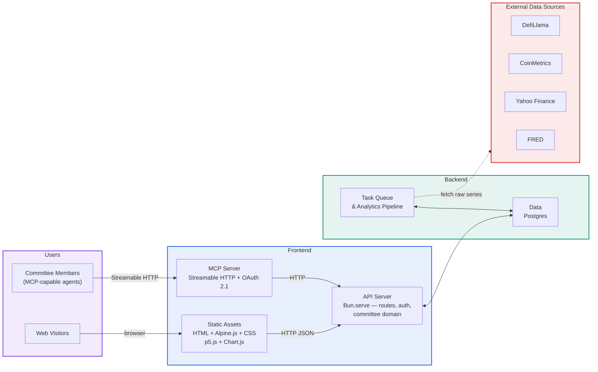
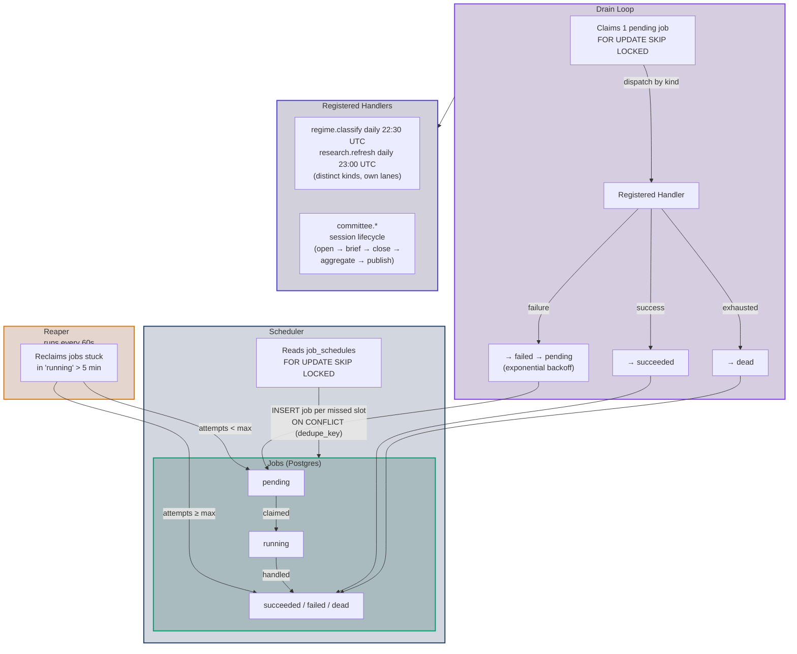
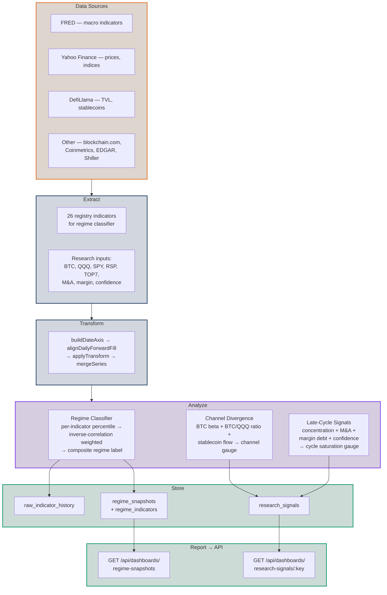

# Network topology — DNS, origins & vendors

How `robotmoney.net` presents several independent product surfaces as one
seamless site, organized by a clean **separation of concerns** — both across
infrastructure tiers and across **two vendors**. This document is cross-cutting:
it spans the **marketing** site, **this repo** (Investment Committee + analytics),
and the **on-chain dapp** (`robotmoney-core`). It is a companion to
[architecture.md](./architecture.md) (this frontend's internals) and
[decisions.md](./decisions.md); the production topology here is decision **D13**,
which supersedes the single-box parts of D8/D11 (see [§10](#10-relationship-to-existing-decisions)).

---

## 1. Principle — two separations of concern

**By tier.** Three surfaces with different lifecycles and infra, deployed
independently:

- **Static tier** — asset delivery. No runtime dependency on anything else; serves
  even when the API and data tiers are down (**fail-open**).
- **API tier** — request/response compute. Stateless services.
- **Data tier** — durable state. One high-availability database.

**By vendor.** Each vendor owns one job, and **no routing software runs anywhere**:

- **Cloudflare — DNS + observability.** Authoritative DNS, proxied TLS/DDoS, and
  monitoring (Health Checks, analytics, Logpush). This is *configuration, not code*
  — no Worker, no reverse proxy.
- **DigitalOcean — compute + storage.** Droplets, Spaces (+CDN), and Managed
  Postgres.

Because Cloudflare runs no routing code and DigitalOcean has no managed
path-router, surfaces are addressed by **subdomain** (host-based routing via plain
DNS), not by path prefix. The seamless look is carried by the **shared design
layer** (ARCHITECTURE §4), not by a shared origin.

---

## 2. The vendor split

| Vendor | Owns | Form |
|--------|------|------|
| **Cloudflare** | DNS, TLS, DDoS, **observability** (Health Checks, analytics, Logpush) | Configuration only — **no software** |
| **DigitalOcean** | **Compute** (Droplets), **storage** (Spaces + CDN), **data** (Managed Postgres HA) | The running system |

**Rule of thumb: Cloudflare resolves and watches; DigitalOcean runs and stores.**
All deployable software lives on DigitalOcean.

---

## 3. The surfaces — subdomain map

Each surface is its own hostname, resolved by a plain DNS record:

| Hostname | Surface | Tier → home | Source |
|----------|---------|-------------|--------|
| `robotmoney.net`, `www.` | Marketing | Static → **DO Spaces CDN** | marketing UI (this repo, D1) |
| `committee.robotmoney.net` | IC + analytics | API → **DO droplet** (Bun) + Data → **Postgres HA** | `robotmoney-frontend` (this repo) |
| `app.robotmoney.net` | Dapp | API → **DO droplet** (`rmpc` + gateway) | `robotmoney-core` |

Each app is served at **its own root**, so there is **no path-prefix and no
base-path handling** — the SPA history router (D4) and import maps (D2) work
unmodified. The SPA and its API are **same-origin** on the same subdomain (no CORS
within a surface).

---

## 4. DNS & TLS — how each hostname resolves

- **Marketing** (`robotmoney.net` via CNAME-flattening, and `www`) → a **DNS-only**
  (grey-cloud) CNAME to the **DO Spaces CDN endpoint**. This is the CDN's native
  host-based usage: DO delivers, caches, and terminates TLS with its **custom-domain
  certificate**. Cloudflare does *not* sit in the data path here, so there is **no
  double-CDN** (§7).
- **App subdomains** (`committee.`, `app.`) → **proxied** (orange-cloud) records to
  the droplet. Cloudflare presents its edge certificate to users and provides
  TLS/DDoS plus traffic analytics; the droplet serves a **Cloudflare Origin CA
  certificate** to the proxy. The droplet's **DO Cloud Firewall** allows ingress
  only from Cloudflare's IP ranges.
- **(Optional hardening)** a **Cloudflare Tunnel** can replace the proxied-DNS +
  firewall approach for *zero* public ingress, at the cost of running the
  `cloudflared` connector on the droplet. Default is proxied DNS + firewall (no
  connector to run).

---

## 5. Static tier — marketing (DO Spaces CDN)

The static marketing assets (the marketing UI preserved per D1) are uploaded to a
**DigitalOcean Space with its CDN enabled**, served on the apex/`www` hostname.
The tier has **no runtime dependency on the API or data tiers** — it is pure static
— so when a droplet or Postgres is unavailable, marketing **still serves
(fail-open)**. Any dynamic data a marketing page wants is fetched client-side and
must **degrade gracefully**; the page never hard-depends on the API.

---

## 6. API tier — services on DO droplets

Request/response services run on **DigitalOcean Droplets**, one surface per
subdomain:

- **`committee.`** — this repo's Bun `api` + `worker`; the `api` co-serves this
  surface's SPA assets (`STATIC_DIR`) same-origin at the subdomain root.
- **`app.`** — the `rmpc` daemon + on-chain gateway (`robotmoney-core`).

Ingress is Cloudflare-proxied DNS locked to Cloudflare IPs by a DO Cloud Firewall
(§4). Droplets are used because Cloudflare has no always-on instance and the `rmpc`
daemon must stay synced to chain head — a scale-to-zero model is wrong for it.

---

## 7. Data tier — Postgres HA cluster (DO)

Durable state is a **DigitalOcean Managed Postgres high-availability cluster**:
primary + standby with automated failover, daily backups, and point-in-time
recovery. Only the API tier connects, via `DATABASE_URL`. This refines D8's
production mode (one Postgres) to a managed HA cluster; the single-box Dockerized
Postgres remains the CI and demo mode (D8).

---

## 8. No double-CDN

Marketing's CDN is **DO Spaces CDN**, reached **DNS-only** (§4), so Cloudflare adds
no second cache in front of it — one cache, one invalidation path (purge is a DO
operation). The proxied app subdomains are dynamic; Cloudflare passes them through.

---

## 9. Seamless without a single origin, and observability

**Seamless look** does not require one origin — it comes from the shared design
layer (`tokens.css` + shared nav/footer chrome; ARCHITECTURE §4), identical on
every subdomain. Shared login/session works by setting cookies on
`.robotmoney.net`. Cross-surface API calls (rare — each surface mostly calls its
own same-host API) use CORS.

**Observability** is Cloudflare's second job, complemented by DO:

- **Cloudflare** — **Health Checks** probe each surface's `/health`; traffic +
  security **analytics** and **Logpush** per hostname.
- **DigitalOcean** — droplet **Monitoring/alerts**, **Uptime** checks, and Managed
  Postgres metrics (replication lag, failover, connections).
- **`/health` JSON contract** (the keystone) — every surface returns the same shape
  and checks its own deps: marketing trivially `200`; IC = Postgres + MCP; dapp =
  `rmpc` alive + gateway + RPC reachable + chain-head lag below threshold.
- **Fail-open** keeps a single failed tier from cascading; the static marketing
  tier in particular stays up independently.

---

## 10. Relationship to existing decisions

- **D11 (single box, no reverse proxy)** — **superseded for production by D13.**
  Production splits across subdomains on DO with Cloudflare for DNS+observability;
  there is still **no reverse proxy** (host-based DNS routing, not a proxy). The
  single-box `docker-compose` remains the **CI and demo** deployment.
- **D8 (one Postgres in Docker)** — **prod mode refined by D13:** production is a
  **DO Managed Postgres HA cluster**; ephemeral (CI) and demo modes unchanged.
- **D10 (split-ready repos)** — reinforced: each surface is already an independent
  host, so a repo split stays mechanical.
- **D4 (SPA history router)** — works **unmodified at the subdomain root**; the
  earlier path-prefix/base-path concern is gone.
- **D2 (buildless)** — import maps resolve at the root, no base-path rewriting.

---

## 11. Task queue topology

The Postgres-backed task queue replaces the old GitHub Actions cron. Three
concurrent loops run inside the `worker` process:

## 12. Analytics pipeline — research & report jobs

The analytics suite runs as two scheduled jobs with distinct kinds and lanes
(issue #107): `regime.classify` (daily 22:30 UTC, analytics lane) and
`research.refresh` (daily 23:00 UTC, research lane).
It drives three compute pipelines through a shared 6-stage access → extract →
transform → analyze → store → report flow:

